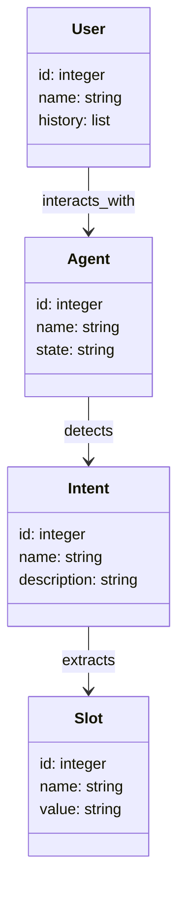
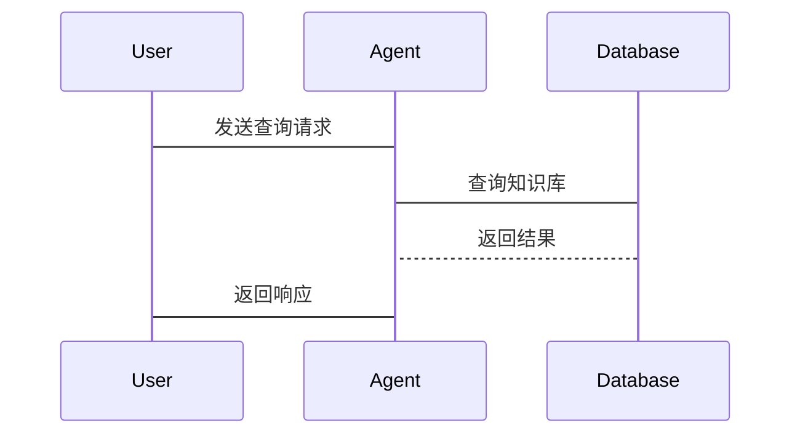

                 


# 《从零开始：搭建AI Agent开发环境》

## 关键词：AI Agent, 开发环境, 自然语言处理, 知识图谱, 机器学习, 深度学习

## 摘要：  
随着人工智能技术的快速发展，AI Agent（人工智能代理）在企业级应用中的价值日益凸显。本篇文章旨在为开发者提供从零开始搭建AI Agent开发环境的详细指导。通过系统介绍AI Agent的核心概念、开发工具链、算法原理、系统架构设计以及实际项目实战，帮助读者全面掌握AI Agent开发环境的搭建方法。文章内容涵盖了从环境配置、工具安装到算法实现、系统优化的全过程，旨在为开发者提供一份实用的实战手册。

---

## 第1章: AI Agent开发环境概述

### 1.1 AI Agent的基本概念
#### 1.1.1 AI Agent的定义
AI Agent（人工智能代理）是指能够感知环境并采取行动以实现目标的智能实体。它可以是一个软件程序，也可以是一个物理设备，通过与用户或环境交互来完成特定任务。

#### 1.1.2 AI Agent的核心属性
- **智能性**：能够理解和处理复杂信息。
- **自主性**：无需外部干预，自主决策。
- **反应性**：能够实时感知环境变化并做出反应。
- **目标导向性**：所有行为都围绕特定目标展开。

#### 1.1.3 AI Agent的分类与应用场景
- **基于规则的AI Agent**：通过预定义的规则进行决策。
- **基于模型的AI Agent**：利用知识库或模型进行推理。
- **基于学习的AI Agent**：通过机器学习算法不断优化行为。

---

### 1.2 AI Agent开发环境的背景与意义
#### 1.2.1 当前AI技术的发展现状
近年来，AI技术在自然语言处理、计算机视觉、机器人等领域取得了显著进展，为AI Agent的发展奠定了基础。

#### 1.2.2 AI Agent在企业级应用中的价值
AI Agent可以应用于客服系统、智能助手、自动化决策系统等领域，显著提升企业效率和用户体验。

#### 1.2.3 开发AI Agent环境的必要性
随着AI技术的普及，搭建AI Agent开发环境是实现企业智能化转型的关键步骤。

---

## 第2章: AI Agent开发的核心技术基础

### 2.1 自然语言处理技术
#### 2.1.1 NLP的基本原理
自然语言处理（NLP）是AI Agent实现人机交互的核心技术，通过处理文本数据，使机器能够理解人类语言。

#### 2.1.2 常见NLP模型及其特点
- **词袋模型（Bag of Words）**：简单但信息丢失严重。
- **词嵌入模型（Word Embedding）**：通过向量化表示词语关系。
- **Transformer模型**：基于注意力机制，性能优越。

#### 2.1.3 NLP在AI Agent中的应用
- **文本分类**：识别文本情感或主题。
- **实体识别**：从文本中提取关键实体信息。
- **对话生成**：生成自然的对话回复。

### 2.2 知识图谱与推理技术
#### 2.2.1 知识图谱的构建与表示
知识图谱是一种结构化的数据表示方式，通过实体和关系的组织，构建语义网络。

#### 2.2.2 基于知识图谱的推理算法
- **基于规则的推理**：通过预定义规则进行推理。
- **基于图的推理**：利用图结构进行路径分析和关系推理。

#### 2.2.3 知识图谱在AI Agent中的应用
- **智能问答**：基于知识图谱提供准确答案。
- **推理与决策**：利用知识图谱进行复杂推理。

### 2.3 机器学习与深度学习
#### 2.3.1 机器学习的基本概念
机器学习是AI Agent实现自主决策的核心技术，通过数据训练模型，使其能够识别模式并做出预测。

#### 2.3.2 深度学习的核心算法
- **卷积神经网络（CNN）**：擅长图像处理。
- **循环神经网络（RNN）**：适用于序列数据处理。
- **Transformer模型**：广泛应用于自然语言处理。

#### 2.3.3 机器学习在AI Agent中的应用
- **用户行为预测**：预测用户的下一步操作。
- **异常检测**：识别异常行为并及时预警。

---

## 第3章: AI Agent开发工具链

### 3.1 开发环境搭建工具
#### 3.1.1 Python编程环境的安装与配置
- **安装Python**：推荐使用Anaconda或Pyenv进行版本管理。
- **配置开发环境**：安装必要的开发工具如Jupyter Notebook、VS Code等。

#### 3.1.2 虚拟环境的使用与管理
- **虚拟环境的作用**：隔离项目依赖，避免版本冲突。
- **常用工具**：virtualenv、venv。

#### 3.1.3 开发工具的安装与配置
- **安装开发工具**：如TensorFlow、PyTorch等深度学习框架。
- **配置环境变量**：确保工具能够正确调用。

### 3.2 第三方库与框架
#### 3.2.1 常用NLP库（如spaCy、NLTK）
- **spaCy**：功能强大，支持多种语言的NLP处理。
- **NLTK**：适合文本处理和语料库分析。

#### 3.2.2 知识图谱处理库（如NetworkX）
- **NetworkX**：用于构建和分析图结构。
- **Neo4j**：图数据库，适合大规模知识图谱存储。

#### 3.2.3 深度学习框架（如TensorFlow、PyTorch）
- **TensorFlow**：适合工业级部署。
- **PyTorch**：适合研究和快速实验。

### 3.3 开发环境的优化与调试
#### 3.3.1 环境配置的常见问题及解决方案
- **依赖冲突**：通过虚拟环境隔离依赖。
- **性能优化**：优化代码和硬件配置。

#### 3.3.2 开发工具的调试技巧
- **调试工具**：使用PyCharm、VS Code的调试功能。
- **日志分析**：通过日志定位问题。

#### 3.3.3 性能优化的建议
- **代码优化**：减少不必要的计算。
- **硬件优化**：使用更高性能的GPU加速。

---

## 第4章: AI Agent核心算法原理

### 4.1 自然语言处理算法
#### 4.1.1 分词算法
- **分词方法**：基于规则和统计模型。
- **常用工具**：jieba、spaCy。

#### 4.1.2 词性标注与句法分析
- **词性标注**：识别每个词的词性。
- **句法分析**：分析句子结构。

#### 4.1.3 文本生成算法
- **生成模型**：如GPT系列模型。
- **生成策略**：贪心算法、beam search。

### 4.2 知识图谱构建与推理算法
#### 4.2.1 知识抽取与实体识别
- **知识抽取**：从文本中提取实体信息。
- **实体识别**：使用命名实体识别（NER）技术。

#### 4.2.2 关系抽取与推理算法
- **关系抽取**：识别实体之间的关系。
- **推理算法**：基于规则和基于模型的推理。

#### 4.2.3 知识图谱的存储与查询
- **存储方式**：图数据库、关系型数据库。
- **查询语言**：SPARQL。

### 4.3 机器学习与深度学习算法
#### 4.3.1 机器学习算法
- **监督学习**：分类、回归。
- **无监督学习**：聚类、降维。

#### 4.3.2 深度学习算法
- **卷积神经网络（CNN）**：图像识别。
- **循环神经网络（RNN）**：序列处理。
- **Transformer模型**：自然语言处理。

#### 4.3.3 算法实现与优化
- **模型训练**：使用合适的数据预处理和优化方法。
- **模型调优**：调整超参数提升性能。

---

## 第5章: 系统分析与架构设计方案

### 5.1 问题场景介绍
- **目标**：搭建一个智能客服AI Agent系统。
- **用户需求**：提供智能问答、意图识别等功能。

### 5.2 系统功能设计
#### 5.2.1 领域模型（Mermaid类图）


#### 5.2.2 系统架构设计（Mermaid架构图）


#### 5.2.3 系统接口设计
- **HTTP接口**：RESTful API。
- **WebSocket接口**：实时通信。

#### 5.2.4 系统交互流程（Mermaid序列图）


---

## 第6章: 项目实战

### 6.1 环境安装
- **Python版本**：Python 3.8以上。
- **安装依赖**：`pip install -r requirements.txt`。

### 6.2 核心代码实现
#### 6.2.1 自然语言处理模块
```python
import spacy

nlp = spacy.load("en_core_web_sm")
doc = nlp("What is the capital of France?")
for token in doc:
    print(token.text, token.pos_)
```

#### 6.2.2 知识图谱构建模块
```python
from networkx import Graph
import networkx as nx

g = Graph()
g.add_nodes_from(["Paris", "France", "Europe"])
g.add_edges_from([("Paris", "France"), ("France", "Europe")])
```

#### 6.2.3 机器学习模型训练模块
```python
import tensorflow as tf
from tensorflow.keras import layers

model = tf.keras.Sequential([
    layers.Dense(64, activation='relu'),
    layers.Dense(1, activation='sigmoid')
])
model.compile(optimizer='adam', loss='binary_crossentropy', metrics=['accuracy'])
model.fit(x_train, y_train, epochs=10, batch_size=32)
```

### 6.3 案例分析与详细解读
- **案例背景**：搭建一个智能问答系统。
- **实现步骤**：
  1. 数据收集与预处理。
  2. 知识图谱构建与存储。
  3. 模型训练与优化。
  4. 系统集成与测试。

### 6.4 项目总结
- **成功经验**：模块化设计和工具链的合理使用。
- **问题与改进**：模型性能优化和系统稳定性提升。

---

## 第7章: 最佳实践与小结

### 7.1 最佳实践 tips
- **工具选择**：根据需求选择合适的工具和框架。
- **代码管理**：使用版本控制工具（如Git）管理代码。
- **性能优化**：定期监控和优化系统性能。

### 7.2 小结
通过本文的指导，读者可以系统地搭建一个完整的AI Agent开发环境，掌握从环境配置到算法实现的全过程。

### 7.3 注意事项
- **数据安全**：保护用户数据隐私。
- **系统稳定性**：确保系统在高负载下的稳定性。

### 7.4 拓展阅读
- **推荐书籍**：《Deep Learning》、《自然语言处理入门》。
- **在线资源**：官方文档和开源社区。

---

## 作者：AI天才研究院/AI Genius Institute & 禅与计算机程序设计艺术 /Zen And The Art of Computer Programming

---

以上是《从零开始：搭建AI Agent开发环境》的完整目录大纲和内容概要，涵盖了从基础概念到实际应用的全过程，帮助读者系统地掌握AI Agent开发环境的搭建方法。

