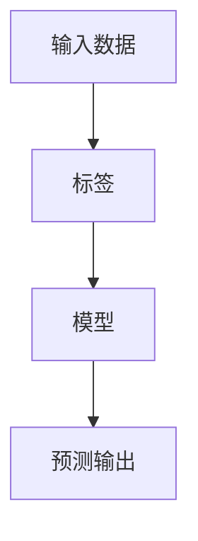
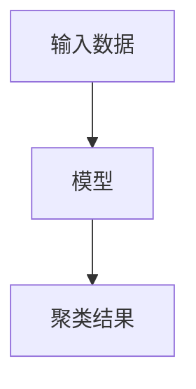
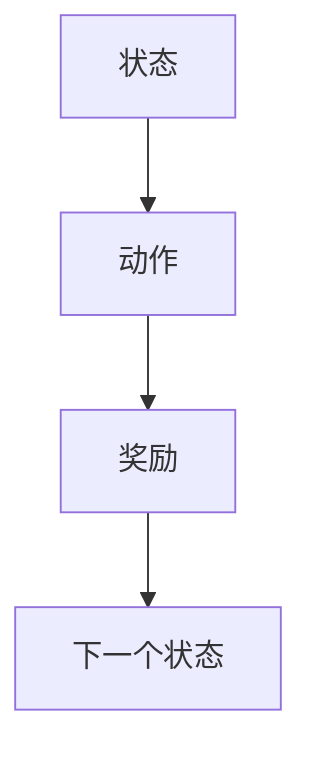
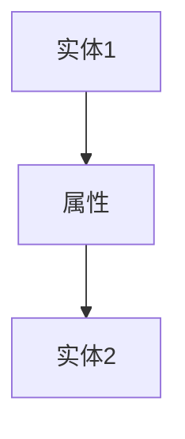

                 


# 从零开始：构建AI Agent的完整指南

> 关键词：AI Agent, 机器学习, 自然语言处理, 强化学习, 智能体, 人工智能

> 摘要：本文将从零开始，系统地介绍AI Agent的构建过程。从基本概念到核心算法，从系统设计到项目实战，全面解析AI Agent的构建方法。通过本文，读者将掌握从理论到实践的完整流程，轻松构建属于自己的AI Agent。

---

# 第一部分: AI Agent的背景与基础

## 第1章: AI Agent的基本概念

### 1.1 AI Agent的定义与特点

#### 1.1.1 什么是AI Agent
AI Agent（人工智能代理）是指能够感知环境并采取行动以实现目标的智能实体。它可以是一个软件程序、一个机器人，甚至是一个虚拟助手。AI Agent的核心目标是通过自主决策和行动来优化特定目标的实现。

#### 1.1.2 AI Agent的核心特点
- **自主性**：AI Agent能够在没有外部干预的情况下自主决策。
- **反应性**：能够实时感知环境变化并做出反应。
- **目标导向**：所有的行动都是为了实现特定的目标。
- **学习能力**：通过与环境的交互不断优化自身的决策能力。

#### 1.1.3 AI Agent与传统程序的区别
| 特性 | AI Agent | 传统程序 |
|------|-----------|-----------|
| 决策方式 | 基于环境反馈动态决策 | 严格按照预设逻辑执行 |
| 学习能力 | 可以通过经验优化行为 | 无法优化，仅能按规则执行 |
| 适应性 | 能够适应环境变化 | 无法适应，只能按原设计运行 |

### 1.2 AI Agent的类型

#### 1.2.1 简单反射式智能体
简单反射式智能体基于当前的感知直接做出反应，没有内部状态。例如，一个自动门系统，当检测到有人靠近时打开，人离开后关闭。

#### 1.2.2 基于模型的反射式智能体
基于模型的反射式智能体不仅依赖当前感知，还依赖对环境的内部模型进行决策。例如，自动驾驶汽车会根据实时数据和内部构建的环境模型做出驾驶决策。

#### 1.2.3 目标驱动智能体
目标驱动智能体通过最大化目标函数来优化决策。例如，智能音箱的目标是尽可能准确地理解用户的意图并执行指令。

#### 1.2.4 情境驱动智能体
情境驱动智能体通过理解当前情境来动态调整行为。例如，智能助手可以根据用户的时间、地点和当前任务提供不同的建议。

### 1.3 AI Agent的应用场景

#### 1.3.1 个人助手
AI Agent可以作为个人助手，帮助用户管理日程、提醒事项、处理邮件等。

#### 1.3.2 智能客服
AI Agent可以模拟客服人员，通过自然语言处理技术为用户提供24小时在线的咨询服务。

#### 1.3.3 游戏AI
AI Agent可以应用于游戏开发，作为游戏NPC（非玩家角色）的决策系统，提供更智能的对手或队友。

#### 1.3.4 智能推荐系统
AI Agent可以根据用户的偏好和行为推荐个性化的内容，例如电影、音乐、商品等。

---

## 第2章: AI Agent的技术基础

### 2.1 机器学习基础

#### 2.1.1 监督学习
监督学习是一种通过标记数据训练模型的方法。模型通过输入数据和对应的标签，学习输入与输出之间的关系。



例如，使用线性回归模型预测房价：

$$ y = \theta_0 + \theta_1 x $$

其中，$x$ 是输入特征，$y$ 是预测目标，$\theta$ 是模型参数。

#### 2.1.2 无监督学习
无监督学习是通过未标记数据训练模型的方法。模型通过发现数据中的结构来推断输入与输出之间的关系。



例如，使用K-means算法对客户进行聚类分析：

$$ \text{目标} = \min \sum_{i=1}^{k} \sum_{j=1}^{n} (x_j - c_i)^2 $$

其中，$k$ 是聚类数，$n$ 是数据点数，$c_i$ 是第$i$个聚类的中心。

#### 2.1.3 强化学习
强化学习是一种通过与环境交互来学习策略的方法。智能体通过与环境的交互获得奖励或惩罚，从而优化其策略。



例如，使用Q-learning算法训练一个智能体在迷宫中找到出口：

$$ Q(s, a) = Q(s, a) + \alpha \left[r + \gamma \max Q(s', a') - Q(s, a)\right] $$

其中，$\alpha$ 是学习率，$\gamma$ 是折扣因子。

### 2.2 自然语言处理基础

#### 2.2.1 词嵌入
词嵌入是一种将词语映射到低维向量空间的技术。通过词嵌入，可以捕捉词语之间的语义关系。

$$ \text{Word Embedding} = W_{word} \cdot \mathbf{e}_i $$

其中，$W_{word}$ 是词嵌入矩阵，$\mathbf{e}_i$ 是输入词语的独热编码。

#### 2.2.2 语言模型
语言模型是一种用于生成或理解人类语言的模型。常见的语言模型包括循环神经网络（RNN）和Transformer。

$$ P(w_i | w_{i-1}, w_{i-2}, \dots, w_{i-n}) $$

其中，$w_i$ 是当前词，$w_{i-1}, w_{i-2}, \dots, w_{i-n}$ 是之前的词。

#### 2.2.3 意图识别
意图识别是通过分析用户的输入内容，识别用户的意图。例如，识别用户的查询是“查询天气”还是“查询交通”。

### 2.3 知识图谱与推理

#### 2.3.1 知识图谱的构建
知识图谱是一种以图结构表示知识的技术。通过构建知识图谱，可以将分散的知识点连接起来，形成一个完整的知识网络。



#### 2.3.2 基于知识图谱的推理
基于知识图谱的推理是通过推理规则从知识图谱中推导出新的知识。

例如，使用SPARQL查询知识图谱中的关系：

```sparql
SELECT * WHERE {
    ?x rdfs:label ?y.
    ?y rdf:type ?z.
}
```

---

## 第3章: AI Agent开发工具与环境

### 3.1 开发环境搭建

#### 3.1.1 Python编程环境
Python是目前最受欢迎的编程语言之一，广泛应用于AI开发。安装Python可以通过官方网站（https://www.python.org）下载安装包。

#### 3.1.2 虚拟环境配置
为了管理Python包的依赖关系，推荐使用虚拟环境。可以使用`venv`或`virtualenv`来创建虚拟环境。

```bash
# 创建虚拟环境
python -m venv myenv

# 激活虚拟环境
source myenv/bin/activate
```

#### 3.1.3 版本控制工具
使用版本控制工具（如Git）管理代码仓库，可以方便地跟踪代码变更和协作开发。

### 3.2 第三方库与框架

#### 3.2.1 TensorFlow/PyTorch
TensorFlow和PyTorch是目前最受欢迎的深度学习框架。TensorFlow适合生产环境，而PyTorch适合研究和实验。

#### 3.2.2 SpaCy/NLTK
SpaCy和NLTK是Python中常用的自然语言处理库。SpaCy适合处理大文本数据，而NLTK适合教学和研究。

#### 3.2.3 Hugging Face Transformers
Hugging Face Transformers是一个基于Transformers模型的开源库，支持多种任务，如文本生成、问答系统等。

### 3.3 开发流程与规范

#### 3.3.1 代码风格
遵循PEP 8代码风格指南，确保代码可读性和一致性。

#### 3.3.2 调试与日志
使用Python的调试工具（如pdb）和日志库（如logging）进行调试和记录程序运行状态。

#### 3.3.3 项目文档
编写项目文档，记录项目的功能、接口、依赖关系和使用说明，方便团队协作和后续维护。

---

## 总结

通过以上步骤，我们可以从零开始构建一个AI Agent。从基本概念到技术基础，从开发工具到系统设计，逐步深入，最终实现一个功能完善的AI Agent。

