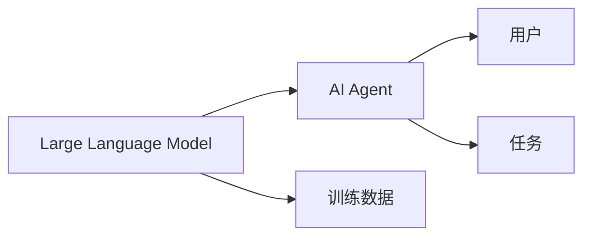
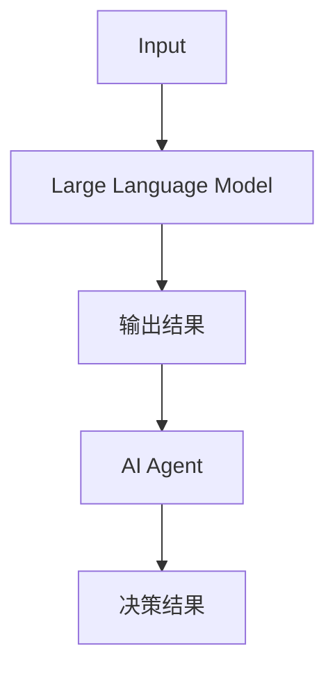
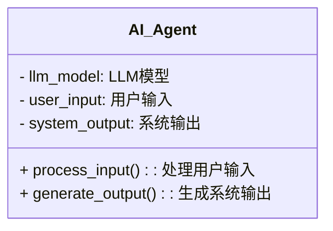
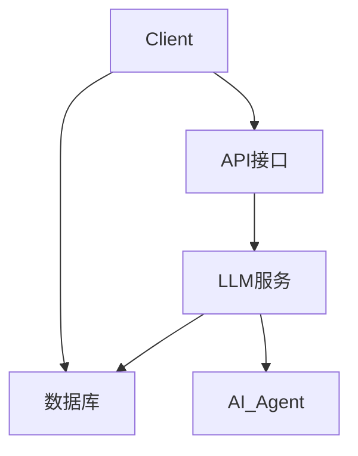

                 


# 从零构建AI Agent：LLM大模型应用开发实践概述

## 关键词：AI Agent, LLM大模型, 人工智能, 机器学习, 自然语言处理, 系统架构设计, 项目实战

## 摘要：本文将从零开始，全面介绍AI Agent的构建过程，涵盖其与LLM大模型的关系、核心算法原理、系统架构设计以及实际项目开发的实战经验。通过详细的理论分析和实践案例，帮助读者理解并掌握AI Agent的应用开发。

---

## 第1章: AI Agent与LLM大模型概述

### 1.1 AI Agent的基本概念

#### 1.1.1 什么是AI Agent
AI Agent（人工智能代理）是一种智能实体，能够感知环境并采取行动以实现特定目标。它可以是一个软件程序，也可以是硬件设备，通过与用户或环境交互，完成复杂任务。AI Agent的核心在于其智能性和自主性，能够根据输入做出决策并执行任务。

#### 1.1.2 AI Agent的核心特征
- **自主性**：能够在没有外部干预的情况下运行。
- **反应性**：能够根据环境变化调整行为。
- **目标导向**：所有行动都围绕实现特定目标展开。
- **学习能力**：通过数据和经验不断优化性能。

#### 1.1.3 AI Agent的应用场景
AI Agent广泛应用于多个领域：
- **智能家居**：控制家庭设备，提供便利生活。
- **智能助手**：如Siri、Alexa，帮助用户完成日常任务。
- **自动驾驶**：作为决策核心，控制车辆运行。
- **客户服务**：通过自动化流程提供高效支持。

### 1.2 LLM大模型的基本原理

#### 1.2.1 什么是LLM
LLM（Large Language Model，大语言模型）是一种基于深度学习的自然语言处理模型，通过大量数据训练，能够生成与人类类似的文本。其核心是Transformer架构，具备强大的文本理解和生成能力。

#### 1.2.2 LLM的核心技术特点
- **基于Transformer架构**：通过自注意力机制处理长文本。
- **预训练-微调模式**：先在大规模数据上预训练，再针对特定任务微调。
- **多任务处理能力**：能够同时处理多种语言任务，如翻译、问答、摘要等。

#### 1.2.3 LLM与AI Agent的关系
AI Agent需要通过LLM来实现自然语言理解与生成能力。LLM作为AI Agent的核心模块，负责处理用户的输入并生成相应的输出，使AI Agent能够与人类进行高效交互。

### 1.3 AI Agent与LLM的结合

#### 1.3.1 AI Agent的构建逻辑
AI Agent的构建逻辑包括以下几个步骤：
1. **需求分析**：明确AI Agent的目标和功能。
2. **模型选择**：选择适合的LLM模型。
3. **接口设计**：定义与用户的交互接口。
4. **功能实现**：实现自然语言处理、决策逻辑等核心功能。
5. **测试优化**：通过测试优化模型性能和用户体验。

#### 1.3.2 LLM在AI Agent中的作用
LLM为AI Agent提供了强大的自然语言处理能力，使其能够理解用户意图并生成自然的回复。通过LLM，AI Agent可以实现多轮对话、意图识别等功能，显著提升用户体验。

#### 1.3.3 AI Agent的典型应用案例
- **智能客服**：通过LLM处理用户咨询，提供快速响应。
- **智能写作助手**：帮助用户生成高质量的文章内容。
- **虚拟助手**：提供个性化服务，如日程管理、信息查询等。

### 1.4 本章小结
本章介绍了AI Agent和LLM的基本概念、技术特点以及它们的结合方式。AI Agent作为智能实体，通过LLM的强大能力，能够实现复杂的自然语言交互，为实际应用提供了坚实的基础。

---

## 第2章: AI Agent的核心概念与联系

### 2.1 核心概念原理

#### 2.1.1 LLM的数学模型
LLM基于Transformer模型，其数学模型主要包括编码器和解码器两部分。编码器将输入文本转化为向量表示，解码器根据编码结果生成输出文本。模型的核心是自注意力机制，通过计算每个词与其他词的相关性，生成上下文相关的表示。

$$\text{自注意力机制公式}：$$
$$
\text{Attention}(Q, K, V) = \text{softmax}\left(\frac{QK^T}{\sqrt{d_k}}\right)V
$$

其中，$Q$、$K$、$V$分别是查询、键、值向量，$d_k$是向量的维度。

#### 2.1.2 AI Agent的决策机制
AI Agent的决策机制通常基于状态、动作和奖励的马尔可夫决策过程。模型通过感知环境状态，选择最优动作以最大化累计奖励。

$$\text{决策公式}：$$
$$
a = \arg\max_a \sum_{t} \gamma^t r_t
$$

其中，$a$是动作，$\gamma$是折扣因子，$r_t$是第$t$步的奖励。

#### 2.1.3 核心概念对比特征表格
以下是LLM和传统机器学习模型的对比特征表格：

| 特征                | LLM模型               | 传统机器学习模型         |
|---------------------|-----------------------|--------------------------|
| 数据需求            | 大规模数据            | 较小规模数据              |
| 任务能力            | 多任务处理            | 单任务处理                |
| 模型复杂度          | 高复杂度              | 较低复杂度                |
| 是否需要微调        | 支持预训练和微调        | 通常不支持预训练          |
| 应用场景            | 自然语言处理          | 分类、回归等              |

### 2.2 实体关系图架构



在上述图中，LLM模型接受训练数据并生成AI Agent，AI Agent与用户交互并执行任务。

### 2.3 本章小结
本章详细讲解了AI Agent和LLM的核心概念及其关系，通过对比分析和图表展示，帮助读者更好地理解两者的联系与区别。

---

## 第3章: LLM大模型的算法原理

### 3.1 LLM的算法流程

#### 3.1.1 Transformer模型的结构
Transformer模型由编码器和解码器组成，编码器负责将输入序列转换为向量表示，解码器根据编码结果生成输出序列。

$$\text{编码器结构公式}：$$
$$
x_i = \text{PositionalEncoding}(i) + \text{Embedding}(x_i)
$$

$$\text{解码器结构公式}：$$
$$
y_i = \text{PositionalEncoding}(i) + \text{Embedding}(y_i)
$$

#### 3.1.2 注意力机制的原理
注意力机制通过计算输入序列中每个词的重要性，生成加权后的表示。其公式如下：

$$
\alpha_i = \text{softmax}\left(\frac{QK^T}{\sqrt{d_k}}\right)_i
$$

其中，$\alpha_i$是第$i$个词的权重。

#### 3.1.3 解码器的实现逻辑
解码器通过自注意力机制和前向网络生成最终的输出序列。其流程如下：

1. 输入序列经过嵌入层生成初始向量。
2. 应用自注意力机制计算权重。
3. 加权后的向量通过前向网络生成最终输出。

### 3.2 AI Agent的决策算法

#### 3.2.1 基于LLM的多轮对话
多轮对话通过维护对话历史，生成连贯的回复。其流程如下：

1. 用户输入问题，AI Agent将其转化为向量表示。
2. LLM基于对话历史生成回复。
3. 回复经过处理后返回给用户。

#### 3.2.2 基于LLM的意图识别
意图识别通过分析用户输入，判断其意图。其流程如下：

1. 用户输入经过分词和词向量化。
2. LLM生成意图标签。
3. 根据意图标签执行相应操作。

#### 3.2.3 基于LLM的决策树构建
决策树通过LLM生成的标签，构建决策树结构。其流程如下：

1. 输入问题，生成多个候选标签。
2. 根据标签构建决策树。
3. 根据决策树生成最终决策。

### 3.3 算法流程图



### 3.4 本章小结
本章详细讲解了LLM和AI Agent的算法原理，通过流程图和公式，帮助读者理解其工作原理。

---

## 第4章: 系统分析与架构设计方案

### 4.1 项目背景与目标

#### 4.1.1 项目背景介绍
随着自然语言处理技术的发展，AI Agent的应用需求不断增加。构建一个基于LLM的AI Agent，能够为用户提供高效的智能服务。

#### 4.1.2 项目目标设定
本项目旨在构建一个基于LLM的AI Agent，实现自然语言交互、任务处理等功能。

### 4.2 系统功能设计

#### 4.2.1 领域模型设计



领域模型展示了AI Agent的主要组成部分和功能。

#### 4.2.2 系统架构设计



系统架构图展示了AI Agent的各个模块及其交互方式。

### 4.3 本章小结
本章通过系统分析和架构设计，为AI Agent的构建提供了理论基础和设计指导。

---

## 第5章: 项目实战

### 5.1 环境安装

#### 5.1.1 安装Python
安装最新版本的Python，确保版本为3.8以上。

#### 5.1.2 安装LLM框架
安装Hugging Face的Transformers库：

```bash
pip install transformers
```

#### 5.1.3 安装其他依赖
安装其他必要的库，如Flask用于构建API：

```bash
pip install flask
```

### 5.2 系统核心实现

#### 5.2.1 AI Agent核心代码实现

```python
from transformers import pipeline

class AI_Agent:
    def __init__(self):
        self.llm = pipeline("text-generation", model="gpt2")

    def process_input(self, input_text):
        response = self.llm(input_text)
        return response[0]['generated_text']
```

#### 5.2.2 API接口实现

```python
from flask import Flask, request, jsonify
from ai_agent import AI_Agent

app = Flask(__name__)
agent = AI_Agent()

@app.route('/api', methods=['POST'])
def process_request():
    data = request.json
    input_text = data['input']
    output = agent.process_input(input_text)
    return jsonify({'output': output})
```

### 5.3 案例分析

#### 5.3.1 智能客服案例
实现一个智能客服系统，用户输入问题，AI Agent生成回复。

#### 5.3.2 自然语言处理案例
实现文本摘要功能，用户输入文本，AI Agent生成摘要。

### 5.4 本章小结
本章通过实际项目案例，展示了AI Agent的构建过程，帮助读者掌握理论知识的实际应用。

---

## 总结与展望

### 总结
本文从零开始，详细介绍了AI Agent的构建过程，涵盖了背景知识、核心概念、算法原理、系统架构设计以及项目实战。通过理论与实践的结合，帮助读者全面掌握AI Agent的应用开发。

### 展望
未来，随着LLM技术的不断发展，AI Agent将具备更强大的功能和更广泛的应用场景。建议读者持续关注相关技术动态，不断提升自己的技术能力。

---

## 作者信息

作者：AI天才研究院/AI Genius Institute & 禅与计算机程序设计艺术 /Zen And The Art of Computer Programming

---

感谢您的耐心阅读，希望这篇文章能为您提供有价值的信息和启发。

