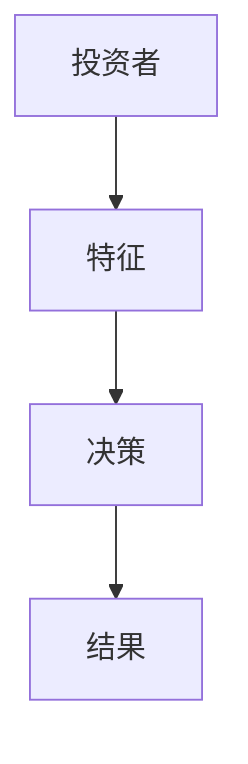
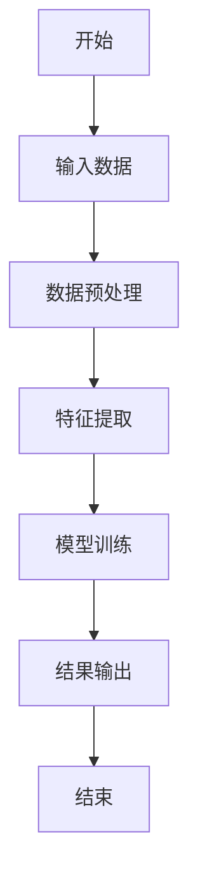
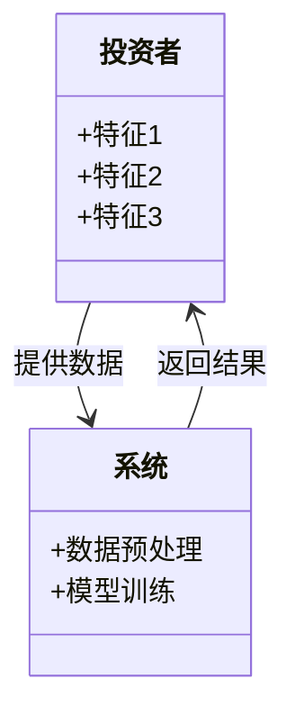
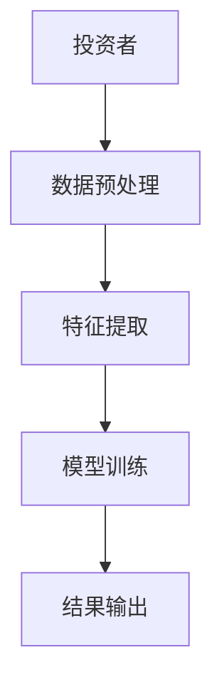
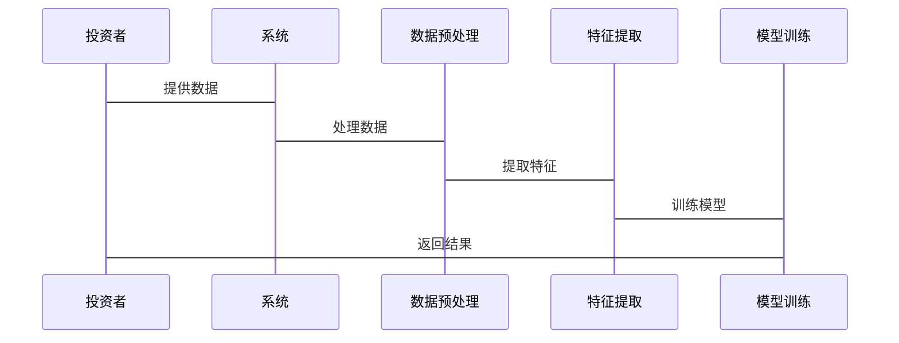

                 


# 《代表性偏差：如何避免以偏概全的投资错误》

## 关键词：代表性偏差、投资决策、认知偏差、算法原理、系统架构

## 摘要

在投资决策中，代表性偏差是一种常见的认知偏差，导致投资者基于片面信息做出决策。本文通过分析代表性偏差的定义、形成机制、解决方法，结合算法原理和系统设计，帮助投资者识别和避免这一偏差。文章详细介绍了偏差的核心概念、算法实现、系统架构，并通过实际案例分析，提供实用的解决方案。

---

## 第一部分：背景介绍

### 第1章：代表性偏差的定义与背景

#### 1.1 问题背景

在投资领域，投资者常常基于有限的信息做出决策，导致代表性偏差。这种偏差使投资者过度依赖某一特征，忽略整体情况。

#### 1.2 问题描述

代表性偏差表现为投资者基于某一特征（如历史收益）进行投资，而忽视其他重要因素。这种偏差可能导致错误的投资决策，影响收益。

#### 1.3 问题解决

通过识别偏差来源、引入多元分析和数据校正，投资者可以减少代表性偏差的影响。

#### 1.4 边界与外延

代表性偏差与其他偏差（如确认偏差）相关，影响范围广泛，但解决方法也有局限性。

---

## 第二部分：核心概念与联系

### 第2章：代表性偏差的核心原理

#### 2.1 偏差的原理分析

代表性偏差源于人类认知的局限性，使人们过度依赖某一特征进行判断，忽视整体情况。

#### 2.2 核心概念的属性特征对比

| 属性 | 偏差表现 | 影响因素 | 解决方法 |
|------|---------|----------|----------|
| 表现形式 | 过度依赖单一特征 | 样本特征 | 数据多元分析 |

#### 2.3 ER实体关系图



---

## 第三部分：算法原理讲解

### 第3章：算法原理与流程图

#### 3.1 算法原理

算法通过多元分析和特征权重调整，减少代表性偏差的影响。

#### 3.2 算法流程图



#### 3.3 Python源代码实现

```python
import pandas as pd
from sklearn.tree import DecisionTreeClassifier
from sklearn.metrics import accuracy_score

# 数据加载
data = pd.read_csv('data.csv')

# 特征提取
features = data[['特征1', '特征2', '特征3']]
target = data['目标']

# 模型训练
model = DecisionTreeClassifier()
model.fit(features, target)

# 预测结果
预测结果 = model.predict(features)

# 计算准确率
准确率 = accuracy_score(target, 预测结果)
print(准确率)
```

#### 3.4 数学模型

数学模型表示为：
$$ P(A|B) = \frac{P(B|A)P(A)}{P(B)} $$
通过调整权重，减少单一特征的影响。

---

## 第四部分：系统分析与架构设计方案

### 第4章：系统架构设计

#### 4.1 问题场景

投资者需要基于多元数据做出决策，减少偏差影响。

#### 4.2 系统功能设计



#### 4.3 系统架构图



#### 4.4 接口与交互



---

## 第五部分：项目实战

### 第5章：项目实战与案例分析

#### 5.1 环境安装

安装Python和相关库，如scikit-learn。

#### 5.2 核心代码实现

```python
from sklearn.ensemble import RandomForestClassifier
import pandas as pd

# 数据加载
data = pd.read_csv('data.csv')

# 特征提取
features = data[['特征1', '特征2', '特征3']]
target = data['目标']

# 模型训练
model = RandomForestClassifier()
model.fit(features, target)

# 预测结果
预测结果 = model.predict(features)

# 计算准确率
准确率 = accuracy_score(target, 预测结果)
print(准确率)
```

#### 5.3 实际案例分析

通过分析历史数据，调整特征权重，减少偏差影响。

---

## 第六部分：总结与展望

### 第6章：总结与最佳实践

#### 6.1 总结

通过多元分析和系统设计，投资者可以有效避免代表性偏差。

#### 6.2 最佳实践

- 多元分析
- 定期校正
- 系统设计

#### 6.3 注意事项

避免过度依赖单一特征，定期校正模型。

#### 6.4 拓展阅读

推荐相关书籍和论文，深入理解偏差问题。

---

## 作者信息

作者：AI天才研究院/AI Genius Institute & 禅与计算机程序设计艺术 /Zen And The Art of Computer Programming

---

通过系统分析和实际案例，本文为投资者提供了识别和避免代表性偏差的实用方法，帮助做出更明智的投资决策。

