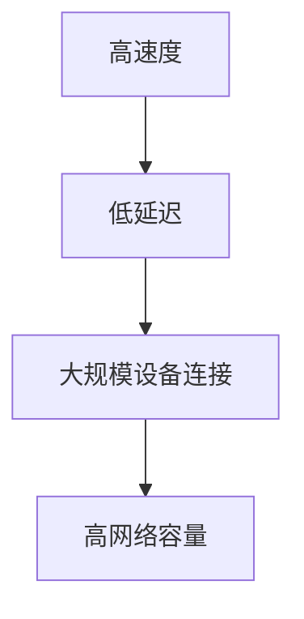
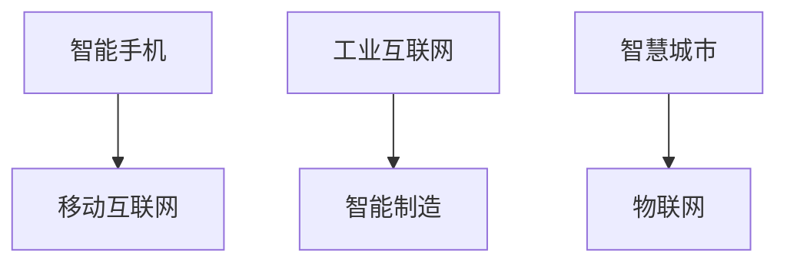

                 

# 价值投资中的5G技术机会

> 关键词：5G技术，价值投资，投资机会，技术驱动，市场分析

> 摘要：本文探讨了5G技术在价值投资中的潜力和机会，分析了5G技术的核心应用场景、市场容量、行业竞争格局以及投资策略。通过技术分析和投资案例，本文为投资者提供了如何在5G技术驱动的市场中发现和抓住投资机会的深度见解。

---

# 第1章: 5G技术的概述与价值投资背景

## 1.1 5G技术的核心概念

### 1.1.1 5G技术的定义与特点

5G技术（第五代移动通信技术）是继4G之后的新一代通信标准，具有高速度、低延迟、大规模设备连接等特性。5G技术通过毫米波和大规模MIMO等技术手段，实现了更高的网络容量和更快的传输速度，为物联网、人工智能和大数据等新兴技术的发展提供了坚实的基础。

### 1.1.2 5G技术的演进历程

5G技术的演进经历了从3G到4G的逐步升级，每个阶段都带来了传输速度和网络容量的提升。5G技术的出现标志着通信技术从“人与人之间的连接”扩展到“万物互联”的新时代。

### 1.1.3 5G技术对社会经济的影响

5G技术的普及将推动多个行业的数字化转型，包括制造业、 healthcare、教育和交通等。5G技术的应用将显著提升生产效率、降低运营成本，并为新兴商业模式的出现提供了可能。

### 图1-1：5G技术的核心特点

---

## 1.2 价值投资的基本概念

### 1.2.1 价值投资的定义与特点

价值投资是一种投资策略，旨在通过分析公司的基本面（如财务状况、行业地位、管理团队等）来寻找被市场低估的投资标的。价值投资强调长期持有和对公司内在价值的理解，注重安全边际和风险控制。

### 1.2.2 价值投资的核心原则

- **安全边际**：买入价格低于公司内在价值。
- **长期视角**：关注公司的长期竞争优势和可持续发展能力。
- **分散投资**：通过分散投资降低风险，避免过度集中。

### 1.2.3 价值投资与5G技术的结合点

5G技术的普及将推动多个行业的发展，投资者可以通过分析5G技术在不同行业的应用潜力，寻找具有竞争优势的公司，从而在价值投资中发现新的机会。

---

## 1.3 5G技术与价值投资的结合背景

### 1.3.1 5G技术的市场潜力

5G技术的市场规模预计在未来几年内迅速增长，特别是在智能手机、工业互联网和智慧城市等领域。5G技术的普及将带来更多的创新和商业机会。

### 1.3.2 价值投资在科技行业的应用

科技行业的技术创新往往伴随着巨大的市场机会，价值投资者可以通过分析技术的成熟度、市场需求和公司的竞争能力，寻找具有长期增长潜力的公司。

### 1.3.3 5G技术对投资机会的影响

5G技术的应用将推动多个行业的数字化转型，为投资者提供了在新兴技术领域进行价值投资的机会。同时，5G技术的普及也将带来新的商业模式和商业机会。

---

## 1.4 本章小结

本章介绍了5G技术的核心概念和价值投资的基本原理，并探讨了两者结合的背景和潜力。通过理解5G技术的特点和应用，投资者可以在科技驱动的市场中发现新的投资机会。

---

# 第2章: 5G技术的核心应用场景

## 2.1 5G技术的主要应用场景

### 2.1.1 智能手机与移动互联网

5G技术的高速度和低延迟为智能手机和移动互联网的应用提供了更好的用户体验。5G技术的普及将推动移动互联网内容的多样化和高清化，为视频 streaming、虚拟现实和增强现实等应用提供了技术基础。

### 2.1.2 工业互联网与智能制造

5G技术的高可靠性和低延迟为工业互联网和智能制造提供了技术保障。5G技术可以实现设备间的实时通信和数据交换，为工业自动化和智能化提供了新的可能性。

### 2.1.3 智慧城市与物联网

5G技术的大规模设备连接能力为智慧城市的建设提供了技术支持。通过5G技术，可以实现城市基础设施的智能化管理和优化，推动城市交通、环境监测和公共安全等领域的创新发展。

### 图2-1：5G技术的主要应用场景

---

## 2.2 5G技术在不同行业的应用潜力

### 2.2.1 通信行业

5G技术的普及将推动通信行业的发展，包括网络设备、基站建设和网络优化等领域。通信行业将通过5G技术的推广实现更高的网络容量和更好的用户体验。

### 2.2.2 电子设备行业

5G技术的应用将推动电子设备行业的产品创新和产业升级，包括智能手机、物联网设备和可穿戴设备等领域。5G技术的普及将为电子设备行业带来更多的市场机会。

### 2.2.3 软件与服务行业

5G技术的高速度和低延迟为软件与服务行业提供了更好的技术基础，推动云计算、大数据和人工智能等技术的发展。5G技术的应用将为软件与服务行业带来更多的创新和商业机会。

---

## 2.3 5G技术的市场容量与增长潜力

### 2.3.1 全球5G市场现状

全球5G市场正处于快速发展阶段，5G网络的建设和部署正在加速。5G技术的普及将推动全球通信行业的升级和转型。

### 2.3.2 中国5G市场的发展趋势

中国5G市场的发展速度在全球范围内处于领先地位。中国政府和企业正在积极推动5G技术的普及和应用，为5G技术的市场发展提供了政策支持和资金投入。

### 2.3.3 5G技术对产业链的带动效应

5G技术的普及将带动整个产业链的发展，包括设备制造、网络建设、软件开发和应用服务等领域。5G技术的应用将为相关行业带来更多的市场机会和增长动力。

---

## 2.4 本章小结

本章详细探讨了5G技术的核心应用场景和不同行业的应用潜力，分析了5G技术的市场容量和增长潜力。通过理解5G技术在各个领域的应用，投资者可以在5G技术驱动的市场中发现更多的投资机会。

---

# 第3章: 5G技术相关公司的价值评估方法

## 3.1 价值投资的核心指标分析

### 3.1.1 财务指标分析

- **收入与利润**：分析公司的收入和利润增长情况，评估公司的盈利能力。
- **研发投入**：评估公司在技术创新和研发投入方面的投入，判断公司的技术优势和竞争力。
- **资产负债**：分析公司的资产负债状况，评估公司的财务健康和偿债能力。

### 3.1.2 市盈率与市净率

- **市盈率（P/E）**：公司股价与每股收益的比率，反映了市场对公司未来盈利能力的预期。
- **市净率（P/B）**：公司股价与每股净资产的比率，反映了市场对公司资产价值的评估。

### 3.1.3 股东权益收益率

股东权益收益率（ROE）是衡量公司盈利能力的重要指标，反映了公司利用股东权益创造利润的能力。

---

## 3.2 5G技术相关公司的核心竞争力分析

### 3.2.1 技术研发能力

5G技术的核心竞争力在于技术研发能力，包括专利数量、技术标准制定权和技术创新能力等。

### 3.2.2 市场占有率

市场占有率是衡量公司市场竞争能力的重要指标，反映了公司在市场中的地位和影响力。

### 3.2.3 供应链稳定性

供应链稳定性是评估公司运营能力的重要因素，稳定的供应链可以确保公司产品的按时交付和成本控制。

---

## 3.3 行业竞争格局与投资机会分析

### 3.3.1 全球5G行业竞争格局

全球5G行业竞争格局呈现多元化，包括设备制造商、网络运营商和软件服务提供商等。投资者需要分析不同公司在全球市场中的竞争地位和未来发展趋势。

### 3.3.2 中国5G行业的竞争优势

中国5G行业在政策支持、市场需求和技术创新等方面具有竞争优势，5G技术的普及和应用将为相关公司带来更多的市场机会。

### 3.3.3 5G技术的未来发展趋势

5G技术的未来发展趋势包括网络切片、边缘计算和智能化运维等，这些趋势将为投资者提供更多的投资机会和挑战。

---

## 3.4 本章小结

本章分析了5G技术相关公司的价值评估方法，包括财务指标分析、市场竞争力分析和行业竞争格局分析。通过综合评估公司的技术优势和市场地位，投资者可以在5G技术驱动的市场中发现具有长期增长潜力的公司。

---

# 第4章: 5G技术对投资策略的影响

## 4.1 价值投资策略的基本框架

### 4.1.1 长期投资与价值发现

价值投资强调长期投资，通过分析公司的基本面和内在价值，寻找被市场低估的投资标的。

### 4.1.2 风险控制与投资组合优化

价值投资者注重风险控制，通过分散投资和严格的风险管理，降低投资组合的整体风险。

---

## 4.2 5G技术对投资策略的特殊影响

### 4.2.1 技术周期与投资机会

5G技术的普及和应用将经历导入期、成长期和成熟期等不同阶段，投资者需要根据技术周期的变化，调整投资策略和投资组合。

### 4.2.2 行业政策与投资策略

政策的变化对5G技术的普及和应用具有重要影响，投资者需要密切关注政策动向，分析政策对行业和公司的影响。

### 4.2.3 技术创新与投资风险

技术创新是5G技术的核心驱动力，但技术创新也伴随着技术和市场风险，投资者需要在技术创新和风险控制之间找到平衡。

---

## 4.3 5G技术驱动的新兴投资机会

### 4.3.1 新型基础设施建设

5G技术的普及将推动新型基础设施建设，包括5G网络、数据中心和云计算设施等，为投资者提供了新的投资机会。

### 4.3.2 数字经济与产业升级

5G技术的应用将推动数字经济的发展，促进传统产业的转型升级，为投资者提供了在数字经济领域进行价值投资的机会。

### 4.3.3 智能终端与应用场景扩展

5G技术的普及将推动智能终端的创新和应用场景的扩展，包括智能手机、物联网设备和可穿戴设备等领域，为投资者提供了丰富的投资机会。

---

## 4.4 本章小结

本章探讨了5G技术对投资策略的影响，分析了技术周期、行业政策和技术创新对投资策略的特殊影响。通过理解5G技术对投资策略的影响，投资者可以在5G技术驱动的市场中制定更加科学和有效的投资策略。

---

# 第5章: 5G技术相关企业的财务分析与投资案例

## 5.1 5G技术相关企业的财务指标分析

### 5.1.1 收入与利润分析

通过分析公司的收入和利润增长情况，评估公司的盈利能力和发展潜力。

### 5.1.2 研发投入与技术创新

分析公司的研发投入和技术创新能力，评估公司在5G技术领域的核心竞争力。

### 5.1.3 资产负债与现金流

分析公司的资产负债状况和现金流情况，评估公司的财务健康和偿债能力。

---

## 5.2 5G技术相关企业的投资案例分析

### 5.2.1 国内外5G龙头企业分析

以某家国内外5G龙头企业为例，分析其财务状况、市场地位和竞争优势，评估其投资价值。

### 5.2.2 5G技术驱动的新兴企业分析

以某家新兴5G技术公司为例，分析其技术创新、市场前景和财务状况，评估其投资潜力。

### 5.2.3 投资回报与风险评估

通过分析投资回报率、风险水平和市场波动性，评估投资5G技术相关企业的可行性。

---

## 5.3 5G技术相关企业的投资策略建议

### 5.3.1 长期投资策略

建议投资者采取长期投资策略，关注公司在5G技术领域的长期竞争优势和发展潜力。

### 5.3.2 风险控制策略

建议投资者注重风险控制，通过分散投资和严格的风险管理，降低投资组合的整体风险。

### 5.3.3 投资组合优化策略

建议投资者根据市场变化和技术发展趋势，优化投资组合，平衡不同行业和公司的投资比例。

---

## 5.4 本章小结

本章通过具体的财务分析和投资案例，展示了如何在5G技术相关企业中进行价值投资。通过分析公司的财务状况、市场地位和竞争优势，投资者可以在5G技术驱动的市场中发现具有长期增长潜力的投资标的。

---

# 作者：AI天才研究院 & 禅与计算机程序设计艺术

---

**小结**：本文系统地探讨了5G技术在价值投资中的机会和潜力，分析了5G技术的核心应用场景、市场容量和行业竞争格局，并提供了具体的财务分析和投资案例。通过综合分析5G技术对投资策略的影响，投资者可以在5G技术驱动的市场中制定更加科学和有效的投资策略，抓住5G技术带来的投资机会。

