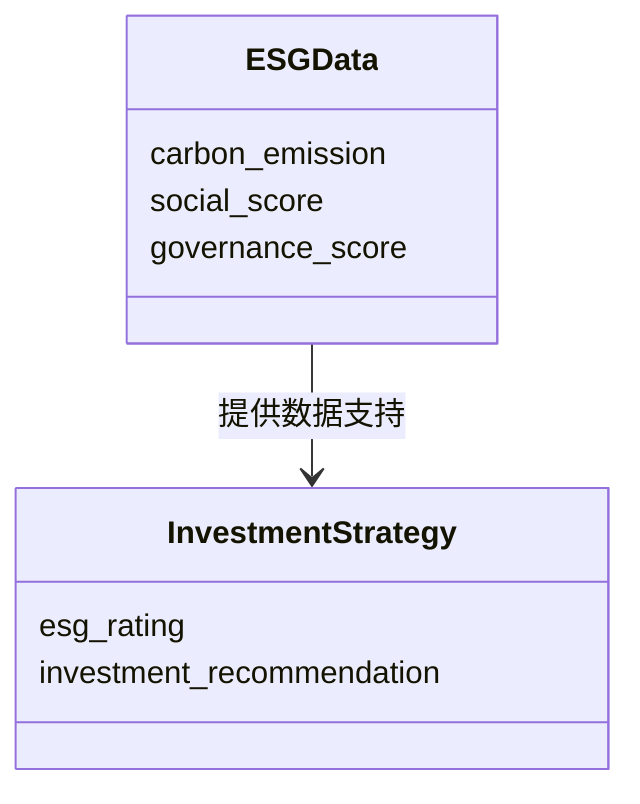
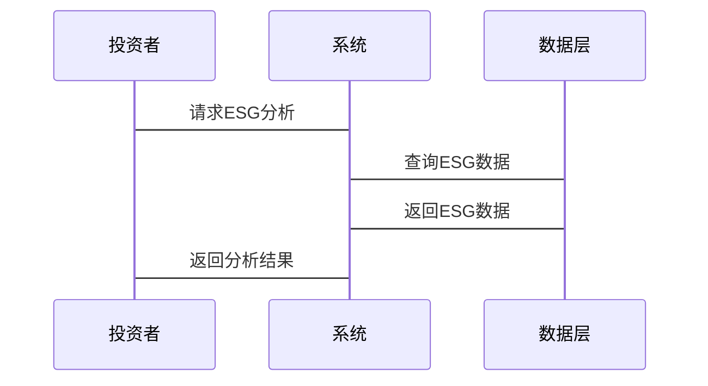

                 

# 价值投资中的ESG因素分析

> 关键词：价值投资, ESG因素, 环境, 社会, 治理, 投资分析, 可持续发展

> 摘要：本文深入探讨了在价值投资中如何分析和利用ESG（环境、社会、治理）因素。通过背景介绍、核心概念、算法原理、数学模型、系统架构、项目实战等多维度分析，揭示了ESG因素对投资决策的重要影响，并提供实际操作的指导和建议。

---

## 第一章：ESG的背景与定义

### 1.1 什么是ESG

#### 1.1.1 ESG的定义与内涵

ESG（Environmental, Social, Governance）是环境、社会和治理的缩写，代表企业在经营过程中对环境、社会和公司治理方面的表现。ESG不仅关注企业的财务绩效，还关注其对社会和环境的影响，是可持续投资的重要指标。

#### 1.1.2 ESG与可持续发展的关系

ESG与可持续发展密切相关。企业通过良好的ESG表现，可以在长期实现更高的价值和更好的社会形象。ESG投资不仅有助于环境保护和社会责任，还能规避潜在的财务风险。

#### 1.1.3 ESG在投资中的重要性

随着全球对可持续发展的关注增加，ESG投资越来越受到重视。越来越多的投资者意识到，ESG表现优秀的公司往往具有更强的抗风险能力和长期增长潜力。

### 1.2 ESG的起源与发展

#### 1.2.1 ESG概念的历史演变

ESG概念起源于20世纪60年代的环境运动，逐步扩展到社会和治理因素。近年来，随着全球气候变化和企业社会责任意识的增强，ESG投资在全球范围内迅速发展。

#### 1.2.2 全球ESG投资的发展现状

当前，ESG投资已成为全球投资的重要组成部分。各大金融机构和评级机构纷纷推出ESG评分标准，帮助投资者评估企业的可持续发展能力。

#### 1.2.3 ESG在不同地区的实践差异

不同地区对ESG的重视程度和实践方式有所不同。例如，欧洲在环境方面较为严格，北美在公司治理方面较为突出，而亚洲则在社会责任方面表现显著。

### 1.3 ESG与传统投资的结合

#### 1.3.1 传统投资的局限性

传统投资往往忽视非财务因素，可能导致企业风险暴露不足。例如，高碳排放企业可能面临政策风险和声誉风险。

#### 1.3.2 ESG如何弥补传统投资的不足

通过引入ESG因素，投资者可以更全面地评估企业风险，避免因环境、社会或治理问题导致的投资损失。

#### 1.3.3 ESG投资的核心优势

ESG投资注重长期价值，能够帮助投资者规避短期波动，抓住具有可持续发展潜力的企业。

### 1.4 ESG的评价标准与框架

#### 1.4.1 主流ESG评级机构及其标准

主流评级机构包括MSCI、S&P和FTSE等，它们提供不同的ESG评分标准和方法论。

#### 1.4.2 ESG指标体系的构建方法

构建ESG指标体系需要考虑环境、社会和治理三方面，每个方面又包含多个具体指标。

#### 1.4.3 ESG评分的计算与解读

ESG评分通常基于标准化的指标体系，经过数据处理和模型计算得出，评分越高表示企业在ESG方面的表现越好。

---

## 第二章：ESG的三要素分析

### 2.1 环境因素（E）

#### 2.1.1 环境因素的定义与范围

环境因素关注企业在资源使用、碳排放、污染等方面的表现。例如，企业是否采用绿色能源、是否遵守环保法规等。

#### 2.1.2 环境指标的关键指标

- 碳排放强度
- 可再生能源使用比例
- 污染物排放量

#### 2.1.3 环境风险对投资的影响

环境表现不佳的企业可能面临政策罚款、社会责任争议和品牌损失，从而影响投资回报。

### 2.2 社会因素（S）

#### 2.2.1 社会因素的定义与范围

社会因素关注企业在员工权益、社区参与、产品安全等方面的表现。例如，企业是否提供公平的薪酬、是否积极参与社会责任项目等。

#### 2.2.2 社会指标的关键指标

- 员工满意度
- 社会责任投入比例
- 产品安全记录

#### 2.2.3 社会风险对投资的影响

社会表现不佳的企业可能面临员工流失、消费者抵制和法律诉讼，从而影响企业稳定性和投资价值。

### 2.3 治理因素（G）

#### 2.3.1 治理因素的定义与范围

治理因素关注企业的公司治理结构、董事会构成、内部控制等方面。例如，企业是否拥有独立的董事会、是否建立有效的风险管理机制等。

#### 2.3.2 治理指标的关键指标

- 董事会独立性
- 内部审计覆盖率
- 信息披露透明度

#### 2.3.3 治理风险对投资的影响

治理表现不佳的企业可能面临管理混乱、内部腐败和合规风险，从而影响企业的长期发展和投资价值。

---

## 第三章：ESG的量化分析方法

### 3.1 ESG的量化分析框架

#### 3.1.1 数据收集与处理

- 数据来源：企业年报、社会责任报告、第三方评级机构数据
- 数据清洗：处理缺失值、异常值
- 数据标准化：将不同指标标准化处理

#### 3.1.2 指标体系的构建

- 确定关键ESG指标
- 设定指标权重
- 组合指标形成综合评分

### 3.2 ESG的数学模型

#### 3.2.1 多元回归模型

$$ \text{企业价值} = \beta_0 + \beta_1 \times \text{ESG评分} + \beta_2 \times \text{其他变量} + \epsilon $$

#### 3.2.2 案例分析：某企业的ESG评分与股价关系

通过回归分析，发现ESG评分较高的企业，其股价表现通常优于评分较低的企业。

### 3.3 ESG的预测模型

#### 3.3.1 基于机器学习的ESG预测

使用随机森林或神经网络模型，基于历史数据预测企业的未来ESG表现。

#### 3.3.2 案例分析：预测某企业的碳排放

通过模型预测，发现某企业未来三年的碳排放将显著减少，这将提升其ESG评分和投资价值。

---

## 第四章：ESG投资策略的系统分析

### 4.1 系统架构设计

#### 4.1.1 模块化设计

- 数据采集模块：收集企业ESG相关数据
- 指标计算模块：计算ESG评分
- 投资决策模块：基于ESG评分制定投资策略

#### 4.1.2 领域模型

### 4.2 系统架构设计

#### 4.2.1 分层架构

- 数据层：存储ESG相关数据
- 业务逻辑层：计算ESG评分、生成投资建议
- 用户界面层：展示ESG评分和投资策略

#### 4.2.2 系统架构图

### 4.3 系统接口设计

#### 4.3.1 API设计

- GET /esg/rating?ticker=XXX
- POST /investment/strategy

#### 4.3.2 系统交互流程

---

## 第五章：项目实战

### 5.1 项目背景

#### 5.1.1 项目目标

构建一个基于ESG分析的投资系统，帮助投资者制定可持续投资策略。

#### 5.1.2 项目需求

- 数据采集：获取企业ESG相关数据
- 指标计算：计算ESG评分
- 投资决策：基于ESG评分制定投资建议

### 5.2 环境影响评估

#### 5.2.1 环境影响分析

计算企业的碳排放强度，评估其环境风险。

#### 5.2.2 环境风险控制

建议投资者优先选择碳排放强度低的企业。

### 5.3 社会风险分析

#### 5.3.1 社会风险评估

评估企业的社会责任履行情况，如员工权益、社区参与等。

#### 5.3.2 社会风险控制

建议投资者关注社会责任表现优秀的企业。

### 5.4 治理结构优化

#### 5.4.1 治理结构分析

评估企业的治理结构，如董事会独立性、内部控制有效性等。

#### 5.4.2 治理风险控制

建议投资者关注治理结构完善的企业。

---

## 第六章：最佳实践与小结

### 6.1 最佳实践

#### 6.1.1 数据来源的可靠性

选择权威的ESG评级机构数据。

#### 6.1.2 指标权重的合理性

根据行业特点调整指标权重。

#### 6.1.3 投资策略的动态调整

定期更新ESG评分，及时调整投资策略。

### 6.2 小结

ESG因素在价值投资中具有重要意义。通过量化分析和系统设计，投资者可以更好地识别和管理风险，实现可持续投资目标。

---

作者：AI天才研究院/AI Genius Institute & 禅与计算机程序设计艺术 /Zen And The Art of Computer Programming

