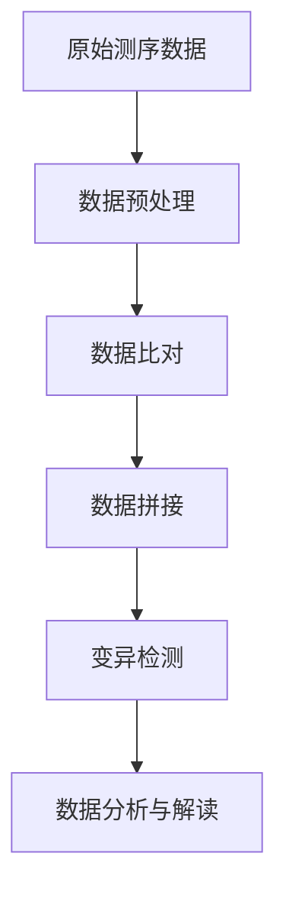
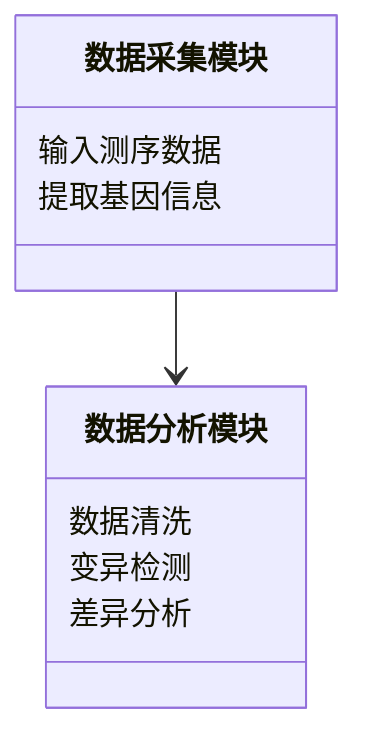
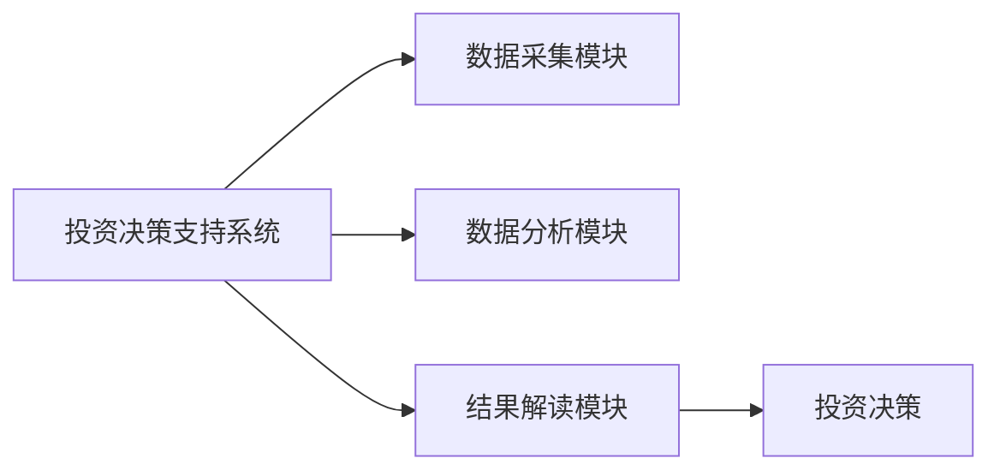

                 

# 价值投资中的下一代DNA测序技术前景

## 关键词：DNA测序技术、价值投资、基因检测、个性化医疗、投资分析

## 摘要：  
下一代DNA测序技术（Next-Generation Sequencing, NGS）作为生物技术领域的革命性突破，正在深刻改变医疗健康行业的面貌。本文将探讨NGS技术在价值投资中的潜在机会与挑战，通过分析其在基因检测、个性化医疗和健康管理中的应用前景，结合实际案例和系统设计，为投资者提供科学的决策支持。

---

## 第一部分：背景介绍

### 第1章：DNA测序技术与价值投资概述

#### 1.1 DNA测序技术的发展历程

DNA测序技术自20世纪70年代以来经历了三次重大变革：  
1. **第一代测序技术**：基于链终止法，测序速度慢、成本高，主要用于科研领域。  
2. **第二代测序技术**：以Illumina和Thermo Fisher为代表，采用高通量平行测序，大幅降低了成本，广泛应用于基因组研究和临床诊断。  
3. **第三代测序技术**：以Oxford Nanopore和Pacific Biosciences为代表，具备长读长优势，进一步提升了测序效率和准确性。

#### 1.2 价值投资的基本概念

价值投资是一种以低于内在价值的价格买入优质资产的投资策略，核心在于寻找市场低估的投资标的。其关键在于对企业的基本面分析，包括财务状况、行业地位、盈利能力等。

#### 1.3 DNA测序技术与价值投资的结合

下一代测序技术在医疗健康领域的广泛应用为投资者提供了新的机遇：  
- **基因检测市场**：个性化医疗、疾病预测和健康管理等领域的需求激增。  
- **技术驱动的公司**：掌握先进测序技术的企业具备更高的市场竞争力和成长空间。

---

## 第二部分：下一代DNA测序技术的核心概念与联系

### 第2章：下一代DNA测序技术的核心原理

#### 2.1 测序技术的原理

下一代测序技术的核心步骤包括：  
1. **片段化处理**：将DNA分子切割成小片段。  
2. **文库制备**：为每个片段添加接头，便于后续测序。  
3. **平行测序**：通过高通量技术同时测定大量片段。  
4. **数据比对**：将测序结果与参考基因组比对，识别变异。

#### 2.2 测序技术的核心要素

| 要素 | 描述 | 重要性 |
|------|------|--------|
| 测序平台 | 不同平台的读长、通量和成本差异显著 | 极高 |
| 数据分析 | 测序数据的处理和解读是关键 | 高 |
| 成本 | 测序成本直接影响市场应用广度 | 中 |

---

## 第三部分：下一代DNA测序技术的算法原理

### 第3章：测序数据分析的算法原理

#### 3.1 测序数据的处理流程

#### 3.2 常见的生物信息学算法

- **数据比对算法**：如BWA、Bowtie，用于将测序片段比对到参考基因组。  
- **变异检测算法**：如GATK、VarScan，用于识别单核苷酸变异和插入缺失。

---

## 第四部分：数学模型与公式

### 第4章：测序数据的统计分析

#### 4.1 测序数据的分布特征

测序数据通常呈现正态分布或偏态分布，可以通过以下公式进行标准化处理：

$$ Z = \frac{X - \mu}{\sigma} $$

其中，\( X \) 是原始数据，\( \mu \) 是均值，\( \sigma \) 是标准差。

#### 4.2 测序数据的差异分析

差异表达分析常用t检验或卡方检验，公式如下：

$$ t = \frac{\bar{X}_1 - \bar{X}_2}{\sqrt{\frac{s_1^2}{n_1} + \frac{s_2^2}{n_2}}} $$

其中，\( \bar{X}_1 \) 和 \( \bar{X}_2 \) 是两组数据的均值，\( s_1 \) 和 \( s_2 \) 是标准差，\( n_1 \) 和 \( n_2 \) 是样本数量。

---

## 第五部分：系统分析与架构设计方案

### 第5章：投资决策支持系统的构建

#### 5.1 系统功能设计

#### 5.2 系统架构设计

---

## 第六部分：项目实战

### 第6章：基于测序技术的医疗投资分析

#### 6.1 个性化医疗的投资机会

个性化医疗基于患者的基因信息制定精准治疗方案，市场需求巨大。例如，癌症基因检测市场年复合增长率超过20%。

#### 6.2 基因检测公司的投资分析

以某基因检测公司为例：  
- **财务状况**：收入增长快，毛利率高。  
- **技术优势**：拥有自主测序平台，成本优势明显。  
- **市场地位**：占据行业领先地位，具备先发优势。

---

## 第七部分：最佳实践与小结

### 第7章：价值投资中的DNA测序技术展望

#### 7.1 投资策略建议

- 重点关注具备核心技术优势的基因检测公司。  
- 留意政策支持和市场需求旺盛的领域，如个性化医疗和健康管理。  

#### 7.2 小结

下一代DNA测序技术正在重塑医疗健康行业，为投资者提供了丰富的投资机会。通过深入分析技术和市场的结合点，投资者可以在这一领域实现长期稳定的收益。

---

## 注意事项

- **技术风险**：测序技术更新迭代快，需关注技术壁垒。  
- **市场风险**：市场需求受政策和技术进步影响较大。  
- **竞争风险**：行业竞争激烈，需关注企业的核心竞争力。

---

## 作者

作者：AI天才研究院/AI Genius Institute & 禅与计算机程序设计艺术/Zen And The Art of Computer Programming

