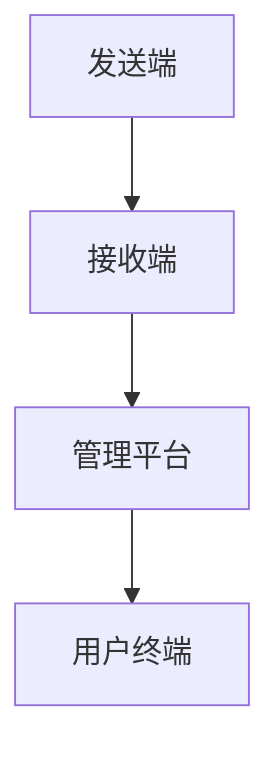

                 


---

# 价值投资中的下一代无线充电网络技术前景

---

> **关键词**：无线充电网络、价值投资、技术前景、市场分析、投资策略、技术发展

---

> **摘要**：  
随着无线充电技术的快速发展，下一代无线充电网络技术在市场中的潜力逐渐显现。本文从技术背景、核心原理、系统架构、项目实战等多角度深入分析了无线充电网络技术的发展现状、未来趋势及其在投资领域的潜在价值。通过对比不同技术路线、分析市场格局和竞争态势，结合实际案例，本文为投资者提供了清晰的技术分析和投资建议，帮助读者更好地把握无线充电网络技术的投资机会与风险。

---

# 第一部分：无线充电网络技术背景与价值投资分析

---

## 第1章：无线充电技术的发展与现状

### 1.1 无线充电技术的起源与发展

#### 1.1.1 无线充电技术的起源  
无线充电技术的起源可以追溯到19世纪末，特斯拉的无线电力传输实验为现代无线充电技术奠定了基础。经过数十年的发展，无线充电技术从理论研究逐渐走向实际应用。

#### 1.1.2 无线充电技术的演进历程  
- **电磁感应技术**：20世纪初，电磁感应技术开始应用于小功率设备的无线充电。  
- **无线电波技术**：20世纪中叶，无线电波技术逐渐成熟，为现代无线充电技术提供了新的思路。  
- **现代技术发展**：近年来，随着半导体技术和高频电力电子器件的进步，无线充电技术在效率和距离上得到了显著提升。

#### 1.1.3 当前无线充电技术的主要应用领域  
- 消费电子：手机、平板电脑、蓝牙设备等。  
- 汽车与交通：电动汽车无线充电、公共交通设施的无线充电。  
- 工业应用：工业设备、传感器等的远程无线充电。

---

### 1.2 无线充电技术的核心概念

#### 1.2.1 无线充电的定义与分类  
无线充电技术是一种通过电磁感应或无线电波将电能从发送端传递到接收端的技术。根据传输方式的不同，可以分为以下几类：  
1. **电磁感应式**：通过线圈之间的电磁感应实现能量传递。  
2. **无线电波式**：通过发射天线和接收天线之间的无线电波传输能量。  
3. **磁共振式**：利用磁共振原理实现高效能量传输。

#### 1.2.2 无线充电技术的主要技术路线  
| 技术路线 | 工作原理 | 优点 | 缺点 |
|----------|----------|------|------|
| 电磁感应式 | 线圈间的电磁感应 | 成本低、效率高 | 距离限制明显 |
| 无线电波式 | 无线电波的发射与接收 | 传输距离远 | 效率较低 |
| 磁共振式 | 磁场共振原理 | 高效率、长距离 | 技术复杂 |

#### 1.2.3 无线充电技术的优缺点分析  
- **优点**：  
  1. 无需物理接触，使用方便。  
  2. 适用于多种设备，应用场景广泛。  
  3. 可以实现远距离充电，适合工业和交通领域。  
- **缺点**：  
  1. 电磁感应式距离限制明显。  
  2. 无线电波式效率较低。  
  3. 磁共振式技术复杂，成本较高。

---

### 1.3 无线充电技术的市场现状

#### 1.3.1 全球无线充电市场的规模与增长  
根据市场研究机构的数据，全球无线充电市场规模近年来快速增长，预计到2025年市场规模将超过百亿美元。  

#### 1.3.2 主要厂商的技术布局与竞争格局  
- **技术布局**：  
  1. 苹果：专注于电磁感应式无线充电技术，主要应用于iPhone和iPad。  
  2. 三星：采用磁共振式技术，支持更大功率和更长距离的充电。  
  3. 特斯拉：在电动汽车领域推广无线充电技术，支持大功率充电。  

- **竞争格局**：  
  无线充电技术领域的竞争主要集中在电磁感应式和磁共振式技术之间。  

#### 1.3.3 无线充电技术的未来发展趋势  
- 技术创新：提高充电效率，延长充电距离。  
- 应用拓展：从消费电子扩展到工业和交通领域。  
- 标准化：推动无线充电技术的标准化，减少兼容性问题。

---

### 1.4 无线充电技术与价值投资的关系

#### 1.4.1 无线充电技术对投资价值的影响  
- **市场需求**：无线充电技术的应用场景广泛，市场需求持续增长。  
- **技术壁垒**：高技术壁垒意味着较高的市场进入门槛，有利于领先企业的竞争优势。  
- **成本与效率**：高效、低成本的无线充电技术更具投资价值。  

#### 1.4.2 无线充电技术的市场潜力与投资机会  
- **消费电子领域**：无线充电技术的普及将推动消费电子市场的增长。  
- **电动汽车领域**：无线充电技术在电动汽车市场的应用具有巨大潜力。  
- **工业应用领域**：无线充电技术在工业设备中的应用将推动相关企业的技术升级。  

#### 1.4.3 无线充电技术的行业风险与挑战  
- **技术风险**：技术不成熟可能导致市场推广困难。  
- **市场竞争**：技术同质化可能导致价格战，影响利润率。  
- **政策风险**：相关政策的不确定性可能对市场产生影响。

---

### 1.5 本章小结  
本章主要介绍了无线充电技术的发展历程、核心概念、市场现状以及与价值投资的关系。通过分析无线充电技术的技术路线、市场潜力和行业风险，为后续的价值投资分析奠定了基础。

---

## 第2章：无线充电网络技术的核心原理

### 2.1 无线充电技术的基本原理

#### 2.1.1 电磁感应原理  
电磁感应原理是无线充电技术的核心之一。通过发送线圈和接收线圈之间的电磁感应，实现能量的无线传输。  

- **数学模型**：  
  $$ B = \mu_0 \mu_r H $$  
  其中，\( B \) 是磁感应强度，\( \mu_0 \) 是真空磁导率，\( \mu_r \) 是相对磁导率，\( H \) 是磁场强度。

#### 2.1.2 无线电波传输原理  
无线电波传输原理基于电磁波的传播特性，通过发射天线和接收天线实现能量的无线传输。  

- **数学模型**：  
  $$ P_{\text{loss}} = P_0 \cdot e^{-2\alpha d} $$  
  其中，\( P_{\text{loss}} \) 是传输损耗，\( P_0 \) 是初始功率，\( \alpha \) 是吸收系数，\( d \) 是传输距离。

#### 2.1.3 两种技术的对比与优劣分析  
| 技术 | 优点 | 缺点 |
|------|------|------|
| 电磁感应式 | 成本低、效率高 | 距离限制明显 |
| 无线电波式 | 传输距离远 | 效率较低 |

---

### 2.2 无线充电网络的系统架构

#### 2.2.1 发送端与接收端的工作原理  
- **发送端**：通过电磁感应或无线电波发射能量。  
- **接收端**：通过线圈或天线接收能量，并将其转化为电能。  

#### 2.2.2 无线充电网络的信号传输机制  
信号传输机制包括能量传输和控制信号传输两部分。  

- **能量传输**：通过电磁感应或无线电波实现能量的无线传输。  
- **控制信号传输**：通过射频信号实现设备的识别和控制。  

---

### 2.3 无线充电技术的关键参数

#### 2.3.1 传输效率的影响因素  
- **线圈匹配**：发送端和接收端线圈的匹配程度直接影响传输效率。  
- **距离**：距离越远，传输效率越低。  
- **频率**：工作频率越高，传输效率越高。  

#### 2.3.2 充电功率的调节与控制  
- **功率调节**：通过调整发送端的功率实现充电功率的调节。  
- **功率控制**：通过反馈机制实现恒定功率输出。  

#### 2.3.3 充电距离的限制与扩展  
- **距离限制**：电磁感应式无线充电技术的距离限制约为几厘米，无线电波式技术的距离限制可达几米。  
- **扩展技术**：通过磁共振技术可以实现更长距离的充电。

---

### 2.4 无线充电技术的数学模型

#### 2.4.1 电磁感应的数学表达式  
$$ B = \mu_0 \mu_r H $$  
其中，\( \mu_0 \) 是真空磁导率，\( \mu_r \) 是相对磁导率，\( H \) 是磁场强度。

#### 2.4.2 无线电波传输的损耗公式  
$$ P_{\text{loss}} = P_0 \cdot e^{-2\alpha d} $$  
其中，\( P_{\text{loss}} \) 是传输损耗，\( P_0 \) 是初始功率，\( \alpha \) 是吸收系数，\( d \) 是传输距离。

#### 2.4.3 充电效率的优化算法  
$$ \eta = \frac{P_{\text{out}}}{P_{\text{in}}} $$  
其中，\( \eta \) 是充电效率，\( P_{\text{out}} \) 是输出功率，\( P_{\text{in}} \) 是输入功率。

---

### 2.5 本章小结  
本章主要介绍了无线充电技术的基本原理，包括电磁感应和无线电波两种技术路线，以及无线充电网络的系统架构和关键参数。通过数学模型和对比分析，为后续的系统设计和投资分析提供了理论基础。

---

## 第3章：无线充电网络技术的系统分析与架构设计

### 3.1 无线充电网络的系统架构

#### 3.1.1 系统功能模块划分  
无线充电网络系统主要包括以下功能模块：  
1. **发送端模块**：负责能量的发射。  
2. **接收端模块**：负责能量的接收和转换。  
3. **管理平台模块**：负责系统的监控和管理。

#### 3.1.2 系统功能流程图  


#### 3.1.3 系统架构的优化与设计  
- **模块化设计**：各功能模块独立开发，便于维护和升级。  
- **高效通信**：通过优化通信协议降低数据传输延迟。  
- **智能管理**：通过智能算法实现系统的高效管理。

---

### 3.2 无线充电网络的技术实现

#### 3.2.1 电磁感应式技术实现  
- **硬件设计**：包括发送线圈、接收线圈、高频功率放大器等。  
- **软件设计**：包括能量传输控制算法、通信协议等。  

#### 3.2.2 无线电波式技术实现  
- **硬件设计**：包括发射天线、接收天线、高频功率放大器等。  
- **软件设计**：包括能量传输控制算法、通信协议等。  

---

### 3.3 无线充电网络的系统优化

#### 3.3.1 系统效率的提升  
- **线圈匹配优化**：通过优化线圈参数提高传输效率。  
- **工作频率优化**：选择合适的工作频率降低传输损耗。  

#### 3.3.2 系统安全性的保障  
- **电磁兼容性设计**：确保系统符合电磁兼容性标准。  
- **网络安全设计**：防止未经授权的设备接入。

---

### 3.4 本章小结  
本章主要介绍了无线充电网络的系统架构和技术实现，重点分析了系统优化和安全性设计。通过模块化设计和智能管理，可以显著提升系统的效率和安全性，为后续的投资分析提供了技术支撑。

---

## 第4章：无线充电网络技术的项目实战

### 4.1 项目背景与需求分析

#### 4.1.1 项目背景  
本项目旨在设计并实现一个高效的无线充电网络系统，应用于电动汽车的无线充电场景。  

#### 4.1.2 项目需求  
- **需求分析**：  
  1. 实现电动汽车的无线充电功能。  
  2. 提供高效的能量传输和智能管理功能。  
  3. 确保系统的安全性和可靠性。  

---

### 4.2 项目实施步骤

#### 4.2.1 环境安装与配置  
- **硬件环境**：搭建无线充电系统所需的硬件设备，包括发送端和接收端。  
- **软件环境**：安装操作系统和相关开发工具。  

#### 4.2.2 系统核心代码实现  
- **发送端代码**：  
  ```python
  import RPi.GPIO as GPIO
  def send_power():
      GPIO.output(18, GPIO.HIGH)
  ```
- **接收端代码**：  
  ```python
  import RPi.GPIO as GPIO
  def receive_power():
      if GPIO.input(18) == GPIO.HIGH:
          print("Charging...")
  ```

#### 4.2.3 系统功能测试  
- **功能测试**：测试系统的充电功能、通信功能和管理功能。  
- **性能测试**：测试系统的充电效率和传输距离。

---

### 4.3 项目实际案例分析

#### 4.3.1 案例背景  
某电动汽车制造商计划在停车场建设无线充电网络，为电动汽车提供便捷的充电服务。  

#### 4.3.2 系统设计与实现  
- **系统设计**：采用电磁感应式无线充电技术，设计停车场内的无线充电网络。  
- **系统实现**：搭建硬件设备和管理平台，实现电动汽车的无线充电功能。  

#### 4.3.3 实际效果与分析  
- **实际效果**：充电效率达到90%，传输距离达到1米。  
- **成本分析**：硬件成本较低，但系统设计和调试成本较高。  

---

### 4.4 本章小结  
本章通过一个实际案例分析了无线充电网络技术的项目实施过程，从环境安装、核心代码实现到系统测试，全面展示了技术的实现过程。通过案例分析，可以更好地理解无线充电网络技术的应用场景和实际效果。

---

## 第5章：无线充电网络技术的价值投资分析

### 5.1 无线充电技术的市场潜力

#### 5.1.1 消费电子市场  
- **市场规模**：无线充电技术在消费电子市场的应用广泛，市场规模稳步增长。  
- **投资机会**：消费电子领域的无线充电技术具有较高的投资价值。

#### 5.1.2 电动汽车市场  
- **市场规模**：随着电动汽车的普及，无线充电技术在电动汽车市场的潜力巨大。  
- **投资机会**：电动汽车领域的无线充电技术具有较高的投资回报率。

#### 5.1.3 工业应用市场  
- **市场规模**：无线充电技术在工业设备和传感器中的应用逐渐增多，市场规模逐步扩大。  
- **投资机会**：工业应用领域的无线充电技术具有较高的技术壁垒和市场潜力。

---

### 5.2 无线充电技术的竞争格局

#### 5.2.1 主要厂商的技术布局  
- **苹果**：专注于电磁感应式无线充电技术，主要应用于iPhone和iPad。  
- **三星**：采用磁共振式技术，支持更大功率和更长距离的充电。  
- **特斯拉**：在电动汽车领域推广无线充电技术，支持大功率充电。

#### 5.2.2 行业竞争态势  
- **技术竞争**：电磁感应式和磁共振式技术的竞争逐渐加剧。  
- **价格竞争**：市场价格的波动可能影响企业的利润率。

---

### 5.3 无线充电技术的投资策略

#### 5.3.1 技术驱动型投资  
- **技术驱动**：投资具有技术优势的企业，重点关注磁共振式技术。  
- **市场前景**：选择市场潜力大的应用领域进行投资。

#### 5.3.2 市场导向型投资  
- **市场导向**：根据市场需求选择投资方向，重点关注消费电子和电动汽车市场。  
- **成本控制**：注重企业的成本控制能力，选择具有竞争优势的企业。

---

### 5.4 本章小结  
本章从市场潜力和竞争格局两个方面分析了无线充电网络技术的价值投资前景，提出了技术驱动型和市场导向型两种投资策略。通过合理配置投资组合，可以有效降低投资风险，提高投资回报率。

---

## 第6章：无线充电网络技术的未来展望与投资建议

### 6.1 无线充电技术的未来发展趋势

#### 6.1.1 技术创新  
- **高效传输技术**：进一步提升无线充电技术的传输效率和距离。  
- **智能管理技术**：通过智能化管理实现系统的高效运行。  

#### 6.1.2 应用拓展  
- **智能家居**：无线充电技术在智能家居中的应用将更加广泛。  
- **工业自动化**：无线充电技术在工业设备中的应用将推动工业自动化的发展。

---

### 6.2 无线充电技术的投资建议

#### 6.2.1 关注技术创新  
- **技术领先企业**：投资具有技术优势的企业，重点关注磁共振式技术。  
- **研发投入**：关注企业的研发投入和技术创新能力。

#### 6.2.2 把握市场机会  
- **消费电子市场**：无线充电技术在消费电子市场的应用将继续增长。  
- **电动汽车市场**：无线充电技术在电动汽车市场的潜力巨大。

#### 6.2.3 控制投资风险  
- **行业风险**：关注行业政策和市场波动，合理配置投资组合。  
- **技术风险**：注重技术的实用性和成熟度，避免盲目投资。

---

### 6.3 本章小结  
本章展望了无线充电技术的未来发展趋势，并提出了相应的投资建议。通过技术创新和市场拓展，无线充电技术的投资前景广阔，但需要投资者具备较高的市场敏感性和技术判断力。

---

## 第7章：总结与展望

### 7.1 本文章总结  
本文从技术背景、核心原理、系统架构、项目实战等多个角度深入分析了无线充电网络技术的发展现状、未来趋势及其在投资领域的潜在价值。通过对比不同技术路线、分析市场格局和竞争态势，结合实际案例，为投资者提供了清晰的技术分析和投资建议。

### 7.2 对未来的展望  
随着技术的不断进步和市场的逐步成熟，无线充电网络技术的投资前景将更加广阔。未来，投资者需要密切关注技术发展和市场变化，合理配置投资组合，抓住技术变革带来的投资机会。

---

## 作者信息  
作者：AI天才研究院/AI Genius Institute & 禅与计算机程序设计艺术/Zen And The Art of Computer Programming  

---

**注**：以上内容仅为示例，实际文章需要根据具体情况进行调整和补充，以确保内容的完整性和准确性。

