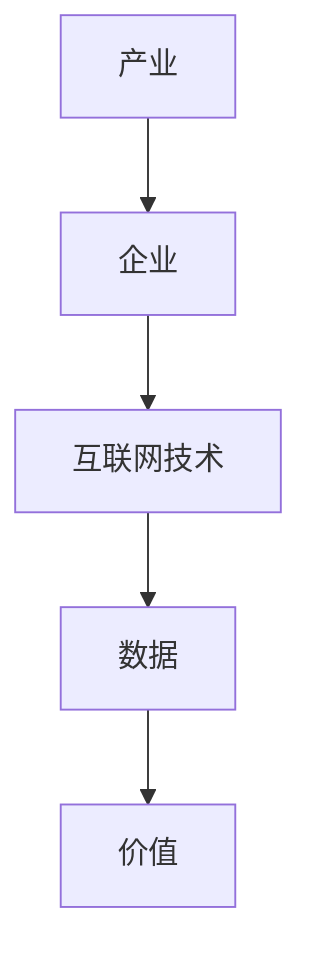
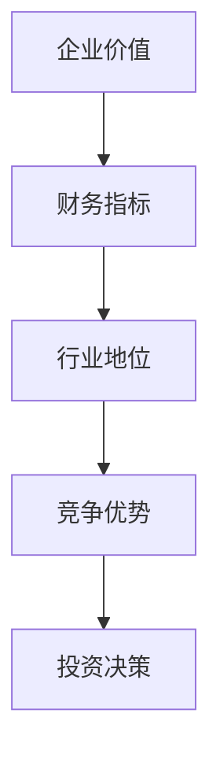
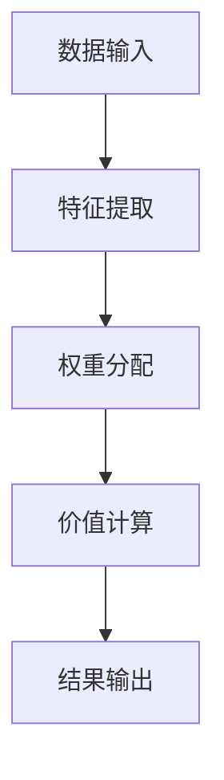
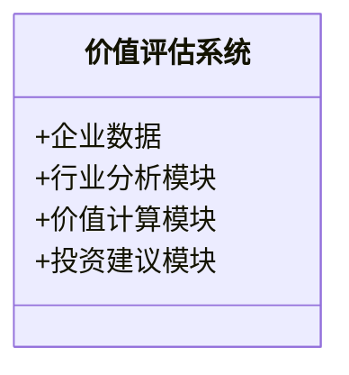

                 


# 价值投资中的产业互联网机遇

> 关键词：价值投资，产业互联网，投资机遇，数据分析，算法模型，系统架构，投资策略

> 摘要：本文将深入探讨价值投资与产业互联网的结合，分析产业互联网带来的投资机遇，以及如何通过数据分析和算法模型进行价值评估。同时，我们将展示一个实际的项目案例，说明如何在产业互联网背景下进行投资分析。

---

## 第1章: 价值投资与产业互联网的背景介绍

### 1.1 价值投资的核心概念

#### 1.1.1 价值投资的定义与核心思想
价值投资是一种投资策略，强调以低于内在价值的价格购买优质资产。其核心思想是通过深入分析企业的基本面，寻找被市场低估的投资机会。价值投资的关键在于长期主义和安全边际。

#### 1.1.2 价值投资的基本原则
- **质量优先**：选择具有强大竞争优势和持续盈利能力的企业。
- **价格敏感**：买入价格低于企业内在价值。
- **长期持有**：避免频繁交易，耐心持有优质资产。

#### 1.1.3 价值投资的适用场景与边界
价值投资适用于对企业基本面分析能力较强的投资者，尤其在市场低迷或企业估值被低估时表现更为突出。其边界在于行业选择和企业质量的筛选。

### 1.2 产业互联网的定义与特点

#### 1.2.1 产业互联网的定义
产业互联网是指将互联网技术应用于传统产业，通过数字化转型提升产业效率和竞争力。它不同于消费互联网，更注重产业内部的协作和数据驱动。

#### 1.2.2 产业互联网的核心特征
- **数据驱动**：通过大数据分析优化产业流程。
- **技术赋能**：利用云计算、人工智能等技术提升效率。
- **产业协同**：促进产业链上下游的协同合作。

#### 1.2.3 产业互联网与消费互联网的区别
| 特性 | 消费互联网 | 产业互联网 |
|------|------------|------------|
| 服务对象 | 消费者    | 企业与产业 |
| 核心技术 | 电商平台、社交媒体 | 数据分析、工业互联网 |
| 目标 | 提升消费体验 | 提升产业效率 |

### 1.3 价值投资与产业互联网的结合

#### 1.3.1 产业互联网对价值投资的影响
产业互联网通过提升产业效率和透明度，为价值投资者提供了更丰富的数据和更精准的分析工具。

#### 1.3.2 产业互联网带来的投资机遇
- **技术驱动型企业**：云计算、人工智能等技术企业的投资机会。
- **传统产业转型**：传统产业通过数字化转型带来的投资机会。
- **数据价值挖掘**：通过数据驱动的投资策略。

#### 1.3.3 产业互联网与价值投资的结合方式
- **数据驱动分析**：利用产业互联网数据进行企业估值。
- **技术赋能投资**：通过技术手段提升投资效率。
- **产业链协同**：关注产业链协同带来的投资机会。

---

## 第2章: 产业互联网的核心概念与联系

### 2.1 产业互联网的实体关系图



### 2.2 价值投资的分析框架



---

## 第3章: 产业互联网中的价值评估算法

### 3.1 产业互联网价值评估的数学模型

$$ V = \sum_{i=1}^{n} w_i x_i $$
其中，$V$ 是企业价值，$w_i$ 是权重，$x_i$ 是指标值。

### 3.2 价值评估算法的流程图



---

## 第4章: 产业互联网与价值投资的系统分析

### 4.1 项目介绍

#### 4.1.1 项目目标
通过分析产业互联网企业的数据，构建价值评估模型，辅助投资决策。

#### 4.1.2 项目范围
- 数据收集：收集企业财务数据、行业数据。
- 数据分析：利用算法模型评估企业价值。
- 投资建议：基于分析结果提出投资策略。

### 4.2 系统功能设计



---

## 第5章: 项目实战

### 5.1 案例分析

#### 5.1.1 数据收集
从公开数据源获取某产业互联网企业的财务数据和行业数据。

#### 5.1.2 特征提取
提取关键财务指标，如收入增长率、净利润率等。

#### 5.1.3 权重分配
根据行业特点和企业特征，分配各指标的权重。

#### 5.1.4 价值计算
利用数学模型计算企业价值，并与市场价格进行对比。

#### 5.1.5 投资建议
根据计算结果，提出投资建议。

### 5.2 系统实现

#### 5.2.1 环境安装
安装必要的数据分析工具，如Python、Pandas、Scikit-learn。

#### 5.2.2 核心实现代码

```python
import pandas as pd
from sklearn.linear_model import LinearRegression

# 数据加载
data = pd.read_csv('industry_data.csv')

# 特征提取
features = data[['收入增长率', '净利润率', '研发投入占比']]
target = data['企业价值']

# 权重分配
model = LinearRegression()
model.fit(features, target)

# 价值计算
predicted_value = model.predict(features)
```

#### 5.2.3 代码解读与分析
- 数据加载：从CSV文件加载数据。
- 特征提取：选择关键财务指标。
- 模型训练：使用线性回归模型训练权重。
- 价值计算：利用训练好的模型预测企业价值。

---

## 第6章: 总结与展望

### 6.1 总结
本文探讨了价值投资与产业互联网的结合，分析了产业互联网带来的投资机遇，并展示了如何通过数据分析和算法模型进行价值评估。

### 6.2 展望
未来，随着技术的不断发展，产业互联网将为价值投资带来更多的机会。投资者需要不断提升数据分析能力，以抓住这些机遇。

---

作者：AI天才研究院/AI Genius Institute & 禅与计算机程序设计艺术 /Zen And The Art of Computer Programming

