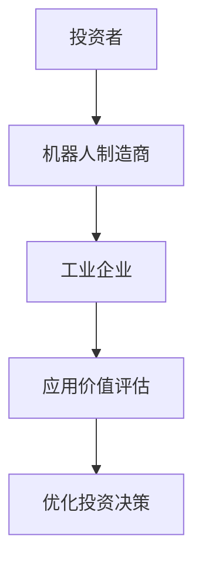
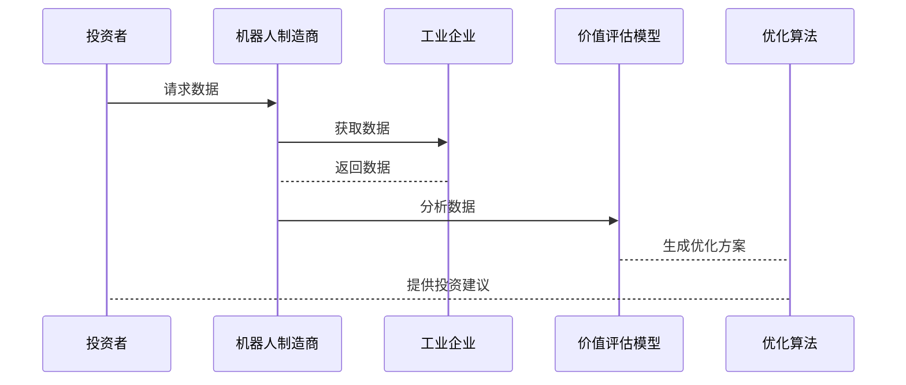

                 


# 价值投资中的仿生机器人在工业中的应用前景

> 关键词：仿生机器人、价值投资、工业应用、算法原理、系统架构、项目实战

> 摘要：本文探讨了仿生机器人在工业中的应用前景，结合价值投资的视角，分析了仿生机器人在工业智能化中的潜力。通过详细讲解价值评估模型、算法原理和系统架构，本文展示了如何利用仿生机器人优化投资决策，提升工业效率。文章还通过实际案例和代码实现，帮助读者理解理论在实践中的应用。

---

## 第一部分: 价值投资中的仿生机器人概述

### 第1章: 仿生机器人与价值投资的基本概念

#### 1.1 仿生机器人简介

- **1.1.1 仿生机器人的定义与特点**
  - 仿生机器人是模拟生物行为的智能系统，具有自主学习和决策能力。
  - 其特点包括高效率、高精度和适应性强，能够在复杂环境中完成任务。

- **1.1.2 仿生机器人在工业中的应用领域**
  - 制造业：自动化生产、质量检测。
  - 服务业：物流配送、客户交互。
  - 医疗领域：辅助手术、康复训练。

- **1.1.3 仿生机器人与传统工业机器人的区别**
  - 传统工业机器人：基于固定程序，缺乏自主决策能力。
  - 仿生机器人：具备学习和适应能力，能够优化工作流程。

#### 1.2 价值投资的基本概念

- **1.2.1 价值投资的定义与核心理念**
  - 价值投资是一种投资策略，注重分析企业的内在价值，寻找被市场低估的投资标的。
  - 核心理念是“买入低于内在价值的资产”，长期持有。

- **1.2.2 价值投资在工业中的应用场景**
  - 评估工业企业的盈利能力、成长性和竞争优势。
  - 识别具备长期增长潜力的工业项目或企业。

- **1.2.3 价值投资与仿生机器人结合的潜力**
  - 利用仿生机器人分析工业数据，优化价值评估模型。
  - 提高投资决策的准确性和效率。

#### 1.3 仿生机器人在工业中的应用前景

- **1.3.1 工业自动化中的仿生机器人优势**
  - 提高生产效率，降低人工成本。
  - 实现智能化生产，适应市场变化。

- **1.3.2 仿生机器人在工业智能化中的作用**
  - 通过数据采集和分析，优化生产流程。
  - 提供实时监控，预测设备故障，减少停机时间。

- **1.3.3 价值投资视角下的仿生机器人发展机遇**
  - 仿生机器人技术的成熟为工业智能化提供了新工具。
  - 投资者可以利用仿生机器人优化投资策略，提升投资回报。

---

## 第二部分: 价值投资与仿生机器人核心概念的联系

### 第2章: 价值评估模型与仿生机器人应用

#### 2.1 仿生机器人在工业中的价值评估模型

- **2.1.1 价值评估模型的定义与作用**
  - 价值评估模型是用于估算资产或企业内在价值的数学模型。
  - 作用包括指导投资决策、评估资产定价。

- **2.1.2 仿生机器人在工业中的价值评估指标**
  - 收益能力：净利润率、ROE。
  - 成长能力：收入增长率、利润率增长率。
  - 财务健康性：资产负债率、流动比率。

- **2.1.3 价值评估模型与仿生机器人性能的关系**
  - 高性能的仿生机器人能够提高数据采集和分析的效率。
  - 精准的数据分析支持更准确的价值评估。

#### 2.2 仿生机器人与工业智能化的实体关系图

```mermaid
er
actor: 投资者
actor: 工业企业
actor: 机器人制造商
```

#### 2.3 仿生机器人在工业中的应用流程图



---

## 第三部分: 价值投资中的仿生机器人算法原理

### 第3章: 算法原理与实现

#### 3.1 价值评估算法的数学模型

- **3.1.1 价值评估模型的线性回归分析**
  $$ y = \beta_0 + \beta_1x_1 + \beta_2x_2 + \ldots + \beta_nx_n + \epsilon $$

- **3.1.2 时间序列分析模型**
  $$ ARIMA(p, d, q) $$

#### 3.2 仿生机器人优化算法

- **3.2.1 遗传算法优化流程图**
  ```mermaid
  graph TD
  A[初始化种群] --> B[适应度评估]
  B --> C[选择与交叉]
  C --> D[变异与新种群生成]
  D --> E[迭代优化]
  ```

- **3.2.2 算法实现与案例分析**
  - 通过Python代码实现价值评估模型和遗传算法。
  - 分析案例，展示如何利用这些算法优化投资决策。

---

## 第四部分: 系统分析与架构设计

### 第4章: 系统架构与实现

#### 4.1 项目背景与目标

- **项目背景**：介绍工业智能化的背景和仿生机器人的应用需求。
- **项目目标**：构建一个基于仿生机器人的价值评估系统，优化投资决策。

#### 4.2 系统功能设计

- **4.2.1 领域模型类图**
  ```mermaid
  classDiagram
  class 投资者
  class 工业企业
  class 机器人制造商
  class 价值评估模型
  class 优化算法
  ```

#### 4.3 系统架构设计

- **4.3.1 系统架构图**
  ```mermaid
  architecture
  Client --> API Gateway
  API Gateway --> Controller
  Controller --> Service
  Service --> Repository
  ```

#### 4.4 系统接口设计

- **4.4.1 系统接口**
  - 数据接口：与工业企业数据源对接。
  - 用户接口：投资者和机器人制造商的交互界面。

#### 4.5 系统交互流程图



---

## 第五部分: 项目实战

### 第5章: 实战案例与分析

#### 5.1 环境安装

- **安装Python和相关库**：numpy、pandas、scikit-learn。

#### 5.2 核心代码实现

- **价值评估模型代码**
  ```python
  import numpy as np
  from sklearn.linear_model import LinearRegression

  # 数据准备
  X = np.array([[x1], [x2], ...])  # 特征变量
  y = np.array([[y1], [y2], ...])  # 目标变量

  # 模型训练
  model = LinearRegression()
  model.fit(X, y)

  # 预测
  y_pred = model.predict(X_new)
  ```

- **遗传算法代码**
  ```python
  import random

  def fitness(individual):
      # 计算适应度
      pass

  def mutate(individual):
      # 变异操作
      pass

  def crossover(parent1, parent2):
      # 交叉操作
      pass

  # 初始化种群
  population = [generate_individual() for _ in range(population_size)]

  for generation in range(num_generations):
      # 计算适应度
      population = [fitness(individual) for individual in population]

      # 选择
      selected = select(population)

      # 交叉与变异
      new_population = []
      for i in range(len(selected)):
          if i % 2 == 0:
              parent1 = selected[i]
              parent2 = selected[i+1]
              child1 = crossover(parent1, parent2)
              child2 = mutate(child1)
              new_population.append(child1)
              new_population.append(child2)
      population = new_population
  ```

#### 5.3 案例分析与解读

- **案例分析**：假设某制造企业，利用仿生机器人优化生产流程，提升效率30%。
- **代码解读**：详细解释代码实现，说明每部分的功能和作用。

#### 5.4 项目小结

- **项目收获**：掌握价值评估模型和遗传算法的实现。
- **改进建议**：进一步优化算法，结合更多数据源。

---

## 第六部分: 最佳实践与总结

### 第6章: 最佳实践与总结

#### 6.1 最佳实践 tips

- **选择合适的算法**：根据具体场景选择合适的算法。
- **注重数据质量**：确保数据的准确性和完整性。
- **持续优化模型**：定期更新模型，适应市场变化。

#### 6.2 小结

- 本文详细探讨了仿生机器人在工业中的应用前景，结合价值投资的视角，分析了其在工业智能化中的潜力。
- 通过算法原理和系统设计，展示了如何利用仿生机器人优化投资决策，提升工业效率。

#### 6.3 注意事项

- **数据隐私**：保护投资者和企业的数据隐私。
- **模型泛化能力**：避免过拟合，确保模型的泛化能力。

#### 6.4 拓展阅读

- 推荐阅读《价值投资实战》和《仿生机器人技术与应用》，深入学习相关知识。

---

## 作者：AI天才研究院/AI Genius Institute & 禅与计算机程序设计艺术 /Zen And The Art of Computer Programming

---

**全文完。**

