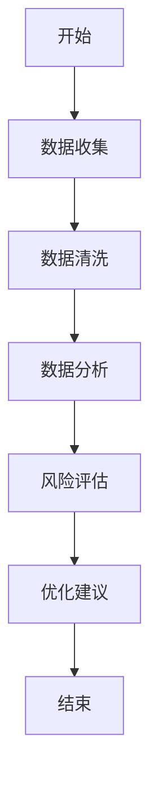
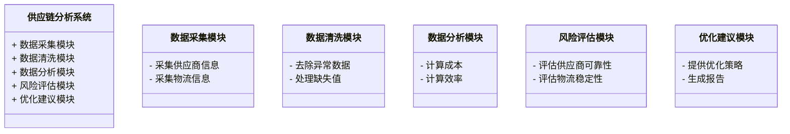
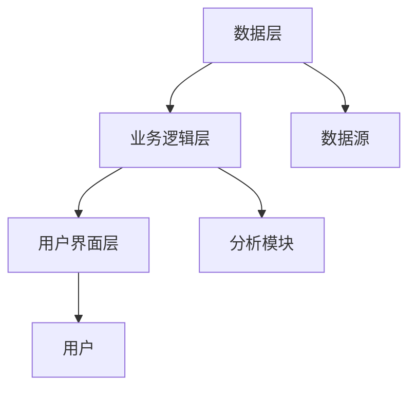
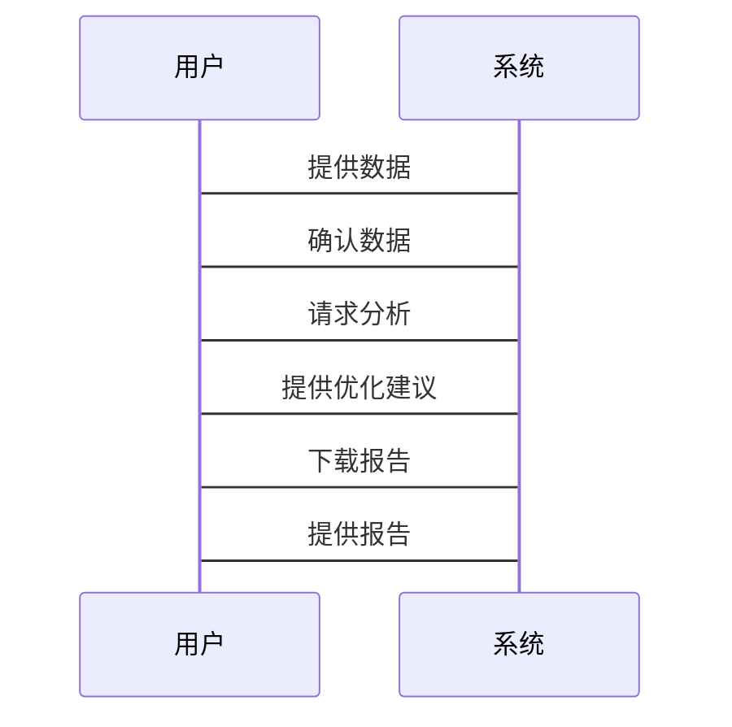

                 


# 价值投资中的供应链分析

---

## 关键词：供应链分析、价值投资、企业价值、风险管理、投资策略、供应链优化

---

## 摘要：  
供应链分析是价值投资中的一个重要环节，通过对供应链的效率、稳定性和透明度的评估，投资者可以更好地识别企业的核心竞争力和潜在风险。本文将详细探讨供应链分析的核心概念、理论基础、数学模型、系统架构以及实际案例，帮助投资者在决策中更好地应用供应链分析。

---

# 第1章: 供应链的基本概念与价值投资的结合

## 1.1 供应链的基本概念

### 1.1.1 供应链的定义与组成部分

供应链是指从原材料采购到最终产品交付的整个过程中的所有环节和参与者。它包括供应商、制造商、分销商、零售商以及消费者等多个环节。供应链的核心在于优化资源分配、降低运营成本并提高效率。

### 1.1.2 供应链在企业运营中的作用

供应链是企业运营的核心之一，它直接影响企业的成本结构、生产效率和市场响应能力。一个高效的供应链能够快速满足市场需求，同时减少库存压力和运营成本。

### 1.1.3 供应链与价值投资的关系

供应链分析是价值投资的重要组成部分。通过对供应链的评估，投资者可以识别企业的竞争优势和潜在风险。例如，供应链的稳定性直接影响企业的盈利能力和抗风险能力。

---

## 1.2 价值投资的核心理念

### 1.2.1 价值投资的定义与特点

价值投资是一种投资策略，旨在通过识别市场低估的企业，长期持有以获取超额收益。其核心理念是寻找具有强大基本面和竞争优势的企业。

### 1.2.2 供应链分析在价值投资中的重要性

供应链分析是评估企业竞争力的重要工具。一个高效的供应链能够降低企业的生产成本，提高产品交付的及时性，从而增强企业的盈利能力。

### 1.2.3 供应链分析对投资决策的影响

供应链分析可以帮助投资者识别企业的潜在风险，例如供应链中断的风险。通过对供应链的深入分析，投资者可以更好地评估企业的长期发展潜力。

---

## 1.3 供应链分析的核心要素

### 1.3.1 供应链的稳定性与弹性

供应链的稳定性是指在面对外部冲击时，供应链能够保持正常运行的能力。弹性是指供应链在需求波动时的调整能力。

### 1.3.2 供应链的成本与效率

供应链的成本包括采购成本、运输成本和库存成本等。效率则是指供应链在单位时间内完成任务的能力。

### 1.3.3 供应链的透明度与可追溯性

透明度是指供应链中各环节的信息共享程度。可追溯性是指在出现问题时，能够快速定位问题环节的能力。

---

## 1.4 供应链分析在投资中的应用前景

### 1.4.1 供应链分析的潜在应用场景

供应链分析可以应用于多个领域，例如制造业、零售业和科技行业等。不同行业的供应链特点不同，分析方法也会有所调整。

### 1.4.2 供应链分析对企业价值的影响

供应链分析可以帮助企业优化运营流程，降低成本，从而提高企业的整体价值。

### 1.4.3 供应链分析的挑战与机遇

供应链分析的挑战包括数据获取难度和分析复杂性。而机遇则是通过技术进步和数据挖掘，提高分析的准确性和效率。

---

## 1.5 本章小结

通过本章的介绍，读者可以理解供应链的基本概念、其在企业运营中的作用，以及供应链分析在价值投资中的重要性。供应链分析不仅是企业运营的核心，也是投资者评估企业价值的重要工具。

---

# 第2章: 供应链分析的理论与方法

## 2.1 供应链分析的理论基础

### 2.1.1 供应链管理的基本原理

供应链管理（SCM）是一种系统化的管理方法，旨在优化供应链中的各个环节，提高整体效率。它强调协同合作和信息共享。

### 2.1.2 供应链分析的框架与模型

供应链分析可以采用多种框架和模型，例如线性规划模型、网络流模型等。这些模型可以帮助企业优化资源配置和降低成本。

### 2.1.3 供应链分析的核心要素与关系

供应链的核心要素包括供应商、制造商、分销商和消费者。各要素之间的关系通过信息流、物流和资金流相互连接。

---

## 2.2 供应链分析的核心概念

### 2.2.1 供应链的稳定性与风险

供应链的稳定性是衡量其抗风险能力的重要指标。通过分析供应链的稳定性，投资者可以评估企业的抗风险能力。

### 2.2.2 供应链的成本与效率

供应链的成本和效率直接影响企业的盈利能力和市场竞争力。优化供应链的成本和效率是企业长期发展的关键。

### 2.2.3 供应链的透明度与可追溯性

透明度和可追溯性是供应链管理的重要组成部分。它们可以帮助企业快速定位问题环节，降低风险。

---

## 2.3 供应链分析的数学模型与公式

### 2.3.1 供应链成本模型

供应链总成本包括采购成本、运输成本和库存成本。公式如下：

$$ \text{总成本} = \text{采购成本} + \text{运输成本} + \text{库存成本} $$

### 2.3.2 供应链效率模型

供应链效率可以通过产出与投入的比率来衡量：

$$ \text{效率} = \frac{\text{产出}}{\text{投入}} $$

### 2.3.3 供应链风险评估模型

供应链风险评分模型可以综合考虑多个因素，例如供应商的可靠性、物流的稳定性等：

$$ \text{风险评分} = \sum_{i=1}^{n} (\text{权重}_i \times \text{风险因子}_i) $$

---

## 2.4 供应链分析的算法原理

### 2.4.1 算法流程图

以下是一个简单的供应链分析算法流程图：



### 2.4.2 算法实现

以下是供应链分析算法的Python实现代码：

```python
def supply_chain_analysis(data):
    # 数据清洗
    cleaned_data = data.dropna()
    # 数据分析
    cost = cleaned_data['cost'].sum()
    efficiency = cleaned_data['output'] / cleaned_data['input']
    # 风险评估
    risk_factors = cleaned_data[['supplier_reliability', 'logistics_stability']]
    risk_score = (risk_factors.mean() * 10).round(2)
    return {
        'total_cost': cost,
        'efficiency': efficiency.mean(),
        'risk_score': risk_score
    }

# 示例数据
data = {
    'cost': [100, 200, 150],
    'input': [50, 60, 70],
    'output': [10, 15, 12],
    'supplier_reliability': [0.9, 0.8, 0.9],
    'logistics_stability': [0.8, 0.7, 0.8]
}

result = supply_chain_analysis(data)
print(result)
```

---

## 2.5 本章小结

本章详细介绍了供应链分析的理论基础、核心概念和数学模型。通过这些分析工具，投资者可以更好地评估企业的供应链状况，从而做出更明智的投资决策。

---

# 第3章: 系统分析与架构设计

## 3.1 系统功能设计

供应链分析系统需要具备数据采集、分析、风险评估和优化建议等功能。以下是系统功能的领域模型：



---

## 3.2 系统架构设计

供应链分析系统的架构可以分为数据层、业务逻辑层和用户界面层。以下是系统架构图：



---

## 3.3 系统接口设计

系统接口设计需要考虑数据输入和输出的格式。以下是接口设计示例：

```python
class SupplyChainSystem:
    def __init__(self, data_source):
        self.data_source = data_source

    def analyze_supply_chain(self):
        # 数据分析逻辑
        pass

    def generate_report(self):
        # 生成报告
        pass
```

---

## 3.4 系统交互设计

以下是系统交互序列图：



---

## 3.5 本章小结

本章通过系统分析与架构设计，详细介绍了供应链分析系统的功能、架构和交互流程。这为投资者提供了实际操作的指导。

---

# 第4章: 案例分析与实际应用

## 4.1 案例背景介绍

以某制造企业为例，分析其供应链的现状和存在的问题。通过供应链分析，识别出供应商选择和物流效率的问题。

---

## 4.2 案例分析过程

### 4.2.1 数据采集与清洗

收集企业的供应链数据，包括供应商信息、物流数据等，并进行清洗处理。

### 4.2.2 数据分析与评估

使用数学模型计算企业的供应链成本和效率，评估供应商可靠性和物流稳定性。

### 4.2.3 分析结果解读

通过分析发现，企业的供应链成本较高，供应商选择不够优化，物流效率较低。

---

## 4.3 案例分析结果

### 4.3.1 优化建议

1. 优化供应商选择，降低采购成本。
2. 改进物流管理，提高运输效率。
3. 建立风险预警机制，降低供应链中断风险。

### 4.3.2 投资决策建议

基于供应链分析结果，投资者可以评估企业的潜在改进空间，从而做出更明智的投资决策。

---

## 4.4 本章小结

通过实际案例分析，读者可以理解供应链分析在投资中的实际应用。案例分析不仅帮助投资者识别企业的潜在问题，还提供了优化建议，从而提高企业的整体价值。

---

# 第5章: 实战指南与最佳实践

## 5.1 环境安装与配置

### 5.1.1 数据分析工具安装

安装Python、Pandas、NumPy等数据分析工具。

### 5.1.2 数据可视化工具安装

安装Matplotlib、Seaborn等数据可视化工具。

### 5.1.3 供应链分析系统安装

安装供应链分析系统的依赖库。

---

## 5.2 核心代码实现

### 5.2.1 数据采集与清洗

```python
import pandas as pd
import numpy as np

data = pd.read_csv('supply_chain.csv')
cleaned_data = data.dropna()
```

### 5.2.2 数据分析与评估

```python
cost = cleaned_data['cost'].sum()
efficiency = cleaned_data['output'] / cleaned_data['input']
risk_factors = cleaned_data[['supplier_reliability', 'logistics_stability']]
risk_score = (risk_factors.mean() * 10).round(2)
```

### 5.2.3 优化建议生成

```python
def generate_recommendations(data):
    recommendations = []
    # 优化供应商选择
    if data['cost'].mean() > 100:
        recommendations.append("优化供应商选择")
    # 改进物流管理
    if data['logistics_time'].mean() > 5:
        recommendations.append("改进物流管理")
    # 建立风险预警机制
    if data['risk_score'].mean() > 7:
        recommendations.append("建立风险预警机制")
    return recommendations

recommendations = generate_recommendations(cleaned_data)
print(recommendations)
```

---

## 5.3 案例分析与结果解读

### 5.3.1 环境搭建

安装所需的工具和库，确保系统可以正常运行。

### 5.3.2 数据分析

通过代码实现数据分析，计算成本、效率和风险评分。

### 5.3.3 结果解读

根据分析结果，生成优化建议，帮助企业优化供应链管理。

---

## 5.4 本章小结

本章通过实战指南，为读者提供了供应链分析的实际操作步骤和最佳实践。通过代码实现和案例分析，读者可以更好地将理论应用到实际投资中。

---

# 第6章: 总结与展望

## 6.1 本章总结

供应链分析是价值投资中的重要工具，通过对供应链的分析，投资者可以更好地评估企业的竞争力和潜在风险。本文详细介绍了供应链分析的核心概念、理论基础、数学模型和实际应用。

---

## 6.2 未来展望

随着技术的进步，供应链分析将更加智能化和数字化。未来的研究方向包括供应链数字化、人工智能在供应链分析中的应用等。供应链分析将为企业和投资者提供更精准的决策支持。

---

# 作者：AI天才研究院/AI Genius Institute & 禅与计算机程序设计艺术 /Zen And The Art of Computer Programming

---

通过以上结构化的内容，读者可以系统地了解供应链分析在价值投资中的应用，并通过实际案例和代码实现，掌握供应链分析的核心技能。

