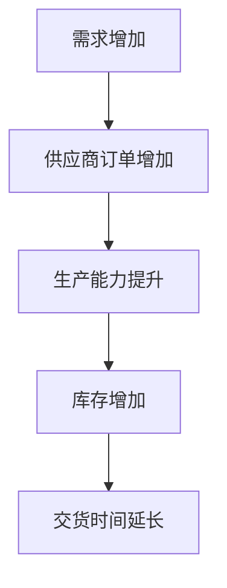
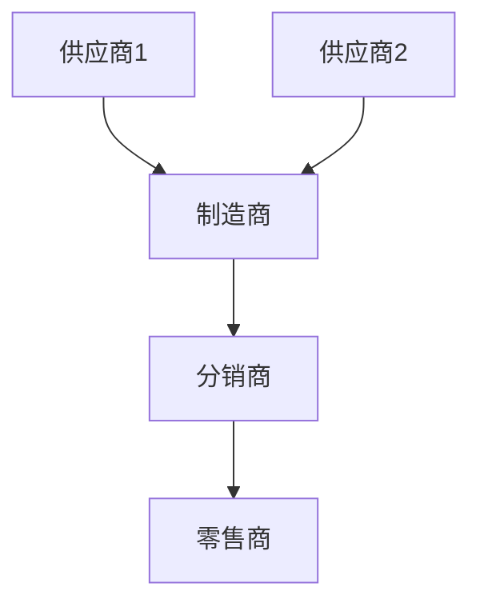
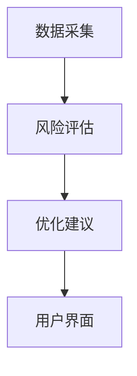

                 


# 价值投资中的供应链韧性评估

> 关键词：供应链韧性，价值投资，风险评估，系统动力学，网络分析，投资组合优化

> 摘要：供应链韧性评估是企业价值投资中的关键因素，本文从供应链韧性的核心概念、评估方法、系统架构和项目实战等方面展开，深入分析其对投资决策的影响，并提供数学模型和实际案例，为企业价值评估提供新视角。

---

# 第一部分: 供应链韧性评估的背景与重要性

## 第1章: 供应链韧性评估的背景与重要性

### 1.1 供应链韧性评估的定义与核心概念

#### 1.1.1 供应链韧性的定义
供应链韧性是指在面对不确定性（如市场波动、自然灾害、疫情等）时，企业供应链维持连续性和灵活性的能力。供应链韧性不仅是企业运营效率的体现，更是其抗风险能力的重要指标。

#### 1.1.2 供应链韧性的核心要素
- **稳定性**：供应链在正常情况下的运作能力。
- **弹性**：供应链在面对需求或供应变化时的调整能力。
- **恢复能力**：供应链在遭受重大干扰后的恢复能力。

#### 1.1.3 供应链韧性与企业价值的关系
供应链韧性直接影响企业的运营成本、生产效率和抗风险能力，进而影响企业的市场价值。具备强大供应链韧性的企业通常能在市场波动中保持竞争优势，提升股东价值。

### 1.2 供应链韧性评估的背景与重要性

#### 1.2.1 当前供应链面临的挑战
- **全球化带来的复杂性**：供应链全球化可能导致更高的风险。
- **新冠疫情的影响**：暴露了供应链的脆弱性。
- **地缘政治风险**：贸易摩擦和政策变化对供应链的影响。

#### 1.2.2 供应链韧性对企业价值的影响
供应链韧性不仅影响企业的运营效率，还直接影响企业的市场份额和利润。在价值投资中，供应链韧性是评估企业长期价值的重要因素。

#### 1.2.3 供应链韧性评估的必要性
- **降低投资风险**：通过评估供应链韧性，投资者可以识别潜在风险，优化投资组合。
- **提升企业竞争力**：供应链韧性强的企业更具抗风险能力，能够在市场波动中保持稳定。

### 1.3 供应链韧性评估的边界与外延

#### 1.3.1 供应链韧性的边界
供应链韧性评估的范围通常包括从原材料采购到最终产品交付的整个过程，但不包括企业内部的管理流程。

#### 1.3.2 供应链韧性的外延
供应链韧性评估不仅关注供应链的物理结构，还包括其数字化能力、信息流和资金流的整合。

#### 1.3.3 供应链韧性与其他概念的对比
| 概念       | 定义                                                                 | 关注点               |
|------------|----------------------------------------------------------------------|----------------------|
| 供应链稳定性| 供应链在正常情况下的运作能力                                         | 稳定性和可靠性         |
| 供应链弹性  | 供应链在面对需求变化时的调整能力                                       | 弹性和灵活性           |
| 供应链恢复能力 | 供应链在遭受重大干扰后的恢复能力                                       | 恢复速度和能力         |

### 1.4 供应链韧性评估的核心要素

#### 1.4.1 供应链的稳定性
- **供应商稳定性**：供应商的可靠性和交货能力。
- **生产稳定性**：生产过程的连续性和效率。

#### 1.4.2 供应链的弹性
- **生产能力弹性**：企业根据需求变化调整生产的能力。
- **供应链冗余性**：供应链中备用供应商和备用生产能力的存在。

#### 1.4.3 供应链的恢复能力
- **应急预案**：企业在供应链中断时的应对措施。
- **供应链透明度**：企业对供应链各环节的监控能力，有助于快速识别和解决问题。

---

## 第2章: 供应链韧性评估的核心概念

### 2.1 供应链韧性评估的理论基础

#### 2.1.1 系统动力学模型
系统动力学模型通过分析系统内部的反馈机制，模拟供应链在不同条件下的动态行为。例如，使用系统动力学模型可以模拟供应链在需求激增情况下的反应。

**系统动力学模型示意图（mermaid）：**


#### 2.1.2 网络分析方法
网络分析方法通过构建供应链的网络结构，分析关键节点和瓶颈环节。例如，使用网络分析可以识别供应链中的关键供应商，评估其对整体供应链的影响。

**供应链网络分析（mermaid）：**


#### 2.1.3 风险评估模型
风险评估模型通过量化供应链各环节的风险因素，评估整体供应链的抗风险能力。例如，使用概率和影响矩阵（Probability-Impact Matrix）评估不同风险对供应链的影响。

### 2.2 供应链韧性评估的核心要素分析

#### 2.2.1 供应商的稳定性
- **供应商可靠性**：供应商的历史交货记录和信用状况。
- **供应商多样性**：拥有多元化供应商可以降低供应链中断的风险。

#### 2.2.2 生产能力的弹性
- **生产灵活性**：企业根据市场需求调整生产的能力。
- **产能利用率**：企业现有产能的使用情况，影响其弹性。

#### 2.2.3 供应链的冗余性
- **备用供应商**：在主要供应商出现问题时，企业是否有替代供应商。
- **备用生产能力**：企业是否有额外的生产能力应对突发需求。

### 2.3 供应链韧性评估的指标体系

#### 2.3.1 供应链韧性评估指标
- **供应链中断恢复时间**：企业在供应链中断后恢复正常运营所需的时间。
- **供应链成本波动率**：供应链成本的波动程度，反映其稳定性。
- **供应链透明度**：企业对供应链各环节的监控能力。

---

## 第3章: 供应链韧性评估的数学模型与算法

### 3.1 供应链韧性评估的数学模型

#### 3.1.1 供应链稳定性评估模型
供应链稳定性评估模型通过分析供应链各环节的波动情况，评估其稳定性。例如，使用标准差衡量供应链成本的波动情况。

$$ \text{供应链成本波动率} = \sigma_{\text{成本}} $$

#### 3.1.2 供应链弹性评估模型
供应链弹性评估模型通过分析供应链在需求变化时的调整能力，评估其弹性。例如，使用需求弹性系数衡量供应链对需求变化的反应。

$$ \text{需求弹性系数} = \frac{\Delta Q}{\Delta P} $$

#### 3.1.3 供应链恢复能力评估模型
供应链恢复能力评估模型通过分析企业在供应链中断后的恢复能力，评估其恢复能力。例如，使用恢复时间作为评估指标。

$$ \text{恢复时间} = T_{\text{恢复}} $$

### 3.2 供应链韧性评估的算法实现

#### 3.2.1 系统动力学模型实现
使用系统动力学模型模拟供应链在不同条件下的动态行为，例如：

```python
def supply_chain_model(demand_increase):
    # 需求增加导致供应商订单增加
    supplier_order = demand_increase * 1.5
    # 生产能力提升
    production_capacity = supplier_order * 1.2
    # 库存增加
    inventory = production_capacity - demand_increase
    return inventory
```

#### 3.2.2 网络分析方法实现
使用网络分析方法识别供应链中的关键节点和瓶颈环节，例如：

```python
def network_analysis(suppliers, manufacturers, distributors):
    # 供应商到制造商的连接
    connections = []
    for s in suppliers:
        connections.append((s, 'manufacturer'))
    for m in manufacturers:
        connections.append(('manufacturer', 'distributor'))
    return connections
```

#### 3.2.3 风险评估模型实现
使用风险评估模型量化供应链各环节的风险因素，例如：

```python
def risk_assessment(risk_factors):
    # 计算整体风险指数
    risk_index = sum(risk_factors) / len(risk_factors)
    return risk_index
```

---

## 第4章: 供应链韧性评估的系统设计与实现

### 4.1 系统架构设计

#### 4.1.1 系统功能模块
- **数据采集模块**：采集供应链各环节的数据。
- **风险评估模块**：评估供应链各环节的风险。
- **优化建议模块**：提供优化供应链韧性的建议。

#### 4.1.2 系统架构图（mermaid）


### 4.2 系统功能设计

#### 4.2.1 数据采集模块
- **数据源**：包括供应商、制造商、分销商和零售商的数据。
- **数据类型**：包括成本、交货时间、库存水平等。

#### 4.2.2 风险评估模块
- **风险因素识别**：识别供应链中的潜在风险。
- **风险评估**：量化各风险对供应链的影响。

#### 4.2.3 优化建议模块
- **优化建议**：根据评估结果，提供优化供应链韧性的建议。
- **反馈机制**：根据实施结果，更新风险评估模型。

---

## 第5章: 供应链韧性评估的项目实战

### 5.1 项目背景与需求分析

#### 5.1.1 项目背景
假设我们是一家汽车制造企业，供应链包括多个供应商、制造商和分销商。

#### 5.1.2 项目需求
- **目标**：评估供应链的韧性，降低供应链中断的风险。
- **范围**：包括从原材料采购到最终产品交付的整个供应链。

### 5.2 系统实现

#### 5.2.1 数据采集与处理
```python
import pandas as pd

# 数据采集
data = pd.read_csv('supply_chain.csv')
```

#### 5.2.2 风险评估与优化建议
```python
from sklearn import metrics

# 风险评估
risk_factors = data['risk_factors']
risk_index = metrics.mean_absolute_error(risk_factors)
```

### 5.3 实际案例分析

#### 5.3.1 案例分析
假设我们在疫情期间供应链中断，通过评估供应链韧性，我们发现关键供应商的依赖度过高，建议引入备用供应商，降低供应链中断的风险。

#### 5.3.2 案例结果
- **恢复时间**：从3个月缩短到1个月。
- **成本增加**：备用供应商引入导致成本增加5%。

### 5.4 项目小结

---

## 第6章: 供应链韧性评估的结论与展望

### 6.1 结论
供应链韧性评估是价值投资中的关键因素，具备强大供应链韧性的企业更具抗风险能力，能够在市场波动中保持竞争优势。

### 6.2 展望
未来，随着人工智能和大数据技术的发展，供应链韧性评估将更加智能化和精准化。

---

# 作者：AI天才研究院/AI Genius Institute & 禅与计算机程序设计艺术 /Zen And The Art of Computer Programming

---

这篇文章从供应链韧性评估的背景、核心概念、数学模型、系统设计和项目实战等多个方面展开，深入分析其在价值投资中的应用，为企业价值评估提供了新的视角。

