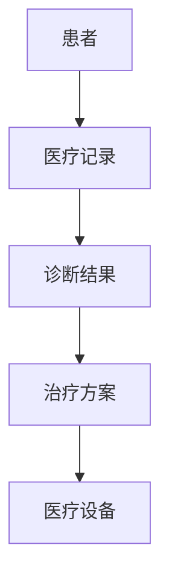
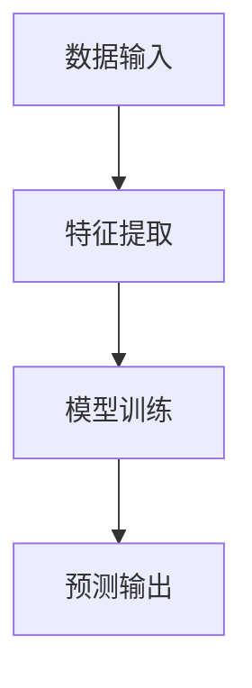
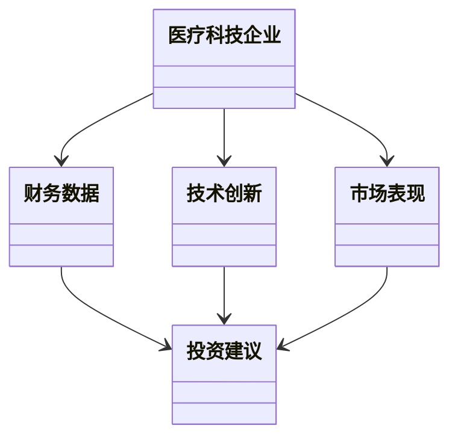
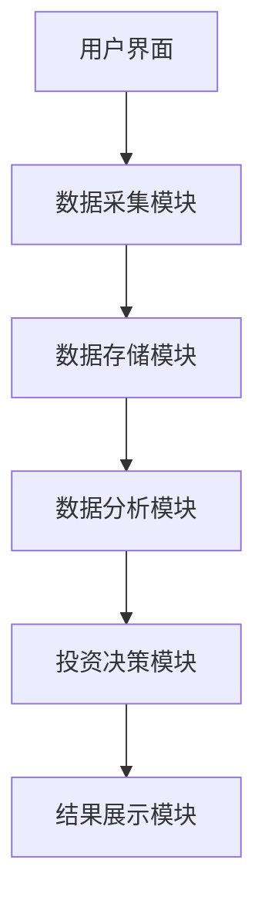
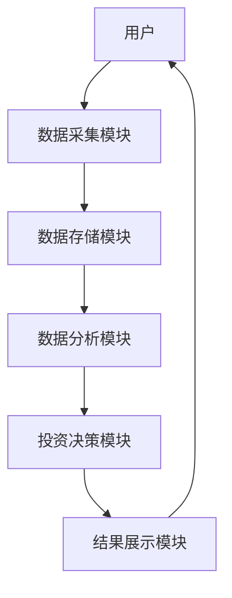

                 


# 《价值投资中的健康医疗科技趋势》

---

## 关键词：价值投资、健康医疗科技、趋势分析、技术驱动、投资策略

---

## 摘要：本文深入分析健康医疗科技领域的投资趋势，结合技术驱动的行业变化，为投资者提供基于科技的健康医疗投资策略和建议。文章从背景、核心概念、算法原理、系统架构、项目实战到最佳实践，全面解析健康医疗科技的投资机会与挑战。

---

# 第1章: 健康医疗科技的发展现状

## 1.1 健康医疗科技的定义与核心领域

### 1.1.1 健康医疗科技的定义

健康医疗科技是利用信息技术、人工智能、生物技术等手段，提升医疗服务质量、效率和可及性的新兴领域。它涵盖疾病预防、诊断、治疗和管理的各个环节，通过技术创新解决传统医疗体系中的痛点。

### 1.1.2 核心领域：AI医疗、基因技术、医疗物联网

- **AI医疗**：利用人工智能技术辅助医疗诊断、药物研发和个性化治疗。
- **基因技术**：通过基因编辑技术改善疾病治疗效果，推动精准医学的发展。
- **医疗物联网**：利用物联网技术实现医疗设备和数据的实时连接，提升医疗资源的管理和利用效率。

### 1.1.3 健康医疗科技的边界与外延

健康医疗科技不仅限于医疗技术本身，还包括医疗数据的采集、分析和应用，以及医疗体系的优化和创新。其外延涵盖了从基础研究到临床应用的整个链条。

---

## 1.2 价值投资的基本概念

### 1.2.1 价值投资的核心理念

价值投资是一种长期投资策略，强调以低于内在价值的价格买入优质资产，通过持有优质资产获得长期收益。其核心在于寻找被市场低估的企业，关注企业的基本面和长期发展潜力。

### 1.2.2 价值投资的适用场景

价值投资适用于那些具有稳定现金流、高ROE（净资产收益率）和良好管理团队的企业。在医疗科技领域，价值投资需要关注企业的技术创新能力、市场竞争力和长期盈利能力。

### 1.2.3 价值投资与健康医疗科技的结合

健康医疗科技的快速发展为价值投资提供了新的机会。通过分析医疗科技企业的技术创新、市场前景和财务表现，投资者可以找到具有长期增长潜力的标的。

---

## 1.3 健康医疗科技与价值投资的结合方式

### 1.3.1 科技驱动的医疗创新

医疗科技的创新直接推动了医疗服务的升级和效率的提升，为相关企业带来了竞争优势。投资者可以通过投资这些创新企业获得超额收益。

### 1.3.2 医疗行业趋势分析

分析医疗行业的趋势，如老龄化加剧、慢性病增加、医疗消费升级等，可以帮助投资者找到具有增长潜力的细分领域。

### 1.3.3 价值投资中的科技评估标准

在健康医疗科技领域，投资者需要关注企业的技术创新能力、知识产权储备、市场竞争力以及商业模式的可持续性。

---

## 1.4 本章小结

本章从健康医疗科技的定义、核心领域和价值投资的基本概念入手，分析了两者结合的必要性和可能性。通过理解健康医疗科技的发展趋势和价值投资的核心理念，投资者可以更好地把握投资机会。

---

# 第2章: 健康医疗科技的核心概念与联系

## 2.1 核心概念原理

### 2.1.1 AI在医疗诊断中的应用

人工智能技术在医疗诊断中的应用主要体现在图像识别、自然语言处理和预测模型构建等方面。例如，AI可以通过分析医学影像快速识别病变区域，辅助医生进行诊断。

### 2.1.2 基因编辑技术的前景

基因编辑技术（如CRISPR）在治疗遗传性疾病、癌症等领域具有广阔的应用前景。通过精准修改基因序列，可以实现疾病的预防和治疗。

### 2.1.3 医疗物联网的发展

医疗物联网通过连接医疗设备、患者数据和医疗服务提供者，实现了医疗资源的高效管理和共享。例如，智能穿戴设备可以实时监测患者的健康数据，并将数据传输到医疗机构进行分析。

---

## 2.2 核心概念对比表格

以下是对健康医疗科技中几个核心概念的对比分析：

| 概念       | 描述                                                                 |
|------------|----------------------------------------------------------------------|
| AI医疗     | 利用人工智能技术辅助医疗诊断和治疗                                   |
| 基因技术   | 通过基因编辑技术改善疾病治疗效果                                   |
| 医疗物联网 | 利用物联网技术实现医疗设备和数据的实时连接                         |

---

## 2.3 ER实体关系图

以下是健康医疗科技中的一个实体关系图，展示了患者、医疗记录和诊断结果之间的关系：



---

## 2.4 本章小结

本章通过分析健康医疗科技的核心概念，包括AI医疗、基因技术、医疗物联网等，帮助读者理解这些技术在医疗领域中的具体应用和相互关系。通过对比表格和实体关系图，进一步明确了各个概念的特点和联系。

---

# 第3章: 健康医疗科技趋势的算法原理

## 3.1 算法原理概述

### 3.1.1 机器学习在疾病预测中的应用

机器学习算法可以通过分析大量的医疗数据，预测患者的疾病风险。例如，利用随机森林算法对患者的健康数据进行分类，预测其患某种疾病的可能性。

### 3.1.2 自然语言处理在医疗文档分析中的应用

自然语言处理技术可以用于分析医疗文档，提取有用的信息。例如，利用词嵌入技术对医学文献中的关键词进行编码，帮助研究人员快速找到相关资料。

### 3.1.3 时间序列分析在医疗数据中的应用

时间序列分析可以用于分析患者的健康数据，预测其病情变化。例如，利用ARIMA模型对患者的血糖数据进行建模，预测其未来的血糖水平。

---

## 3.2 机器学习算法流程图

以下是机器学习在疾病预测中的一个流程图：



---

## 3.3 机器学习代码实现

以下是基于随机森林算法的疾病预测代码示例：

```python
from sklearn.ensemble import RandomForestClassifier
from sklearn.model_selection import train_test_split
import pandas as pd

# 加载数据
data = pd.read_csv('medical_data.csv')

# 分割特征和标签
X = data.drop('target', axis=1)
y = data['target']

# 分割训练集和测试集
X_train, X_test, y_train, y_test = train_test_split(X, y, test_size=0.2)

# 训练模型
model = RandomForestClassifier(n_estimators=100)
model.fit(X_train, y_train)

# 预测结果
y_pred = model.predict(X_test)

# 输出准确率
print('Accuracy:', model.score(X_test, y_test))
```

---

## 3.4 本章小结

本章通过分析健康医疗科技中的算法原理，详细介绍了机器学习、自然语言处理和时间序列分析等技术在疾病预测和医疗文档分析中的应用。通过代码实现和流程图的展示，进一步明确了这些算法的具体实现方式和应用场景。

---

# 第4章: 系统分析与架构设计方案

## 4.1 问题场景介绍

医疗科技投资分析系统需要解决的问题包括数据采集、分析和投资决策支持。通过构建一个高效的系统架构，可以帮助投资者快速获取医疗科技企业的相关信息，并进行投资决策。

---

## 4.2 项目介绍

医疗科技投资分析系统是一个基于大数据和人工智能的医疗科技投资分析平台。该系统通过整合医疗科技企业的财务数据、技术创新能力和市场表现，为投资者提供全面的投资分析支持。

---

## 4.3 系统功能设计

### 4.3.1 领域模型设计

以下是医疗科技投资分析系统的领域模型：



---

## 4.4 系统架构设计

以下是医疗科技投资分析系统的架构图：



---

## 4.5 系统接口设计

医疗科技投资分析系统的接口设计如下：

- 数据采集模块接口：从公开数据源获取医疗科技企业的财务数据、技术创新能力和市场表现。
- 数据分析模块接口：对数据进行清洗、整合和分析，生成投资建议。
- 投资决策模块接口：根据分析结果，提供投资建议和风险评估。

---

## 4.6 系统交互流程图

以下是系统交互流程图：



---

## 4.7 本章小结

本章通过系统分析与架构设计，详细介绍了医疗科技投资分析系统的功能模块、架构设计和接口设计。通过系统交互流程图的展示，进一步明确了各模块之间的协作关系。

---

# 第5章: 项目实战

## 5.1 环境安装

以下是项目实战所需的环境安装步骤：

1. 安装Python和必要的开发工具（如Jupyter Notebook）。
2. 安装Pandas、Scikit-learn、TensorFlow等机器学习库。
3. 安装Mermaid和相关可视化工具。

---

## 5.2 核心代码实现

以下是项目实战的核心代码实现：

```python
import pandas as pd
from sklearn.ensemble import RandomForestClassifier
from sklearn.model_selection import train_test_split

# 加载数据
data = pd.read_csv('medical_data.csv')

# 分割特征和标签
X = data.drop('target', axis=1)
y = data['target']

# 分割训练集和测试集
X_train, X_test, y_train, y_test = train_test_split(X, y, test_size=0.2)

# 训练模型
model = RandomForestClassifier(n_estimators=100)
model.fit(X_train, y_train)

# 预测结果
y_pred = model.predict(X_test)

# 输出准确率
print('Accuracy:', model.score(X_test, y_test))
```

---

## 5.3 案例分析

以下是项目实战的案例分析：

假设我们有一个医疗科技企业的财务数据、技术创新能力和市场表现数据，通过上述代码实现的模型可以预测该企业的投资价值，并提供相应的投资建议。

---

## 5.4 本章小结

本章通过项目实战，详细介绍了医疗科技投资分析系统的环境安装、核心代码实现和案例分析。通过实际操作，读者可以更好地理解系统的设计和实现过程。

---

# 第6章: 最佳实践与注意事项

## 6.1 投资策略

在健康医疗科技领域，投资者需要关注企业的技术创新能力、市场竞争力和长期盈利能力。建议投资者选择那些具有核心技术优势和良好财务表现的企业进行投资。

---

## 6.2 风险控制

健康医疗科技领域的投资风险较高，投资者需要做好风险控制。例如，分散投资、设置止损点等。

---

## 6.3 长期趋势跟踪

健康医疗科技的发展是一个长期的过程，投资者需要关注行业的长期发展趋势，避免短期波动的影响。

---

## 6.4 拓展阅读

以下是一些推荐阅读的书籍和文章：

1. 《医疗科技投资指南》
2. 《人工智能在医疗中的应用》
3. 《基因编辑技术与精准医学》

---

## 6.5 本章小结

本章总结了健康医疗科技领域的投资策略、风险控制和长期趋势跟踪等方面的内容，并推荐了一些拓展阅读材料，帮助读者进一步深入学习。

---

# 作者：AI天才研究院/AI Genius Institute & 禅与计算机程序设计艺术 /Zen And The Art of Computer Programming

---

以上是《价值投资中的健康医疗科技趋势》的目录大纲，涵盖了从背景介绍、核心概念、算法原理、系统架构、项目实战到最佳实践的各个方面。

