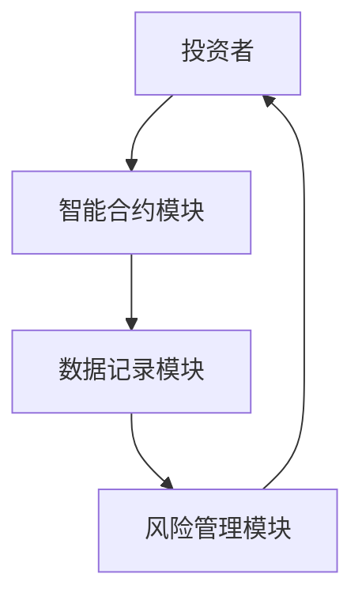

                 


# 价值投资中的区块链技术应用

> 关键词：区块链技术，价值投资，智能合约，风险管理，透明度

> 摘要：区块链技术作为一种分布式账本技术，通过其去中心化、不可篡改和透明性的特点，正在逐步改变传统的价值投资方式。本文将深入探讨区块链技术在提升投资透明度、降低风险、提高效率等方面的应用，并结合实际案例和系统架构设计，详细分析区块链如何为价值投资带来革新。

---

## 第一部分：区块链技术与价值投资概述

### 第1章：区块链技术基础

#### 1.1 区块链的基本概念

区块链是一种分布式账本技术，通过去中心化的方式记录数据，确保数据的安全性和不可篡改性。区块链的核心特点包括：

- **去中心化**：数据分布在多个节点上，没有单一的控制中心。
- **不可篡改**：数据一旦记录，难以被修改。
- **透明性**：所有交易记录在区块链上公开可见。

#### 1.2 价值投资的基本原理

价值投资是一种投资策略，强调通过分析企业的基本面，如财务状况、行业地位等，寻找被市场低估的投资标的。其核心理念是长期持有优质资产，而非短期市场波动。

#### 1.3 区块链技术在价值投资中的潜在价值

区块链技术可以增强投资的透明度，降低操作成本，并提高投资决策的效率。通过智能合约，投资者可以实现自动化的投资协议执行，减少人为干预带来的风险。

---

## 第二部分：区块链技术在价值投资中的核心应用

### 第2章：区块链技术在投资透明度中的应用

#### 2.1 区块链技术如何提高投资透明度

通过区块链的分布式账本，投资者可以实时追踪投资标的的状态和交易记录，确保数据的真实性和透明性。例如，区块链可以记录股票的发行、转让和持有情况，避免信息不对称的问题。

#### 2.2 智能合约的应用与优势

智能合约是区块链上的自动执行程序，能够自动执行投资协议中的条款。例如，当某个条件满足时，智能合约可以自动进行资金划转，减少人为操作的风险。

#### 2.3 区块链在投资信息记录中的作用

区块链可以记录投资标的的全生命周期信息，包括发行、转让、分红等，为投资者提供全面的信息支持，帮助其做出更明智的投资决策。

### 第3章：区块链技术在投资风险管理中的应用

#### 3.1 区块链技术如何降低投资风险

区块链通过智能合约和分布式账本技术，可以实时监控投资标的的风险变化。例如，当某企业的财务数据出现异常时，区块链系统可以立即触发预警机制。

#### 3.2 智能合约在风险管理中的应用案例

智能合约可以设定投资的止损点，当投资标的的价值低于设定阈值时，自动触发平仓指令，避免更大的损失。

### 第4章：区块链技术在投资效率提升中的应用

#### 4.1 区块链技术如何提高投资效率

通过区块链技术，投资流程可以实现自动化，减少中间环节和人工操作。例如，智能合约可以自动处理投资协议的签订和资金划转，提高投资效率。

#### 4.2 区块链技术在投资自动化中的应用案例

某些区块链平台可以实现自动化的投资组合管理，根据市场变化自动调整投资策略，提高投资效率和收益。

---

## 第三部分：区块链技术在价值投资中的系统架构与实现

### 第5章：区块链技术在价值投资中的系统架构设计

#### 5.1 系统的总体架构

区块链投资平台的系统架构包括以下几个模块：

1. **智能合约模块**：用于自动执行投资协议。
2. **数据记录模块**：记录投资标的的全生命周期信息。
3. **风险管理模块**：实时监控投资风险并触发预警。

#### 5.2 系统功能设计

- **投资者信息管理**：记录投资者的身份信息和投资记录。
- **投资协议管理**：通过智能合约自动执行投资协议。
- **风险管理**：实时监控投资风险并触发预警。

#### 5.3 系统架构图



---

## 第四部分：项目实战

### 第6章：区块链投资平台的实现

#### 6.1 环境安装

- **区块链平台选择**：建议使用以太坊或其他支持智能合约的公链。
- **开发工具安装**：安装Solidity编译器和以太坊钱包。

#### 6.2 智能合约实现

以下是智能合约的示例代码：

```solidity
// SPDX-License-Identifier: MIT
pragma solidity ^0.8.0;

contract InvestmentContract {
    address payable public investor;
    address payable public company;

    function invest(uint amount) public payable {
        require(msg.sender == investor, "Only investor can call this function");
        company.transfer(amount);
    }

    function withdraw(uint amount) public payable {
        require(msg.sender == company, "Only company can call this function");
        investor.transfer(amount);
    }
}
```

#### 6.3 代码解读与分析

智能合约通过预编译的代码自动执行投资协议，确保资金的合理分配和使用。

#### 6.4 实际案例分析

以某区块链投资平台为例，通过智能合约实现投资协议的自动执行，减少人为干预，提高投资效率。

---

## 第五部分：结论与展望

### 第7章：结论与展望

#### 7.1 本章总结

区块链技术通过提高透明度、降低风险和提高效率，正在逐步改变价值投资的方式。智能合约的应用是区块链技术在投资领域的重要创新。

#### 7.2 未来展望

未来，区块链技术在价值投资中的应用将更加广泛，包括更多自动化投资工具和智能合约的应用。同时，随着技术的不断发展，区块链的安全性和性能也将得到进一步提升。

---

## 作者：AI天才研究院/AI Genius Institute & 禅与计算机程序设计艺术 /Zen And The Art of Computer Programming

