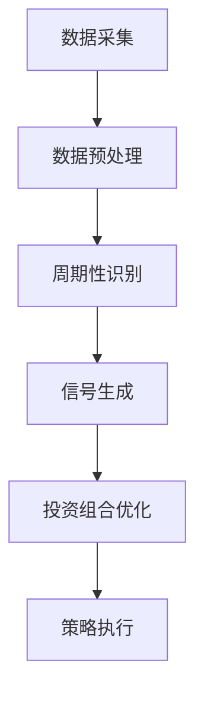

                 


# 价值投资中的反周期策略

> 关键词：价值投资、反周期策略、经济周期、资产价格波动、投资组合、风险管理

> 摘要：本文探讨了反周期策略在价值投资中的应用，分析了经济周期对资产价格的影响，详细讲解了反周期策略的核心概念、数学模型、系统架构及实际案例，为投资者提供了科学的投资决策支持。

---

## 第1章 反周期策略的定义与背景

### 1.1 反周期策略的基本概念

反周期策略是一种在经济周期波动中，通过逆向投资来捕捉市场低点和高点的投资策略。其核心在于利用市场的周期性波动，在市场低迷时买入低估资产，在市场繁荣时卖出高估资产，从而实现超额收益。

#### 1.1.1 经济周期的基本定义

经济周期通常分为四个阶段：复苏、繁荣、衰退和萧条。每个阶段的经济表现和市场情绪不同，对资产价格的影响也各异。

#### 1.1.2 反周期策略的定义与特征

反周期策略是指在经济周期的低谷期（如衰退和萧条阶段）投资，而在高峰期（如复苏和繁荣阶段）退出。其特征包括防御性、逆向思维和长期视角。

#### 1.1.3 反周期策略在价值投资中的重要性

反周期策略帮助投资者在市场低谷时发现价值，避免高位追涨，同时在市场高点时及时离场，降低风险。

### 1.2 价值投资的基本原理

价值投资强调以低于内在价值的价格买入优质资产，长期持有，等待市场的重新评估。其核心在于寻找市场先生的错误定价。

#### 1.2.1 价值投资的核心理念

价值投资认为市场价格波动围绕内在价值上下波动，投资者应关注企业的基本面，而非市场的短期波动。

#### 1.2.2 市场波动与投资者情绪

市场波动主要由投资者情绪驱动，情绪的周期性变化导致市场的周期性波动。

#### 1.2.3 价值投资与经济周期的关系

经济周期影响企业的盈利能力和资产价值，价值投资者通过分析周期性波动，寻找具有长期竞争优势的企业。

### 1.3 反周期策略的优势与挑战

#### 1.3.1 反周期策略的优势

- 抗跌性强，在市场低谷时买入低估资产。
- 长期收益稳定，避免短期波动的冲击。

#### 1.3.2 反周期策略的挑战

- 市场预测难度大，准确判断经济周期阶段困难。
- 短期亏损风险高，需有足够的耐心和纪律。

#### 1.3.3 反周期策略与传统投资策略的对比

传统投资策略多为顺势而为，而反周期策略则为逆市而行，适合长期稳健投资者。

---

## 第2章 经济周期与资产价格波动

### 2.1 经济周期的四个阶段

#### 2.1.1 经济周期的定义与分类

经济周期分为复苏、繁荣、衰退和萧条四个阶段，每个阶段的资产价格表现不同。

#### 2.1.2 经济周期对股市的影响

股市在经济繁荣时上涨，在衰退时下跌，但长期趋势与企业盈利相关。

#### 2.1.3 不同经济周期阶段的资产表现

- **繁荣阶段**：股市和房地产价格上涨。
- **衰退阶段**：股市和商品价格下跌。
- **萧条阶段**：债券和防御性股票表现较好。

### 2.2 资产价格波动的周期性特征

#### 2.2.1 股票价格的周期性波动

股票价格受市场情绪和经济周期影响，波动性较大。

#### 2.2.2 债券价格的周期性波动

债券价格受利率和经济周期影响，经济衰退时债券价格上涨。

#### 2.2.3 商品价格的周期性波动

商品价格受供需和经济周期影响，经济复苏时价格上涨。

### 2.3 市场情绪与周期性波动的关系

#### 2.3.1 投资者情绪的周期性变化

市场情绪从乐观到悲观，再到乐观，呈现周期性波动。

#### 2.3.2 市场情绪对资产价格的影响

情绪高涨时资产价格高估，情绪低落时资产价格低估。

#### 2.3.3 市场情绪与经济周期的互动

市场情绪推动经济周期变化，而经济周期反过来影响市场情绪。

---

## 第3章 反周期策略的核心概念与原理

### 3.1 反周期策略的理论基础

#### 3.1.1 价值投资与反周期策略的关系

反周期策略是价值投资在经济周期波动中的具体应用。

#### 3.1.2 反周期策略的经济学基础

基于市场有效性和非理性，反周期策略利用价格与价值的偏离进行投资。

#### 3.1.3 反周期策略的数学模型

反周期策略通过数学模型识别市场周期，如使用移动平均线和波动率指标。

### 3.2 反周期策略的核心要素

#### 3.2.1 估值分析

通过市盈率、市净率等指标判断资产是否低估。

#### 3.2.2 财务指标分析

分析企业的盈利能力、资产负债情况等，判断其内在价值。

#### 3.2.3 行业周期分析

选择处于周期性低谷的行业进行投资。

### 3.3 反周期策略的实施步骤

#### 3.3.1 确定经济周期阶段

通过GDP增长率、失业率等指标判断经济所处阶段。

#### 3.3.2 选择反周期性资产

在衰退阶段投资防御性资产，在繁荣阶段投资周期性资产。

#### 3.3.3 构建投资组合

根据经济周期阶段，调整投资组合的资产配置。

---

## 第4章 反周期策略的数学模型与算法

### 4.1 反周期策略的数学模型

#### 4.1.1 资产波动率计算

使用标准差公式计算资产价格波动率：

$$\text{波动率} = \sqrt{\frac{1}{n}\sum_{i=1}^{n}(x_i - \mu)^2}$$

#### 4.1.2 资产收益计算

使用几何平均收益公式计算资产的长期收益：

$$\text{几何平均收益} = \left(\prod_{i=1}^{n}(1 + r_i)\right)^{1/n} - 1$$

### 4.2 反周期策略的算法实现

#### 4.2.1 数据采集与预处理

- 采集历史价格数据。
- 清洗数据，处理缺失值和异常值。

#### 4.2.2 周期性识别

- 使用移动平均线识别市场趋势。
- 使用相对强弱指数（RSI）判断超买超卖。

#### 4.2.3 信号生成

- 当市场处于超卖状态时，生成买入信号。
- 当市场处于超买状态时，生成卖出信号。

#### 4.2.4 投资组合优化

- 使用现代投资组合理论（MPT）优化资产配置。

---

## 第5章 系统分析与架构设计

### 5.1 系统功能设计

- 数据采集模块：采集市场数据。
- 信号生成模块：识别周期性低谷。
- 策略执行模块：根据信号调整投资组合。

### 5.2 系统架构设计



---

## 第6章 项目实战：反周期策略的实现

### 6.1 环境安装

- 安装Python、Pandas、NumPy等库。

### 6.2 核心实现

```python
import pandas as pd
import numpy as np

def calculate_volatility(prices):
    mu = np.mean(prices)
    variance = np.mean((prices - mu)**2)
    return np.sqrt(variance)

prices = pd.Series([100, 90, 80, 70, 60])
volatility = calculate_volatility(prices)
print(volatility)
```

### 6.3 案例分析

以2008年金融危机为例，分析反周期策略在市场低谷时的买入机会。

---

## 第7章 总结与展望

### 7.1 总结

反周期策略通过逆向投资，在经济周期低谷时发现价值，实现长期稳健收益。

### 7.2 注意事项

- 需要长期视角和耐心。
- 风险控制是关键。

### 7.3 拓展阅读

建议阅读《价值投资实战策略》和《投资学原理》。

---

## 作者

作者：AI天才研究院/AI Genius Institute & 禅与计算机程序设计艺术/Zen And The Art of Computer Programming

---

以上是《价值投资中的反周期策略》的详细目录和内容概要，希望对您有所帮助！

