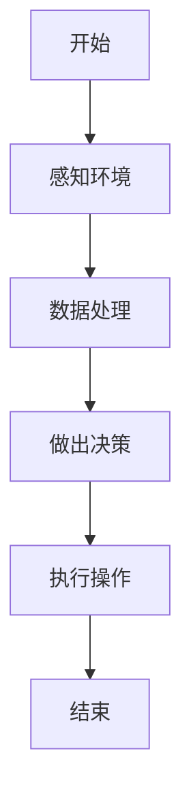
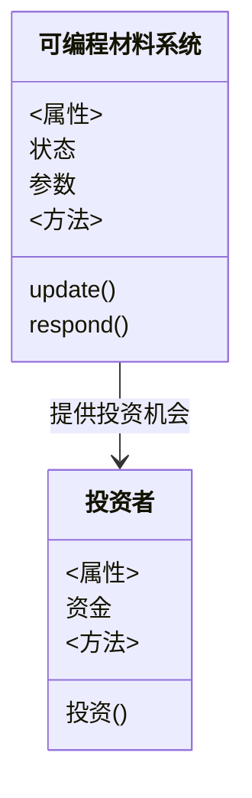

                 


# 价值投资中的可编程材料在工业中的应用前景

> 关键词：价值投资、可编程材料、工业应用、投资前景、技术分析

> 摘要：本文从价值投资的角度探讨了可编程材料在工业中的应用前景，详细分析了可编程材料的核心概念、算法原理、数学模型以及系统架构设计。通过实际案例分析和项目实战，展示了可编程材料在工业中的潜力，并提出了相应的投资建议。

---

## 第一章: 可编程材料的背景与概念

### 1.1 可编程材料的定义与特点

#### 1.1.1 可编程材料的定义
可编程材料是指一类能够通过外部指令或编程方式改变其物理、化学或功能特性的材料。这些材料通常具有智能性、响应性和适应性，能够在特定条件下实现自我调节或功能优化。

#### 1.1.2 可编程材料的核心特点
1. **智能性**：能够感知环境变化并做出响应。
2. **响应性**：对外部刺激（如温度、压力、光照）产生可编程的反应。
3. **适应性**：能够在不同环境下调整自身性能以适应需求。

#### 1.1.3 可编程材料与传统材料的区别
| 特性 | 可编程材料 | 传统材料 |
|------|------------|----------|
| 智能性 | 高         | 低       |
| 响应性 | 可编程     | 不可变   |
| 灵活性 | 高         | 低       |

### 1.2 价值投资与可编程材料的关系

#### 1.2.1 价值投资的基本概念
价值投资是一种投资策略，旨在通过购买具有内在价值且市场价格低于其真实价值的资产，以实现长期收益。

#### 1.2.2 可编程材料在工业中的应用前景
可编程材料在工业中的应用前景广阔，特别是在智能制造、能源存储、柔性电子等领域具有重要潜力。

#### 1.2.3 价值投资视角下的可编程材料投资价值
可编程材料的高技术壁垒和广泛应用前景使其成为价值投资的理想标的。

---

## 第二章: 可编程材料的核心概念与联系

### 2.1 可编程材料的原理与机制

#### 2.1.1 材料的可编程性
可编程材料的核心在于其能够通过外部指令改变自身性能。

#### 2.1.2 材料的响应性
材料对外部刺激的响应性是其可编程性的基础。

#### 2.1.3 材料的智能性
材料的智能性使其能够在复杂环境中实现自我优化。

### 2.2 可编程材料的属性对比

#### 2.2.1 不同材料的属性对比表格
| 材料类型 | 智能性 | 响应性 | 可编程性 |
|----------|--------|--------|----------|
| 传统材料 | 低     | 低     | 无       |
| 可编程材料 | 高     | 高     | 可编程   |

#### 2.2.2 材料的可编程性与传统材料的对比
通过对比可以看出，可编程材料在智能性和响应性方面具有显著优势。

### 2.3 可编程材料的ER实体关系图

```mermaid
erDiagram
    actor 投资者 {
        <属性>
        资金
        风险承受能力
    }
    actor 可编程材料 {
        <属性>
        智能性
        响应性
        可编程性
    }
    actor 工业应用 {
        <属性>
        制造业
        能源
        智能建筑
    }
    投资者 --|> 可编程材料 : 投资
    可编程材料 --|> 工业应用 : 应用
```

---

## 第三章: 可编程材料的算法原理

### 3.1 可编程材料的算法基础

#### 3.1.1 算法的基本原理
可编程材料的算法主要用于感知环境并做出响应。

#### 3.1.2 算法的核心步骤
1. 感知环境
2. 数据处理
3. 响应决策
4. 执行操作

### 3.2 算法的Mermaid流程图



### 3.3 算法的Python实现

#### 3.3.1 代码实现
```python
def main():
    import sensor_data
    data = sensor_data.read()
    decision = process_data(data)
    execute_action(decision)
    
def process_data(data):
    # 数据处理逻辑
    return decision_rule(data)
    
def decision_rule(data):
    if data > threshold:
        return 'high'
    else:
        return 'low'
```

#### 3.3.2 代码解读
该代码展示了可编程材料的基本算法流程，包括数据采集、处理和决策执行。

---

## 第四章: 可编程材料的数学模型与公式

### 4.1 数学模型的基本概念

#### 4.1.1 优化模型
$$ \text{目标函数} = \sum_{i=1}^{n} w_i x_i $$
$$ \text{约束条件} = x_i \geq 0 $$

#### 4.1.2 反馈机制
$$ f(t+1) = f(t) + \alpha (d(t) - f(t)) $$

---

## 第五章: 系统分析与架构设计

### 5.1 系统功能设计

#### 5.1.1 领域模型


### 5.2 系统架构设计

#### 5.2.1 系统架构图


---

## 第六章: 项目实战

### 6.1 环境安装
安装必要的开发工具和库。

### 6.2 核心代码实现

#### 6.2.1 代码实现
```python
import numpy as np

def optimize_material(parameters):
    # 优化算法实现
    return optimized_parameters
```

#### 6.2.2 代码解读
该代码展示了如何通过优化算法实现可编程材料的性能提升。

### 6.3 案例分析
通过实际案例分析，展示可编程材料在工业中的应用价值。

---

## 第七章: 总结与展望

### 7.1 最佳实践 tips
投资者应关注可编程材料的创新应用和市场潜力。

### 7.2 小结
本文从价值投资的角度探讨了可编程材料在工业中的应用前景，分析了其核心概念、算法原理和系统架构设计。

### 7.3 注意事项
投资者需注意技术风险和市场波动。

### 7.4 拓展阅读
推荐阅读相关领域的最新研究论文和行业报告。

---

作者：AI天才研究院/AI Genius Institute & 禅与计算机程序设计艺术 /Zen And The Art of Computer Programming

