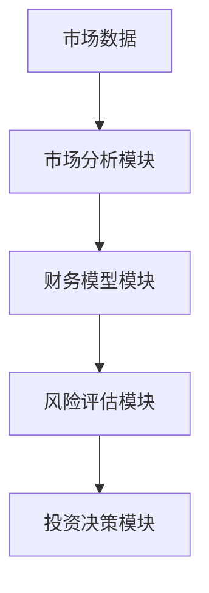
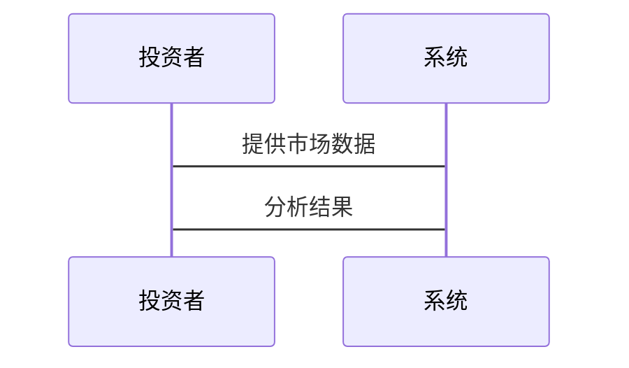

                 


# 价值投资中的合成食品技术趋势

> 关键词：合成食品技术，价值投资，经济模型，技术趋势，投资策略

> 摘要：合成食品技术作为一种新兴的技术趋势，正在对传统食品行业产生深远影响。本文从价值投资的角度，分析合成食品技术的核心概念、经济模型、技术趋势及其对投资策略的影响。通过详细的技术分析和实际案例，本文为投资者提供了一个全面的视角，以评估合成食品技术企业的投资价值。

---

# 引言

合成食品技术是近年来食品行业的一项重大创新，它通过生物工程、化学合成和信息技术等手段，生产出与传统食品营养成分相似的替代品。随着全球对可持续发展的关注增加，合成食品技术因其环保、高效和健康的特点，正逐渐成为投资者关注的焦点。本文将从价值投资的角度，深入分析合成食品技术的趋势及其对投资决策的影响。

---

# 第1章 合成食品技术的背景与现状

## 1.1 合成食品技术的定义与分类

### 1.1.1 合成食品技术的定义

合成食品技术是指通过化学合成或生物工程技术，直接从基础原料（如糖、淀粉、蛋白质等）或细胞培养等方法，生产出具有特定营养成分的食品。与传统食品加工不同，合成食品技术不依赖于传统的农业或畜牧业，而是通过实验室或工厂化生产的方式，制造出替代传统食材的产品。

### 1.1.2 合成食品技术的分类

1. **基于植物基的合成食品**：通过植物提取或发酵技术，生产出类似于肉类、乳制品等的产品。例如，植物基蛋白肉。
2. **基于细胞培养的合成食品**：通过细胞培养技术，直接从动物细胞中生产出肉类组织。
3. **基于化学合成的合成食品**：通过化学合成方法，直接合成所需的营养成分或食品成分。

### 1.1.3 合成食品技术的发展历程

合成食品技术的发展可以追溯到20世纪初，但真正的大规模商业化始于21世纪初。随着技术的进步和环保意识的增强，合成食品技术在近年来得到了迅速发展。

---

## 1.2 价值投资的基本原理

### 1.2.1 价值投资的定义

价值投资是一种投资策略，强调以低于其内在价值的价格购买优质资产。其核心理念是通过分析企业的基本面，寻找那些被市场低估的投资标的。

### 1.2.2 价值投资的核心理念

1. **安全边际**：以低于内在价值的价格买入资产，以确保投资的安全性。
2. **长期视角**：关注企业的长期盈利能力，而非短期市场波动。
3. **基本面分析**：通过分析企业的财务状况、行业地位、竞争优势等，评估其内在价值。

### 1.2.3 价值投资在现代金融中的地位

价值投资是投资领域的重要流派之一，尤其在股票投资中占据重要地位。其核心思想是通过深入分析企业基本面，寻找具有长期竞争优势的企业进行投资。

---

## 1.3 合成食品技术与价值投资的结合

### 1.3.1 合成食品技术对传统食品行业的冲击

合成食品技术的出现，对传统食品行业产生了巨大的冲击。通过替代传统食材的生产方式，合成食品技术减少了对农业资源的依赖，降低了生产成本，并提高了生产效率。

### 1.3.2 价值投资在合成食品技术领域的应用

1. **技术壁垒分析**：评估合成食品企业的技术优势，包括专利数量、技术领先性等。
2. **市场需求分析**：分析合成食品的市场需求，包括消费者偏好、市场规模等。
3. **成本结构分析**：评估合成食品的生产成本，包括原材料成本、生产效率等。

### 1.3.3 合成食品技术企业的投资价值分析

通过对合成食品企业的基本面分析，评估其内在价值，寻找那些具有长期竞争优势的企业进行投资。

---

## 1.4 本章小结

本章从合成食品技术的定义、分类及其发展历程入手，详细介绍了价值投资的基本原理，并探讨了合成食品技术与价值投资的结合。通过分析合成食品技术对传统食品行业的冲击，以及其在价值投资中的应用，为后续的分析奠定了基础。

---

# 第2章 合成食品技术的核心概念与经济模型

## 2.1 合成食品技术的核心概念

### 2.1.1 合成食品技术的关键技术

1. **植物基蛋白质合成技术**：通过基因工程技术，提高植物蛋白的产量和质量。
2. **细胞培养技术**：通过细胞培养技术，直接从动物细胞中生产出肉类组织。
3. **化学合成技术**：通过化学合成方法，直接合成所需的营养成分。

### 2.1.2 合成食品技术的成本结构

1. **原材料成本**：包括糖、淀粉、蛋白质等基础原料的成本。
2. **生产成本**：包括实验室或工厂的租金、设备折旧、人工成本等。
3. **研发成本**：包括技术研发、专利申请等成本。

### 2.1.3 合成食品技术的市场定位

合成食品技术的目标市场包括健康食品市场、环保食品市场等，其核心竞争优势在于其环保、健康和高效的特点。

---

## 2.2 价值投资中的关键指标

### 2.2.1 市盈率（P/E）的计算与应用

市盈率 = 股票价格 / 每股净利润

市盈率反映了投资者对企业的盈利能力和成长性的预期。一般来说，市盈率越低，企业的投资价值越高。

### 2.2.2 市净率（P/B）的计算与应用

市净率 = 股票价格 / 每股净资产

市净率反映了企业的资产质量。一般来说，市净率越低，企业的资产质量越高。

### 2.2.3 净资产收益率（ROE）的计算与应用

ROE = 净利润 / 净资产

净资产收益率反映了企业的盈利能力。一般来说，ROE越高，企业的盈利能力越强。

---

## 2.3 合成食品技术企业的经济模型

### 2.3.1 成本收益分析模型

1. **收入预测**：基于市场需求和价格，预测合成食品的销售收入。
2. **成本预测**：基于原材料和生产成本，预测总成本。
3. **利润预测**：通过收入减去成本，预测净利润。

### 2.3.2 投资回报周期分析

1. **初始投资**：包括设备购置、厂房建设等。
2. **年收益**：基于收入预测，计算年收益。
3. **投资回报周期**：初始投资 / 年收益

### 2.3.3 市场增长率预测模型

1. **市场容量**：基于人口增长和消费习惯，预测市场容量。
2. **市场份额**：基于企业竞争优势，预测市场份额。
3. **增长率**：市场份额 × 市场容量增长率

---

## 2.4 本章小结

本章详细分析了合成食品技术的核心概念，并介绍了价值投资中的关键指标。通过对合成食品技术企业的经济模型分析，为投资者提供了一个全面的视角，以评估其投资价值。

---

# 第3章 合成食品技术的趋势与投资策略

## 3.1 合成食品技术的技术趋势

### 3.1.1 植物基蛋白质的优化

随着技术的进步，植物基蛋白质的产量和质量将不断提高，进一步接近传统肉类的口感和营养。

### 3.1.2 细胞培养技术的突破

细胞培养技术的成本将逐步降低，生产效率将不断提高，推动合成肉的大规模商业化。

### 3.1.3 化学合成技术的创新

化学合成技术将更加高效和精准，进一步降低合成食品的生产成本。

---

## 3.2 合成食品技术的投资策略

### 3.2.1 关注技术领先的企业

选择那些具有技术壁垒和竞争优势的企业进行投资。

### 3.2.2 评估市场需求

分析合成食品的市场需求，选择那些具有较大市场潜力的企业进行投资。

### 3.2.3 优化投资组合

通过优化投资组合，降低投资风险，提高投资回报。

---

## 3.3 本章小结

本章分析了合成食品技术的技术趋势，并提出了相应的投资策略。通过对技术趋势的分析，投资者可以更好地把握合成食品技术的投资机会。

---

# 第4章 合成食品技术的系统分析与架构设计

## 4.1 系统功能设计

### 4.1.1 市场分析模块

通过市场数据分析，预测合成食品的市场需求和价格走势。

### 4.1.2 财务模型模块

通过财务模型分析，评估合成食品企业的内在价值和投资回报。

### 4.1.3 风险评估模块

通过风险评估模型，识别和评估合成食品投资中的潜在风险。

---

## 4.2 系统架构设计

### 4.2.1 系统架构图



### 4.2.2 系统交互流程图



---

## 4.3 本章小结

本章通过系统功能设计和架构设计，展示了如何通过系统化的方法，进行合成食品技术的投资分析。

---

# 第5章 项目实战与案例分析

## 5.1 项目环境安装

1. 数据分析工具：Python、Excel等。
2. 数据来源：公开市场数据、企业财报等。

## 5.2 核心代码实现

### 5.2.1 收益预测模型

```python
import pandas as pd
import numpy as np

# 数据加载
data = pd.read_csv('market_data.csv')

# 收益预测模型
def predict_revenue(company_info):
    # 假设公司信息包括收入、成本、市场份额等
    revenue = company_info['收入'] * (1 + company_info['市场份额'] * company_info['市场增长率'])
    return revenue

# 投资回报分析
def investment_analysis(company_info, revenue):
    initial_cost = company_info['初始投资']
    annual_revenue = revenue
    return_period = initial_cost / annual_revenue
    return return_period

# 示例分析
company_info = {
    '收入': 100000000,
    '成本': 50000000,
    '市场份额': 0.1,
    '市场增长率': 0.2,
    '初始投资': 200000000
}

revenue = predict_revenue(company_info)
return_period = investment_analysis(company_info, revenue)
print(f"预测收入: {revenue}, 投资回报周期: {return_period}")
```

### 5.2.2 风险评估模型

```python
def risk_assessment(revenue, cost, market_share):
    profit_margin = (revenue - cost) / revenue
    market_risk = (1 - market_share) * 0.5
    return profit_margin - market_risk

# 示例分析
revenue = 100000000
cost = 50000000
market_share = 0.1

risk = risk_assessment(revenue, cost, market_share)
print(f"风险评估: {risk}")
```

## 5.3 案例分析

### 5.3.1 某合成食品企业的投资分析

通过上述代码，我们可以对某合成食品企业的收入、成本和市场风险进行分析，评估其投资价值。

## 5.4 本章小结

本章通过项目实战和案例分析，展示了如何将理论应用于实际投资分析中。通过代码实现和案例分析，投资者可以更好地理解和应用合成食品技术的投资策略。

---

# 结论

合成食品技术作为一项新兴技术，正在对传统食品行业产生深远影响。通过价值投资的角度，分析合成食品技术的核心概念、经济模型和技术趋势，可以帮助投资者更好地把握投资机会。本文通过系统的分析和实际案例，为投资者提供了一个全面的视角，以评估合成食品技术企业的投资价值。

---

# 作者

作者：AI天才研究院/AI Genius Institute  
& 禅与计算机程序设计艺术 /Zen And The Art of Computer Programming

