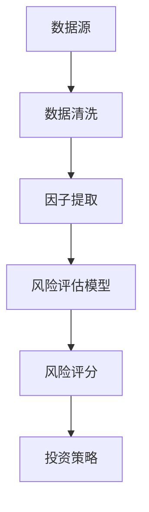
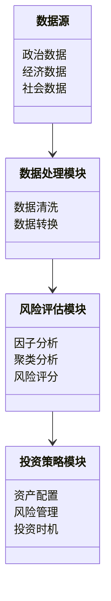

                 


```markdown
# 价值投资中的地缘政治风险评估

> 关键词：价值投资，地缘政治风险，风险评估，投资决策，资产配置

> 摘要：本文系统阐述了地缘政治风险在价值投资中的重要性，详细分析了地缘政治风险的定义、分类及其对投资决策的影响。通过构建地缘政治风险评估模型，结合因子分析和聚类分析方法，提出了一种基于Python的算法实现方案，并通过实际案例验证了模型的有效性。本文还探讨了地缘政治风险评估在投资组合管理中的应用，为投资者提供了实用的策略建议。

---

## 第一部分: 地缘政治风险与价值投资的结合

### 第1章: 地缘政治风险的定义与特征

#### 1.1 地缘政治风险的核心概念
- **地缘政治风险的定义**：指由于政治、经济、军事等领域的冲突或变化，对特定区域或全球市场造成的潜在风险。
- **地缘政治风险的分类**：
  - **国家层面**：如主权违约、政策变化等。
  - **区域层面**：如贸易摩擦、地缘冲突等。
  - **全球层面**：如全球经济波动、国际政治格局变化等。
- **地缘政治风险的特征**：
  - **复杂性**：涉及多个变量和利益相关者。
  - **不确定性**：难以完全预测。
  - **长期性**：可能对市场产生持续影响。

#### 1.2 价值投资的基本原理
- **价值投资的定义**：通过分析企业的基本面，寻找被市场低估的投资标的。
- **价值投资的核心理念**：
  - **安全边际**：投资标的的内在价值与市场价格之间的差额。
  - **长期视角**：关注企业的长期盈利能力。
  - **逆向思维**：在市场恐慌时寻找机会。
- **价值投资与地缘政治风险的关联**：
  - 地缘政治风险可能影响企业的经营环境和盈利能力。
  - 地缘政治风险可能引发市场的过度反应，为价值投资者提供机会。

#### 1.3 地缘政治风险对价值投资的影响
- **影响途径**：
  - **直接影响**：如贸易限制、关税政策对企业收入的影响。
  - **间接影响**：如市场情绪波动对资产价格的影响。
- **具体案例**：
  - 美中贸易摩擦对企业供应链的影响。
  - 地缘政治冲突对能源价格的冲击。

---

### 第2章: 地缘政治风险评估的核心概念与框架

#### 2.1 地缘政治风险评估的理论基础
- **风险评估的基本原理**：
  - 风险 = 概率 × 影响程度。
- **地缘政治风险的多维度分析**：
  - 经济因素：如贸易政策、货币政策。
  - 政治因素：如政府稳定性、政策变化。
  - 社会因素：如社会动荡、公众情绪。
- **地缘政治风险的量化方法**：
  - 指数法：如构造地缘政治风险指数。
  - 模型法：如回归分析、时间序列分析。

#### 2.2 地缘政治风险评估的框架体系
- **风险评估的层次结构**：
  - **宏观层面**：全球或区域的地缘政治风险。
  - **中观层面**：行业或企业的地缘政治风险。
  - **微观层面**：具体资产的地缘政治风险。
- **风险评估的关键指标**：
  - **政治风险指数**：如世界银行的政治风险指数。
  - **经济风险指数**：如汇率波动、通货膨胀率。
  - **社会风险指数**：如社会稳定指数、公众情绪指数。
- **风险评估的流程与步骤**：
  1. 数据收集与整理。
  2. 风险因子的识别与筛选。
  3. 风险模型的构建与验证。
  4. 风险结果的应用与反馈。

#### 2.3 地缘政治风险与投资决策的关联性分析
- **投资决策中的风险偏好**：
  - 风险厌恶型投资者：倾向于选择低风险资产。
  - 风险中性型投资者：追求风险与收益的平衡。
  - 风险偏好型投资者：倾向于选择高风险高收益的资产。
- **地缘政治风险对投资组合的影响**：
  - 风险分散：通过多元化配置降低地缘政治风险的影响。
  - 资产配置：根据地缘政治风险调整资产权重。
- **风险评估在投资策略中的应用**：
  - **风险定价**：根据地缘政治风险调整资产定价。
  - **风险管理**：制定应对地缘政治风险的策略。
  - **投资时机**：根据地缘政治风险预测选择投资时机。

---

## 第二部分: 地缘政治风险评估的算法与模型

### 第3章: 地缘政治风险评估的数学模型

#### 3.1 风险评估的基本数学模型
- **风险概率计算公式**：
  \[
  P = \frac{\text{发生次数}}{\text{总样本数}}
  \]
- **风险影响程度的度量**：
  - 影响程度 = 资产损失 / 资产规模。
- **风险综合评分模型**：
  \[
  R = \alpha \cdot P + \beta \cdot I
  \]
  其中，\( R \) 是风险评分，\( P \) 是风险概率，\( I \) 是影响程度，\( \alpha \) 和 \( \beta \) 是权重系数。

#### 3.2 基于因子分析的风险评估模型
- **因子分析的基本原理**：
  - 通过因子分析提取多个变量的共性因子。
  - 确定每个因子的权重。
- **地缘政治风险因子的提取**：
  - 政治因子：如政府稳定性、政策变化。
  - 经济因子：如贸易政策、货币政策。
  - 社会因子：如社会稳定、公众情绪。
- **因子权重的确定方法**：
  - 主成分分析（PCA）：通过方差最大化提取因子。
  - 回归分析：根据历史数据确定因子权重。

#### 3.3 基于聚类分析的风险分类模型
- **聚类分析的基本概念**：
  - 根据相似性将数据分为若干类别。
  - 每个类别代表一种风险类型。
- **地缘政治风险的聚类方法**：
  - K-means聚类：根据地缘政治风险指数将国家或地区分为若干类别。
  - 层次聚类：逐步合并相似的地缘政治风险区域。
- **风险类别与投资策略的关联**：
  - 高风险类别：如中东地区的地缘政治冲突。
  - 中风险类别：如中美贸易摩擦。
  - 低风险类别：如欧洲经济稳定地区。

---

### 第4章: 地缘政治风险评估的算法实现

#### 4.1 基于Python的算法实现
- **数据采集与预处理**：
  - 数据来源：如新闻、政策文件、经济指标。
  - 数据清洗：处理缺失值、异常值。
  - 数据转换：如标准化、归一化。
- **风险因子的提取与分析**：
  - 使用Python的pandas库进行数据处理。
  - 使用numpy库进行矩阵运算。
  - 使用sklearn库进行因子分析和聚类分析。
- **风险评估模型的构建与验证**：
  - 构建回归模型：预测地缘政治风险评分。
  - 验证模型：通过历史数据验证模型的准确性。

#### 4.2 风险评估算法的流程图



---

## 第三部分: 价值投资中的地缘政治风险应用

### 第5章: 系统分析与架构设计方案

#### 5.1 问题场景介绍
- **目标**：构建一个地缘政治风险评估系统。
- **用户**：投资者、投资机构。
- **功能需求**：
  - 数据采集与处理。
  - 风险评估与分析。
  - 投资策略建议。

#### 5.2 系统功能设计
- **领域模型**：


#### 5.3 系统架构设计


---

### 第6章: 项目实战

#### 6.1 环境安装与数据准备
- **环境安装**：
  - Python 3.8及以上版本。
  - 安装pandas、numpy、sklearn等库。
- **数据准备**：
  - 数据来源：如Yahoo Finance、World Bank。
  - 数据类型：如股票价格、经济指标、政策文本。

#### 6.2 核心实现代码
```python
import pandas as pd
from sklearn.decomposition import PCA
from sklearn.cluster import KMeans
import numpy as np

# 数据加载
data = pd.read_csv('geopolitical_risk_factors.csv')

# 数据预处理
data = data.dropna()
data = (data - data.mean()) / data.std()

# 因子分析
pca = PCA(n_components=3)
principal_components = pca.fit_transform(data)

# 聚类分析
kmeans = KMeans(n_clusters=3)
clusters = kmeans.fit_predict(principal_components)

# 风险评分
risk_score = pd.DataFrame({
    '国家': data.index,
    '风险类别': clusters,
    '风险评分': [round(np.mean(principal_components[i]), 2) for i in range(len(data))]
})
```

#### 6.3 代码应用解读
- **因子分析**：提取主要影响地缘政治风险的因素。
- **聚类分析**：将国家或地区分为不同风险类别。
- **风险评分**：计算每个国家或地区的风险评分。

#### 6.4 实际案例分析
- **案例**：中美贸易摩擦对特定行业的影响。
- **分析步骤**：
  1. 数据采集：收集中美贸易摩擦期间的相关数据。
  2. 风险评估：使用模型计算风险评分。
  3. 投资策略：根据风险评分调整资产配置。

---

### 第7章: 最佳实践与总结

#### 7.1 最佳实践
- **数据质量**：确保数据的准确性和完整性。
- **模型验证**：通过历史数据验证模型的准确性。
- **持续监控**：定期更新数据和模型。

#### 7.2 小结
- 地缘政治风险是价值投资中不可忽视的因素。
- 通过构建地缘政治风险评估模型，投资者可以更好地应对风险，制定科学的投资策略。

#### 7.3 注意事项
- 避免过度依赖单一模型。
- 结合市场实际情况调整模型参数。
- 定期更新模型以适应新的地缘政治环境。

#### 7.4 拓展阅读
- 推荐书籍：《投资学》、《地缘政治经济学》。
- 推荐论文：关于地缘政治风险与资产定价的研究。

---

## 作者信息

作者：AI天才研究院/AI Genius Institute & 禅与计算机程序设计艺术 /Zen And The Art of Computer Programming
```

