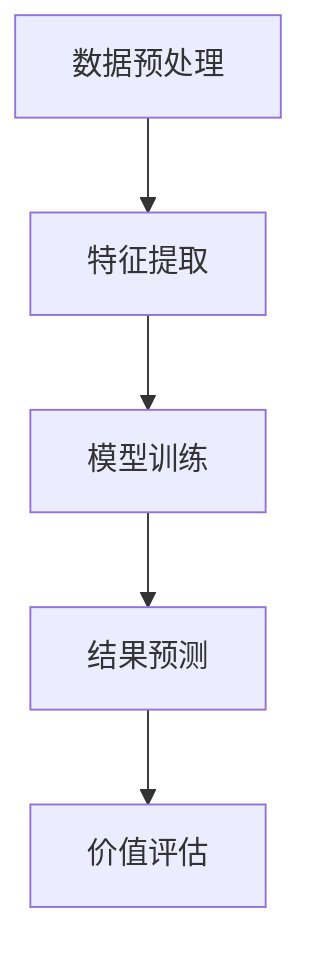
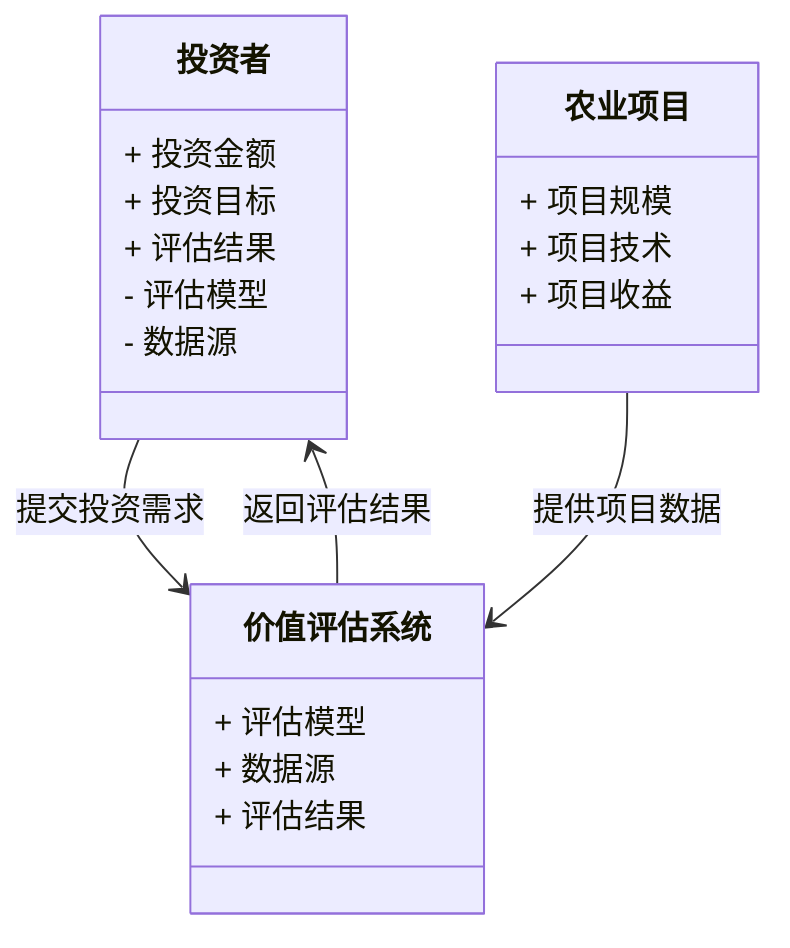
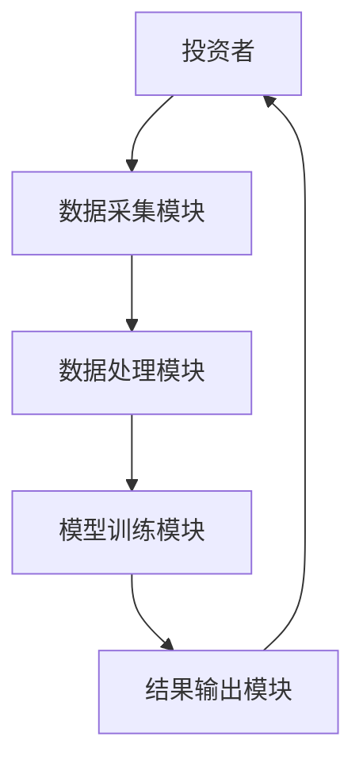

                 


# 价值投资中的垂直农业发展趋势

> 关键词：价值投资，垂直农业，发展趋势，技术驱动，投资策略

> 摘要：本文探讨了价值投资在垂直农业领域的应用趋势，分析了垂直农业的技术特点、市场潜力以及价值投资的核心策略。通过详细分析垂直农业的商业模式、技术驱动因素和价值投资的关键要素，本文提出了未来价值投资在垂直农业中的发展方向，并为投资者提供了实用的策略建议。

---

## 第一部分: 价值投资与垂直农业的背景介绍

### 第1章: 价值投资的基本概念

#### 1.1 价值投资的定义
价值投资是一种以基本面分析为核心的长期投资策略，强调以低于内在价值的价格买入优质资产。其核心理念是通过深入分析企业的财务状况、行业地位和竞争优势，寻找具有长期增长潜力的公司进行投资。

#### 1.2 价值投资的核心原则
- **安全边际**：买入价格低于内在价值，确保投资的安全性。
- **长期视角**：关注企业的长期盈利能力，而非短期市场波动。
- **基本面分析**：通过财务数据和行业分析，评估企业的内在价值。

#### 1.3 价值投资在现代金融中的地位
价值投资是投资领域的重要流派之一，尤其在市场波动加剧的情况下，其长期稳健的投资策略受到广泛关注。随着科技的进步和数据分析能力的提升，价值投资的理论和实践也在不断进化。

---

### 第2章: 垂直农业的定义与特点

#### 2.1 垂直农业的定义
垂直农业是一种通过多层立体种植技术，在有限空间内高效种植农作物的模式。其核心在于最大化土地利用率，减少对自然资源的依赖。

#### 2.2 垂直农业的核心技术
- **智能温室**：通过温控、湿度控制和光照调节，实现精准种植。
- **垂直种植架**：利用多层种植架提高空间利用率。
- **自动化技术**：包括自动浇水、施肥和收割系统。
- **数据驱动**：通过物联网（IoT）和大数据分析优化种植过程。

#### 2.3 垂直农业的市场潜力
随着城市化进程加快和人口增长，垂直农业因其高效、环保和可持续的特点，成为农业发展的新趋势。特别是在城市中，垂直农业为解决粮食供应问题提供了新的解决方案。

---

## 第二部分: 价值投资中的垂直农业发展趋势分析

### 第3章: 价值投资在垂直农业中的应用现状

#### 3.1 价值投资在农业领域的传统模式
传统农业投资主要关注大规模种植和传统农业企业。投资者通过分析企业的财务状况和行业前景，寻找具有稳定收益的农业项目。

#### 3.2 垂直农业对价值投资模式的改变
垂直农业的技术驱动和高效生产模式，为价值投资带来了新的机会。投资者可以关注技术创新能力强、市场前景广阔的垂直农业企业。

#### 3.3 价值投资在垂直农业中的典型案例
- **案例一**：某垂直农业企业的价值评估与投资策略。
- **案例二**：通过数据分析识别具有成长潜力的垂直农业项目。

---

## 第三部分: 价值投资中的垂直农业核心概念与联系

### 第4章: 核心概念的定义与属性对比

#### 4.1 价值投资的核心概念
- **内在价值**：企业的实际价值，与市场波动无关。
- **安全边际**：买入价格与内在价值的差距，确保投资的安全性。

#### 4.2 垂直农业的核心概念
- **技术驱动**：垂直农业依赖于智能温室、自动化技术和物联网等技术。
- **空间效率**：通过多层种植最大化土地利用率。

#### 4.3 两者的属性对比分析
| 属性         | 价值投资             | 垂直农业             |
|--------------|----------------------|----------------------|
| 核心驱动力   | 内在价值与安全边际   | 技术与空间效率       |
| 投资对象     | 企业与资产           | 农业项目与技术       |
| 风险因素     | 市场波动与企业经营风险 | 技术风险与政策风险   |

---

### 第5章: 核心概念的ER实体关系图

```mermaid
erDiagram
    actor 投资者 {
        <属性> 投资金额
        <属性> 投资期限
        <属性> 投资目标
    }
    actor 农业项目 {
        <属性> 项目规模
        <属性> 项目技术
        <属性> 项目收益
    }
    actor 价值评估系统 {
        <属性> 评估模型
        <属性> 数据源
        <属性> 评估结果
    }
    投资者 --> 价值评估系统 : 提供投资需求
    农业项目 --> 价值评估系统 : 提供项目数据
    价值评估系统 --> 投资者 : 输出评估结果
```

---

## 第四部分: 价值投资中的垂直农业算法原理

### 第6章: 算法原理的详细分析

#### 6.1 算法概述
本文提出了一种基于机器学习的垂直农业价值评估模型，通过分析企业的财务数据、技术能力和市场潜力，预测其未来收益。

#### 6.2 算法流程


#### 6.3 算法实现
以下是基于Python的算法实现代码：

```python
import pandas as pd
from sklearn.model_selection import train_test_split
from sklearn.linear_model import LinearRegression

# 数据加载与预处理
data = pd.read_csv('vertical_farming_data.csv')
X = data[[' revenue', 'expenses', 'profit_margin']]
y = data['value_per_share']

# 数据分割
X_train, X_test, y_train, y_test = train_test_split(X, y, test_size=0.2, random_state=42)

# 模型训练
model = LinearRegression()
model.fit(X_train, y_train)

# 模型预测
predictions = model.predict(X_test)

# 模型评估
score = model.score(X_test, y_test)
print(f"模型的准确率为: {score}")
```

#### 6.4 数学公式
以下是模型的核心公式：

$$
\text{预测价值} = \beta_0 + \beta_1 \times \text{收入} + \beta_2 \times \text{成本} + \beta_3 \times \text{利润率}
$$

---

## 第五部分: 价值投资中的垂直农业系统分析与架构设计

### 第7章: 系统分析与架构设计

#### 7.1 系统功能设计
以下是系统功能模块的类图：



#### 7.2 系统架构设计
以下是系统架构的mermaid图：



---

## 第六部分: 价值投资中的垂直农业项目实战

### 第8章: 项目实战

#### 8.1 环境安装
```bash
pip install numpy pandas scikit-learn
```

#### 8.2 核心代码实现
```python
from sklearn.metrics import mean_squared_error
import numpy as np

# 训练模型
model.fit(X_train, y_train)

# 预测结果
y_pred = model.predict(X_test)

# 评估模型
 mse = mean_squared_error(y_test, y_pred)
 print(f"均方误差: {mse}")
```

#### 8.3 案例分析
通过分析某垂直农业企业的财务数据和市场表现，评估其投资价值，并制定相应的投资策略。

---

## 第七部分: 总结与展望

### 第9章: 总结

#### 9.1 本文的主要结论
- 价值投资在垂直农业中的应用潜力巨大。
- 技术驱动是垂直农业发展的核心因素。
- 数据分析和机器学习在价值评估中发挥重要作用。

#### 9.2 未来研究方向
- 探索更多垂直农业技术的应用场景。
- 提升价值评估模型的准确性和实时性。
- 研究政策和技术对垂直农业投资的影响。

---

## 第八部分: 最佳实践与注意事项

### 第10章: 最佳实践 tips

- **数据驱动决策**：依赖于准确的数据和模型进行价值评估。
- **长期视角**：关注企业的长期发展和技术创新能力。
- **风险管理**：合理评估投资风险，确保投资安全。

---

## 作者

作者：AI天才研究院/AI Genius Institute & 禅与计算机程序设计艺术 /Zen And The Art of Computer Programming

