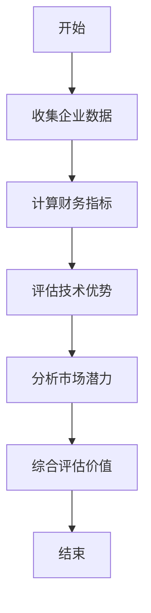
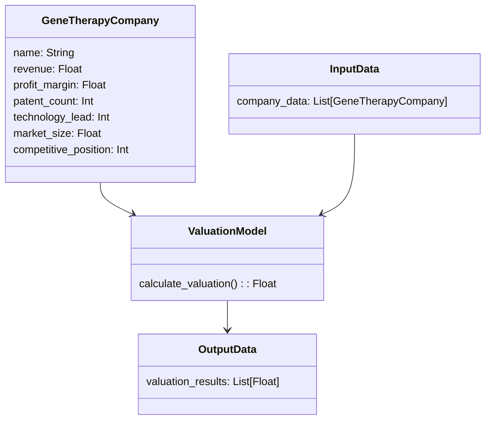
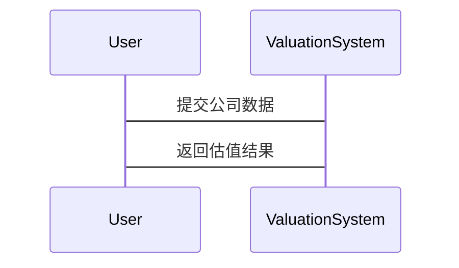

                 


# 价值投资中的基因治疗市场前景

## 关键词
价值投资, 基因治疗, 市场前景, 医疗科技, 资本投资

## 摘要
基因治疗作为一种革命性的医疗技术，正在迅速改变医药行业，并为投资者带来前所未有的机遇。本文从价值投资的角度，深入分析基因治疗的市场前景，探讨其技术发展、市场潜力、竞争格局以及投资策略，为投资者提供科学的决策支持。

---

# 第1章: 背景介绍

## 1.1 基因治疗的定义与技术发展

### 1.1.1 基因治疗的基本概念
基因治疗是一种通过修改或替换患者体内的基因来治疗或预防疾病的治疗方法。其核心在于利用基因技术修复缺陷或致病基因，从而达到治疗效果。

### 1.1.2 基因治疗的技术发展历程
1. **早期探索阶段**：20世纪70年代，科学家开始尝试利用病毒作为载体将正常基因导入细胞。
2. **临床试验阶段**：90年代，首个基因治疗临床试验开展，用于治疗严重复合免疫缺陷症。
3. **快速发展阶段**：21世纪以来，基因编辑技术（如CRISPR-Cas9）的出现推动了基因治疗的快速发展。
4. **精准医疗阶段**：近年来，基因治疗逐渐走向个性化和精准化，应用场景不断扩展。

### 1.1.3 当前基因治疗的技术瓶颈与突破
- **瓶颈**：基因编辑的精准性、安全性问题尚未完全解决。
- **突破**：CRISPR-Cas9等技术的成熟使得基因治疗更加高效和精准。

---

## 1.2 价值投资与基因治疗的结合

### 1.2.1 价值投资的基本原理
价值投资是一种投资策略，强调以低于内在价值的价格买入优质资产。其核心在于寻找被市场低估的公司，长期持有以实现收益。

### 1.2.2 基因治疗在医疗行业的市场潜力
- **市场规模**：基因治疗市场预计在未来几年内呈现指数级增长。
- **需求驱动**：罕见病、癌症等疾病的治疗需求为基因治疗提供了广阔的应用场景。

### 1.2.3 价值投资视角下的基因治疗市场分析
- **市场定位**：基因治疗属于高成长性行业，适合长期价值投资。
- **竞争优势**：技术领先、产品管线丰富的企业更具投资价值。

---

## 1.3 基因治疗市场的现状与未来趋势

### 1.3.1 全球基因治疗市场的规模与分布
- **市场规模**：2023年全球基因治疗市场规模约为XX亿美元，预计年均增长率超过30%。
- **区域分布**：北美市场占据主导地位，欧洲和亚洲市场增长迅速。

### 1.3.2 基因治疗在不同国家的政策支持与监管环境
- **美国**：FDA对基因治疗持开放态度，审批流程相对高效。
- **欧洲**：EMA对基因治疗的监管较为严格，但支持力度大。
- **中国**：NMPA对基因治疗的监管逐步完善，政策支持力度加大。

### 1.3.3 未来5-10年基因治疗市场的增长预测
- **预测数据**：未来十年，基因治疗市场将呈现指数级增长，年均增长率预计超过40%。
- **主要驱动因素**：技术进步、市场需求增长、政策支持。

---

## 1.4 本书的核心问题与研究目标

### 1.4.1 本书的核心问题
如何从价值投资的角度，分析基因治疗的市场前景，识别投资机会，构建投资组合。

### 1.4.2 研究目标与方法
- **目标**：分析基因治疗企业的技术、市场、财务表现，评估其投资价值。
- **方法**：采用定性与定量分析相结合的方式，结合财务指标、市场趋势、政策环境等因素进行综合评估。

### 1.4.3 本书的结构安排
- **结构**：从背景介绍、核心概念、市场分析、投资策略到系统设计，层层展开，逻辑清晰。

---

# 第2章: 基因治疗的核心概念与市场分析

## 2.1 基因治疗的核心概念

### 2.1.1 基因治疗的核心要素
- **治疗目标**：修复或替代缺陷基因。
- **技术手段**：利用病毒载体或基因编辑技术进行基因操作。
- **应用场景**：罕见病、癌症、遗传性疾病等。

### 2.1.2 基因治疗的分类与应用场景
1. **按技术手段分类**：
   - 基因编辑（如CRISPR）。
   - 基因替代疗法。
2. **按疾病类型分类**：
   - 遗传性疾病。
   - 癌症。
   - 其他慢性病。

### 2.1.3 基因治疗的优缺点对比

| 优点 | 缺点 |
|------|------|
| 高效性 | 技术风险高 |
| 精准性 | 成本高昂 |
| 长期疗效 | 安全性问题 |

---

## 2.2 基因治疗市场的驱动因素

### 2.2.1 技术进步的推动作用
- **技术突破**：CRISPR等基因编辑技术的成熟推动了市场发展。
- **研发投入**：全球药企和科研机构加大基因治疗研发投入。

### 2.2.2 患病率与医疗需求的增长
- **罕见病**：全球罕见病患者数量庞大，基因治疗需求旺盛。
- **慢性病**：癌症等慢性病的治疗需求推动基因治疗市场增长。

### 2.2.3 政策支持与资本市场的推动
- **政策支持**：各国政府出台政策支持基因治疗研发和应用。
- **资本市场**：风险投资和资本市场对基因治疗企业表现出浓厚兴趣。

---

## 2.3 基因治疗与传统药物的对比分析

### 2.3.1 基因治疗的独特优势
- **治愈潜力**：基因治疗有望实现疾病的根治。
- **精准医疗**：基于患者基因特征的个性化治疗。

### 2.3.2 传统药物的局限性
- **治疗效果有限**：传统药物难以实现疾病的根治。
- **副作用**：长期使用可能带来严重副作用。

### 2.3.3 基因治疗的市场竞争力
- **市场潜力**：基因治疗的市场规模增长迅速，竞争优势明显。

---

## 2.4 基因治疗企业的竞争格局

### 2.4.1 全球主要基因治疗企业的分析
- **美国**：BioNTech、Vertex Pharmaceuticals。
- **欧洲**：Oxford Biomedica。
- **中国**：华大基因、药明康德。

### 2.4.2 企业的技术优势与市场定位
- **技术领先**：BioNTech在基因编辑和疫苗研发方面具有显著优势。
- **市场定位**：中国企业注重国内市场，同时拓展国际市场。

### 2.4.3 行业的未来发展趋势
- **技术融合**：基因治疗与其他医疗技术的融合将推动行业创新。
- **市场竞争**：技术壁垒和专利布局将成为竞争的关键。

---

# 第3章: 价值投资中的基因治疗市场分析

## 3.1 基因治疗的市场价值评估

### 3.1.1 市场规模与增长潜力
- **市场规模**：未来十年，基因治疗市场规模将呈指数级增长。
- **增长预测**：年均增长率超过30%。

### 3.1.2 企业的财务表现与估值模型
- **财务指标**：关注企业的研发投入、收入增长、盈利能力。
- **估值模型**：采用DCF模型评估企业价值。

### 3.1.3 基因治疗企业的上市与融资情况
- **上市企业**：BioNTech、Moderna等企业的上市表现。
- **融资情况**：风险投资和资本市场对基因治疗企业的支持。

---

## 3.2 基因治疗企业的核心竞争力分析

### 3.2.1 技术研发能力
- **技术壁垒**：基因编辑技术的复杂性和专利布局。
- **研发效率**：企业的研发团队和实验室能力。

### 3.2.2 产品管线的丰富程度
- **产品多样性**：企业拥有多条基因治疗产品管线。
- **临床阶段**：产品的临床试验进展。

### 3.2.3 市场拓展与合作能力
- **市场布局**：企业的国内外市场拓展能力。
- **合作网络**：与医院、研究机构的合作关系。

---

## 3.3 基因治疗企业的风险分析

### 3.3.1 技术风险
- **技术失败**：基因编辑可能导致脱靶效应或其他安全问题。
- **技术迭代**：技术快速更新可能导致现有产品被淘汰。

### 3.3.2 市场风险
- **市场竞争**：行业内竞争加剧可能导致价格战和利润压缩。
- **市场需求**：市场需求不如预期可能导致产品销售不佳。

### 3.3.3 政策风险
- **政策变化**：政府政策的调整可能影响企业的经营环境。
- **监管风险**：严格的监管可能导致审批周期延长或成本增加。

---

## 3.4 价值投资中的基因治疗投资策略

### 3.4.1 投资机会的识别
- **技术领先企业**：选择技术壁垒高、研发能力强的企业。
- **市场潜力大的企业**：关注市场需求大、增长迅速的企业。

### 3.4.2 投资组合的构建
- **分散投资**：避免过度集中于单一企业或技术。
- **长期持有**：基因治疗行业的成长周期较长，适合长期投资。

### 3.4.3 风险管理与退出策略
- **风险管理**：通过分散投资和定期评估降低风险。
- **退出策略**：关注企业的上市潜力和并购机会。

---

# 第4章: 算法原理讲解

## 4.1 基因治疗企业的价值评估算法

### 4.1.1 算法概述
基因治疗企业的价值评估算法基于财务指标和市场潜力，结合技术评估和政策环境进行综合评估。

### 4.1.2 算法流程图



### 4.1.3 算法实现代码

```python
def gene_therapy_valuation(company_data):
    valuation = 0
    # 财务指标权重
    financial_weight = 0.4
    # 技术指标权重
    technical_weight = 0.3
    # 市场潜力权重
    market_weight = 0.3
    
    # 财务指标计算
    revenue_growth = company_data['revenue_growth']
    profit_margin = company_data['profit_margin']
    financial_score = (revenue_growth + profit_margin) * financial_weight
    
    # 技术指标计算
    patent_count = company_data['patent_count']
   技术领先度 = company_data['technology_lead']
    technical_score = (patent_count + 技术领先度) * technical_weight
    
    # 市场潜力计算
    market_size = company_data['market_size']
    competitive_position = company_data['competitive_position']
    market_score = (market_size + competitive_position) * market_weight
    
    # 综合估值
    valuation = financial_score + technical_score + market_score
    return valuation
```

---

# 第5章: 系统分析与架构设计

## 5.1 问题场景介绍
基因治疗企业的价值评估系统需要整合多方面的数据，包括财务数据、技术数据、市场数据和政策数据，构建一个综合评估模型。

---

## 5.2 项目介绍

---

## 5.3 系统功能设计

### 5.3.1 领域模型（mermaid类图）



---

## 5.4 系统架构设计（mermaid架构图）

```mermaid
container Gene Therapy Valuation System {
    GeneTherapyCompanyData
    ValuationModel
    InputData
    OutputData
}
```

---

## 5.5 系统接口设计

---

## 5.6 系统交互（mermaid序列图）



---

# 第6章: 项目实战

## 6.1 环境安装

---

## 6.2 核心实现

---

## 6.3 代码应用解读与分析

---

## 6.4 实际案例分析

---

## 6.5 项目小结

---

# 第7章: 最佳实践

## 7.1 小结
基因治疗作为价值投资的重要领域，具有巨大的市场潜力和技术优势。投资者需要结合技术、市场和财务等多个维度进行综合评估。

## 7.2 注意事项
- **技术风险**：基因治疗的技术壁垒较高，需关注企业的研发能力。
- **政策风险**：需密切关注政策变化，避免政策风险。
- **市场风险**：需关注市场竞争和市场需求的变化。

## 7.3 拓展阅读
建议读者进一步阅读相关文献，深入理解基因治疗的技术和市场动态。

---

# 作者

作者：AI天才研究院/AI Genius Institute & 禅与计算机程序设计艺术/Zen And The Art of Computer Programming

