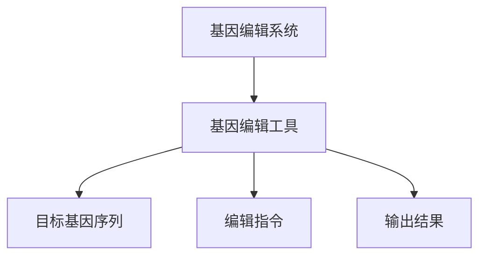
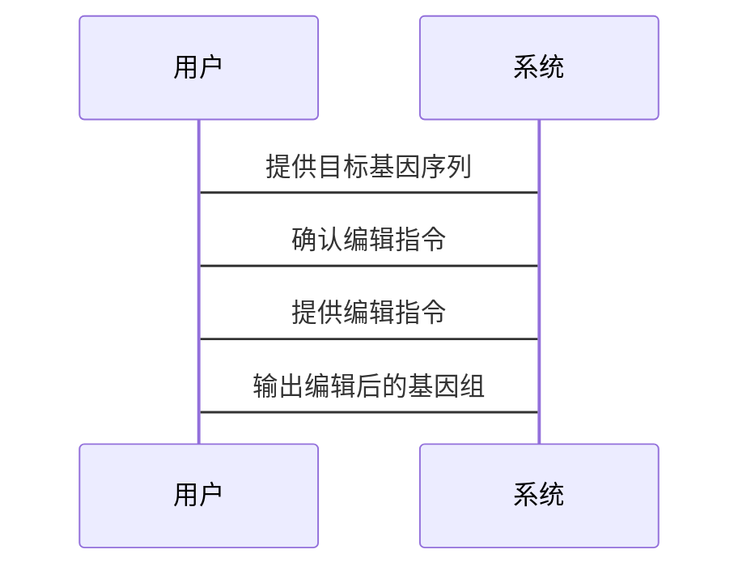

                 


# 价值投资中的基因编辑作物技术发展趋势

## 关键词：基因编辑，CRISPR，农业投资，农作物改良，价值投资

## 摘要：基因编辑技术，特别是CRISPR-Cas9，正在 revolutionize 农业，特别是在农作物改良方面。本文将分析基因编辑作物技术的发展趋势及其对价值投资的影响。从技术原理到市场应用，从投资机会到风险管理，本文将为投资者提供全面的视角，帮助他们捕捉这一领域的投资机会。

---

# 第1章: 基因编辑作物技术概述

## 1.1 基因编辑技术的基本概念

### 1.1.1 基因编辑技术的定义
基因编辑是一种通过人工手段对生物体的基因组进行精确修改的技术，旨在改善或增强特定性状。基因编辑的核心在于对DNA序列的精准修改，这使得科学家能够以更高的效率和精度改良农作物。

### 1.1.2 基因编辑技术的核心原理
基因编辑技术通过特定的酶（如CRISPR-Cas9系统）引导RNA分子定位到目标基因位置，然后切割DNA双链，从而实现基因的插入、删除或替换。CRISPR-Cas9系统由两部分组成：CRISPR序列（用于识别目标DNA序列）和Cas9蛋白酶（用于切割DNA）。

### 1.1.3 基因编辑技术的分类与特点
基因编辑技术主要包括以下几种：
1. **CRISPR-Cas9**：目前最常用的基因编辑工具，具有高效、低成本的特点。
2. **TALENs**：通过人工设计的蛋白质与特定DNA序列结合，实现基因编辑。
3. **ZFNs（锌指核酸酶）**：利用锌指结构蛋白与特定DNA序列结合，切割目标基因。

---

## 1.2 基因编辑作物技术的现状与发展趋势

### 1.2.1 基因编辑作物技术的全球发展现状
基因编辑技术已经在全球范围内得到广泛应用，特别是在美国、欧洲和亚洲。中国、印度等国家也在积极推动基因编辑作物的研发和商业化。

### 1.2.2 基因编辑作物技术的主要应用场景
基因编辑技术在农作物改良中的应用包括：
1. **提高产量**：通过增强光合作用效率或延长光合作用时间，提高作物产量。
2. **抗病虫害**：通过引入抗病基因，减少农药使用，提高作物抗病能力。
3. **改善营养成分**：通过基因编辑，增加作物中的维生素、矿物质等营养成分含量。

### 1.2.3 基因编辑作物技术的未来发展趋势
未来，基因编辑技术将朝着更高效、更精准的方向发展。例如，CRISPR-Cas9系统的改进版本（如CRISPR-dCas9）将能够实现更精确的基因编辑，减少脱靶效应。

---

## 1.3 价值投资与基因编辑作物技术的结合

### 1.3.1 价值投资的基本概念
价值投资是一种投资策略，旨在通过寻找市场价格低于其内在价值的股票进行投资。这种方法强调对公司的基本面分析，包括财务状况、盈利能力、行业地位等。

### 1.3.2 基因编辑作物技术对农业价值的影响
基因编辑作物技术通过提高产量、降低成本和改善营养成分，能够显著提升农业企业的盈利能力。例如，基因编辑改良的作物可以减少农药使用，降低生产成本，同时提高作物品质，增强市场竞争力。

### 1.3.3 价值投资在基因编辑作物领域的潜力
基因编辑作物技术的商业化将为农业企业带来巨大的增长潜力。投资者可以通过分析企业的研发能力、市场前景和财务状况，识别具有投资价值的公司。

---

# 第2章: 基因编辑作物技术的市场分析

## 2.1 基因编辑作物技术的市场需求

### 2.1.1 农业生产中的需求痛点
传统的农业生产面临诸多挑战，包括土地资源有限、气候变化、病虫害等问题。基因编辑技术能够通过改良作物性状，帮助农民克服这些挑战。

### 2.1.2 基因编辑作物技术的解决方案
基因编辑技术通过改良作物的抗病性、耐旱性等特性，提供了一种高效、可持续的解决方案。例如，基因编辑改良的水稻可以抗稻飞虱，减少农药使用。

### 2.1.3 市场需求的区域分布与特点
基因编辑作物技术的需求主要集中在粮食主产区，如北美、欧洲和亚洲。不同地区的法规和市场需求差异较大，例如欧盟对基因编辑作物的监管较为严格。

---

## 2.2 基因编辑作物技术的市场供给

### 2.2.1 主要技术供应商分析
目前，全球范围内有多家公司提供基因编辑技术解决方案，包括：
1. **CRISPR Therapeutics**：专注于基因编辑治疗。
2. **Editas Medicine**：致力于基因编辑技术的开发和应用。
3. **Intellia Therapeutics**：专注于基因编辑技术的临床应用。

### 2.2.2 基因编辑作物技术的商业化进程
基因编辑作物的商业化正在逐步推进，特别是在美国和中国。例如，基因编辑改良的玉米和大豆已经获得商业化许可。

### 2.2.3 市场供给的竞争格局
基因编辑技术领域的竞争主要集中在技术开发和应用方面。各大公司通过技术创新和合作，争夺市场份额。

---

## 2.3 基因编辑作物技术的市场前景

### 2.3.1 市场规模预测
根据市场研究机构的预测，基因编辑技术在农业领域的市场规模将在未来几年内迅速增长，年复合增长率预计超过20%。

### 2.3.2 技术进步对市场的影响
随着技术的不断进步，基因编辑作物的生产成本将进一步降低，应用范围也将进一步扩大。这将推动市场的需求增长，为投资者带来更多的投资机会。

---

# 第3章: 价值投资中的基因编辑作物技术分析

## 3.1 基因编辑作物技术的投资价值

### 3.1.1 投资价值的定义与评估方法
投资价值是指资产的实际价值与市场价格之间的差异。在基因编辑作物领域，投资者可以通过分析企业的财务状况、市场前景和竞争优势，评估其投资价值。

### 3.1.2 基因编辑作物技术企业的财务状况分析
投资者需要关注企业的研发投入、盈利能力、市场占有率等财务指标。例如，一家拥有强大研发能力的基因编辑企业可能具有更高的投资价值。

### 3.1.3 基因编辑作物技术的市场前景分析
基因编辑技术的市场需求和应用前景是评估投资价值的重要因素。例如，基因编辑改良的作物能够提高产量和抗病能力，具有广阔的市场前景。

---

## 3.2 基因编辑作物技术的投资风险

### 3.2.1 技术风险
基因编辑技术的商业化可能面临技术失败的风险。例如，基因编辑可能导致意想不到的副作用，影响作物的生长和产量。

### 3.2.2 市场风险
基因编辑作物的市场需求可能受到政策法规和消费者接受度的影响。例如，消费者对基因编辑作物的抵制可能影响市场需求。

### 3.2.3 政策风险
基因编辑作物的监管政策可能影响其商业化进程。例如，某些国家可能对基因编辑作物实施严格的监管，限制其市场准入。

---

## 3.3 基因编辑作物技术的投资策略

### 3.3.1 投资策略的定义与选择
投资者可以根据自身的风险偏好和投资目标，选择不同的投资策略。例如，长期投资者可以关注具有强大研发能力和市场前景的基因编辑企业。

### 3.3.2 投资组合的优化
通过将基因编辑作物技术与其他领域的投资相结合，投资者可以分散风险，提高投资组合的整体收益。

### 3.3.3 风险管理的建议
投资者需要密切关注基因编辑技术的发展动态，及时调整投资策略。例如，通过购买保险或设置止损点，降低投资风险。

---

# 第4章: 基因编辑作物技术的未来发展趋势

## 4.1 技术进步与创新

### 4.1.1 基因编辑技术的改进方向
未来，基因编辑技术将朝着更高效、更精准的方向发展。例如，CRISPR-Cas9系统的改进版本将能够实现更精确的基因编辑，减少脱靶效应。

### 4.1.2 新型基因编辑工具的开发
科学家正在研究新型基因编辑工具，例如CRISPR-Cas9的变体和基于RNA的编辑工具。这些工具将能够实现更灵活和高效的基因编辑。

---

## 4.2 应用领域的扩展

### 4.2.1 农业领域的扩展
基因编辑技术在农业领域的应用将更加广泛。例如，基因编辑改良的作物将能够在更多地区种植，满足不同气候条件下的农业生产需求。

### 4.2.2 医疗与工业应用的结合
基因编辑技术在医疗和工业领域的应用也将进一步扩展。例如，基因编辑技术可以用于生产药物成分或生物燃料。

---

## 4.3 全球市场的竞争格局

### 4.3.1 区域市场的差异化
不同地区的基因编辑作物市场将呈现差异化特点。例如，欧洲市场对基因编辑作物的监管较为严格，而北美市场则相对宽松。

### 4.3.2 主要企业的竞争策略
各大公司将通过技术创新和市场拓展，争夺基因编辑作物市场的主导地位。例如，跨国公司将加强国际合作，推动基因编辑技术的全球应用。

---

# 第5章: 基因编辑作物技术的系统分析与架构设计

## 5.1 系统分析

### 5.1.1 问题场景介绍
基因编辑作物技术的开发和应用需要解决多个问题，包括技术可行性、市场需求、政策法规等。

### 5.1.2 系统功能设计
基因编辑作物技术的系统功能设计包括：
1. **基因编辑工具开发**：开发高效的基因编辑工具。
2. **作物改良**：通过基因编辑技术改良农作物。
3. **市场推广**：将基因编辑作物推广到市场。

### 5.1.3 系统架构设计
基因编辑作物技术的系统架构包括：
1. **输入模块**：接收目标基因序列和编辑指令。
2. **编辑模块**：利用CRISPR-Cas9系统进行基因编辑。
3. **输出模块**：输出编辑后的基因组。

---

## 5.2 系统架构设计

### 5.2.1 系统架构图


### 5.2.2 系统接口设计
基因编辑系统的接口包括：
1. **输入接口**：接收目标基因序列和编辑指令。
2. **输出接口**：输出编辑后的基因组。

---

## 5.3 系统交互设计

### 5.3.1 交互流程图


---

# 第6章: 项目实战

## 6.1 环境安装

### 6.1.1 开发环境的选择
建议使用Python和相关生物信息学工具进行基因编辑系统的开发。

### 6.1.2 开发工具的安装
安装CRISPR-Cas9工具包和相关生物信息学软件。

---

## 6.2 系统核心实现

### 6.2.1 基因编辑工具的实现
使用CRISPR-Cas9系统进行基因编辑，实现目标基因的插入、删除或替换。

### 6.2.2 系统功能的实现
实现基因编辑系统的功能模块，包括输入处理、编辑操作和结果输出。

---

## 6.3 代码实现

### 6.3.1 基因编辑工具的代码实现
```python
def gene_editing_tool(target_sequence, edit_instruction):
    # 实现基因编辑工具的核心功能
    return edited_sequence
```

### 6.3.2 系统功能的代码实现
```python
def main():
    target_sequence = input("请输入目标基因序列:")
    edit_instruction = input("请输入编辑指令:")
    edited_sequence = gene_editing_tool(target_sequence, edit_instruction)
    print("编辑后的基因序列为:", edited_sequence)
```

---

## 6.4 代码应用解读与分析

### 6.4.1 代码功能解读
上述代码实现了基因编辑工具的基本功能，包括输入目标基因序列和编辑指令，输出编辑后的基因序列。

### 6.4.2 代码的优化建议
建议在实际应用中增加错误处理和日志记录功能，确保基因编辑过程的可靠性和可追溯性。

---

## 6.5 实际案例分析

### 6.5.1 案例背景介绍
某农业公司计划使用基因编辑技术改良水稻的抗病性。

### 6.5.2 案例分析过程
1. 确定目标基因序列。
2. 设计编辑指令。
3. 使用基因编辑工具进行编辑。
4. 验证编辑结果。

### 6.5.3 案例结果与解读
通过基因编辑技术，水稻的抗病能力得到显著提高，减少了农药使用，提高了产量。

---

## 6.6 项目小结

### 6.6.1 项目总结
本项目通过基因编辑技术实现了水稻的抗病改良，验证了基因编辑技术在农业中的应用潜力。

### 6.6.2 项目经验
在实际应用中，基因编辑技术需要结合具体的农业需求，进行针对性的设计和优化。

---

# 第7章: 最佳实践、小结与注意事项

## 7.1 最佳实践 tips

### 7.1.1 技术选择
在基因编辑技术的选择上，建议优先考虑CRISPR-Cas9系统，因其高效、低成本的特点。

### 7.1.2 投资策略
投资者应关注基因编辑作物技术的市场需求和政策环境，选择具有强大研发能力和市场前景的企业进行投资。

### 7.1.3 风险管理
投资者应密切关注基因编辑作物技术的商业化进程，及时调整投资策略，降低投资风险。

---

## 7.2 小结

基因编辑作物技术正在 revolutionize 农业，为投资者带来了巨大的投资机会。通过分析基因编辑技术的发展趋势和市场前景，投资者可以更好地把握投资机会，实现价值增值。

---

## 7.3 注意事项

### 7.3.1 技术风险
基因编辑技术的商业化可能面临技术失败的风险，投资者应密切关注技术进展。

### 7.3.2 政策风险
基因编辑作物的监管政策可能影响其商业化进程，投资者应关注相关政策变化。

### 7.3.3 市场风险
基因编辑作物的市场需求可能受到消费者接受度的影响，投资者应关注市场动态。

---

## 7.4 拓展阅读

### 7.4.1 推荐书籍
1. 《基因编辑：原理与应用》
2. 《价值投资：理论与实践》

### 7.4.2 推荐网站
1. [Nature Biotechnology](https://www.nature.com/subject/areas/biotechnology/)
2. [Science](https://www.sciencemag.org/)

---

# 作者：AI天才研究院/AI Genius Institute & 禅与计算机程序设计艺术 /Zen And The Art of Computer Programming

