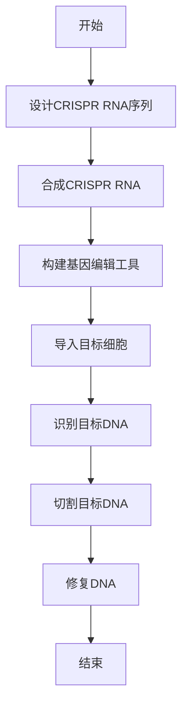

                 

# 价值投资中的基因编辑技术机遇

> 关键词：价值投资，基因编辑技术，CRISPR-Cas9，投资机会，生物技术

> 摘要：基因编辑技术，尤其是CRISPR-Cas9，正在改变生物技术领域，为投资者带来巨大的投资机会。本文将探讨基因编辑技术的基本原理、其在农业和医疗中的应用，以及如何将其与价值投资策略相结合，帮助投资者识别和评估具有长期增长潜力的企业。

---

## 第一部分：基因编辑技术与价值投资的背景介绍

### 第1章：基因编辑技术的基本概念

#### 1.1 基因编辑技术的定义与历史

基因编辑技术是一种通过人工手段对生物的基因组进行精确修改的技术，旨在添加、删除或修改特定的基因片段。这些技术在医学、农业和生物技术等领域具有广泛的应用潜力。

基因编辑技术的历史可以追溯到20世纪初，但CRISPR-Cas9技术的出现标志着该领域的重要突破。CRISPR-Cas9是一种基于细菌的天然免疫系统开发出的基因编辑工具，使得基因编辑变得更加高效、精确和经济。

#### 1.2 价值投资的基本原理

价值投资是一种长期投资策略，强调通过深入分析企业的基本面，寻找市场价格低于其内在价值的投资机会。这种策略的核心在于识别那些具有强大竞争优势、良好财务状况和可持续增长潜力的企业。

---

### 第2章：基因编辑技术的原理

#### 2.1 CRISPR-Cas9技术的工作机制

CRISPR-Cas9系统由两部分组成：CRISPR序列和Cas9蛋白。CRISPR序列是一段RNA分子，能够与目标DNA序列配对；Cas9蛋白是一种核酸酶，能够切割目标DNA链。当CRISPR序列与目标DNA配对后，Cas9蛋白会切割DNA双链，从而实现基因编辑。

CRISPR-Cas9技术的步骤如下：

1. 设计并合成与目标DNA序列互补的CRISPR RNA。
2. 将CRISPR RNA与Cas9蛋白结合，形成基因编辑工具。
3. 将基因编辑工具导入目标细胞，使其进入细胞核。
4. CRISPR RNA引导Cas9蛋白识别并结合目标DNA。
5. Cas9蛋白切割目标DNA链，导致双链断裂。
6. 细胞修复断裂的DNA链，可能导致基因的插入或删除。

#### 2.2 基因编辑技术的核心算法

基因编辑技术的核心算法包括序列比对算法和基因编辑工具的设计算法。以下是几种常见的算法：

1. **序列比对算法**：用于将CRISPR RNA序列与目标DNA序列进行比对，确保两者能够准确匹配。
2. **基因编辑工具设计算法**：用于设计CRISPR RNA序列，使其能够高效地编辑目标基因。

以下是CRISPR-Cas9技术的流程图：

---

### 第3章：基因编辑技术的应用领域

#### 3.1 医疗领域的应用

基因编辑技术在医疗领域的应用主要集中在基因治疗和疾病模型的构建。例如，CRISPR-Cas9技术可以用于修复遗传性疾病患者的基因缺陷，从而治疗疾病。

#### 3.2 农业领域的应用

基因编辑技术在农业中的应用主要集中在作物改良和动物育种。例如，通过基因编辑技术可以提高作物的抗病性和产量，或者改良动物的肉质和生长速度。

---

## 第二部分：价值投资中的基因编辑技术机遇

### 第4章：基因编辑技术的市场分析

#### 4.1 基因编辑技术的市场现状

基因编辑技术的市场目前主要集中在医疗和农业领域。随着技术的不断进步，市场对基因编辑技术的需求将持续增长。以下是全球基因编辑技术市场的规模预测：

| 年份 | 市场规模（亿美元） |
|------|-------------------|
| 2020 | 6.0              |
| 2025 | 20.0             |
| 2030 | 50.0             |

---

### 第5章：价值投资中的基因编辑技术策略

#### 5.1 投资机会识别

在价值投资中，识别基因编辑技术的投资机会需要考虑以下几个因素：

1. **企业的技术实力**：企业是否拥有自主的基因编辑技术？
2. **市场的潜在需求**：基因编辑技术在目标市场的应用前景如何？
3. **财务状况**：企业的财务状况是否健康，是否具备持续研发投入的能力？

---

## 第三部分：基因编辑技术与价值投资的结合

### 第6章：基因编辑技术的价值投资分析

#### 6.1 投资回报率分析

以下是基因编辑技术相关公司的投资回报率分析模型：

$$IRR = \frac{\text{净现值}}{\text{初始投资}}$$

---

### 第7章：基因编辑技术的未来展望

#### 7.1 未来的技术发展趋势

基因编辑技术的未来发展趋势包括：

1. **技术的进一步优化**：提高基因编辑的精度和效率。
2. **新的应用场景**：探索基因编辑技术在更多领域的应用，如环保和能源。

---

## 第四部分：总结与建议

### 第8章：投资策略与风险管理

#### 8.1 投资策略

投资者在进行基因编辑技术投资时，应采取以下策略：

1. **长期投资**：关注具有长期增长潜力的企业。
2. **分散投资**：避免将所有资金投入到单一领域。

#### 8.2 风险管理

投资者应关注以下风险：

1. **技术风险**：基因编辑技术的不确定性和失败可能性。
2. **市场风险**：市场的波动性和政策变化。

---

## 作者信息

作者：AI天才研究院/AI Genius Institute & 禅与计算机程序设计艺术 /Zen And The Art of Computer Programming

