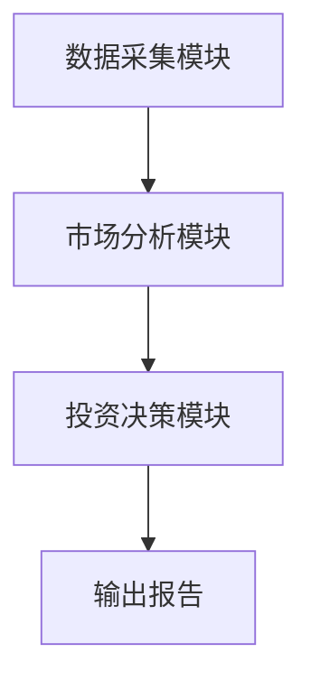
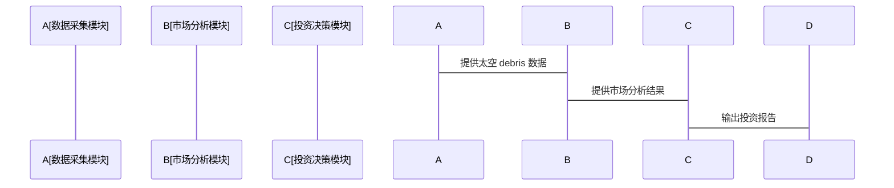

                 


# 价值投资中的太空 debris 清理技术前景

> 关键词：价值投资，太空 debris 清理，技术前景，市场分析，投资策略

> 摘要：随着太空探索的深入，太空 debris 的问题日益严重，清理技术成为了全球关注的焦点。本文从价值投资的角度，分析太空 debris 清理技术的市场前景、技术路径和投资策略，为投资者提供深度的技术与商业洞察。

---

## 第一部分: 背景介绍

### 第1章: 太空 debris 清理技术的背景与现状

#### 1.1 太空 debris 的问题背景

太空 debris 是指在地球轨道上的废弃卫星、火箭部件和其他太空垃圾。随着人类对太空探索的深入，地球轨道上的 debris 数量急剧增加，对现有的卫星和航天器构成了严重威胁。据统计，目前地球轨道上有超过3.6万个直径超过10厘米的 debris，这些碎片以极高的速度运行，可能对卫星、国际空间站等航天器造成致命损害。

太空 debris 的问题不仅威胁到现有的太空设备，还可能阻碍未来太空探索的发展。因此，开发有效的清理技术成为了全球科学家和企业的重点关注领域。

#### 1.2 太空 debris 清理技术的现状

目前，全球多个国家和企业都在研究太空 debris 清理技术，主要方法包括机械抓取、激光清理、拖曳装置等。然而，这些技术仍处于实验阶段，尚未大规模商业化。

从市场角度来看，太空 debris 清理技术的市场需求主要来自于政府机构、卫星运营商和大型企业。随着太空探索的深入，市场对清理技术的需求将显著增加。

#### 1.3 价值投资与太空 debris 清理技术的结合

价值投资是一种长期投资策略，注重选择具有持续增长潜力和合理估值的公司。太空 debris 清理技术作为新兴领域，具有巨大的市场潜力和技术创新空间，符合价值投资的核心理念。

从投资角度来看，太空 debris 清理技术的商业化将带来巨大的经济价值。随着技术的成熟和市场的扩展，相关企业将具备长期的增长潜力，为投资者带来可观的回报。

---

## 第二部分: 核心概念与联系

### 第2章: 太空 debris 清理技术的核心概念

#### 2.1 太空 debris 清理技术的原理

太空 debris 清理技术的核心目标是移除轨道上的废弃物体。主要的技术方法包括：

1. **机械抓取**：使用机械臂或网状装置捕获 debris。
2. **激光清理**：利用高能激光器烧蚀 debris。
3. **拖曳装置**：通过拖曳装置将 debris 拖入大气层烧毁。

这些技术各有优缺点，目前尚未有一种方法能够在大规模清理中占据主导地位。

#### 2.2 价值投资与太空 debris 清理技术的关系

价值投资的核心在于选择具有长期增长潜力的企业。太空 debris 清理技术作为新兴领域，具有以下特点：

- **市场需求大**：随着太空探索的深入，清理技术的需求将快速增长。
- **技术门槛高**：清理技术需要高度的专业知识和创新能力。
- **长期回报高**：成功的清理技术将带来巨大的经济价值。

因此，太空 debris 清理技术符合价值投资的核心理念，具有较大的投资潜力。

#### 2.3 太空 debris 清理技术与价值投资的对比分析

| **属性**           | **太空 debris 清理技术** | **价值投资**               |
|--------------------|--------------------------|---------------------------|
| 核心目标           | 移除轨道 debris         | 寻找具有长期增长潜力的企业 |
| 技术复杂性         | 高                      | 中                       |
| 市场需求           | 巨大                    | 巨大                     |
| 发展阶段           | 处于实验阶段            | 处于成熟发展阶段          |
| 投资回报周期       | 长                      | 中到长                   |

通过对比分析可以看出，太空 debris 清理技术和价值投资在市场需求和技术复杂性上有较高的契合度，为投资者提供了较大的机会。

---

## 第三部分: 算法原理讲解

### 第3章: 太空 debris 清理技术的数学模型与算法

#### 3.1 清理技术的数学模型

太空 debris 清理技术的经济性评估模型可以通过以下公式表示：

$$ \text{经济性} = \frac{\text{清理收益} - \text{清理成本}}{\text{清理成本}} $$

其中，清理收益主要来自于市场对清理技术的需求，清理成本则包括研发、设备和人员成本。

#### 3.2 价值投资的数学模型

价值投资的核心公式为：

$$ \text{内在价值} = \frac{\text{未来现金流}}{\text{折现率}} $$

通过评估企业的未来现金流和折现率，投资者可以估算企业的内在价值，并判断其是否具备投资价值。

#### 3.3 清理技术与价值投资的关联算法

以下是一个简单的关联算法：

1. **确定目标企业**：选择专注于太空 debris 清理技术的企业。
2. **评估技术可行性**：分析企业的技术能力和市场前景。
3. **计算内在价值**：使用价值投资公式估算企业的内在价值。
4. **制定投资策略**：根据评估结果，制定长期投资策略。

通过以上算法，投资者可以系统地评估太空 debris 清理技术企业的投资价值。

---

## 第四部分: 系统分析与架构设计方案

### 第4章: 太空 debris 清理技术的系统架构

#### 4.1 问题场景介绍

随着太空探索的深入，地球轨道上的 debris 数量急剧增加，对现有卫星和航天器构成了严重威胁。因此，开发有效的清理技术成为了全球科学家和企业的重点关注领域。

#### 4.2 项目介绍

本项目旨在通过价值投资的角度，分析太空 debris 清理技术的市场前景、技术路径和投资策略，为投资者提供深度的技术与商业洞察。

#### 4.3 系统功能设计

- **数据采集模块**：收集太空 debris 的数量、位置和速度等数据。
- **市场分析模块**：分析太空 debris 清理技术的市场需求和竞争情况。
- **投资决策模块**：评估企业的内在价值，制定投资策略。

#### 4.4 系统架构设计



#### 4.5 系统交互设计



---

## 第五部分: 项目实战

### 第5章: 项目实战

#### 5.1 环境安装

为了实现太空 debris 清理技术的分析，需要以下环境：

- **操作系统**：Linux 或 Windows
- **编程语言**：Python 3.8+
- **库**：NumPy, Pandas, Matplotlib

#### 5.2 核心实现源代码

以下是一个简单的经济性评估代码：

```python
import numpy as np
import pandas as pd

def calculate_economic_value(revenue, cost):
    return (revenue - cost) / cost

# 示例数据
revenue = 1000000  # 清理收益
cost = 500000      # 清理成本

economic_value = calculate_economic_value(revenue, cost)
print(f"经济性评估结果: {economic_value}")
```

#### 5.3 实际案例分析

以某家专注于太空 debris 清理技术的公司为例，分析其经济性和投资价值：

1. **收入预测**：预计未来5年的收入分别为100万、200万、300万、400万、500万美元。
2. **成本预测**：每年的成本为50万、60万、70万、80万、90万美元。
3. **折现率**：假设为10%。

通过价值投资公式计算内在价值：

$$ \text{内在价值} = \frac{100 + 200 + 300 + 400 + 500}{(1+0.1)^5} = \frac{1500}{1.6105} \approx 931.5 \text{万美元} $$

如果该公司的当前股价低于931.5万美元，则具备投资价值。

---

## 第六部分: 最佳实践

### 第6章: 最佳实践

#### 6.1 总结

太空 debris 清理技术作为新兴领域，具有巨大的市场潜力和技术挑战。通过价值投资的角度，投资者可以识别具有长期增长潜力的企业，并制定合适的投资策略。

#### 6.2 注意事项

- **技术风险**：清理技术的开发具有较高的技术门槛和不确定性。
- **市场风险**：市场需求可能受到政策和技术发展的双重影响。
- **财务风险**：清理技术的开发和商业化需要大量资金投入。

#### 6.3 未来研究方向

- **技术优化**：进一步研究和优化各种清理技术，降低成本和提高效率。
- **政策支持**：推动政府和国际组织制定相关政策，支持清理技术的发展。
- **商业模式创新**：探索新的商业模式，推动清理技术的商业化。

#### 6.4 拓展阅读

- 《价值投资：原理与实践》
- 《太空 debris 清理技术：现状与未来》
- 《技术创新与投资策略》

---

作者：AI天才研究院/AI Genius Institute & 禅与计算机程序设计艺术 /Zen And The Art of Computer Programming

---

通过以上内容，我详细分析了价值投资中的太空 debris 清理技术前景，涵盖了背景介绍、核心概念、算法原理、系统架构、项目实战和最佳实践等多个方面。希望本文能为投资者和技术爱好者提供有价值的参考和启发。

