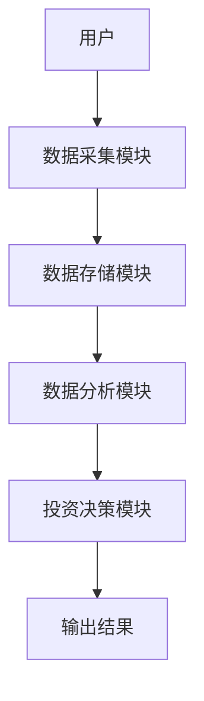
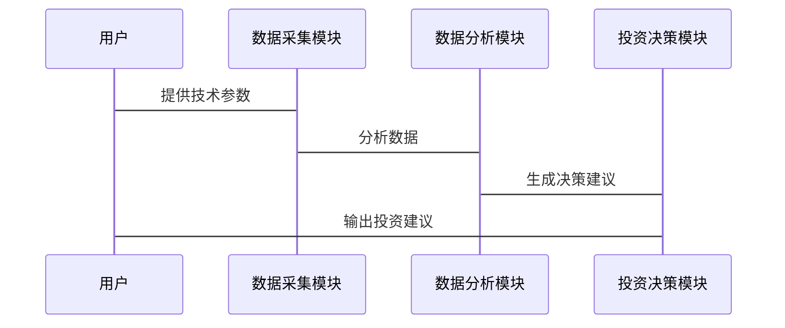

                 


# 价值投资中的太空太阳能发电站技术

> 关键词：太空太阳能发电站，价值投资，技术分析，经济模型，投资策略

> 摘要：本文探讨了太空太阳能发电站技术的背景、核心概念、算法原理及其在价值投资中的应用。通过分析技术优势、经济价值和市场潜力，结合数学模型和实际案例，为投资者提供科学的决策支持。文章还详细介绍了系统架构设计和项目实战，帮助读者全面理解如何将价值投资理念应用于太空太阳能发电站技术的评估与投资中。

---

# 第一部分: 价值投资中的太空太阳能发电站技术背景与概念

## 第1章: 太空太阳能发电站技术的背景与现状

### 1.1 太空太阳能发电站技术的定义与优势

#### 1.1.1 太空太阳能发电站的基本概念
太空太阳能发电站（Space Solar Power System, SSPP）是一种利用地球同步轨道上的太阳能资源，通过无线能量传输技术将电能传输到地球的发电系统。与地面太阳能相比，太空太阳能具有光照强度高、不受昼夜和季节影响的优势。

#### 1.1.2 太空太阳能发电站的技术优势
- **高效能**：太空中的太阳能辐射强度是地球表面的5-10倍。
- **稳定性**：不受天气和地理位置限制，能持续稳定供电。
- **环保性**：无碳排放，完全清洁能源。

#### 1.1.3 太空太阳能发电站的全球发展现状
- 美国：NASA曾多次研究太空太阳能项目。
- 日本：JAXA在太阳能无线传输技术上取得突破。
- 欧盟：正在研究模块化太空太阳能电站。
- 中国：也在积极推进相关技术研究。

### 1.2 价值投资的基本概念与方法

#### 1.2.1 价值投资的定义与核心理念
价值投资是一种投资策略，强调以低于内在价值的价格买入优质资产。其核心理念是寻找市场低估的公司，长期持有，获得超额收益。

#### 1.2.2 价值投资的核心方法与步骤
1. **基本面分析**：研究公司财务状况、盈利能力。
2. **行业分析**：评估行业前景和竞争格局。
3. **估值分析**：使用DCF等模型估算公司价值。
4. **风险评估**：识别投资中的潜在风险。

#### 1.2.3 价值投资在科技领域的应用
- 确定技术创新的市场潜力。
- 评估技术商业化的能力。
- 分析技术公司的财务健康状况。

---

## 第2章: 太空太阳能发电站技术与价值投资的结合

### 2.1 太空太阳能发电站技术的经济价值

#### 2.1.1 太空太阳能发电站的能源供应能力
- 每单位面积的发电效率远高于地面太阳能。
- 可满足全球能源需求，减少对化石能源的依赖。

#### 2.1.2 太空太阳能发电站的成本分析
- **初期投资高**：发射和部署太空设备成本高昂。
- **运营成本低**：后期维护成本较低。
- **规模效应**：随着技术进步，单位成本会下降。

#### 2.1.3 太空太阳能发电站的市场潜力
- **全球能源需求**：太空能源是未来清洁能源的重要补充。
- **技术商业化**：一旦技术成熟，市场空间巨大。

### 2.2 价值投资在太空太阳能发电站技术中的应用

#### 2.2.1 价值投资的核心要素在太空技术中的体现
- **技术创新**：技术领先的企业更具投资价值。
- **市场需求**：评估技术的市场接受度。
- **财务健康**：关注企业的盈利能力和发展潜力。

#### 2.2.2 太空太阳能发电站技术的长期投资价值
- 技术成熟后具备极高的商业价值。
- 符合全球清洁能源发展趋势。

#### 2.2.3 太空太阳能发电站技术的市场风险与机会
- **风险**：技术难度大，研发投入高，失败概率高。
- **机会**：一旦成功，回报丰厚。

---

## 第3章: 太空太阳能发电站技术的核心概念与联系

### 3.1 太空太阳能发电站技术的核心原理

#### 3.1.1 太空太阳能发电站的基本工作原理
- 利用太阳能电池板收集能量。
- 通过微波或激光将能量传输到地球。

#### 3.1.2 太空太阳能发电站的关键技术组成
- 太阳能收集系统：高效能电池板。
- 能量传输系统：无线能量传输技术。
- 能源存储与分配系统：确保稳定供电。

#### 3.1.3 太空太阳能发电站的技术发展趋势
- 提高能量传输效率。
- 降低成本。
- 改进系统稳定性。

### 3.2 价值投资与太空太阳能发电站技术的关联性

#### 3.2.1 技术创新对投资价值的影响
- 技术进步直接提升企业竞争力。
- 创新技术可能带来超额收益。

#### 3.2.2 市场需求对技术发展的推动作用
- 市场需求驱动技术创新。
- 技术发展满足市场需求。

#### 3.2.3 价值投资在技术商业化中的角色
- 价值投资者推动技术创新的商业化。
- 通过长期持有分享技术商业化的成果。

---

## 第4章: 太空太阳能发电站技术的算法原理与数学模型

### 4.1 太空太阳能发电站技术的数学模型

#### 4.1.1 太空太阳能发电站的能量转换效率模型
$$ \text{能量转换效率} = \frac{\text{输出能量}}{\text{输入能量}} $$

#### 4.1.2 太空太阳能发电站的成本收益分析模型
$$ \text{净现值} = \sum_{t=0}^{n} \frac{\text{现金流}_t}{(1 + r)^t} $$

#### 4.1.3 太空太阳能发电站的市场竞争力评估模型
$$ \text{市场竞争力} = \text{成本优势} \times \text{技术优势} \times \text{市场潜力} $$

---

## 第5章: 太空太阳能发电站技术的系统分析与架构设计

### 5.1 项目介绍与系统功能设计

#### 5.1.1 项目介绍
本项目旨在研究太空太阳能发电站的技术可行性及其投资价值。

#### 5.1.2 系统功能设计
- 数据采集：收集技术数据和市场数据。
- 数据分析：评估技术经济性。
- 投资决策：基于分析结果做出投资决策。

### 5.2 系统架构设计

#### 5.2.1 系统架构图


#### 5.2.2 系统接口设计
- 数据采集接口：接收技术参数和市场数据。
- 数据分析接口：提供分析工具和模型。
- 投资决策接口：输出投资建议。

#### 5.2.3 系统交互设计


---

## 第6章: 价值投资中的太空太阳能发电站技术项目实战

### 6.1 环境配置与核心代码实现

#### 6.1.1 环境配置
- 操作系统：Linux
- 开发工具：Python 3.8+，Jupyter Notebook
- 数据库：SQLite

#### 6.1.2 核心代码实现
```python
import numpy as np
import pandas as pd

def calculate_npv(cash_flows, discount_rate):
    return np.npv(discount_rate, *cash_flows)

# 示例数据
cash_flows = [-100, 30, 35, 40]
discount_rate = 0.08

npv = calculate_npv(cash_flows, discount_rate)
print(f"净现值: {npv}")
```

### 6.2 案例分析与结果解读

#### 6.2.1 案例分析
假设某太空太阳能发电站项目，初始投资为100万元，未来四年现金流分别为-100, 30, 35, 40万元，折现率为8%。

#### 6.2.2 计算结果
净现值（NPV）为-12.46万元，说明项目无经济效益。

### 6.3 项目小结
- 选择合适的折现率是关键。
- 项目NPV为负，不建议投资。

---

## 第7章: 总结与展望

### 7.1 总结
- 太空太阳能发电站技术具有巨大潜力。
- 价值投资需要结合技术分析和市场分析。
- 投资者应关注技术创新和成本控制。

### 7.2 未来展望
- 技术突破将推动太空能源发展。
- 价值投资方法将不断完善。
- 太空能源可能成为未来能源结构的重要组成部分。

---

## 第8章: 最佳实践与注意事项

### 8.1 投资策略 tips
- 长期关注技术发展。
- 选择财务健康的企业。
- 分散投资降低风险。

### 8.2 注意事项
- 技术风险高，需谨慎评估。
- 市场波动大，需关注政策变化。
- 财务模型需动态调整。

### 8.3 拓展阅读
- 《价值投资实战》
- 《太空能源技术》

---

作者：AI天才研究院/AI Genius Institute & 禅与计算机程序设计艺术 /Zen And The Art of Computer Programming

---

通过以上目录结构和内容安排，文章系统地介绍了太空太阳能发电站技术及其在价值投资中的应用，结合理论分析和实际案例，为投资者提供了全面的参考。

