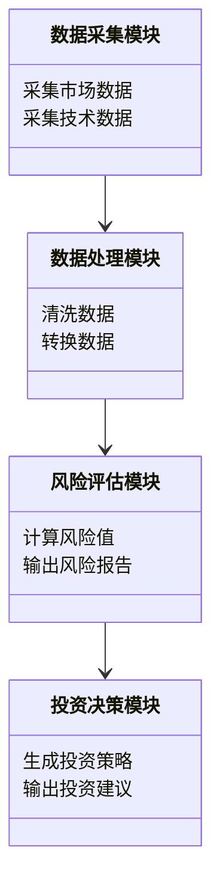
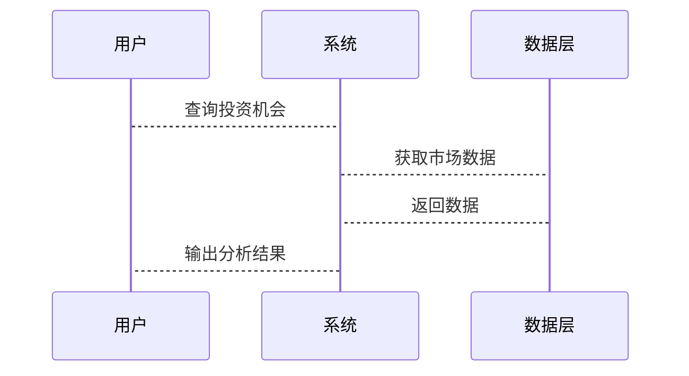

                 


# 价值投资中的太空旅游基础设施分析

**关键词：价值投资、太空旅游、基础设施分析、投资策略、风险评估、数学模型**

**摘要：**  
本文将探讨如何在价值投资的框架下，分析太空旅游基础设施的潜力和投资机会。通过系统地分析太空旅游基础设施的核心要素，包括发射平台、空间站、卫星互联网等，本文将结合定量和定性分析方法，建立数学模型，评估项目风险，并提出投资策略。最终，本文将为投资者提供一份详尽的分析框架和实战指南，帮助他们在太空旅游基础设施领域做出明智的投资决策。

---

# 第一章: 背景介绍

## 1.1 太空旅游的发展现状

### 1.1.1 太空旅游的历史演变

太空旅游从20世纪50年代开始萌芽，经历了从政府主导到商业化的转变。近年来，SpaceX、Blue Origin和 Virgin Galactic 等公司推动了商业太空旅行的发展，使其从科幻小说走向现实。

### 1.1.2 当前太空旅游的主要参与者

- **SpaceX**：美国公司，以低成本火箭发射和可重复使用的航天器著称。
- **Blue Origin**：由Jeff Bezos创立，专注于亚轨道太空旅行。
- **Virgin Galactic**：理查德·布兰森的公司，致力于将普通人送入太空。
- **Rocket Lab**：专注于小型卫星发射。
- **中国航天科技集团**：中国的主导力量，在卫星发射和太空探索方面具有重要地位。

### 1.1.3 太空旅游的市场规模与增长潜力

市场规模预计在2030年达到数万亿美元，主要驱动因素包括技术进步、政策支持和市场需求的增长。

---

## 1.2 价值投资的基本概念

### 1.2.1 价值投资的定义与核心理念

价值投资是一种投资策略，强调购买低于内在价值的资产。核心理念是寻找市场低估的公司，长期持有，等待其价值回归。

### 1.2.2 价值投资在不同领域的应用

- **传统行业**：如制造业、能源等。
- **科技行业**：如半导体、人工智能等。
- **新兴行业**：如太空旅游、区块链等。

### 1.2.3 太空旅游与价值投资的结合点

太空旅游行业的高增长潜力与当前市场的低估状态为价值投资提供了机会。

---

## 1.3 太空旅游基础设施的定义与外延

### 1.3.1 太空旅游基础设施的定义

太空旅游基础设施指支持太空旅行所需的硬件和系统，包括发射平台、空间站、卫星互联网、地面支持系统等。

### 1.3.2 基础设施的核心要素与组成

- **发射平台**：火箭发射的起点。
- **空间站**：提供居住和实验支持的平台。
- **卫星互联网**：为地球提供通信和网络服务。
- **地面支持系统**：提供地面技术支持和数据处理。

### 1.3.3 基础设施的边界与外延

太空旅游基础设施的外延包括与之相关的技术、法规、政策和市场。

---

# 第二章: 太空旅游基础设施的核心概念与联系

## 2.1 核心概念原理

### 2.1.1 太空旅游基础设施的主要组成部分

- **发射平台**：发射火箭和航天器的设施。
- **空间站**：在轨运行的平台，供宇航员生活和工作。
- **卫星互联网**：提供全球互联网服务的卫星网络。
- **地面支持系统**：地面基站和技术支持。

### 2.1.2 各组成部分的相互关系与协同作用

发射平台提供发射服务，空间站提供驻留支持，卫星互联网提供通信支持，地面支持系统提供技术保障。

---

## 2.2 核心概念属性特征对比表

| 特性 | 发射平台 | 空间站 | 卫星互联网 | 地面支持系统 |
|------|----------|--------|------------|--------------|
| 功能 | 发射航天器 | 提供驻留与实验支持 | 提供通信与导航服务 | 提供地面技术支持与数据处理 |
| 技术要求 | 高可靠性与安全性 | 长寿命与可维护性 | 高覆盖率与低延迟 | 高可用性与实时性 |
| 投资成本 | 高 | 极高 | 中等偏高 | 中等 |

---

## 2.3 ER实体关系图

```mermaid
erDiagram
    actor 投资者 {
        <属性> 投资金额
        <属性> 投资目标
    }
    actor 用户 {
        <属性> 用户需求
        <属性> 用户反馈
    }
    entity 基础设施 {
        <属性> 基础设施类型
        <属性> 基础设施状态
    }
    entity 项目 {
        <属性> 项目名称
        <属性> 项目阶段
    }
    investor -> 基础设施 : 投资
    user -> 基础设施 : 使用
    investor -> 项目 : 投资
    user -> 项目 : 反馈
```

---

# 第三章: 数学模型与分析方法

## 3.1 现金流模型

### 3.1.1 现金流模型的定义与作用

现金流模型用于预测未来现金流，评估项目的可行性和投资回报。

### 3.1.2 现金流模型的数学表达

$$\text{现金流} = \text{收入} - \text{成本}$$

### 3.1.3 现金流模型的应用步骤

1. 确定初始投资。
2. 估计未来现金流。
3. 计算净现值（NPV）。
4. 评估投资可行性。

---

## 3.2 风险评估模型

### 3.2.1 风险评估模型的定义与作用

风险评估模型用于识别和量化投资风险。

### 3.2.2 风险评估模型的数学表达

$$\text{风险} = \text{概率} \times \text{影响}$$

---

## 3.3 投资组合优化模型

### 3.3.1 投资组合优化模型的定义与作用

通过优化投资组合，降低风险，提高收益。

### 3.3.2 投资组合优化模型的数学表达

$$\text{收益} = \sum w_i \times r_i$$

其中，\(w_i\) 是投资比例，\(r_i\) 是资产的收益率。

---

## 3.4 价值评估模型

### 3.4.1 价值评估模型的定义与作用

用于评估公司或项目的内在价值。

### 3.4.2 价值评估模型的数学表达

$$\text{内在价值} = \sum \frac{\text{现金流}}{(1 + r)^t}$$

其中，\(r\) 是折现率，\(t\) 是时间。

---

# 第四章: 系统分析与架构设计方案

## 4.1 问题场景介绍

太空旅游基础设施的复杂性要求系统化的分析方法。

## 4.2 项目介绍

### 4.2.1 项目目标

分析太空旅游基础设施的投资价值。

### 4.2.2 项目范围

涵盖发射平台、空间站、卫星互联网和地面支持系统。

---

## 4.3 系统功能设计

### 4.3.1 功能模块

- 数据采集模块。
- 数据处理模块。
- 风险评估模块。
- 投资决策模块。

### 4.3.2 领域模型



---

## 4.4 系统架构设计

### 4.4.1 架构选择

采用分层架构，包括数据层、业务逻辑层和用户界面层。

### 4.4.2 架构图


---

## 4.5 系统接口设计

### 4.5.1 接口定义

- 数据接口：与市场数据源对接。
- 用户接口：供投资者查询和分析。

---

## 4.6 系统交互设计

### 4.6.1 交互流程

1. 用户输入查询条件。
2. 系统处理请求。
3. 系统返回结果。



---

# 第五章: 项目实战

## 5.1 环境安装

### 5.1.1 安装Python

安装Python 3.x版本，确保环境配置正确。

### 5.1.2 安装依赖

安装所需的库，如numpy、pandas、scipy。

---

## 5.2 核心代码实现

### 5.2.1 现金流模型代码

```python
import numpy as np
import pandas as pd

def calculate_npv(cash_flows, discount_rate):
    return np.npv(discount_rate, *cash_flows)

# 示例数据
cash_flows = [-100, 50, 60, 70]
discount_rate = 0.10

npv = calculate_npv(cash_flows, discount_rate)
print(f"净现值：{npv}")
```

### 5.2.2 风险评估模型代码

```python
def calculate-risk(probability, impact):
    return probability * impact

risk = calculate-risk(0.2, 0.8)
print(f"风险值：{risk}")
```

---

## 5.3 案例分析与解读

### 5.3.1 案例分析

分析SpaceX的投资价值。

### 5.3.2 代码应用解读

解释代码实现的逻辑和应用场景。

---

## 5.4 项目小结

总结项目实施的关键步骤和成果。

---

# 第六章: 最佳实践与小结

## 6.1 投资策略

### 6.1.1 风险管理

分散投资，降低风险。

### 6.1.2 长期趋势

关注技术进步和市场需求。

---

## 6.2 注意事项

### 6.2.1 数据质量

确保数据的准确性和完整性。

### 6.2.2 模型假设

合理假设，避免偏差。

---

## 6.3 拓展阅读

推荐相关书籍和资源。

---

# 作者

**作者：AI天才研究院/AI Genius Institute & 禅与计算机程序设计艺术 /Zen And The Art of Computer Programming**

---

以上是《价值投资中的太空旅游基础设施分析》的完整目录大纲和文章内容。

