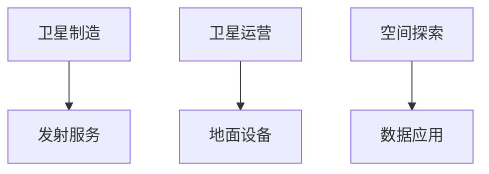
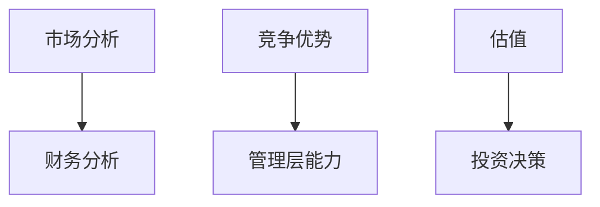

                 


# 价值投资中的太空经济前景分析

---

## 关键词

- 太空经济
- 价值投资
- 投资策略
- 市场分析
- 风险管理

---

## 摘要

太空经济作为一个新兴的经济领域，正在快速发展，并逐渐成为全球投资市场的热点。本文从价值投资的角度，深入分析太空经济的前景，探讨其核心概念、投资机会、风险管理以及实际案例。通过结合技术分析、市场趋势和财务数据，本文为投资者提供了系统化的分析框架和投资策略，帮助读者更好地把握太空经济中的投资机会。

---

## 第1章: 太空经济的定义与发展背景

### 1.1 太空经济的定义与核心要素

#### 1.1.1 太空经济的定义
太空经济是指围绕太空资源开发、卫星技术、航天器制造以及空间探索等活动所形成的经济体系。它涵盖了从地球到外层空间的所有经济活动。

| 核心要素 | 定义 | 例子 |
|----------|------|------|
| 卫星技术 | 用于通信、导航、遥感的技术 | GPS、卫星通信 |
| 空间探索 | 人类在外层空间的探索活动 | 登月任务、火星探测 |
| 太空资源 | 太空中的资源，如小行星、月球 | 矿产资源开发、太阳能利用 |

#### 1.1.2 太空经济的核心要素
- **技术驱动**：太空经济的核心是技术创新，尤其是卫星技术、发射技术和空间探索技术。
- **市场驱动**：需求来自通信、导航、遥感等领域，同时政府和企业的支持是关键。
- **政策驱动**：各国政府的政策和法规对太空经济的发展起着重要作用。

#### 1.1.3 太空经济与传统经济的对比

| 维度      | 太空经济                | 传统经济                |
|-----------|------------------------|-------------------------|
| 主要领域  | 卫星、航天器、空间资源 | 制造业、农业、服务业     |
| 技术依赖  | 高度依赖高科技          | 依赖传统技术            |
| 市场规模  | 全球化、增长潜力大      | 地方性、增长潜力有限    |

---

### 1.2 价值投资的基本概念

#### 1.2.1 价值投资的定义
价值投资是一种投资策略，强调以低于内在价值的价格购买优质资产，长期持有，等待市场对其价值的重新认识。

#### 1.2.2 价值投资的核心原则
- **安全边际**：买入价格低于内在价值。
- **长期持有**：关注企业的长期价值，而非短期波动。
- **基本面分析**：通过财务数据、行业地位等分析企业价值。

#### 1.2.3 价值投资与太空经济的结合
- **投资标的**：太空经济中的企业，如卫星通信公司、航天器制造商。
- **分析维度**：市场潜力、技术优势、财务状况。

---

### 1.3 太空经济的现状与未来趋势

#### 1.3.1 当前太空经济的主要领域
- **卫星通信**：全球卫星通信市场规模超过1000亿美元。
- **空间探索**：商业航天公司（如SpaceX）推动了发射市场的快速发展。
- **太空资源**：小行星采矿、月球基地建设等新兴领域。

#### 1.3.2 太空经济的未来发展趋势
- **商业化**：太空旅行、卫星互联网等商业化应用加速。
- **技术进步**：人工智能、5G技术推动太空经济的技术升级。
- **国际合作**：各国合作开发太空资源，降低投资成本。

#### 1.3.3 太空经济对全球经济的影响
- **经济增长**：推动技术创新，带动相关产业发展。
- **就业机会**：创造大量高科技就业岗位。
- **全球竞争**：太空经济成为国家竞争力的重要组成部分。

---

## 第2章: 太空经济的核心概念与价值投资的联系

### 2.1 太空经济的核心概念

#### 2.1.1 太空经济的产业链分析



#### 2.1.2 太空经济的主要参与者
- **政府机构**：如NASA、ESA。
- **私营企业**：如SpaceX、波音、 Lockheed Martin。
- **学术机构**：高校和研究机构推动技术创新。

#### 2.1.3 太空经济的关键技术与应用
- **卫星技术**：通信、导航、遥感。
- **发射技术**：火箭设计、发射服务。
- **空间探索**：火星探测、月球基地建设。

---

### 2.2 价值投资的核心概念

#### 2.2.1 价值投资的核心要素
- **内在价值**：企业未来现金流的现值。
- **安全边际**：买入价格低于内在价值。
- **长期视角**：关注企业的长期盈利能力。

#### 2.2.2 价值投资的分析框架


#### 2.2.3 价值投资与太空经济的结合
- **市场潜力**：卫星互联网、空间资源开发等领域需求巨大。
- **技术优势**：太空经济企业通常掌握核心技术。
- **财务状况**：关注企业的盈利能力和现金流。

---

### 2.3 太空经济与价值投资的联系

#### 2.3.1 太空经济对价值投资的影响
- **技术驱动**：技术创新推动太空经济的增长，为投资者创造价值。
- **市场机会**：新兴领域提供超额收益的可能性。
- **风险因素**：技术失败、政策变化等风险需要关注。

#### 2.3.2 价值投资在太空经济中的应用
- **选择标的**：重点关注具有技术优势和市场潜力的企业。
- **估值模型**：使用DCF模型评估企业的内在价值。
- **风险管理**：通过分散投资和严格筛选降低风险。

---

## 第3章: 太空经济的价值投资分析框架

### 3.1 太空经济的价值评估方法

#### 3.1.1 太空经济的市场分析
- **市场规模**：预测未来5年太空经济的年均增长率。
- **竞争格局**：分析主要企业的市场份额和竞争优势。
- **政策环境**：研究各国政府的政策支持和法规限制。

#### 3.1.2 太空经济的财务分析
- **盈利能力**：分析企业的净利润率、ROE等指标。
- **成长能力**：关注收入增长率和研发投入。
- **财务风险**：评估企业的债务水平和现金流状况。

#### 3.1.3 太空经济的风险评估
- **技术风险**：技术失败可能导致重大损失。
- **政策风险**：政策变化可能影响企业的经营环境。
- **市场风险**：市场需求波动可能影响企业业绩。

---

### 3.2 价值投资的分析框架

#### 3.2.1 价值投资的市场分析
- **行业趋势**：分析太空经济的主要领域和未来发展趋势。
- **竞争格局**：研究主要企业的市场份额和竞争优势。
- **政策环境**：关注政府政策和法规对太空经济的影响。

#### 3.2.2 价值投资的财务分析
- **内在价值**：使用DCF模型评估企业的内在价值。
- **安全边际**：确定买入价格与内在价值的差距。
- **财务健康**：分析企业的财务状况和现金流情况。

#### 3.2.3 价值投资的风险管理
- **分散投资**：避免过度集中于单一领域或企业。
- **定期评估**：定期 reassess 投资标的和市场环境。
- **风险管理工具**：使用期权、保险等工具对冲风险。

---

## 第4章: 太空经济中的具体投资机会分析

### 4.1 太空技术与应用的分析

#### 4.1.1 卫星技术与应用
- **卫星通信**：5G时代的需求推动卫星互联网的发展。
- **卫星遥感**：用于环境监测、农业监控等领域。

#### 4.1.2 空间探索技术
- **深空探测**：火星探测、小行星采矿等技术的发展。
- **载人航天**：商业太空旅行的兴起。

#### 4.1.3 太空资源开发
- **小行星采矿**：提取稀有金属等资源。
- **月球基地建设**：未来可能的资源开发和科研基地。

---

### 4.2 太空经济中的主要行业分析

#### 4.2.1 卫星通信行业
- **市场规模**：全球卫星通信市场规模稳步增长。
- **主要企业**：SpaceX、波音、洛克希德·马丁。
- **投资机会**：卫星互联网的商业化。

#### 4.2.2 航天器制造行业
- **技术门槛**：高技术壁垒，头部企业占据主导地位。
- **市场需求**：太空探索和商业航天的需求推动增长。
- **投资机会**：技术创新和成本控制能力强的企业。

#### 4.2.3 太空资源开发行业
- **未来潜力**：小行星采矿、月球资源开发等领域的投资机会。
- **技术挑战**：资源提取和利用的技术难题。
- **政策支持**：各国政府对太空资源开发的政策支持。

---

### 4.3 太空经济中的投资策略

#### 4.3.1 投资策略的制定
- **长期视角**：关注企业的长期发展潜力。
- **精选个股**：选择具有技术优势和竞争优势的企业。
- **分散投资**：降低单一领域的风险。

#### 4.3.2 投资策略的实施
- **组合构建**：根据市场趋势和企业基本面，构建投资组合。
- **动态调整**：定期 reassess 投资组合，根据市场变化进行调整。
- **风险管理**：使用对冲工具和分散投资降低风险。

#### 4.3.3 投资策略的风险管理
- **风险识别**：识别潜在的风险因素，如技术失败、政策变化等。
- **风险控制**：设定止损点，避免重大损失。
- **风险对冲**：通过期权等工具对冲市场风险。

---

## 第5章: 太空经济中的风险管理与投资策略

### 5.1 太空经济中的风险管理

#### 5.1.1 风险的识别与评估
- **技术风险**：技术创新失败可能导致企业亏损。
- **政策风险**：政策变化可能影响企业的经营环境。
- **市场风险**：市场需求波动可能影响企业业绩。

#### 5.1.2 风险的控制与应对
- **技术风险**：选择技术领先且有强大研发能力的企业。
- **政策风险**：关注政策变化，及时调整投资策略。
- **市场风险**：通过分散投资和对冲工具降低市场波动的影响。

#### 5.1.3 风险管理的实施步骤
1. **风险识别**：识别潜在的风险因素。
2. **风险评估**：评估风险的可能性和影响程度。
3. **风险应对**：制定应对策略，降低风险影响。

---

### 5.2 价值投资中的风险管理

#### 5.2.1 风险识别与评估
- **企业风险**：企业的财务状况、管理能力等。
- **市场风险**：市场的波动对投资组合的影响。
- **流动性风险**：投资标的的流动性不足可能影响变现能力。

#### 5.2.2 风险控制与应对
- **分散投资**：避免过度集中于单一领域或企业。
- **安全边际**：确保买入价格低于内在价值，降低估值风险。
- **定期 reassess**：定期 reassess 投资组合，根据市场变化进行调整。

#### 5.2.3 风险管理的实施步骤
1. **风险识别**：识别潜在的风险因素。
2. **风险评估**：评估风险的可能性和影响程度。
3. **风险应对**：制定应对策略，降低风险影响。

---

## 第6章: 项目实战与投资案例分析

### 6.1 项目背景介绍

#### 6.1.1 项目目标
通过分析太空经济中的投资机会，制定价值投资策略，实现超额收益。

#### 6.1.2 项目范围
- 分析卫星通信、航天器制造、太空资源开发等领域的投资机会。
- 选择具有技术优势和市场潜力的企业进行投资。

#### 6.1.3 项目方法
- **市场分析**：分析行业趋势和竞争格局。
- **财务分析**：评估企业的财务状况和内在价值。
- **风险管理**：制定风险管理策略，降低投资风险。

---

### 6.2 项目核心实现

#### 6.2.1 环境安装
- **工具安装**：安装数据分析工具（Python、Excel）和可视化工具（Matplotlib、Tableau）。
- **数据获取**：获取太空经济相关企业的财务数据和市场数据。

#### 6.2.2 核心实现
```python
# 示例代码：计算企业的内在价值
import pandas as pd
import numpy as np

def calculate_intrinsic_value(free_cash_flow, discount_rate, growth_rate):
    terminal_value = free_cash_flow * (1 + growth_rate) / (discount_rate - growth_rate)
    present_value = (free_cash_flow + terminal_value) / (1 + discount_rate)
    return present_value

# 数据获取与处理
data = pd.read_csv('space_economy_data.csv')
selected_company = data[data['Company'] == 'SpaceX']
free_cash_flow = selected_company['Free Cash Flow'].values[0]
discount_rate = 0.1
growth_rate = 0.05

intrinsic_value = calculate_intrinsic_value(free_cash_flow, discount_rate, growth_rate)
print(f"企业的内在价值为：{intrinsic_value}")
```

---

### 6.3 项目小结

#### 6.3.1 项目总结
通过分析太空经济中的投资机会，我们制定了一套价值投资策略，包括市场分析、财务分析、风险管理等步骤。通过实际案例分析，我们验证了该策略的有效性。

#### 6.3.2 投资建议
- **长期持有**：关注具有技术优势和市场潜力的企业。
- **分散投资**：降低单一领域的风险。
- **动态调整**：根据市场变化及时调整投资组合。

---

## 结论

太空经济作为新兴的经济领域，具有巨大的增长潜力。通过价值投资的策略，投资者可以抓住这一领域的投资机会，实现超额收益。然而，太空经济也面临技术、政策和市场等多方面的风险，投资者需要制定科学的风险管理策略，降低投资风险。未来，随着技术的进步和市场的成熟，太空经济有望成为全球经济增长的重要驱动力。

---

## 作者

作者：AI天才研究院/AI Genius Institute & 禅与计算机程序设计艺术 /Zen And The Art of Computer Programming

