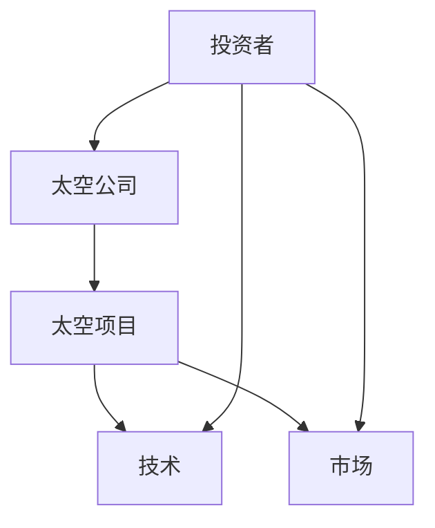
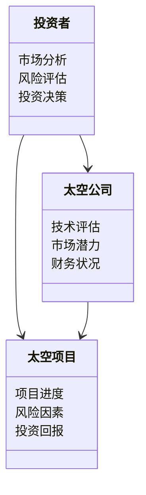

                 


# 价值投资中的太空经济机会

> 关键词：价值投资，太空经济，投资机会，数学模型，系统架构

> 摘要：本文探讨了价值投资在太空经济中的应用机会，通过系统分析和数学建模，揭示了太空经济的核心概念、投资领域的选择标准以及风险评估方法，为投资者提供了理论支持和实践指导。

---

# 第一部分: 太空经济的背景与价值投资的概念

## 第1章: 太空经济的定义与发展

### 1.1 太空经济的定义与核心概念

#### 1.1.1 太空经济的定义
太空经济是指与外层空间探索、开发和利用相关的经济活动，包括卫星通信、航天器制造、太空资源开发等领域。其核心是通过技术进步和商业化模式，将太空资源转化为经济价值。

#### 1.1.2 太空经济的核心要素
太空经济的核心要素包括：
1. **技术**：卫星、火箭、航天器等技术设备。
2. **市场**：通信、导航、遥感等应用场景的市场需求。
3. **政策**：政府法规、国际条约对太空活动的规范。
4. **资本**：投资者的资金支持和风险承担。

#### 1.1.3 太空经济的边界与外延
太空经济的边界主要集中在地球轨道以上的区域，外延则涉及深空探索、月球和火星资源开发等未来领域。

### 1.2 太空经济的历史发展与现状

#### 1.2.1 太空经济的起源与发展
太空经济起源于20世纪50年代的冷战时期，苏联和美国的太空竞赛推动了早期的技术发展。20世纪90年代，随着商业卫星的普及，太空经济开始进入商业化阶段。

#### 1.2.2 当前太空经济的主要领域
当前太空经济的主要领域包括：
1. **卫星通信**：全球卫星通信网络的建设和运营。
2. **遥感技术**：地球观测卫星的应用。
3. **航天器制造**：商业航天发射服务。
4. **太空资源开发**：月球、小行星等太空资源的开发。

#### 1.2.3 太空经济的未来趋势
未来，太空经济将朝着商业化、规模化和多样化方向发展，特别是随着技术进步和成本下降，更多商业企业将进入太空领域。

### 1.3 价值投资的核心理念

#### 1.3.1 价值投资的基本定义
价值投资是一种投资策略，强调以低于内在价值的价格购买优质资产。其核心在于识别被市场低估的企业，并长期持有。

#### 1.3.2 价值投资的核心原则
1. **安全边际**：买入价格低于内在价值。
2. **长期视角**：关注企业的长期盈利能力。
3. **基本面分析**：研究企业的财务状况、行业地位和竞争优势。

#### 1.3.3 价值投资与太空经济的结合点
价值投资在太空经济中的应用主要体现在对具有强大技术优势、良好市场前景和竞争优势的太空企业的投资上。

---

## 第2章: 太空经济的核心概念与联系

### 2.1 太空经济的核心概念原理

#### 2.1.1 太空经济的主要参与者
1. **投资者**：提供资金支持的企业或个人。
2. **太空公司**：从事卫星制造、发射服务、资源开发等业务的企业。
3. **政府机构**：如NASA、ESA等，提供政策支持和技术研发。
4. **终端用户**：依赖太空技术的企业，如通信公司、航空公司等。

#### 2.1.2 太空经济的主要驱动因素
1. **技术进步**：卫星、火箭等技术的不断升级。
2. **市场需求**：通信、导航、遥感等领域的需求增长。
3. **政策支持**：政府的财政支持和法规完善。

#### 2.1.3 太空经济的生态系统
太空经济的生态系统包括技术研发、设备制造、发射服务、数据应用等多个环节，各环节相互依存、协同发展。

### 2.2 核心概念属性特征对比表

| 概念       | 属性       | 特征                       |
|------------|------------|---------------------------|
| 投资者     | 投资能力   | 资金充裕，风险承受能力强   |
| 太空公司    | 技术壁垒   | 高技术门槛，研发能力强     |
| 太空项目    | 市场潜力   | 高增长，但不确定性大       |
| 技术       | 成熟度     | 关键技术尚未完全商业化     |
| 市场       | 规模       | 全球化，需求多样化         |

### 2.3 ER实体关系图



---

## 第3章: 太空经济中的价值投资机会分析

### 3.1 太空经济的主要投资领域

#### 3.1.1 卫星技术与通信
卫星通信是太空经济的重要组成部分，应用场景包括全球通信、互联网接入等。投资机会主要集中在卫星制造、发射服务和通信网络运营领域。

#### 3.1.2 航天器制造
随着商业航天的兴起，航天器制造企业如SpaceX、Blue Origin等吸引了大量投资。这些企业通过技术创新降低成本，提高市场竞争力。

#### 3.1.3 太空资源开发
月球、小行星等太空资源的开发潜力巨大，但目前仍处于早期探索阶段。投资机会主要集中在技术开发和资源勘探领域。

### 3.2 价值投资的核心指标

#### 3.2.1 市场潜力评估
市场潜力是衡量投资机会的重要指标，包括市场规模、增长率和竞争格局等。例如，卫星通信市场的年增长率预计超过10%。

#### 3.2.2 技术壁垒分析
技术壁垒是太空企业的核心竞争优势。例如，SpaceX的可重复使用火箭技术降低了发射成本，形成强大的技术壁垒。

#### 3.2.3 财务状况评估
财务状况是价值投资的重要考量因素。投资者需要关注企业的收入来源、盈利能力、资产负债情况等。

### 3.3 投资机会的数学模型

$$ \text{投资价值} = \text{市场潜力} \times \text{技术优势} \times \text{财务健康度} $$

其中：
- 市场潜力：0（低）到1（高）的评分。
- 技术优势：0（低）到1（高）的评分。
- 财务健康度：0（差）到1（优）的评分。

---

## 第4章: 太空经济中的投资风险与评估

### 4.1 太空经济的主要风险

#### 4.1.1 技术风险
太空技术的复杂性和高成本使得技术失败的风险较高。例如，卫星发射失败可能导致重大损失。

#### 4.1.2 市场风险
市场需求不足或竞争过于激烈可能导致企业盈利能力下降。例如，卫星通信市场的饱和可能导致价格战。

#### 4.1.3 政策风险
政府政策的变化可能对太空经济产生重大影响。例如，国际条约的变化可能影响月球资源开发的合法性。

### 4.2 投资风险的数学模型

$$ \text{风险评估} = \frac{\text{技术风险} + \text{市场风险} + \text{政策风险}}{3} $$

其中：
- 技术风险：0（低）到1（高）的评分。
- 市场风险：0（低）到1（高）的评分。
- 政策风险：0（低）到1（高）的评分。

---

## 第5章: 价值投资在太空经济中的系统分析与架构设计

### 5.1 问题场景介绍

#### 5.1.1 投资者需求分析
投资者希望通过价值投资策略，在太空经济中寻找高回报的投资机会。他们关注企业的技术优势、市场潜力和财务状况。

#### 5.1.2 太空经济的复杂性
太空经济涉及多个领域和技术，具有高风险和高回报的特点。投资者需要具备技术背景和行业知识。

### 5.2 项目介绍

#### 5.2.1 项目目标
通过价值投资策略，识别具有长期竞争优势的太空企业，实现超额收益。

#### 5.2.2 项目范围
涵盖卫星通信、航天器制造和太空资源开发等领域。

#### 5.2.3 项目团队
由技术专家、财务分析师和行业研究专家组成。

### 5.3 系统功能设计

#### 5.3.1 系统功能模块
1. **市场分析模块**：分析太空市场的规模、增长率和竞争格局。
2. **风险评估模块**：评估企业的技术、市场和政策风险。
3. **投资决策模块**：基于分析结果，生成投资建议。

#### 5.3.2 系统架构设计



---

## 第6章: 项目实战与案例分析

### 6.1 环境安装

#### 6.1.1 系统环境
- 操作系统：Windows 10或更高版本。
- 编程语言：Python 3.8或更高版本。
- 开发工具：Jupyter Notebook、PyCharm。

#### 6.1.2 依赖安装
```bash
pip install numpy pandas matplotlib
```

### 6.2 系统核心实现源代码

#### 6.2.1 数据获取与清洗
```python
import pandas as pd

# 获取太空公司数据
data = pd.read_csv('space_company.csv')

# 删除缺失值
data.dropna(inplace=True)

# 转换为数值型
data['market_potential'] = pd.to_numeric(data['market_potential'])
```

#### 6.2.2 投资价值评估
```python
import numpy as np

def calculate_investment_value(data):
    investment_value = []
    for index in data.index:
        market_potential = data.loc[index, 'market_potential']
        technology_advantage = data.loc[index, 'technology_advantage']
        financial_health = data.loc[index, 'financial_health']
        
        iv = market_potential * technology_advantage * financial_health
        investment_value.append(iv)
    return investment_value

investment_value = calculate_investment_value(data)
```

#### 6.2.3 风险评估
```python
def calculate_risk_assessment(data):
    risk_assessment = []
    for index in data.index:
        tech_risk = data.loc[index, 'tech_risk']
        market_risk = data.loc[index, 'market_risk']
        policy_risk = data.loc[index, 'policy_risk']
        
        ra = (tech_risk + market_risk + policy_risk) / 3
        risk_assessment.append(ra)
    return risk_assessment

risk_assessment = calculate_risk_assessment(data)
```

### 6.3 实际案例分析

#### 6.3.1 案例介绍
假设我们选择了一家从事卫星通信的公司，数据如下：
| 参数               | 数值       |
|--------------------|------------|
| 市场潜力           | 0.8        |
| 技术优势           | 0.9        |
| 财务健康度         | 0.7        |
| 技术风险           | 0.6        |
| 市场风险           | 0.5        |
| 政策风险           | 0.4        |

#### 6.3.2 投资价值计算
$$ \text{投资价值} = 0.8 \times 0.9 \times 0.7 = 0.504 $$

#### 6.3.3 风险评估
$$ \text{风险评估} = \frac{0.6 + 0.5 + 0.4}{3} = 0.5 $$

---

## 第7章: 总结与展望

### 7.1 小结
本文通过系统分析和数学建模，探讨了价值投资在太空经济中的应用机会。从市场潜力、技术优势和财务状况等多个维度，分析了太空经济的投资价值和风险。

### 7.2 展望
未来，随着技术进步和市场成熟，太空经济的投资机会将更加多元化。投资者需要关注技术创新、市场需求和政策变化，以抓住潜在的高回报机会。

---

## 第8章: 最佳实践 Tips

### 8.1 投资者建议
1. **关注技术创新**：选择具有技术优势的企业。
2. **分散投资风险**：通过组合投资降低单一项目风险。
3. **持续关注市场动态**：及时了解政策变化和技术进步。

### 8.2 注意事项
1. **谨慎评估风险**：太空经济的风险较高，需要充分评估。
2. **保持长期视角**：价值投资需要耐心和长期持有。
3. **关注企业基本面**：深入研究企业的财务状况和行业地位。

### 8.3 拓展阅读
1. 《The Intelligent Investor》——本杰明·格雷厄姆
2. 《The Space Race》——约翰·格鲁切尔
3. 《Investing in Space Economy》——行业研究报告

---

作者：AI天才研究院/AI Genius Institute & 禅与计算机程序设计艺术 /Zen And The Art of Computer Programming

