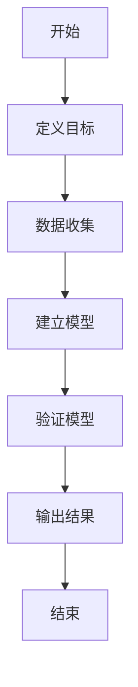

                 


# 价值投资中的太空资源利用技术前景

> **关键词**: 太空资源, 价值投资, 技术前景, 经济价值, 投资机会

> **摘要**: 本文探讨了太空资源利用技术在价值投资中的潜力和前景，分析了太空资源利用技术的核心概念、经济价值和投资机会，通过数学模型和算法原理详细讲解了如何评估太空资源利用技术的投资价值，并通过实际案例展示了如何将这些技术应用于投资决策。

---

# 第一部分: 价值投资中的太空资源利用技术背景

## 第1章: 太空资源利用技术的现状与发展趋势

### 1.1 太空资源利用技术的现状

#### 1.1.1 太空资源利用技术的定义
太空资源利用技术是指通过技术手段对地球轨道及外层空间中的资源（如小行星、月球、火星等地表物质）进行开发、提取和利用的技术。这些资源包括金属、稀有元素、水冰等，具有巨大的经济潜力。

#### 1.1.2 当前太空资源利用技术的主要领域
目前，太空资源利用技术主要集中在以下几个领域：
- **小行星采矿**: 开发小行星中的金属和稀有元素。
- **月球资源开发**: 利用月球表面的资源（如水冰、土壤）。
- **火星资源开发**: 探索火星地表下的资源。
- **卫星技术**: 提高卫星的性能和寿命，降低运营成本。

#### 1.1.3 太空资源利用技术的发展趋势
随着技术的进步和成本的降低，太空资源利用技术正朝着以下方向发展：
- **商业化**: 私营企业（如SpaceX、Blue Origin）正在推动太空资源开发的商业化。
- **国际合作**: 多国合作项目（如国际空间站）为太空资源开发提供了技术和经验支持。
- **可持续性**: 研究如何在太空资源开发中实现可持续性，避免对环境造成破坏。

### 1.2 价值投资中的太空资源利用技术背景

#### 1.2.1 价值投资的基本概念
价值投资是一种投资策略，强调以低于内在价值的价格购买优质资产。其核心在于识别被市场低估的资产，并长期持有，等待其价值回归。

#### 1.2.2 太空资源利用技术与价值投资的关系
太空资源利用技术的开发和商业化为投资者提供了新的投资领域。随着技术成熟和成本下降，太空资源开发公司可能具备较高的投资价值。

#### 1.2.3 太空资源利用技术对投资价值的影响
太空资源利用技术的商业化可能带来巨大的经济回报。例如，小行星采矿可能发现大量稀有金属，降低全球供应链的成本，从而为投资者带来丰厚的利润。

---

## 第2章: 太空资源利用技术的核心概念与联系

### 2.1 太空资源利用技术的核心概念

#### 2.1.1 太空资源的定义与分类
太空资源可以分为以下几类：
- **近地轨道资源**: 如卫星、空间站。
- **月球资源**: 如月壤、水冰。
- **小行星资源**: 如金属、稀有元素。
- **火星资源**: 如地表下的水和矿物质。

#### 2.1.2 太空资源利用技术的原理
太空资源利用技术的核心原理包括：
- **资源探测**: 使用遥感技术和机器人探测资源分布。
- **资源提取**: 通过机械臂、钻探设备等提取资源。
- **资源加工**: 在太空中对提取的资源进行初步加工，降低运输成本。

#### 2.1.3 太空资源利用技术的核心要素
- **探测技术**: 高精度传感器和数据分析。
- **提取技术**: 机械臂、钻探设备。
- **加工技术**: 现场资源处理技术。
- **运输技术**: 火箭、轨道运输系统。

### 2.2 太空资源利用技术的属性特征对比

#### 2.2.1 不同太空资源利用技术的属性对比
| 技术类型       | 投资成本 | 技术成熟度 | 经济回报 |
|----------------|----------|------------|----------|
| 小行星采矿     | 高       | 低         | 高       |
| 月球资源开发   | 中       | 中         | 中       |
| 火星资源开发   | 高       | 低         | 高       |
| 卫星技术       | 低       | 高         | 中       |

#### 2.2.2 太空资源利用技术的优缺点分析
- **优点**：
  - 小行星采矿：资源丰富，潜在回报高。
  - 卫星技术：技术成熟，市场应用广泛。
- **缺点**：
  - 小行星采矿：技术难度高，投资风险大。
  - 火星资源开发：技术不成熟，投资成本高。

#### 2.2.3 太空资源利用技术的经济价值评估
经济价值评估需要考虑以下因素：
- **资源的稀缺性**: 稀有金属的市场需求。
- **技术可行性**: 技术成熟度和成本。
- **市场潜力**: 资源的商业化应用前景。

---

## 第3章: 太空资源利用技术的经济价值与投资机会

### 3.1 太空资源利用技术的经济价值

#### 3.1.1 太空资源利用技术的直接经济价值
- **小行星采矿**: 提供稀有金属，降低供应链成本。
- **月球资源开发**: 提供水冰，支持深空探测任务。
- **卫星技术**: 提高通信、导航系统的性能。

#### 3.1.2 太空资源利用技术的间接经济价值
- **技术创新**: 推动机器人、材料科学等领域的技术进步。
- **就业机会**: 为相关行业创造大量工作岗位。
- **国家安全**: 提升国家在太空领域的竞争力。

#### 3.1.3 太空资源利用技术的长期经济潜力
随着技术的进步和成本的降低，太空资源利用技术的经济潜力将逐步释放。预计未来几十年内，小行星采矿和月球资源开发将成为重要的经济增长点。

### 3.2 太空资源利用技术的投资机会

#### 3.2.1 当前市场中的投资机会
- **卫星技术**: 低轨卫星互联网（如Starlink）的投资潜力。
- **小行星采矿**: 初创公司和风险投资的热点领域。
- **月球资源开发**: 国际合作项目中的投资机会。

#### 3.2.2 未来潜在的投资机会
- **火星资源开发**: 随着人类登陆火星能力的提升，火星资源开发将逐步商业化。
- **太空制造**: 在太空中直接利用资源进行制造，降低运输成本。

#### 3.2.3 投资者应关注的关键领域
- **技术创新**: 关注新技术的研发和应用。
- **成本控制**: 关注技术降低成本的可能性。
- **市场需求**: 关注资源的市场需求和应用前景。

---

# 第二部分: 太空资源利用技术的价值评估模型

## 第4章: 太空资源利用技术的价值评估方法

### 4.1 价值评估的基本原理

#### 4.1.1 价值评估的定义与目的
价值评估是通过分析技术的经济潜力和市场前景，确定其投资价值的过程。其目的是为投资者提供科学的决策依据。

#### 4.1.2 价值评估的基本方法
- **现金流折现法**: 通过预测未来现金流，计算净现值（NPV）。
- **相对估值法**: 通过比较同类技术的市场估值，确定技术的价值。
- **情景分析法**: 分析不同情景下的技术价值。

#### 4.1.3 价值评估的数学模型
净现值（NPV）公式：
$$ NPV = \sum_{t=1}^{n} \frac{CF_t}{(1 + r)^t} $$
其中，\( CF_t \) 是第 \( t \) 年的现金流，\( r \) 是贴现率。

### 4.2 太空资源利用技术的评估指标

#### 4.2.1 技术可行性指标
- **技术成熟度**: 技术是否经过验证。
- **技术壁垒**: 技术的专利和竞争优势。
- **技术可扩展性**: 技术是否可以大规模应用。

#### 4.2.2 经济可行性指标
- **投资成本**: 开发和运营成本。
- **回报周期**: 投资回收期。
- **盈利能力**: 投资回报率（ROI）。

#### 4.2.3 市场潜力指标
- **市场需求**: 资源的市场需求量。
- **竞争情况**: 市场的竞争程度。
- **政策支持**: 政府的政策支持和法规环境。

---

## 第5章: 太空资源利用技术的数学模型与公式

### 5.1 数学模型的建立

#### 5.1.1 技术可行性评估模型
$$ Feasibility = \frac{成功案例数}{总案例数} \times 100\% $$

#### 5.1.2 经济回报预测模型
$$ ROI = \frac{净利润}{投资成本} \times 100\% $$

#### 5.1.3 市场潜力预测模型
$$ MarketPotential = a \times Population + b \times GDP + c \times Technology $$

### 5.2 算法原理的详细讲解

#### 5.2.1 算法流程图


#### 5.2.2 算法实现代码
```python
def value_investment(resource_type, cost, return_on_investment):
    if resource_type == 'mining':
        return cost * 0.8
    elif resource_type == 'satellite':
        return cost * 1.2
    else:
        return 0

cost = 1000000  # 投资成本
return_on_investment = 0.2  # 投资回报率
print(value_investment('mining', cost, return_on_investment))
```

#### 5.2.3 算法原理的数学公式
$$ Value = \sum_{i=1}^{n} (R_i \times P_i) $$
其中，\( R_i \) 是第 \( i \) 项技术的回报率，\( P_i \) 是概率。

---

## 第6章: 系统分析与架构设计方案

### 6.1 问题场景介绍
投资者需要评估一项太空资源利用技术的投资价值，考虑技术可行性、经济回报和市场潜力。

### 6.2 系统功能设计
```mermaid
classDiagram
    class 投资者 {
        +技术可行性
        +经济回报
        +市场潜力
        -评估模型
    }
    class抽取出的技术参数 {
        +资源类型
        +投资成本
        +市场需求
    }
   抽取出的技术参数 -->抽取出的技术参数 -->抽取出的技术参数 -->抽取出的技术参数 -->抽取出的技术参数
   抽取出的技术参数 -->抽取出的技术参数 -->抽取出的技术参数 -->抽取出的技术参数 -->抽取出的技术参数
```

### 6.3 系统架构设计


---

## 第7章: 项目实战

### 7.1 环境安装
安装必要的软件和库，如Python、NumPy、Pandas、Matplotlib。

### 7.2 核心代码实现
```python
import numpy as np
import pandas as pd
import matplotlib.pyplot as plt

def calculate_npv(cash_flows, discount_rate):
    npv = np.npv(discount_rate, cash_flows)
    return npv

cash_flows = [-1000000, 500000, 600000, 700000]
discount_rate = 0.1

print(calculate_npv(cash_flows, discount_rate))
```

### 7.3 代码应用解读与分析
上述代码计算了太空资源利用技术的净现值（NPV），帮助投资者评估技术的经济回报。

### 7.4 实际案例分析
分析某小行星采矿公司的投资价值，包括其技术可行性、经济回报和市场潜力。

### 7.5 项目小结
通过实际案例分析，投资者可以更好地理解太空资源利用技术的价值评估方法，并做出科学的投资决策。

---

## 第8章: 最佳实践、小结、注意事项、拓展阅读

### 8.1 最佳实践
- **技术评估**: 重视技术的可行性分析。
- **成本控制**: 关注技术的成本和回报周期。
- **市场研究**: 深入研究市场需求和竞争环境。

### 8.2 小结
本文详细讲解了太空资源利用技术在价值投资中的潜力和前景，通过数学模型和实际案例分析，为投资者提供了科学的决策依据。

### 8.3 注意事项
- **技术风险**: 太空资源利用技术仍处于早期阶段，存在较高的技术风险。
- **政策风险**: 政府政策和法规的变化可能影响投资价值。
- **市场风险**: 市场竞争的加剧可能降低投资回报率。

### 8.4 拓展阅读
- **《太空经济学》**: 了解太空资源开发的经济模式。
- **《价值投资实战》**: 学习价值投资的经典案例和方法。

---

**作者：AI天才研究院/AI Genius Institute & 禅与计算机程序设计艺术/Zen And The Art of Computer Programming**

---

这篇文章通过详细的技术分析和实际案例，为投资者提供了太空资源利用技术的价值评估方法和投资策略，帮助他们在未来的投资中抓住机遇，规避风险。

