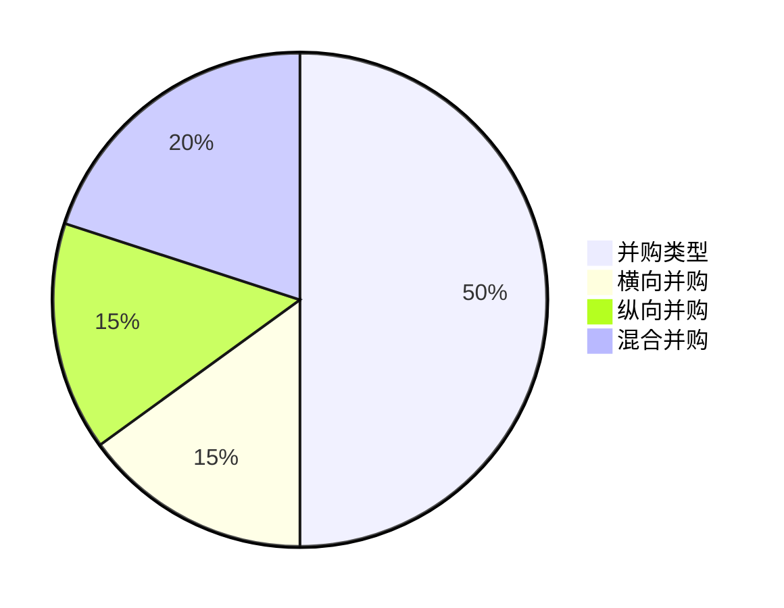

                 

# 《价值投资中的并购机会分析》

## 关键词：
- 价值投资
- 并购机会
- 企业估值
- 财务分析
- 并购策略

## 摘要：
在价值投资中，并购机会分析是识别潜在投资标的和创造超额收益的重要手段。本文系统地探讨了并购机会的识别、评估和实施过程，结合企业估值、财务分析和并购策略，提供了深入的理论支持和实际案例分析。通过构建完整的分析框架，本文帮助投资者在并购市场中发现价值，优化投资组合，实现长期稳健收益。

---

# 第一章：价值投资与并购概述

## 1.1 价值投资与并购概述

### 1.1.1 价值投资的定义与核心理念
价值投资是一种投资策略，强调以低于内在价值的价格买入优质资产。其核心理念是寻找市场低估的公司，并长期持有，等待其价值回归。这种策略强调安全边际和长期价值，而非短期价格波动。

**核心概念对比表：**

| 战略 | 描述 |
|------|------|
| 价值投资 | 以低于内在价值的价格买入优质资产，注重安全边际 |
| 股票投资 | 通过买入股票获取资本增值和股息收益 |

### 1.1.2 并购的基本概念与分类
并购（Mergers and Acquisitions, M&A）是指一家企业收购另一家企业部分或全部资产或股权的行为。并购可以分为以下几种类型：

**并购类型对比图：**

并购的主要驱动因素包括：
1. **协同效应**：通过整合资源降低成本或提高收入。
2. **市场扩展**：进入新市场或行业。
3. **竞争优势**：通过收购优质资产或技术增强竞争力。

### 1.1.3 并购与价值投资的关系
并购是价值投资者寻找超额收益的重要途径。通过分析并购机会，投资者可以发现被市场低估的标的，捕捉价值洼地。同时，并购活动本身也可能创造价值，例如通过整合提升企业效率。

---

# 第二章：价值投资中的企业估值基础

## 2.1 企业估值的基本方法

### 2.1.1 市盈率法
市盈率（P/E ratio）是企业市值与净利润的比率。公式如下：

$$ P/E = \frac{市场价}{每股收益} $$

**优点：**
- 简单易懂，数据容易获取。
- 适用于盈利稳定的公司。

**缺点：**
- 无法反映公司的资产质量。
- 适用于周期性行业可能不准确。

### 2.1.2 现金流折现法
现金流折现法（DCF）将未来现金流折现为当前价值。公式如下：

$$ V = \sum_{t=1}^{n} \frac{CF_t}{(1 + r)^t} $$

其中，\( r \) 是折现率，\( CF_t \) 是第 \( t \) 年的现金流。

**步骤：**
1. 预测未来现金流。
2. 选择合适的折现率。
3. 计算现值并加总。

### 2.1.3 企业价值与股权价值的区分
企业价值（EV）是企业整体价值，包括股权和债权。公式如下：

$$ EV = 市场价值 + 债务 - 现金及等价物 $$

股权价值（Equity）则是股东权益的价值，公式为：

$$ Equity = EV - 债务 + 现金及等价物 $$

### 2.1.4 并购中的估值挑战
并购中的估值挑战包括：
1. **协同效应的评估**：协同效应难以量化，可能导致高估。
2. **管理层质量**：管理层能力直接影响整合效果。
3. **整合风险**：整合过程中的文化和管理冲突可能影响价值。

---

# 第三章：并购机会的识别与筛选

## 3.1 并购机会的识别标准

### 3.1.1 行业分析与趋势判断
行业分析包括：
1. 行业生命周期：处于成熟期的行业可能并购机会较多。
2. 行业集中度：集中度低的行业可能通过并购提高集中度。
3. 市场趋势：行业未来增长潜力。

### 3.1.2 目标公司基本面分析
基本面分析包括：
1. **财务健康状况**：关注企业的盈利能力、现金流和债务水平。
2. **管理层质量**：管理层是否有良好的往绩和战略规划。
3. **竞争优势**：企业是否有独特的竞争优势。

### 3.1.3 管理层与企业治理
管理层的质量和治理结构直接影响并购后的整合效果。良好的治理结构和高效的管理层是并购成功的关键。

---

## 3.2 并购目标的筛选流程

### 3.2.1 界定了明确的并购目标
明确的并购目标需要满足以下条件：
1. 企业具有持续盈利能力。
2. 行业具有增长潜力。
3. 估值合理，具有安全边际。

### 3.2.2 初步筛选与尽职调查
初步筛选包括：
1. 财务指标筛选：如ROE、ROA等。
2. 行业地位筛选：如市场份额、竞争优势。

尽职调查包括：
1. 财务尽职调查：核实财务数据的真实性。
2. 法律尽职调查：检查是否存在法律纠纷。
3. 业务尽职调查：评估企业业务模式和竞争优势。

### 3.2.3 估值与财务模型的构建
构建财务模型时，需考虑以下步骤：
1. 数据收集：收集目标公司的历史财务数据。
2. 假设设定：如收入增长率、利润率等。
3. 模型构建：预测未来现金流并进行估值。
4. 敏感性分析：评估模型的稳健性。

---

## 3.3 并购机会的筛选与评估

### 3.3.1 并购机会的评估标准
评估标准包括：
1. 估值合理性：目标公司是否被市场低估。
2. 协同效应潜力：并购后是否能产生协同效应。
3. 风险可控性：并购后的整合风险是否可控。

### 3.3.2 并购目标的优先级排序
优先级排序可基于以下因素：
1. 估值差异：目标公司是否显著低于内在价值。
2. 协同效应：并购后是否能显著提升效率。
3. 竞争优势：目标公司是否具备独特竞争优势。

### 3.3.3 并购机会的动态调整
在市场变化和企业经营状况变化时，需动态调整并购目标和策略。

---

## 3.4 本章小结

本章详细介绍了并购机会的识别标准和筛选流程，包括行业分析、目标公司基本面分析、管理层质量评估以及估值模型的构建。通过这些步骤，投资者可以系统地识别和筛选出具有并购潜力的目标公司。

---

# 第四章：并购交易的分析与决策

## 4.1 并购整合的协同效应分析

### 4.1.1 协同效应的类型
协同效应主要分为以下几种：
1. **成本协同**：通过整合降低运营成本。
2. **收入协同**：通过整合扩大市场份额。
3. **技术协同**：通过整合获取新技术或研发能力。

### 4.1.2 协同效应的评估方法
评估协同效应的方法包括：
1. **定性分析**：评估整合后的协同潜力。
2. **定量分析**：通过财务模型预测协同效应的具体数值。

### 4.1.3 协同效应的风险与挑战
协同效应的实现面临以下风险：
1. **整合风险**：文化和管理冲突可能导致整合失败。
2. **执行风险**：整合过程中可能遇到意外问题。
3. **市场风险**：外部市场环境的变化可能影响协同效应的实现。

---

## 4.2 并购定价策略

### 4.2.1 并购定价的基本原则
并购定价需遵循以下原则：
1. **合理估值**：基于目标公司的真实价值进行定价。
2. **安全边际**：确保并购价格低于目标公司的内在价值。
3. **风险控制**：充分考虑并购后的整合风险和市场风险。

### 4.2.2 并购溢价的确定
并购溢价是指并购价格高于目标公司账面价值的部分。溢价的确定需综合考虑目标公司的未来盈利能力、协同效应和市场环境。

### 4.2.3 并购定价的实践应用
在实践中，投资者需结合市场情况和目标公司特点，灵活调整并购定价策略。例如，在市场低迷时，可适当提高溢价以吸引卖家。

---

## 4.3 并购决策的制定与实施

### 4.3.1 并购决策框架
并购决策框架包括以下步骤：
1. **目标识别**：识别具有并购潜力的目标公司。
2. **尽职调查**：全面评估目标公司的情况。
3. **估值与定价**：确定合理的并购价格。
4. **整合规划**：制定并购后的整合计划。
5. **风险评估**：评估并购过程中的各种风险。

### 4.3.2 并购决策的实施步骤
并购决策的实施步骤包括：
1. **战略规划**：明确并购目标和战略意图。
2. **团队组建**：组建专业的并购团队。
3. **交易执行**：完成尽职调查和交易交割。
4. **整合实施**：制定并执行整合计划。

### 4.3.3 并购决策的监控与调整
在并购过程中，需持续监控整合进展，并根据实际情况调整整合策略。例如，如果整合过程中遇到重大问题，需及时调整整合计划。

---

## 4.4 本章小结

本章重点分析了并购整合的协同效应和定价策略，探讨了并购交易的分析与决策过程。通过合理评估协同效应和制定科学的定价策略，投资者可以有效降低并购风险，提升并购成功率。

---

# 第五章：并购后的整合与风险管理

## 5.1 并购整合的实施

### 5.1.1 整合规划的制定
整合规划的制定需考虑以下方面：
1. **组织结构整合**：如何优化组织结构，提高效率。
2. **文化整合**：如何融合两种企业文化，避免冲突。
3. **资源整合**：如何整合资源，提高资源利用率。

### 5.1.2 整合实施的关键步骤
整合实施的关键步骤包括：
1. **高管任命**：确定整合后的高管团队。
2. **流程优化**：优化业务流程，提高效率。
3. **文化融合**：推动文化融合，增强团队凝聚力。

---

## 5.2 并购中的风险管理

### 5.2.1 并购风险的类型
并购风险主要包括：
1. **整合风险**：整合过程中可能遇到的文化冲突和管理问题。
2. **财务风险**：并购过程中可能产生的财务负担和债务风险。
3. **市场风险**：市场环境变化可能影响并购后的业绩。

### 5.2.2 风险管理策略
风险管理策略包括：
1. **风险识别**：识别并购过程中可能遇到的主要风险。
2. **风险评估**：评估各种风险的可能性和影响程度。
3. **风险控制**：制定相应的控制措施，降低风险发生的概率。
4. **风险应对**：制定应对策略，减轻风险的影响。

---

## 5.3 并购中的法律与税务问题

### 5.3.1 并购中的法律问题
并购中的法律问题包括：
1. **反垄断法**：确保并购不违反反垄断法规。
2. **公司治理**：确保并购后的公司治理结构合法合规。
3. **知识产权**：确保并购过程中知识产权的合法使用。

### 5.3.2 并购中的税务问题
并购中的税务问题包括：
1. **税务规划**：合理规划税务，降低税务负担。
2. **税务风险**：评估并购过程中的税务风险，制定应对策略。

---

## 5.4 本章小结

本章重点分析了并购后的整合与风险管理，探讨了整合规划的制定与实施、并购风险的类型与管理策略。通过有效的整合和风险管理，可以降低并购失败的概率，提高并购的成功率。

---

# 第六章：成功并购策略与案例分析

## 6.1 成功并购的策略

### 6.1.1 确定清晰的并购战略
确定清晰的并购战略包括：
1. **战略目标**：明确并购的目的和目标。
2. **行业选择**：选择具有增长潜力的行业。
3. **规模与范围**：根据企业规模和资源选择合适的并购规模和范围。

### 6.1.2 建立专业的并购团队
建立专业的并购团队包括：
1. **内部团队**：培养专业的并购团队，提升内部能力。
2. **外部顾问**：聘请专业的外部顾问，提供技术支持。

### 6.1.3 建立有效的监控机制
建立有效的监控机制包括：
1. **绩效评估**：定期评估并购绩效，发现问题及时调整。
2. **风险管理**：建立有效的风险管理机制，降低并购风险。

---

## 6.2 并购案例分析

### 6.2.1 案例一：可口可乐收购汇源果汁
**背景**：可口可乐收购汇源果汁是为了扩大在中国市场的影响力。
**分析**：通过收购，可口可乐获得了汇源果汁的分销网络和品牌价值，提升了在中国市场的竞争力。
**启示**：并购不仅仅是财务上的合并，更是战略资源的整合。

### 6.2.2 案例二：微软收购Nuance Communications
**背景**：微软收购Nuance Communications是为了加强其在人工智能领域的布局。
**分析**：通过收购，微软获得了Nuance在语音识别和自然语言处理领域的技术优势，提升了其在AI领域的竞争力。
**启示**：技术并购是企业保持竞争优势的重要手段。

---

## 6.3 案例分析小结

通过以上案例分析，我们可以看出，并购的成功不仅需要合理的战略规划和强大的执行能力，还需要对行业趋势和市场环境有深刻的理解。成功的并购能够为企业创造显著的价值，而失败的并购则可能对企业造成重大损失。

---

# 第七章：未来趋势与挑战

## 7.1 未来并购趋势

### 7.1.1 科技驱动的并购
随着科技的发展，技术创新将成为并购的主要驱动力。企业将通过并购获取新技术和新能力，以应对快速变化的市场环境。

### 7.1.2 全球化与本地化并购
全球化并购将继续增加，企业通过跨国并购扩大市场份额。同时，本地化并购也将成为重要趋势，企业通过本地并购更好地适应当地市场环境。

### 7.1.3 ESG因素的影响
随着ESG（环境、社会、治理）投资理念的兴起，ESG因素将越来越成为并购的重要考量。企业将更加注重并购标的的可持续发展能力。

---

## 7.2 并购中的挑战

### 7.2.1 科技创新的挑战
科技创新的挑战包括：
1. **技术更新**：技术更新换代快，企业需要不断进行技术创新。
2. **竞争加剧**：科技领域的竞争日益激烈，企业需要不断创新以保持竞争优势。

### 7.2.2 全球化与本地化的挑战
全球化与本地化的挑战包括：
1. **文化差异**：不同国家和地区的文化差异可能影响并购后的整合。
2. **法律法规**：不同国家和地区的法律法规差异可能增加并购的复杂性。

### 7.2.3 ESG因素的挑战
ESG因素的挑战包括：
1. **社会责任**：企业需要承担更多的社会责任，可能增加运营成本。
2. **治理结构**：企业需要优化治理结构，提高透明度和问责制。

---

## 7.3 本章小结

本章探讨了未来并购的趋势和挑战，包括科技驱动的并购、全球化与本地化并购以及ESG因素的影响。随着科技的发展和全球化的深入，并购将继续成为企业增长的重要手段。然而，科技、全球化和ESG因素也将给并购带来新的挑战，企业需要不断创新和调整策略以应对这些挑战。

---

# 作者：AI天才研究院/AI Genius Institute & 禅与计算机程序设计艺术 /Zen And The Art of Computer Programming

---

以上是《价值投资中的并购机会分析》的完整文章结构，涵盖从并购机会的识别、估值、整合到风险管理的全过程。文章通过理论分析、案例研究和实际操作指导，为投资者提供了系统性的并购机会分析框架。

