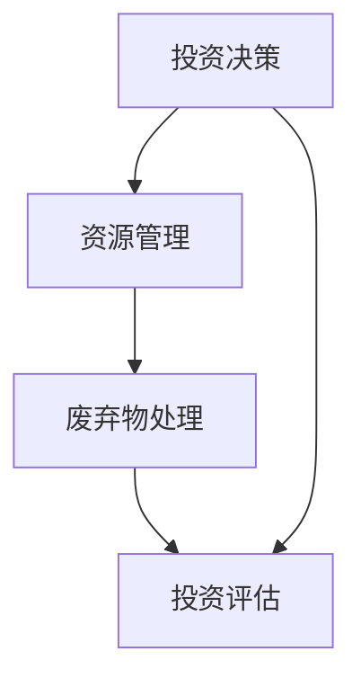

                 


# 价值投资中的循环经济模式分析

> 关键词：价值投资，循环经济，资源效率，投资策略，可持续发展

> 摘要：本文探讨了循环经济模式对价值投资策略的影响，分析了循环经济的核心要素及其对投资决策的潜在影响，提出了基于循环经济模式的新型投资评估方法。

---

# 第一部分：价值投资中的循环经济模式背景

## 第1章：循环经济模式概述

### 1.1 循环经济的基本概念

#### 1.1.1 循环经济的定义与特点
循环经济是一种以资源高效利用和循环利用为核心，以减量化、再利用、资源化为原则的经济模式。其特点包括：
- **减量化**：减少资源消耗和废弃物产生。
- **再利用**：延长产品和材料的生命周期。
- **资源化**：将废弃物转化为可利用资源。

#### 1.1.2 循环经济的核心要素
循环经济的核心要素包括：
- **资源输入**：原材料的获取与管理。
- **产品生产**：设计和生产过程的优化。
- **废弃物处理**：废弃物的回收与再利用。
- **循环经济链**：企业间的协同合作。

#### 1.1.3 循环经济与传统经济的对比
| 对比维度 | 循环经济 | 传统经济 |
|----------|----------|----------|
| 资源利用 | 高效循环 | 低效单向 |
| 废弃物处理 | 再利用为主 | 排放为主 |
| 环境影响 | 低污染 | 高污染 |

### 1.2 价值投资的基本原理

#### 1.2.1 价值投资的定义与特点
价值投资是一种基于对企业内在价值评估的投资策略，核心在于寻找市场价格低于内在价值的企业。

#### 1.2.2 价值投资的核心理念
- **安全边际**：买入价格低于内在价值。
- **长期视角**：关注企业的长期盈利能力。
- **基本面分析**：重点分析企业的财务状况、行业地位和竞争优势。

#### 1.2.3 循环经济与价值投资的结合点
循环经济模式下的企业可能具备更高的资源效率和更低的环境风险，这可能成为价值投资的重要考量因素。

### 1.3 循环经济模式在价值投资中的应用前景

#### 1.3.1 循环经济模式对企业价值的影响
- 提高资源利用率，降低成本。
- 降低环境风险，增强企业形象。
- 延长产品生命周期，提升竞争力。

#### 1.3.2 价值投资中循环经济模式的潜在收益
- 投资于具备可持续竞争优势的企业。
- 享受循环经济带来的成本节约和效率提升。

#### 1.3.3 循环经济模式对投资策略的改变
- 投资标准需考虑企业的循环经济能力。
- 需建立新的估值模型，反映循环经济带来的长期收益。

---

## 第2章：循环经济模式的核心概念与联系

### 2.1 循环经济模式的核心要素

#### 2.1.1 资源循环利用
资源循环利用是循环经济的基础，通过技术手段将废弃物转化为资源。

#### 2.1.2 产品生命周期管理
从设计、生产到回收的全生命周期管理，延长产品寿命，减少资源浪费。

#### 2.1.3 产业链协同
企业间的协同合作，构建循环经济产业链，实现资源的高效流动。

### 2.2 价值投资中的循环经济模式

#### 2.2.1 循环经济模式对企业价值的影响
企业通过循环经济模式可以降低成本、提高效率、增强竞争力，从而提升内在价值。

#### 2.2.2 价值投资中循环经济模式的评估指标
- 资源利用率。
- 废弃物再利用率。
- 循环经济带来的成本节约。

#### 2.2.3 循环经济模式与企业竞争力的关系
循环经济模式可以降低企业的环境风险，提升品牌形象，增强市场竞争力。

### 2.3 循环经济模式与传统经济模式的对比

#### 2.3.1 经济模式的对比
| 对比维度 | 循环经济 | 传统经济 |
|----------|----------|----------|
| 资源利用 | 高效循环 | 低效单向 |
| 成本结构 | 低资源依赖 | 高资源依赖 |
| 可持续性 | 高可持续性 | 低可持续性 |

#### 2.3.2 企业竞争力的对比
循环经济模式下的企业具备更低的环境风险和更高的资源效率，长期来看更具竞争力。

---

## 第3章：价值投资中的循环经济模式分析

### 3.1 循环经济模式对投资策略的影响

#### 3.1.1 投资标准的调整
在选择投资标的时，需考虑企业的循环经济能力，包括资源利用率、废弃物处理能力等。

#### 3.1.2 投资回报的预测
循环经济模式可能带来更高的投资回报，但需要建立新的估值模型。

### 3.2 循环经济模式的数学模型

#### 3.2.1 资源效率对投资回报的影响
假设企业通过循环经济模式提高了资源利用率，投资回报率可以表示为：
$$ ROI = \frac{收入 - 成本}{成本} \times 100\% $$

其中，收入和成本均受到资源效率的影响。

#### 3.2.2 循环经济模式的数学模型设计
建立循环经济模式下的投资回报模型：
$$ ROI_{\text{循环}} = ROI_{\text{传统}} \times \left(1 + \frac{\text{资源效率提升}}{\text{传统资源效率}}\right) $$

---

## 第4章：价值投资中的循环经济模式实现

### 4.1 循环经济模式的系统架构设计

#### 4.1.1 系统功能设计
- **资源管理模块**：监控和优化资源利用。
- **废弃物处理模块**：管理和再利用废弃物。
- **投资评估模块**：基于循环经济的估值模型。

#### 4.1.2 系统架构图


### 4.2 循环经济模式的实现步骤

#### 4.2.1 环境安装
- 安装必要的数据分析工具和建模软件。
- 数据收集：企业资源利用数据、废弃物处理数据。

#### 4.2.2 核心代码实现
```python
def calculate ROI(resource_efficiency, traditional_efficiency):
    return (resource_efficiency / traditional_efficiency) * 100
```

---

## 第5章：价值投资中的循环经济模式案例分析

### 5.1 案例介绍
选择一家制造企业，分析其循环经济模式的应用情况。

#### 5.1.1 环境介绍
- 企业采用废弃物再利用技术，将生产废弃物转化为新产品原料。
- 通过循环经济模式，企业降低了成本，提高了资源效率。

#### 5.1.2 核心代码实现
```python
def calculate_saving(resource_usage, waste Recycling):
    return resource_usage - waste Recycling
```

#### 5.1.3 投资回报分析
- 通过循环经济模式，企业每年节约成本10%，投资回报率显著提高。

### 5.2 案例分析与总结

#### 5.2.1 投资回报分析
- 循环经济模式下的投资回报率高于传统模式。
- 企业通过循环经济模式提升了市场竞争力。

#### 5.2.2 经验总结
- 投资于具备循环经济能力的企业，需关注其资源效率和废弃物处理能力。
- 需建立新的估值模型，反映循环经济带来的长期收益。

---

## 第6章：价值投资中的循环经济模式最佳实践

### 6.1 最佳实践

#### 6.1.1 投资策略建议
- 在选择投资标的时，优先考虑具备循环经济能力的企业。
- 建立新的估值模型，反映循环经济带来的长期收益。

#### 6.1.2 风险管理建议
- 关注政策风险，循环经济模式可能受到政策支持或限制。
- 评估企业的循环经济能力，避免投资于表面具备循环经济能力但实际能力不足的企业。

### 6.2 小结

#### 6.2.1 价值投资中的循环经济模式的核心要点
- 循环经济模式可以降低企业成本，提高效率。
- 投资于具备循环经济能力的企业具备长期竞争优势。

#### 6.2.2 未来展望
随着环保意识的增强和政策的支持，循环经济模式在价值投资中的应用将越来越广泛。

---

作者：AI天才研究院/AI Genius Institute & 禅与计算机程序设计艺术 /Zen And The Art of Computer Programming

