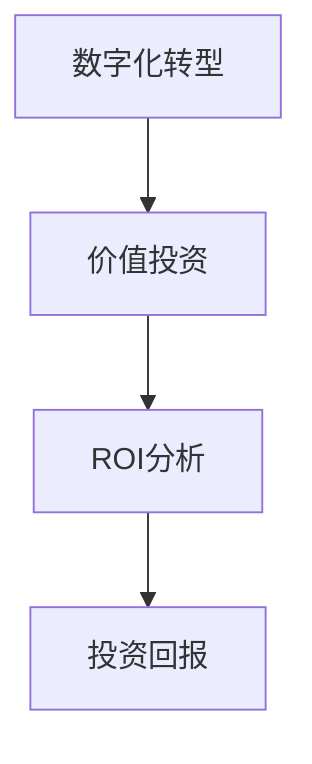
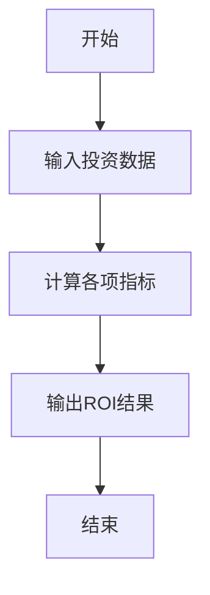
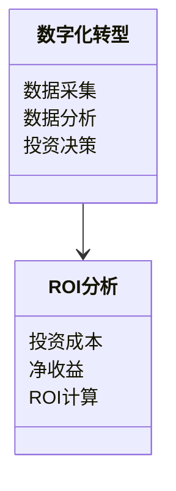
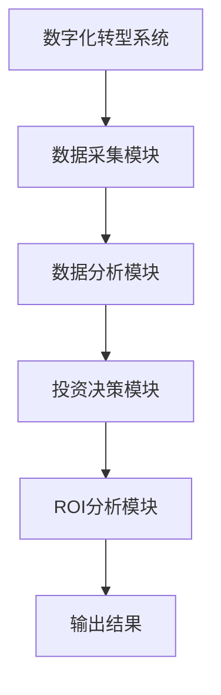

                 


```markdown
# 价值投资中的数字化转型ROI分析

**关键词**：价值投资、数字化转型、ROI分析、投资回报率、数字化投资策略

**摘要**：本文探讨如何通过数字化转型提升价值投资的效率和效果，重点分析了数字化转型对企业价值投资的影响，以及如何通过ROI（投资回报率）分析优化投资决策。文章结合了理论分析和实际案例，深入解析了数字化转型在价值投资中的应用，提出了一个基于ROI的数字化投资策略框架，帮助投资者更好地理解和应用这一方法。

---

## 正文

### 第一部分：价值投资与数字化转型的背景与概念

#### 第1章：数字化转型与价值投资概述

##### 1.1 数字化转型的背景与意义

- **1.1.1 数字化转型的定义与内涵**  
  数字化转型是指利用数字技术（如大数据、人工智能、云计算等）对企业业务流程、商业模式和运营方式进行创新和优化的过程。它不仅仅是技术的升级，更是对企业整体架构和文化的根本性变革。

- **1.1.2 数字化转型对企业价值的影响**  
  数字化转型通过提高效率、降低成本、增强客户体验等方式，显著提升了企业的市场竞争力和利润率。特别是在价值投资中，数字化转型能够帮助投资者更精准地评估企业的长期价值。

- **1.1.3 数字化转型与价值投资的结合**  
  价值投资强调长期持有优质资产，而数字化转型为企业提供了更强大的数据支持和分析工具，使得投资者能够更准确地评估企业的未来潜力。

##### 1.2 价值投资的核心概念

- **1.2.1 价值投资的基本原理**  
  价值投资的核心在于寻找市场低估的优质企业，长期持有以获得超额收益。其关键在于对企业基本面的深入分析。

- **1.2.2 价值投资的关键指标**  
  价值投资者通常关注市盈率（P/E）、市净率（P/B）、股息率等指标，这些指标能够帮助投资者评估企业的内在价值。

- **1.2.3 价值投资与企业数字化的关系**  
  数字化转型为企业提供了更强大的数据支持和分析能力，使得价值投资者能够更精准地识别低估企业，并动态调整投资策略。

##### 1.3 数字化转型中的ROI分析框架

- **1.3.1 ROI的定义与计算方法**  
  ROI（Return on Investment）是衡量投资回报的重要指标，计算公式为：$$ROI = \frac{\text{净收益}}{\text{投资成本}} \times 100\%$$

- **1.3.2 数字化转型对ROI的影响**  
  数字化转型通过提高效率、降低成本和提升收益，显著提升了投资回报率。

- **1.3.3 价值投资中的ROI分析框架**  
  在价值投资中，ROI分析框架可以帮助投资者评估企业的长期盈利能力，从而做出更明智的投资决策。

### 第二部分：数字化转型中的ROI分析模型

#### 第2章：核心概念与联系

##### 2.1 数字化转型的核心概念

- **2.1.1 数字化转型的关键要素**  
  包括数据驱动、技术创新、组织变革等。

- **2.1.2 数字化转型的阶段划分**  
  通常分为数据化、智能化、生态化三个阶段。

- **2.1.3 数字化转型与企业竞争力的关系**  
  数字化转型能够显著提升企业的市场竞争力和长期盈利能力。

##### 2.2 价值投资中的ROI分析模型

- **2.2.1 ROI分析模型的构成**  
  包括投资成本、净收益、投资期限等关键要素。

- **2.2.2 数字化转型对ROI的影响路径**  
  通过优化运营效率、提升客户价值和降低风险，数字化转型能够显著提升投资回报率。

- **2.2.3 ROI分析模型的数学表达**  
  $$ROI = \frac{\text{投资收益} - \text{投资成本}}{\text{投资成本}} \times 100\%$$

##### 2.3 核心概念的ER实体关系图



#### 2.4 本章小结

本章通过分析数字化转型的核心概念及其与价值投资的关系，构建了ROI分析框架，为后续的ROI分析提供了理论基础。

### 第三部分：数字化转型中的ROI分析算法

#### 第3章：ROI分析算法原理

##### 3.1 ROI分析算法的核心原理

- **3.1.1 ROI的计算公式**  
  $$ROI = \frac{\text{净利润}}{\text{投资成本}} \times 100\%$$

- **3.1.2 ROI分析的数学模型**  
  $$ROI = \frac{\text{收入} - \text{成本}}{\text{成本}} \times 100\%$$

- **3.1.3 ROI分析的算法流程**  
  1. 收集投资数据。  
  2. 计算净收益。  
  3. 计算ROI。  
  4. 输出结果。

##### 3.2 ROI分析的算法实现

- **3.2.1 算法流程图（Mermaid）**



- **3.2.2 Python代码实现**

```python
def calculate ROI(investment_cost, net_profit):
    return (net_profit / investment_cost) * 100

# 示例
investment_cost = 1000000
net_profit = 200000
roi = calculate ROI(investment_cost, net_profit)
print(f"ROI: {roi}%")
```

### 第四部分：系统分析与架构设计

#### 第4章：系统分析与架构设计

##### 4.1 系统功能设计（领域模型）



##### 4.2 系统架构设计（Mermaid）



### 第五部分：项目实战

#### 第5章：项目实战

##### 5.1 环境安装

- 安装Python和相关库（如Pandas、NumPy）。

##### 5.2 核心代码实现

```python
import pandas as pd
import numpy as np

def calculate ROI(investment_cost, net_profit):
    return (net_profit / investment_cost) * 100

# 示例数据
data = {
    '投资成本': [1000000],
    '净收益': [200000]
}
df = pd.DataFrame(data)
roi = calculate ROI(df['投资成本'].iloc[0], df['净收益'].iloc[0])
print(f"ROI: {roi}%")
```

##### 5.3 案例分析与结果解读

- 通过实际案例分析，验证ROI分析模型的有效性。

### 第六部分：总结与展望

#### 第6章：总结与展望

##### 6.1 最佳实践

- 建议投资者结合数字化转型工具，优化投资策略。

##### 6.2 小结

本文通过理论分析和实际案例，深入探讨了数字化转型在价值投资中的应用，构建了基于ROI的分析框架，为投资者提供了新的思路。

##### 6.3 注意事项

- 投资者应结合市场环境和企业实际情况，灵活调整投资策略。

##### 6.4 拓展阅读

- 推荐阅读《投资最重要的事》和《数字化转型：企业成功的必经之路》。

---

**作者：AI天才研究院/AI Genius Institute & 禅与计算机程序设计艺术 /Zen And The Art of Computer Programming**
```

