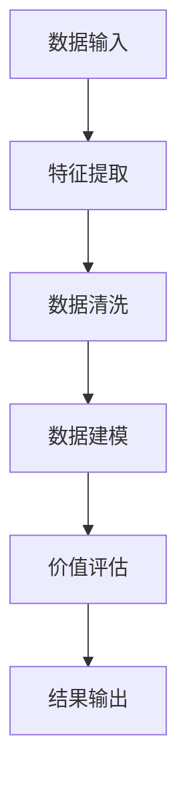
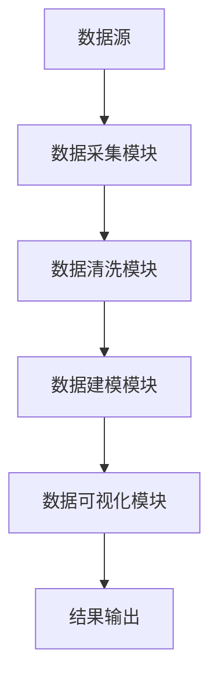
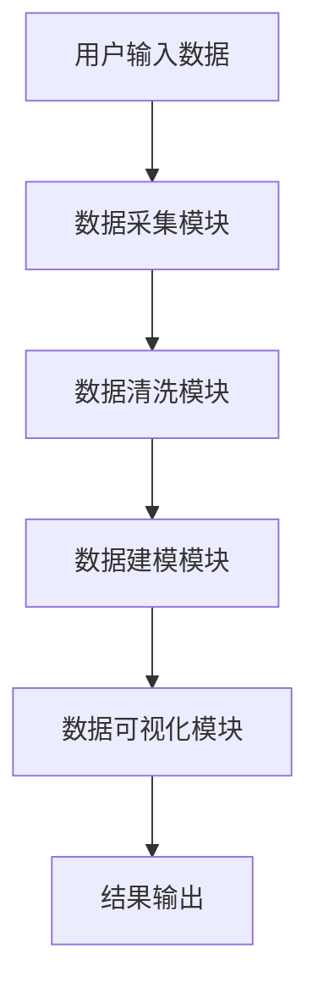

                 


# 价值投资中的数据资产评估

> 关键词：数据资产评估，价值投资，数据资产，投资决策，数据分析

> 摘要：本文深入探讨了数据资产评估在价值投资中的重要性，分析了数据资产评估的核心概念、算法原理和系统架构，结合实际案例详细讲解了数据资产评估的实现过程，为投资者提供了从理论到实践的全面指导。

---

## 第一部分：数据资产评估与价值投资概述

### 第1章：数据资产评估的背景与意义

#### 1.1 数据资产的定义与特性
- **数据资产的定义**：数据资产是指能够为企业或投资者带来经济价值的数据资源，包括结构化数据（如财务报表）和非结构化数据（如文本、图像）。
- **数据资产的核心特性**：
  - **完整性**：数据的全面性和准确性。
  - **及时性**：数据的更新频率和时效性。
  - **关联性**：数据之间的关系及其对投资决策的影响。
  - **安全性**：数据的保护和隐私问题。

#### 1.2 数据资产评估的必要性
- **数据驱动投资决策的重要性**：在价值投资中，数据是决策的核心依据，通过对数据的分析，投资者可以发现潜在的投资机会。
- **数据资产评估在价值投资中的价值**：通过评估数据资产的价值，投资者可以优化投资组合，降低风险。

#### 1.3 数据资产评估的核心要素
- **数据质量的评估维度**：
  - 数据的准确性：数据是否反映了真实情况。
  - 数据的完整性：数据是否全面。
  - 数据的可比性：数据是否可以进行比较。
- **数据资产的生命周期**：
  - 数据采集：从各种渠道获取数据。
  - 数据处理：清洗、转换和整合数据。
  - 数据分析：通过分析数据发现投资机会。
  - 数据可视化：将分析结果以图表形式展示。
- **数据资产的分类与层次结构**：
  - 结构化数据：如股票价格、财务报表。
  - 非结构化数据：如新闻、社交媒体评论。
  - 半结构化数据：如JSON格式的数据。

### 第2章：数据资产评估的核心概念与联系

#### 2.1 数据资产评估的核心原理
- **数据资产评估的基本原理**：通过对数据的质量、相关性和可用性进行评估，确定数据的价值。
- **数据资产价值的影响因素**：
  - 数据的稀缺性：稀有的数据价值更高。
  - 数据的时效性：数据的时效性影响其价值。
  - 数据的准确性：准确的数据更有价值。
- **数据资产评估的数学模型**：
  - 数据资产评估模型可以表示为：
    $$ V = f(Q, R, A) $$
    其中，\( V \) 是数据资产的价值，\( Q \) 是数据的质量，\( R \) 是数据的相关性，\( A \) 是数据的可用性。

#### 2.2 数据资产与传统资产的对比
- **数据资产与传统资产的对比表格**：
  | 特性        | 数据资产        | 传统资产         |
  |-------------|-----------------|------------------|
  | 形态        | 数字化          | 实物             |
  | 可复制性     | 高              | 低               |
  | 变现能力     | 快              | 缓慢             |
  | 依赖性       | 高              | 低               |

- **数据资产评估与传统资产评估的差异**：
  - 数据资产评估更依赖于数据分析技术。
  - 数据资产评估需要考虑数据的动态变化。

#### 2.3 数据资产评估的核心流程图


### 第3章：数据资产评估的算法原理

#### 3.1 数据资产评估的核心算法
- **线性回归模型**：
  - 数据资产评估的线性回归模型可以表示为：
    $$ y = \beta_0 + \beta_1x + \epsilon $$
    其中，\( y \) 是数据资产的价值，\( x \) 是影响价值的特征变量，\( \beta_0 \) 和 \( \beta_1 \) 是模型的系数，\( \epsilon \) 是误差项。

- **决策树模型**：
  - 决策树模型通过构建树状结构，将数据资产的价值分为不同的类别。

- **神经网络模型**：
  - 神经网络模型通过多层神经元网络，学习数据资产的价值评估。

#### 3.2 数据资产评估算法的实现
- **线性回归模型的Python实现**：
  ```python
  import numpy as np
  from sklearn.linear_model import LinearRegression

  # 示例数据
  X = np.array([[1], [2], [3], [4], [5]])
  y = np.array([2, 4, 5, 4, 5])

  # 创建模型
  model = LinearRegression()

  # 训练模型
  model.fit(X, y)

  # 预测结果
  print(model.predict([[6]]))  # 输出：[[6.8]]
  ```

- **数据资产评估算法的流程图**：
  ```mermaid
  graph TD
      A[数据输入] --> B[特征提取]
      B --> C[数据清洗]
      C --> D[数据建模]
      D --> E[价值评估]
      E --> F[结果输出]
  ```

---

## 第二部分：数据资产评估的系统架构与实现

### 第4章：数据资产评估的系统架构设计

#### 4.1 问题场景介绍
- 数据资产评估系统需要处理大量数据，包括数据采集、清洗、建模和结果输出。

#### 4.2 系统功能设计
- 数据采集模块：从数据库、API等渠道获取数据。
- 数据清洗模块：处理缺失值、异常值。
- 数据建模模块：使用机器学习模型进行价值评估。
- 数据可视化模块：将结果以图表形式展示。

#### 4.3 系统架构设计


#### 4.4 系统接口设计
- 数据采集接口：从数据库获取数据。
- 数据清洗接口：处理数据异常。
- 数据建模接口：调用机器学习模型。

#### 4.5 系统交互流程图


### 第5章：数据资产评估的项目实战

#### 5.1 项目背景与目标
- 通过实际案例，展示数据资产评估的实现过程。

#### 5.2 环境安装与配置
- 安装Python、Jupyter Notebook、scikit-learn等工具。

#### 5.3 数据采集与处理
- 从股票数据库获取历史数据。
- 使用pandas进行数据清洗和处理。

#### 5.4 数据建模与评估
- 使用线性回归模型进行价值评估。
- 通过交叉验证评估模型性能。

#### 5.5 实际案例分析
- 以某股票为例，展示数据资产评估的全过程。

#### 5.6 项目小结
- 总结项目经验，提出改进建议。

---

## 第三部分：总结与展望

### 第6章：总结与展望

#### 6.1 小结
- 数据资产评估是价值投资的重要组成部分。
- 通过数据分析技术，可以有效评估数据资产的价值。

#### 6.2 最佳实践 tips
- 数据资产评估需要结合具体业务场景。
- 数据资产评估模型需要不断优化和更新。

#### 6.3 未来展望
- 数据资产评估将更加智能化和自动化。
- 数据资产的价值将更加受到重视。

---

## 作者：AI天才研究院 & 禅与计算机程序设计艺术

---

通过以上结构和内容，我将按照每个部分逐步展开，详细讲解每个章节的核心内容，确保文章逻辑清晰、结构紧凑，帮助读者全面理解数据资产评估在价值投资中的重要性及实现方法。

