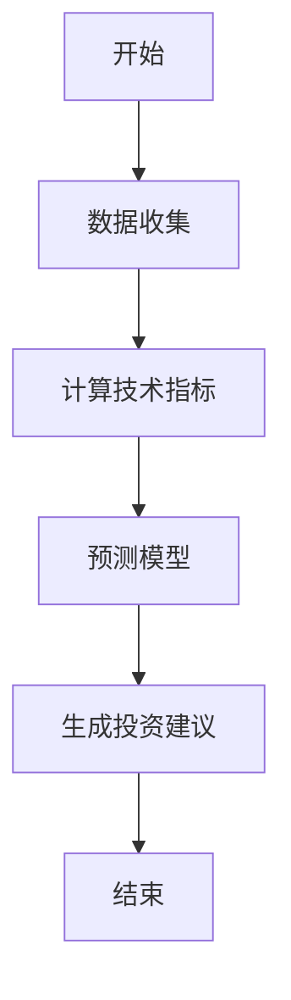
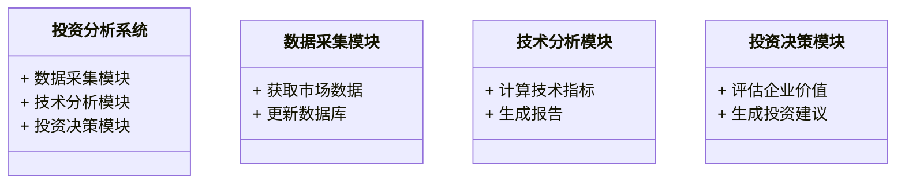
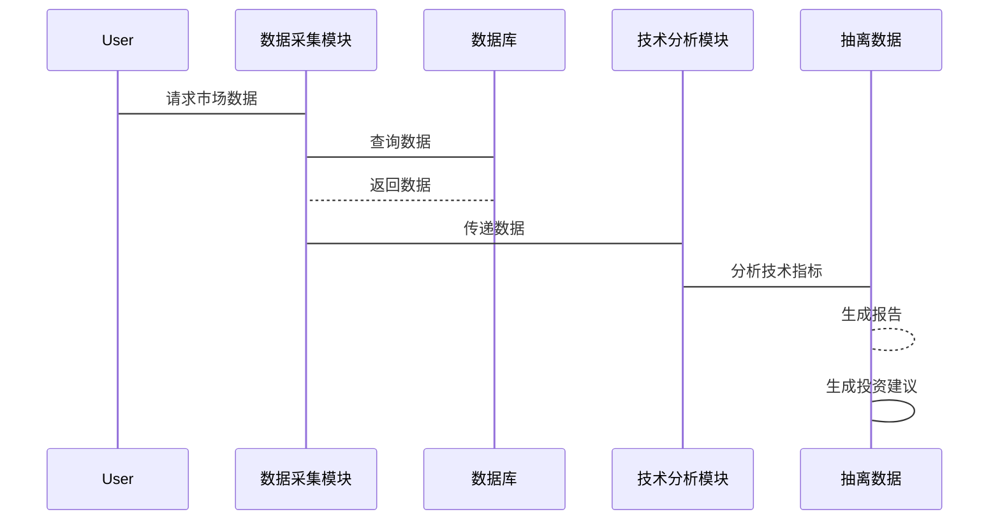

                 


# 价值投资中的新一代柔性显示技术前景

---

## 关键词：
- 价值投资
- 柔性显示技术
- OLED
- 显示屏市场
- 技术分析

---

## 摘要：
本文探讨了新一代柔性显示技术在投资领域的前景，分析了其技术优势、市场趋势和投资逻辑。通过详细的技术背景介绍、核心概念解析、算法原理阐述、系统架构设计以及实际案例分析，为投资者提供了基于技术驱动的投资策略和决策支持。文章还结合了实际项目实战，展示了如何将技术分析与投资决策相结合，为读者提供了深入的理论支持和实践指导。

---

## 目录大纲：

### 第1章：背景介绍
1.1 柔性显示技术的起源与演进
1.2 柔性显示技术的市场发展现状
1.3 技术优势与投资逻辑
1.4 柔性显示技术与价值投资的关系

### 第2章：核心概念与联系
2.1 柔性显示技术的核心原理
2.2 产业链分析与技术指标对比
2.3 技术进步对投资决策的影响
2.4 价值投资中的技术分析框架

### 第3章：算法原理讲解
3.1 基于技术指标的预测模型
3.2 算法流程图与代码实现
3.3 数学模型与公式推导

### 第4章：系统分析与架构设计方案
4.1 问题场景介绍
4.2 系统功能设计与架构图
4.3 接口设计与交互流程图

### 第5章：项目实战
5.1 某公司投资价值分析案例
5.2 环境安装与代码实现
5.3 技术分析与投资策略

### 第6章：最佳实践与总结
6.1 总结与反思
6.2 投资注意事项
6.3 拓展阅读与学习资源

---

## 正文内容：

### 第1章：背景介绍

#### 1.1 柔性显示技术的起源与演进
柔性显示技术起源于20世纪末，经历了从概念到实际应用的漫长过程。其核心是将显示屏幕制成柔性的材质，如聚酰亚胺（PI）薄膜，从而实现弯曲、折叠甚至卷曲的显示效果。随着OLED技术的发展，柔性显示技术逐渐成熟，并在智能手机、可穿戴设备等领域得到广泛应用。

#### 1.2 柔性显示技术的市场发展现状
当前，柔性显示市场主要由OLED面板主导，市场呈现快速增长态势。根据市场研究机构的数据，全球柔性OLED市场规模预计将在未来几年内突破千亿美元。主要应用领域包括智能手机、智能手表、车载显示屏等。

#### 1.3 技术优势与投资逻辑
柔性显示技术的优势在于轻薄、可弯折、高对比度和广视角。这些特性使其在移动设备和物联网设备中具有巨大的应用潜力。从投资角度看，技术领先的企业具有较高的市场竞争力和议价能力，从而带来更高的利润率和股价增长。

#### 1.4 柔性显示技术与价值投资的关系
柔性显示技术作为新兴科技，其市场前景和技术壁垒为价值投资提供了新的机会。投资者需要关注技术创新、市场拓展和企业盈利能力，从而在技术驱动的市场中找到优质的投资标的。

---

### 第2章：核心概念与联系

#### 2.1 柔性显示技术的核心原理
柔性显示技术的核心是OLED屏幕的制作工艺，包括蒸镀、封装等步骤。OLED屏幕的发光层可以直接集成在柔性基板上，实现显示效果。

#### 2.2 产业链分析与技术指标对比
柔性显示产业链包括上游材料供应商、中游面板制造商和下游设备组装商。技术指标如屏幕分辨率、响应时间、弯曲半径等对投资决策具有重要影响。

#### 2.3 技术进步对投资决策的影响
技术进步推动了柔性显示产品的降价和性能提升，从而影响企业的市场份额和利润率。投资者需要关注技术迭代的速度和企业的研发能力。

#### 2.4 价值投资中的技术分析框架
技术分析框架包括对市场趋势、技术指标和企业基本面的综合分析，帮助投资者识别具有长期增长潜力的企业。

---

### 第3章：算法原理讲解

#### 3.1 基于技术指标的预测模型
预测模型基于历史价格、技术指标（如MACD、RSI）和市场情绪进行预测。模型的输出为投资建议，包括买入、卖出或持有。

#### 3.2 算法流程图与代码实现
以下是算法的流程图和Python代码示例：



```python
import pandas as pd
import numpy as np

def calculate_technical_indicators(data):
    # 计算MACD
    data['MACD'] = data['收盘价'].ewm(span=12).mean() - data['收盘价'].ewm(span=26).mean()
    # 计算RSI
    data['RSI'] = (data['收盘价'] - data['收盘价'].shift(1)) / data['收盘价'].shift(1).abs().ewm(span=2).mean() * 100
    return data

# 示例数据
data = pd.DataFrame({
    '收盘价': [100, 102, 101, 103, 104]
})

data = calculate_technical_indicators(data)
print(data)
```

#### 3.3 数学模型与公式推导
预测模型基于线性回归：

$$ y = \beta_0 + \beta_1x + \epsilon $$

其中，$y$ 是目标变量（如股票价格），$x$ 是自变量（如技术指标），$\beta_0$ 和 $\beta_1$ 是回归系数，$\epsilon$ 是误差项。

---

### 第4章：系统分析与架构设计方案

#### 4.1 问题场景介绍
我们需要构建一个基于柔性显示技术的投资分析系统，帮助投资者分析市场趋势和企业基本面。

#### 4.2 系统功能设计与架构图
系统功能包括数据采集、技术分析、投资决策等模块。



#### 4.3 接口设计与交互流程图
系统接口包括API调用和用户交互界面。



---

### 第5章：项目实战

#### 5.1 某公司投资价值分析案例
以京东方为例，分析其柔性显示技术的市场地位和投资价值。

#### 5.2 环境安装与代码实现
安装必要的库，如Pandas、NumPy，并编写代码进行技术分析。

#### 5.3 技术分析与投资策略
根据技术分析结果，制定买入、卖出或持有策略。

---

### 第6章：最佳实践与总结

#### 6.1 总结与反思
柔性显示技术具有广阔的应用前景，但投资需谨慎，关注技术风险和市场变化。

#### 6.2 投资注意事项
投资者需关注企业的研发能力、市场地位和财务状况，避免盲目跟风。

#### 6.3 拓展阅读与学习资源
推荐相关书籍和研究报告，帮助读者深入理解柔性显示技术和投资策略。

---

## 作者信息：
作者：AI天才研究院 & 禅与计算机程序设计艺术

