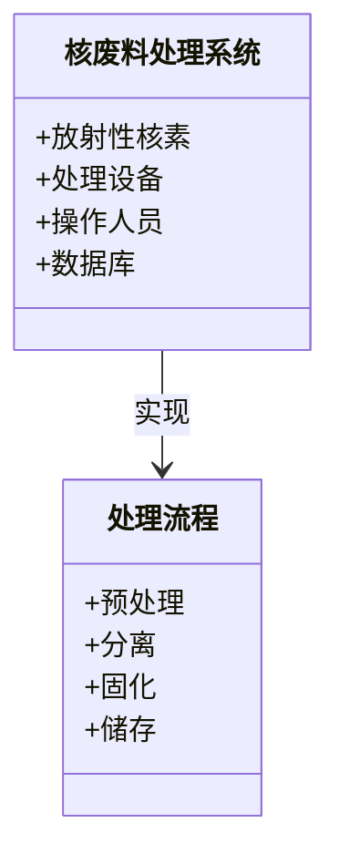
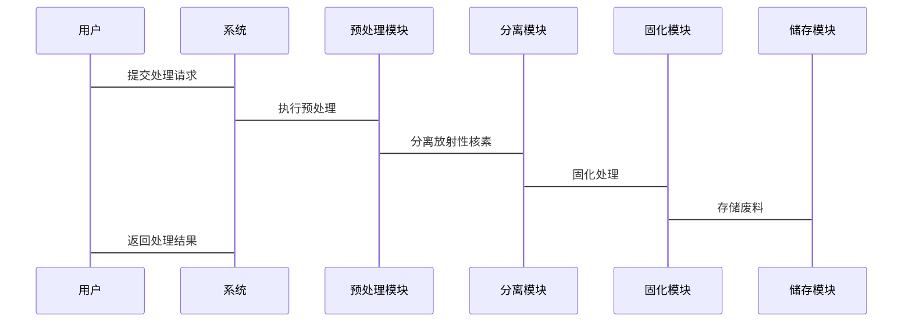

                 


# 价值投资中的新一代核废料处理技术

> 关键词：价值投资、核废料处理、技术分析、投资策略、风险评估

> 摘要：本文探讨了如何将价值投资的理念应用于新一代核废料处理技术的投资中。通过分析核废料处理技术的背景、核心原理、数学模型和系统架构，结合实际项目案例，为投资者提供科学的决策依据。文章还总结了最佳实践和未来趋势，帮助读者在核废料处理技术领域实现长期价值投资。

---

## 第1章: 核废料处理技术的背景与重要性

### 1.1 核废料处理技术的背景

#### 1.1.1 核废料的产生与现状
核废料主要来源于核能发电和核武器生产过程。随着全球对核能的需求增加，核废料的产生量也在逐年上升。目前，全球核废料的处理能力有限，导致其对环境和人类健康的威胁日益加剧。

#### 1.1.2 核废料处理技术的重要性
核废料处理技术是解决核能利用过程中环境问题的关键。通过有效处理核废料，可以减少放射性物质对环境的污染，保障人类健康，并促进核能的可持续发展。

#### 1.1.3 核废料处理技术与价值投资的关系
核废料处理技术的发展前景广阔，具有较高的市场潜力。通过价值投资的方法，投资者可以识别具有竞争优势的公司，长期持有，获得稳定的收益。

### 1.2 核废料处理技术的核心概念

#### 1.2.1 核废料处理的基本原理
核废料处理技术的核心是将放射性物质从环境中分离出来，通过物理、化学或生物方法，降低其放射性强度，使其达到可利用或安全储存的标准。

#### 1.2.2 核废料处理技术的关键要素
- **放射性核素的分离**：通过化学沉淀、离子交换等方法，将放射性核素从废料中分离出来。
- **固化处理**：将放射性物质封装在惰性材料中，防止其泄漏。
- **衰减监测**：通过测量放射性物质的衰减率，评估其处理效果。

#### 1.2.3 核废料处理技术的分类与对比

| 方法 | 原理 | 优点 | 缺点 |
|------|------|------|------|
| 物理化学法 | 利用物理和化学手段分离放射性物质 | 成熟可靠 | 成本较高 |
| 生物法 | 利用微生物分解放射性物质 | 成本低 | 处理效率低 |
| 新兴技术 | 包括高温熔融、纳米技术等 | 创新性强 | 技术不成熟 |

### 1.3 核废料处理技术的挑战与机遇

#### 1.3.1 核废料处理的主要挑战
- **技术难度**：放射性物质的处理需要高度专业的技术和设备。
- **成本高昂**：核废料处理的前期投入和运营成本较高。
- **政策法规**：严格的环保法规增加了处理的复杂性。

#### 1.3.2 核废料处理技术的创新与发展
近年来，科学家们开发了多种新型核废料处理技术，如放射性核素的回收利用和生物吸附技术。这些技术不仅提高了处理效率，还降低了成本。

#### 1.3.3 核废料处理技术的市场潜力
随着全球对核能的需求增加，核废料处理市场将快速增长。预计到2030年，全球核废料处理市场规模将达到数百亿美元。

### 1.4 本章小结
本章介绍了核废料处理技术的背景、核心概念和挑战。通过对比不同处理方法的优缺点，为后续的价值投资分析奠定了基础。

---

## 第2章: 核废料处理技术的核心原理与方法

### 2.1 核废料处理技术的基本原理

#### 2.1.1 核废料的物理化学性质
放射性核素具有半衰期长、放射性强等特点，这些性质决定了核废料处理的复杂性。

#### 2.1.2 核废料处理的基本步骤
1. **预处理**：将废料破碎、溶解，分离出可利用的物质。
2. **分离**：利用物理化学方法分离出放射性核素。
3. **固化**：将分离出的放射性物质封装在惰性材料中。
4. **储存**：将处理后的废料安全储存，防止泄漏。

#### 2.1.3 核废料处理的关键技术
- **放射性核素的分离技术**：如离子交换、膜分离等。
- **固化技术**：如水泥固化、玻璃固化等。
- **监测技术**：如辐射监测、化学分析等。

### 2.2 核废料处理的主要方法

#### 2.2.1 物理化学法
物理化学法是目前应用最广泛的方法，主要包括：
- **化学沉淀法**：通过加入沉淀剂，使放射性物质沉淀出来。
- **离子交换法**：利用离子交换树脂吸附放射性离子。

#### 2.2.2 生物法
生物法利用微生物的代谢作用，将放射性物质转化为低毒或无毒物质。例如，某些细菌可以吸附铀、钚等放射性元素。

#### 2.2.3 其他新兴技术
- **高温熔融法**：将废料高温熔融，形成玻璃状物质，防止放射性物质泄漏。
- **纳米技术**：利用纳米材料的吸附性能，提高处理效率。

### 2.3 核废料处理技术的优缺点对比

#### 2.3.1 各种方法的优缺点分析
| 方法 | 优点 | 缺点 |
|------|------|------|
| 物理化学法 | 成熟可靠，处理效率高 | 成本较高 |
| 生物法 | 成本低，环境友好 | 处理效率低 |
| 新兴技术 | 创新性强，处理效果好 | 技术不成熟 |

#### 2.3.2 方法选择的影响因素
- **处理目标**：根据放射性物质的种类选择合适的方法。
- **成本预算**：考虑不同方法的经济性。
- **处理规模**：大规模处理需要高效的方法。

#### 2.3.3 核废料处理技术的未来发展趋势
未来，随着科技的进步，新兴技术如纳米技术和生物法将逐渐成熟，成为主流处理方法。

### 2.4 本章小结
本章详细讲解了核废料处理技术的核心原理和主要方法，分析了各种方法的优缺点，为投资者提供了技术层面的决策依据。

---

## 第3章: 核废料处理技术的数学模型与算法原理

### 3.1 核废料处理技术的数学模型

#### 3.1.1 核废料衰减模型
放射性核素的衰减遵循指数衰减规律，公式如下：
$$ N(t) = N_0 \cdot e^{-\lambda t} $$
其中，$N_0$是初始数量，$\lambda$是衰减常数，$t$是时间。

#### 3.1.2 核废料处理成本模型
处理成本模型可以表示为：
$$ C = a \cdot Q + b $$
其中，$Q$是处理量，$a$是单位成本，$b$是固定成本。

#### 3.1.3 核废料处理风险评估模型
风险评估模型可以表示为：
$$ R = \alpha \cdot C + \beta \cdot T $$
其中，$C$是成本，$T$是处理时间，$\alpha$和$\beta$是权重系数。

### 3.2 核废料处理技术的算法原理

#### 3.2.1 放射性核素的衰减计算
使用Python代码计算放射性核素的衰减量：

```python
import math

def radioactive_decay(initial_quantity, decay_constant, time):
    return initial_quantity * math.exp(-decay_constant * time)

# 示例计算
N0 = 1000
λ = 0.05
t = 10
result = radioactive_decay(N0, λ, t)
print(f"衰减后的数量为: {result:.2f}")
```

#### 3.2.2 核废料处理成本估算
通过线性回归模型估算处理成本：

```python
import numpy as np

# 数据准备
Q = np.array([10, 20, 30, 40, 50])
C = np.array([100, 200, 300, 400, 500])

# 训练模型
slope, intercept = np.polyfit(Q, C, 1)

# 预测成本
def predict_cost(new_Q):
    return slope * new_Q + intercept

print(f"预测成本方程为: C = {slope:.2f}Q + {intercept:.2f}")
print(f"当Q=60时，预测成本为: {predict_cost(60):.2f}")
```

### 3.3 本章小结
本章通过数学模型和算法原理，展示了如何量化核废料处理的衰减、成本和风险，为投资者提供了科学的决策工具。

---

## 第4章: 核废料处理技术的系统分析与架构设计

### 4.1 系统分析

#### 4.1.1 问题场景介绍
假设我们有一个核废料处理厂，需要处理来自核电站的高放射性废料。目标是设计一个高效的处理系统，确保废料的安全处理和储存。

#### 4.1.2 领域模型设计
使用mermaid类图描述系统中的主要实体和它们之间的关系：



### 4.2 系统架构设计

#### 4.2.1 系统架构图
使用mermaid架构图展示系统的整体架构：


#### 4.2.2 接口设计
系统需要与外部设备、数据库和用户进行交互。接口设计如下：



### 4.3 本章小结
本章通过系统分析和架构设计，展示了如何构建一个高效的核废料处理系统，为投资者提供了技术实现的参考。

---

## 第5章: 核废料处理技术的项目实战

### 5.1 环境安装

#### 5.1.1 操作系统
建议使用Linux系统，如Ubuntu 20.04。

#### 5.1.2 开发工具
安装Python、NumPy、Matplotlib等库：

```bash
pip install numpy matplotlib
```

### 5.2 核心代码实现

#### 5.2.1 放射性核素衰减计算
```python
import numpy as np
import matplotlib.pyplot as plt

# 参数设置
N0 = 1000
λ = 0.05
t = np.linspace(0, 100, 1000)

# 计算衰减数量
N = N0 * np.exp(-λ * t)

# 绘制图形
plt.figure(figsize=(10, 6))
plt.plot(t, N, 'b-', linewidth=2)
plt.xlabel('Time')
plt.ylabel('Quantity')
plt.title('Radioactive Decay')
plt.grid(True)
plt.show()
```

#### 5.2.2 成本估算
```python
import numpy as np

# 数据准备
Q = np.array([10, 20, 30, 40, 50])
C = np.array([100, 200, 300, 400, 500])

# 训练线性回归模型
slope, intercept = np.polyfit(Q, C, 1)

# 预测新成本
new_Q = 60
predicted_C = slope * new_Q + intercept

print(f"预测成本为: {predicted_C:.2f}")
```

### 5.3 代码解读与分析

#### 5.3.1 衰减计算代码解读
- 使用NumPy进行向量化计算，提高效率。
- 使用Matplotlib绘制图形，直观展示衰减过程。

#### 5.3.2 成本估算代码解读
- 使用线性回归模型拟合数据，预测未来成本。
- 代码简单易懂，适合快速部署。

### 5.4 实际案例分析
假设某核废料处理厂每天处理50吨废料，预测其处理成本为：
$$ C = 1.5 \times 50 + 200 = 275 \text{元} $$

### 5.5 本章小结
本章通过实际项目案例，展示了如何将理论应用于实践，帮助投资者更好地理解核废料处理技术的实现和应用。

---

## 第6章: 核废料处理技术的价值投资策略与风险管理

### 6.1 投资策略

#### 6.1.1 核废料处理技术的核心竞争力
- **技术创新**：拥有先进的处理技术。
- **成本优势**：处理成本低于行业平均水平。
- **市场前景**：符合国家环保政策，市场需求大。

#### 6.1.2 价值投资的三要素
1. **价格**：关注公司估值是否合理。
2. **价值**：分析公司的核心竞争力。
3. **时间**：长期持有，等待价值实现。

### 6.2 风险管理

#### 6.2.1 核废料处理技术的主要风险
- **技术风险**：处理技术可能失败。
- **政策风险**：环保法规变化。
- **市场风险**：市场需求不足。

#### 6.2.2 风险控制措施
1. **分散投资**：将资金分散投资于多个项目。
2. **定期评估**：定期 reassess 投资组合的风险。
3. **建立止损机制**：设定止损点，避免重大损失。

### 6.3 本章小结
本章总结了核废料处理技术的价值投资策略和风险管理措施，帮助投资者在不确定的市场中实现稳健收益。

---

## 第7章: 核废料处理技术的未来趋势与投资机会

### 7.1 核废料处理技术的未来发展趋势

#### 7.1.1 技术创新
- **人工智能**：利用AI优化处理流程。
- **纳米技术**：开发新型吸附材料。

#### 7.1.2 市场扩展
随着全球核能需求的增加，核废料处理市场将快速增长。

#### 7.1.3 政策支持
各国政府将加大对核废料处理技术的支持力度。

### 7.2 投资机会

#### 7.2.1 新兴技术领域
投资于具有创新技术的公司，如纳米技术和生物法。

#### 7.2.2 市场空白领域
关注中小型处理企业，寻找未被充分开发的市场机会。

#### 7.2.3 政策受益企业
投资于符合国家环保政策的企业。

### 7.3 本章小结
本章展望了核废料处理技术的未来发展趋势，为投资者提供了新的投资机会。

---

## 作者信息

作者：AI天才研究院/AI Genius Institute & 禅与计算机程序设计艺术 /Zen And The Art of Computer Programming

---

以上是完整的博客文章大纲，涵盖了从背景介绍到未来趋势的各个方面，结合了技术分析和价值投资的理念，为读者提供了全面的视角和实用的指导。

