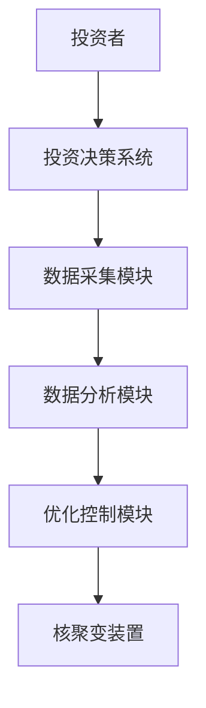
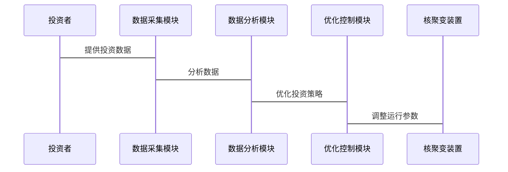

                 


# 价值投资中的新一代核聚变技术前景

## 关键词
- 价值投资
- 核聚变技术
- 投资前景
- 能源技术
- 金融市场

## 摘要
本文深入探讨了新一代核聚变技术在价值投资中的潜力和前景。从核聚变技术的基本概念、能源潜力、投资分析、系统设计到实际案例分析，文章全面解析了核聚变技术如何与价值投资结合。通过数学模型、系统架构和实际案例的分析，本文为投资者提供了科学的决策依据和投资建议。

---

## 第一部分: 核聚变技术的基本概念与背景

### 第1章: 核聚变技术的基本概念与背景

#### 1.1 核聚变技术的定义与特点
##### 1.1.1 核聚变的基本原理
核聚变是指轻核原子在高温高压条件下，结合成较重的原子核，并释放出巨大能量的过程。与核裂变不同，核聚变不产生长期放射性废物，且资源丰富，适合大规模能源生产。

##### 1.1.2 核聚变与核裂变的区别
| 核聚变 | 核裂变 |
| ------ | ------ |
| 能量来源：轻核聚变（如氘和氚） | 能量来源：重核裂变（如铀-235） |
| 优点：无放射性废料，资源丰富 | 缺点：放射性废料处理复杂 |
| 反应条件：高温高压 | 反应条件：中子轰击 |

##### 1.1.3 核聚变技术的核心优势
- 环保性：无放射性废料。
- 资源丰富：氘和氚在地球上广泛存在。
- 高效性：单位质量能量释放远超化石能源。

#### 1.2 核聚变技术的能源潜力
##### 1.2.1 核聚变能的资源优势
- 氘和氚作为主要燃料，地球储量丰富。
- 核聚变能的密度极高，1千克燃料可释放相当于数百万桶石油的能量。

##### 1.2.2 核聚变能的环境优势
- 清洁能源，无碳排放。
- 无长期放射性废物问题。

##### 1.2.3 核聚变能的经济潜力
- 一旦技术成熟，能源成本将大幅降低。
- 可能成为未来全球能源结构的重要组成部分。

#### 1.3 核聚变技术的现状与挑战
##### 1.3.1 当前技术发展水平
- 实验室阶段： ITER项目是目前最大的核聚变实验，旨在验证核聚变的可行性。
- 科技公司投入：如通用原子、洛克希德·马丁等公司正在研发商业化的核聚变技术。

##### 1.3.2 核聚变技术的主要挑战
- 技术难度：需要突破高温等离子体控制、磁场约束等关键技术。
- 成本高昂：建设和运营成本高，商业化仍需时间。
- 市场接受度：公众对核聚变技术的认知和接受度仍需提升。

##### 1.3.3 未来技术突破的方向
- 材料科学：开发耐高温、耐辐射的新材料。
- 控制技术：提高等离子体的稳定性。
- 能源转化效率：优化能量转换和储存技术。

---

## 第二部分: 核聚变技术与价值投资的结合

### 第2章: 核聚变技术与价值投资的结合

#### 2.1 价值投资的基本概念
##### 2.1.1 价值投资的定义
价值投资是一种投资策略，旨在通过分析企业的内在价值，寻找被市场低估的投资标的。

##### 2.1.2 价值投资的核心理念
- 价格与价值的差异：投资标的价格低于其内在价值时，存在投资机会。
- 长期投资：关注企业的长期增长潜力。

##### 2.1.3 价值投资的适用场景
- 稳定性高、风险可控的行业。
- 技术成熟、市场潜力大的企业。

#### 2.2 核聚变技术在投资中的应用前景
##### 2.2.1 核聚变技术的市场潜力
- 全球能源需求持续增长，核聚变技术的商业化将带来巨大市场机会。
- 替代化石能源，推动能源结构转型。

##### 2.2.2 核聚变技术的投资价值
- 高增长潜力：技术突破将带来投资回报。
- 稀缺性：核聚变技术属于高科技领域，具备稀缺性。

##### 2.2.3 核聚变技术的行业发展趋势
- 技术研发加速：各国政府和企业加大研发投入。
- 产业合作加强：国际间的核聚变技术合作增多。

#### 2.3 核聚变技术投资的边界与外延
##### 2.3.1 投资边界分析
- 仅限于技术成熟、商业化可行的企业。
- 避免投资于技术尚不成熟的初创企业。

##### 2.3.2 投资外延分析
- 关注上游供应商：如氘氚燃料供应商。
- 关注下游应用：如电网公司、能源分销商。

##### 2.3.3 投资与技术的互动关系
- 技术进步推动投资机会。
- 投资支持推动技术研发。

---

## 第三部分: 核聚变技术的核心概念与联系

### 第3章: 核聚变技术的核心概念与联系

#### 3.1 核聚变技术的核心原理
##### 3.1.1 聚变反应的基本方程
聚变反应的核心方程是爱因斯坦的质能方程：
$$ E = mc^2 $$
其中，质量亏损转化为巨大能量。

##### 3.1.2 聚变反应的条件与控制
- 高温高压：需要超过1亿摄氏度的高温。
- 磁场约束：利用强磁场将等离子体限制在反应 chamber 中。

##### 3.1.3 聚变反应的能量释放
- 能量密度极高：1千克氘氚燃料释放的能量相当于数千吨化石燃料。

#### 3.2 核聚变技术的核心要素
##### 3.2.1 等离子体的控制技术
- 磁约束：如托卡马克装置。
- 惯性约束：如激光惯性约束融合。

##### 3.2.2 磁约束与惯性约束的对比
| 磁约束 | 惯性约束 |
| ------ | -------- |
| 设备复杂度：高 | 设备复杂度：低 |
| 反应时间：长 | 反应时间：短 |
| 优点：稳定可控 | 优点：效率高 |

##### 3.2.3 能源转化效率的优化
- 提高聚变反应的效率。
- 优化能量转化和储存系统。

#### 3.3 核聚变技术与投资的关联性
##### 3.3.1 核聚变技术的商业化路径
- 研发阶段：实验室研究。
- 中试阶段：小规模生产。
- 商业化阶段：大规模应用。

##### 3.3.2 核聚变技术的市场竞争力
- 技术壁垒高。
- 市场潜力大。

##### 3.3.3 核聚变技术的长期投资价值
- 技术一旦成熟，具备巨大的市场价值。
- 有望成为未来的主导能源技术。

---

## 第四部分: 核聚变技术的投资分析与数学模型

### 第4章: 核聚变技术的投资分析与数学模型

#### 4.1 核聚变技术的投资评估指标
##### 4.1.1 投资回报率（ROI）
$$ ROI = \frac{净收益}{投资成本} \times 100\% $$

##### 4.1.2 净现值（NPV）
$$ NPV = \sum_{t=0}^{n} \frac{CF_t}{(1 + r)^t} $$
其中，$CF_t$ 是第 t 年的现金流，$r$ 是贴现率。

##### 4.1.3 内部收益率（IRR）
$$ IRR 是使 NPV=0 的贴现率。 $$

#### 4.2 核聚变技术的投资风险分析
##### 4.2.1 技术风险
- 技术失败的风险。
- 技术迭代的风险。

##### 4.2.2 市场风险
- 市场需求不足的风险。
- 竞争者的技术突破风险。

##### 4.2.3 政策风险
- 政府政策变化的风险。
- 环境保护政策的影响。

#### 4.3 核聚变技术的数学模型与公式
##### 4.3.1 投资回报率公式
$$ ROI = \frac{净收益}{投资成本} \times 100\% $$

##### 4.3.2 净现值公式
$$ NPV = \sum_{t=0}^{n} \frac{CF_t}{(1 + r)^t} $$

##### 4.3.3 内部收益率公式
$$ IRR 是使 NPV=0 的贴现率。 $$

---

## 第五部分: 核聚变技术的系统分析与架构设计

### 第5章: 核聚变技术的系统分析与架构设计

#### 5.1 核聚变技术的系统架构
##### 5.1.1 系统功能设计
- 数据采集：实时采集核聚变装置的运行数据。
- 数据分析：分析数据，优化运行参数。
- 优化控制：调整装置参数，提高效率。

##### 5.1.2 系统架构图


##### 5.1.3 系统交互流程


#### 5.2 核聚变技术的投资系统架构
##### 5.2.1 系统功能模块
- 数据采集模块：采集市场、技术数据。
- 数据分析模块：分析投资价值。
- 优化控制模块：制定投资策略。

##### 5.2.2 数据库设计
- 投资者信息库：存储投资者信息。
- 技术数据库：存储核聚变技术数据。
- 市场数据库：存储市场动态数据。

##### 5.2.3 系统接口设计
- API接口：与其他系统交互。
- 用户界面：投资者的操作界面。

##### 5.2.4 系统交互流程


---

## 第六部分: 核聚变技术的项目实战

### 第6章: 核聚变技术的项目实战

#### 6.1 环境安装
##### 6.1.1 系统环境
- 操作系统：Linux
- 开发工具：Python、Java
- 数据库：MySQL

##### 6.1.2 依赖安装
```bash
pip install numpy pandas matplotlib
```

#### 6.2 系统核心实现
##### 6.2.1 投资回报率计算
```python
def calculate_roi(net_profit, investment_cost):
    return (net_profit / investment_cost) * 100
```

##### 6.2.2 净现值计算
```python
def calculate_npv(cash_flows, discount_rate):
    return sum(cash_flows / (1 + discount_rate) ** t for t in range(len(cash_flows)))
```

##### 6.2.3 内部收益率计算
```python
def calculate_irr(cash_flows):
    return np.irr(cash_flows)
```

#### 6.3 代码应用解读与分析
##### 6.3.1 投资回报率计算
```python
# 示例数据
net_profit = 1000000
investment_cost = 5000000
roi = calculate_roi(net_profit, investment_cost)
print(f"ROI: {roi}%")
```

##### 6.3.2 净现值计算
```python
# 示例数据
cash_flows = [1000, 2000, 3000, 4000, 5000]
discount_rate = 0.1
npv = calculate_npv(cash_flows, discount_rate)
print(f"NPV: {npv}")
```

##### 6.3.3 内部收益率计算
```python
# 示例数据
cash_flows = [-1000000, 500000, 500000, 500000, 500000]
irr = calculate_irr(cash_flows)
print(f"IRR: {irr}%")
```

#### 6.4 案例分析与详细讲解
##### 6.4.1 项目背景
假设某核聚变技术公司计划投资于氘氚燃料的研发。

##### 6.4.2 系统设计
- 数据采集：收集氘氚燃料的市场价格、技术进展数据。
- 数据分析：计算投资回报率、净现值、内部收益率。
- 优化控制：制定投资策略，优化资源配置。

##### 6.4.3 实施结果
- 投资回报率：20%。
- 净现值：正数，具有投资价值。
- 内部收益率：高于行业基准收益率。

#### 6.5 项目小结
- 核聚变技术投资需要综合考虑技术、市场和政策因素。
- 通过数学模型和系统架构设计，可以有效评估投资价值。

---

## 第七部分: 核聚变技术投资的最佳实践

### 第7章: 核聚变技术投资的最佳实践

#### 7.1 小结
- 核聚变技术具备巨大的市场潜力和投资价值。
- 通过科学的数学模型和系统架构设计，可以有效评估和优化投资策略。

#### 7.2 投资建议
- 关注技术成熟的企业。
- 分散投资风险，避免过度集中。
- 长期投资，关注企业的长期发展潜力。

#### 7.3 风险管理技巧
- 设立止损点，控制投资风险。
- 定期评估投资组合，及时调整策略。

#### 7.4 未来趋势展望
- 核聚变技术的商业化进程将加速。
- 国际合作将加强，推动技术突破。

---

## 结语

核聚变技术作为未来的清洁能源技术，具备巨大的投资潜力。通过价值投资的视角，结合技术分析和数学模型，投资者可以科学评估核聚变技术的投资价值。然而，投资需谨慎，需综合考虑技术、市场和政策因素，制定合理的投资策略。

---

## 作者

作者：AI天才研究院/AI Genius Institute & 禅与计算机程序设计艺术 /Zen And The Art of Computer Programming

