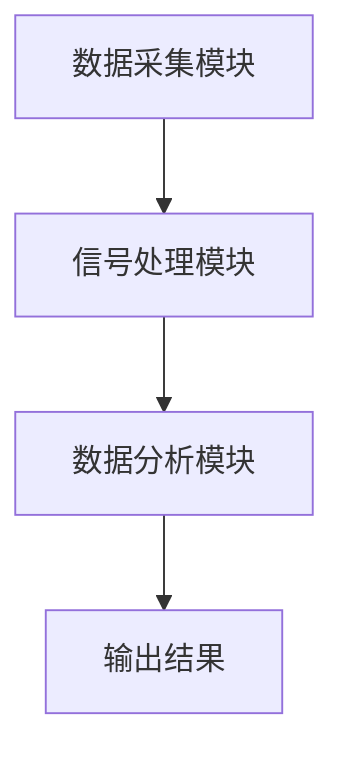

                 


# 价值投资中的新一代生物传感器技术前景

## 关键词：价值投资，生物传感器，市场情绪，投资决策，数据分析

## 摘要：  
本文探讨了生物传感器技术在价值投资中的应用前景，分析了生物传感器的基本原理及其在金融市场中的潜力。通过详细讲解生物传感器技术的核心概念、算法原理、系统架构以及实际案例，本文展示了如何利用生物传感器技术提升投资决策的科学性和准确性。同时，本文还讨论了生物传感器技术在价值投资中的优势与挑战，并展望了未来的发展趋势。

---

## 第一部分：生物传感器技术基础与价值投资背景

### 第1章：生物传感器技术概述

#### 1.1 生物传感器的基本概念  
生物传感器是一种能够检测和分析生物信号的设备，通过将生物信号转化为可测量的电子信号，实现对生理指标的实时监测。生物传感器广泛应用于医疗、健康监测、环境监测等领域。  

**核心概念与联系：**  
生物传感器的核心要素包括：  
1. 生物识别元件（如酶、抗体、核酸等）  
2. 信号转换元件（如电极、光传感器等）  
3. 数据处理系统（如模数转换器、微处理器等）  

#### 1.2 价值投资的基本概念  
价值投资是一种以低于市场价买入优质资产的投资策略，核心在于识别被市场低估的企业，长期持有以实现收益。  

**核心概念与联系：**  
价值投资的关键要素包括：  
1. 公司基本面分析（如财务状况、盈利能力、竞争优势等）  
2. 市场情绪分析  
3. 风险管理  

#### 1.3 生物传感器技术与价值投资的结合  
生物传感器技术可以通过监测投资者的心理和生理状态，提供实时的市场情绪数据，辅助价值投资决策。  

---

## 第二部分：生物传感器技术的核心原理与系统架构

### 第2章：生物传感器的核心原理  

#### 2.1 生物传感器的工作原理  
生物传感器通过捕获生物信号（如心率、皮肤电活动、脑电波等）并将其转化为可分析的电子信号，用于评估投资者的情绪和决策能力。  

**数学模型：**  
生物传感器数据的时间序列分析模型：  
$$ S(t) = a \cdot S(t-1) + b \cdot S(t-2) + c \cdot t + \epsilon $$  
其中，$S(t)$ 表示当前时刻的信号强度，$a$、$b$ 是自回归系数，$c$ 是时间趋势系数，$\epsilon$ 是误差项。  

#### 2.2 生物传感器的系统架构  
生物传感器系统通常包括数据采集模块、信号处理模块和数据分析模块。  

**系统架构图：**  


---

### 第3章：生物传感器技术的数学模型与算法  

#### 3.1 生物传感器数据的数学建模  
生物传感器数据的特征提取和预测模型是基于时间序列分析和机器学习算法。  

**Python 实现示例：**  
```python
import numpy as np
from sklearn.linear_model import LinearRegression

# 示例数据
X = np.array([[1], [2], [3], [4], [5]])
y = np.array([2, 4, 6, 8, 10])

# 线性回归模型
model = LinearRegression()
model.fit(X, y)

# 预测结果
print(model.predict([[6]]))  # 输出：[[12]]
```

---

## 第三部分：生物传感器技术在价值投资中的应用

### 第4章：生物传感器技术在金融市场的应用  

#### 4.1 生物传感器技术在市场情绪分析中的应用  
通过监测投资者的生理指标（如心率变异性、皮肤电活动），分析市场情绪的变化，帮助预测市场波动。  

**案例分析：**  
假设某投资者在决策时，生物传感器显示其心率变异性降低，表明其处于紧张状态，可能影响其决策的准确性。  

---

### 第5章：价值投资策略与生物传感器技术的结合  

#### 5.1 价值投资中的生物传感器技术应用  
通过实时监测投资者的情绪和认知状态，优化投资决策，识别潜在风险。  

**经典案例：**  
以苹果公司为例，利用生物传感器技术分析投资者对其创新产品的市场反应，评估其投资价值。  

---

## 第四部分：案例分析与未来展望  

### 第6章：生物传感器技术在价值投资中的案例分析  

#### 6.1 投资者情绪分析案例  
通过分析投资者在公司财报发布前后的生理指标变化，预测市场情绪的变化趋势，辅助投资决策。  

---

### 第7章：生物传感器技术的优势与挑战  

#### 7.1 生物传感器技术的优势  
1. 提供实时数据，辅助投资决策  
2. 通过生理指标分析市场情绪  
3. 优化投资组合管理  

#### 7.2 生物传感器技术的挑战  
1. 数据准确性问题  
2. 技术瓶颈与成本问题  
3. 伦理和法律问题  

---

## 第五部分：总结与未来展望  

### 第8章：总结与未来展望  

#### 8.1 总结  
生物传感器技术为价值投资提供了新的工具和方法，通过实时监测投资者的情绪和认知状态，优化投资决策。  

#### 8.2 未来展望  
随着生物传感器技术的不断发展，其在价值投资中的应用将更加广泛，可能涉及更多的领域和应用场景。  

---

## 作者：AI天才研究院/AI Genius Institute & 禅与计算机程序设计艺术 /Zen And The Art of Computer Programming

