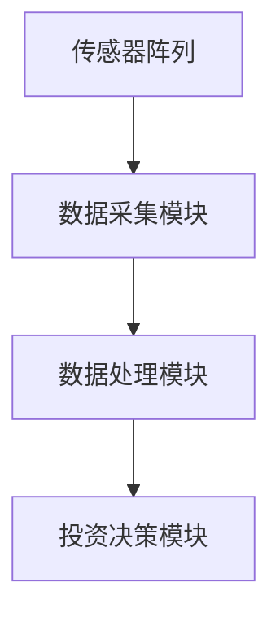

                 

# 价值投资中的新一代生物传感器阵列技术前景

## 关键词：
生物传感器阵列，价值投资，医疗健康，传感器技术，数据驱动投资

## 摘要：
本文深入探讨了生物传感器阵列技术在价值投资中的应用前景。通过分析生物传感器阵列的核心原理、系统架构、算法优化和实际案例，本文揭示了这一技术在医疗健康、投资决策支持等领域的巨大潜力。文章还详细介绍了基于生物传感器的数据分析方法和投资决策模型，为读者提供了从理论到实践的全面指南。

---

## 正文

### 第1章 生物传感器阵列技术概述

#### 1.1 生物传感器的基本概念
生物传感器是一种能够检测生物分子（如蛋白质、DNA、葡萄糖等）并与电子信号转换的装置。其核心由三部分组成：生物识别元件、信号转换元件和数据处理单元。

#### 1.2 生物传感器阵列的优势
生物传感器阵列将多个传感器集成在一个芯片上，具有以下优势：
- **高灵敏度**：多个传感器协同工作，提高检测精度。
- **多参数监测**：能够同时监测多种生物指标。
- **稳定性**：阵列结构提高了传感器的耐用性和一致性。

#### 1.3 价值投资中的生物传感器技术
在价值投资中，生物传感器阵列技术可用于监测健康指标（如心率、血糖、压力水平等），为投资者提供数据驱动的健康评估和投资决策支持。

---

### 第2章 生物传感器阵列的核心技术

#### 2.1 传感器材料的选择
生物传感器的性能取决于材料的选择。常用的材料包括：
- **纳米材料**：如石墨烯和碳纳米管，具有高灵敏度。
- **生物兼容材料**：如聚乳酸，适用于体内传感器。

#### 2.2 传感器阵列的布局设计
传感器阵列的布局直接影响检测效果。常见的布局方式包括：
- **线性排列**：传感器按直线排列，适用于单一方向的检测。
- **矩阵排列**：传感器呈二维排列，适用于多参数监测。

#### 2.3 数据采集与预处理
传感器数据需要经过预处理才能用于分析。预处理步骤包括：
- **噪声消除**：通过滤波算法去除干扰信号。
- **信号放大**：放大微弱信号以提高检测灵敏度。

---

### 第3章 生物传感器阵列的算法优化

#### 3.1 信号处理算法
常用的信号处理算法包括：
- **傅里叶变换**：用于频域分析。
- **小波变换**：用于时频分析。

#### 3.2 机器学习算法
机器学习算法在生物传感器数据分类中具有重要作用。常用的算法包括：
- **支持向量机（SVM）**：适用于二分类问题。
- **随机森林**：适用于多分类问题。

#### 3.3 算法优化策略
- **参数调优**：通过网格搜索优化算法性能。
- **特征选择**：去除冗余特征以提高分类准确率。

---

### 第4章 生物传感器阵列的数学模型

#### 4.1 传感器信号模型
传感器信号可以用以下数学模型表示：
$$ y = a x + b $$
其中，$y$ 是传感器输出，$x$ 是输入信号，$a$ 是灵敏度，$b$ 是偏置。

#### 4.2 数据融合模型
数据融合模型可以表示为：
$$ f(x_1, x_2, ..., x_n) = w_1 x_1 + w_2 x_2 + ... + w_n x_n $$
其中，$w_i$ 是权重系数，$x_i$ 是输入信号。

---

### 第5章 系统架构设计

#### 5.1 系统功能模块
- **数据采集模块**：负责采集传感器数据。
- **数据处理模块**：负责数据预处理和特征提取。
- **投资决策模块**：基于传感器数据生成投资建议。

#### 5.2 系统架构图

---

### 第6章 项目实战

#### 6.1 项目背景
本项目旨在开发一个基于生物传感器的健康投资系统，用于监测用户的健康状况并提供投资建议。

#### 6.2 系统实现
- **环境配置**：安装Python、TensorFlow和传感器驱动。
- **数据采集**：使用Arduino采集传感器数据。
- **数据处理**：使用Python对数据进行预处理和特征提取。

#### 6.3 实际案例分析
以糖尿病患者为例，分析传感器数据并生成投资建议。

---

### 第7章 总结与展望

生物传感器阵列技术在价值投资中的应用前景广阔。通过不断优化传感器性能和算法模型，未来可以实现更精准的投资决策支持。

---

作者：AI天才研究院 & 禅与计算机程序设计艺术

