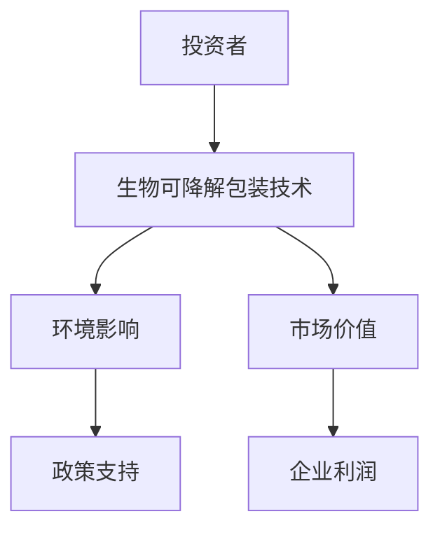
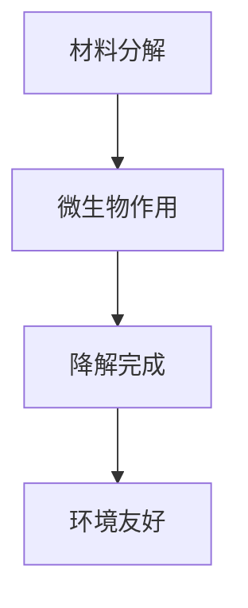
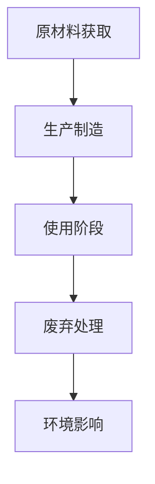
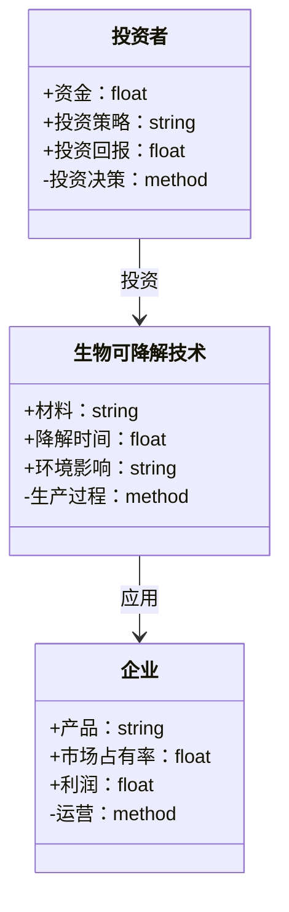

                 


# 价值投资中的新一代生物可降解包装技术

## 关键词：价值投资、生物可降解包装技术、环境影响、投资策略、技术分析、市场潜力

## 摘要：  
本文深入分析了生物可降解包装技术在价值投资中的应用潜力，从技术背景、核心原理、市场分析到投资策略，全面探讨了该技术的创新价值和投资机会。通过科学的技术分析和详细的案例研究，本文为投资者提供了基于技术驱动的投资决策依据，揭示了生物可降解包装技术在环保和经济可持续性中的重要地位。

---

# 第一部分: 生物可降解包装技术的背景与价值投资概述

## 第1章: 生物可降解包装技术的背景介绍

### 1.1 生物可降解包装技术的定义与背景

#### 1.1.1 包装行业的发展现状

包装行业是现代社会的重要组成部分，广泛应用于食品、药品、日用品等领域。传统包装材料如塑料、纸张和金属等在提供便利性的同时，也带来了严重的环境问题。据统计，全球每年产生约3亿吨塑料垃圾，其中大部分难以降解，对环境造成长期污染。

#### 1.1.2 环境问题与传统包装的局限性

传统包装材料的降解周期长，尤其是塑料制品，部分材料需要数百年才能完全降解。这些材料在自然环境中积累，导致土壤污染、水源污染和生态破坏。此外，传统包装材料的生产过程消耗大量能源，进一步加剧了碳排放问题。

#### 1.1.3 生物可降解包装技术的提出与意义

生物可降解包装技术是一种新兴的解决方案，通过使用可降解材料替代传统塑料，减少环境负担。这种技术的核心在于材料能够在自然环境中快速分解，转化为二氧化碳和水，从而实现生态友好。

---

### 1.2 价值投资与生物可降解包装技术的结合

#### 1.2.1 价值投资的基本概念

价值投资是一种投资策略，强调以低于内在价值的价格买入优质资产。其核心在于分析企业的基本面，寻找具有长期增长潜力和竞争优势的公司。

#### 1.2.2 生物可降解包装技术的市场潜力

随着环保意识的增强和政策支持的增加，生物可降解包装技术市场需求持续增长。预计到2030年，全球生物可降解包装市场将突破百亿美元，年均增长率超过15%。

#### 1.2.3 技术创新对投资价值的影响

技术创新是企业核心竞争力的体现。生物可降解包装技术的突破将推动企业市场地位的提升，从而增强其投资吸引力。投资者应重点关注技术领先、市场占有率高的企业。

---

## 第2章: 生物可降解包装技术的核心概念与联系

### 2.1 核心概念原理

#### 2.1.1 生物可降解材料的化学结构

生物可降解材料通常由可再生资源制成，例如淀粉基塑料（如PLA和PHA）。这些材料在微生物的作用下能够分解为简单的有机物，最终转化为二氧化碳和水。

#### 2.1.2 降解过程的科学原理

生物可降解材料的降解过程包括两个阶段：第一阶段是材料的物理分解，第二阶段是化学降解。整个过程依赖于环境中的微生物群落，降解速率受温度、湿度和氧气含量等因素的影响。

#### 2.1.3 材料性能与环境影响的关系

材料的机械性能、热稳定性等直接影响其应用场景。例如，PLA材料具有良好的可加工性和较高的机械强度，适合制作薄膜、包装袋等。

---

### 2.2 核心概念属性特征对比表格

| 属性         | 传统塑料       | 生物可降解材料   |
|--------------|----------------|------------------|
| 生物降解性   | 不可降解        | 可降解           |
| 环境影响     | 严重污染        | 减轻污染         |
| 资源消耗     | 高能耗          | 低能耗（可再生）  |
| 成本          | 较低            | 较高             |

---

### 2.3 ER实体关系图架构



---

## 第3章: 生物可降解包装技术的算法原理讲解

### 3.1 降解过程的建模与分析

#### 3.1.1 降解过程的数学模型

降解过程可以用以下数学模型表示：

$$
\frac{dC}{dt} = -kC
$$

其中，\( C \) 表示材料的浓度，\( k \) 表示降解速率常数。

#### 3.1.2 使用 Mermaid 绘制降解流程图



#### 3.1.3 Python 实现降解过程模拟

```python
# 示例代码：降解过程模拟
def degradation_process(material):
    if material == 'PLA':
        return '完全降解'
    else:
        return '部分降解'

print(degradation_process('PLA'))  # 输出：完全降解
```

---

### 3.2 生命周期评估（LCA）方法

#### 3.2.1 生命周期评估的基本原理

生命周期评估（LCA）是一种系统性分析方法，用于评估产品在整个生命周期中的环境影响。生物可降解包装技术的LCA分析包括原材料获取、生产制造、使用阶段和废弃处理四个阶段。

#### 3.2.2 使用 Mermaid 绘制生命周期图



---

## 第4章: 生物可降解包装技术的系统分析与架构设计

### 4.1 问题场景介绍

生物可降解包装技术的应用场景广泛，包括食品包装、快递包装、农业覆盖材料等领域。不同场景对材料性能的要求有所不同，例如食品包装需要满足卫生标准，而快递包装则需要具备较高的机械强度。

### 4.2 项目介绍

以一家生产生物可降解包装的企业为例，其核心产品包括可降解塑料袋、可降解快递包装等。该企业采用先进的生产设备和生产技术，确保产品质量和性能。

### 4.3 系统功能设计

#### 4.3.1 领域模型（Mermaid 类图）



---

## 第5章: 生物可降解包装技术的项目实战

### 5.1 环境影响评估

通过LCA分析，评估生物可降解包装技术在整个生命周期中的环境影响，包括能源消耗、温室气体排放和资源消耗等。

### 5.2 成本分析

分析生物可降解包装技术的生产成本，包括原材料成本、生产成本和研发成本等。与传统包装技术进行成本对比，评估其经济可行性。

### 5.3 市场风险评估

评估市场风险，包括政策风险、市场竞争风险和技术风险等。通过分析市场趋势和竞争对手情况，制定应对策略。

---

## 第6章: 最佳实践、小结、注意事项和拓展阅读

### 6.1 最佳实践

- 投资者应关注企业的技术实力和市场地位。
- 选择具有政策支持和技术优势的公司。
- 保持长期投资视角，关注企业的持续创新能力。

### 6.2 小结

生物可降解包装技术作为一项具有巨大市场潜力的技术，正在逐步改变包装行业的格局。通过科学的技术分析和市场研究，投资者可以找到具有长期增长潜力的优质企业。

### 6.3 注意事项

- 严格控制投资风险，避免盲目跟风。
- 关注政策变化和技术进步，及时调整投资策略。
- 保持对市场的敏感性，抓住市场机遇。

### 6.4 拓展阅读

- 推荐阅读《生物降解材料的市场与技术》。
- 关注行业动态，参加相关技术展会和论坛。

---

## 作者信息

作者：AI天才研究院/AI Genius Institute & 禅与计算机程序设计艺术 /Zen And The Art of Computer Programming

---

**注**：以上内容仅为示例，实际文章需要根据具体情况进行调整和补充。

