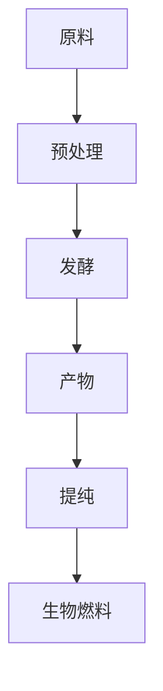
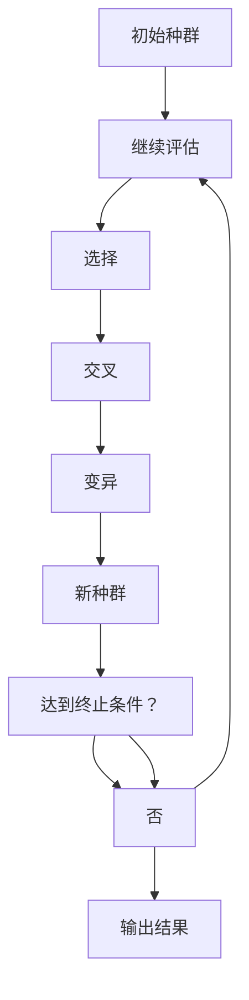

                 


# 价值投资中的新一代生物燃料技术前景

---

## 关键词  
价值投资，生物燃料，技术创新，能源转型，投资前景，可持续发展

---

## 摘要  
随着全球能源需求的增长和对可持续发展的关注，生物燃料技术在能源市场中的地位日益重要。本文从价值投资的角度，分析了新一代生物燃料技术的前景。通过探讨生物燃料技术的核心原理、市场潜力和投资策略，本文旨在为投资者提供基于技术分析的投资决策依据。

---

## 第一部分: 价值投资中的生物燃料技术前景概述

### 第1章: 生物燃料技术的基本概念

#### 1.1 生物燃料的定义与分类  
生物燃料是指通过生物发酵或化学转化等技术，利用生物质（如农作物残渣、林业废弃物、 algae等）生产的可再生能源。生物燃料主要包括以下几类：  
1. **第一代生物燃料**：主要来源于粮食作物（如玉米、甘蔗）的发酵，用于生产乙醇。  
2. **第二代生物燃料**：利用非粮食生物质（如秸秆、林业残渣）通过酶解和发酵技术生产纤维素乙醇。  
3. **第三代生物燃料**：以 algae 为基础，通过光合作用和生物转化技术生产生物柴油或生物燃料油。  

生物燃料的优势在于其可再生性和低碳排放，但其局限性在于生产成本较高，且部分技术仍处于实验阶段。

#### 1.2 生物燃料技术的发展历程  
生物燃料技术的发展可以分为以下几个阶段：  
1. **早期阶段（20世纪初至20世纪末）**：主要研究乙醇的生产技术，主要应用于汽车燃料。  
2. **技术突破阶段（21世纪初）**：随着环保压力的增加，各国开始加大对生物燃料技术的投入，纤维素乙醇和生物柴油技术逐渐成熟。  
3. **未来趋势（当前及未来）**：第三代生物燃料技术（基于 algae 的生产）逐渐成为研究重点，同时人工智能和大数据技术在生物燃料生产中的应用也在不断深入。  

---

### 第2章: 价值投资与生物燃料技术的结合

#### 2.1 价值投资的基本原理  
价值投资是一种基于对公司基本面分析的投资策略，核心在于寻找市场价格低于其内在价值的公司。其三大原则包括：  
1. **安全边际**：买入价格低于公司内在价值。  
2. **长期视角**：关注公司的长期盈利能力。  
3. **竞争优势**：选择具有独特竞争优势的企业。  

#### 2.2 生物燃料技术的市场分析  
1. **全球能源市场的现状与趋势**：随着化石能源的枯竭和环境问题的加剧，全球能源市场正在向清洁化、可再生化转型。  
2. **生物燃料在能源转型中的作用**：生物燃料是实现低碳能源的重要组成部分，其市场需求将随着环保政策的加强而快速增长。  
3. **生物燃料技术的商业化前景**：虽然目前部分生物燃料技术尚未完全商业化，但随着技术进步和成本下降，其商业化前景广阔。  

#### 2.3 价值投资视角下的生物燃料技术评估  
1. **技术创新对投资价值的影响**：技术创新能够降低生产成本、提高效率，从而增强公司的盈利能力。  
2. **市场需求与技术可行性分析**：投资者需要关注技术的市场需求和技术可行性，避免投资于不切实际的技术。  
3. **投资风险与回报的平衡**：生物燃料技术的投资风险较高，但一旦技术成熟，回报潜力巨大。  

---

## 第二部分: 生物燃料技术的核心原理与分析

### 第3章: 生物燃料技术的核心原理

#### 3.1 生物燃料生产的基本流程  
生物燃料的生产流程通常包括以下几个步骤：  
1. **原料的选择与预处理**：选择适合的生物质原料，并进行粉碎、灭菌等预处理。  
2. **发酵过程**：通过微生物发酵将生物质转化为燃料前体。  
3. **后处理与提纯**：对发酵产物进行分离、提纯，最终得到生物燃料。  

#### 3.2 生物燃料技术的关键技术  
1. **微生物发酵技术**：利用特定的微生物（如酵母菌）将生物质转化为燃料。  
2. **酶催化技术**：通过酶的作用加速生物质的分解和转化。  
3. **生物质气化技术**：将生物质通过高温气化生成可燃气体，再转化为液体燃料。  

#### 3.3 生物燃料技术的效率与成本分析  
1. **生产效率的提升策略**：通过优化发酵条件和提高酶活性来提高生产效率。  
2. **成本控制的关键因素**：原料成本、能源消耗和设备维护是影响成本的主要因素。  
3. **技术创新对成本的影响**：技术创新可以显著降低生产成本，提高竞争力。  

---

### 第4章: 生物燃料技术的核心概念与联系

#### 4.1 生物燃料技术的核心概念  
1. **微生物代谢的基本原理**：微生物通过代谢作用将生物质转化为燃料。  
2. **生物质转化的化学反应**：生物质在高温高压下的化学反应是燃料生成的关键步骤。  
3. **生物燃料的能量转换效率**：能量从生物质到燃料的转化效率是衡量技术优劣的重要指标。  

#### 4.2 生物燃料技术的概念对比分析  
以下表格对比了不同生物燃料技术的优缺点：  

| 技术类型      | 优点                          | 缺点                          |
|---------------|-------------------------------|-------------------------------|
| 第一代乙醇    | 生产技术成熟，成本较低        | 依赖粮食作物，可能引发粮食危机 |
| 第二代纤维素乙醇 | 原料广泛，环境友好            | 技术复杂，成本较高              |
| 第三代藻类燃料 | 原料丰富，单位面积产量高        | 技术尚不成熟，成本高            |

#### 4.3 生物燃料技术的实体关系图  


---

## 第三部分: 生物燃料技术的算法原理与数学模型

### 第5章: 生物燃料生产过程中的优化算法

#### 5.1 生物燃料生产过程中的优化问题  
生物燃料生产过程中，优化目标包括：  
1. **最大化产量**：通过优化发酵条件和微生物选择提高产量。  
2. **最小化成本**：通过优化原料选择和设备利用降低成本。  
3. **提高效率**：通过优化生产流程和参数提高整体效率。  

#### 5.2 基于遗传算法的优化策略  
以下是一个简单的遗传算法流程图：  



#### 5.3 数学模型与公式  
生物燃料的产量与发酵时间的关系可以通过以下公式表示：  
$$ P = a \cdot t + b $$  
其中，$P$ 表示产量，$t$ 表示发酵时间，$a$ 和 $b$ 是常数。  

---

## 第四部分: 生物燃料技术的系统分析与架构设计

### 第6章: 生物燃料生产系统的架构设计

#### 6.1 系统功能设计  
1. **原料处理模块**：负责原料的预处理和储存。  
2. **发酵模块**：实现生物质的发酵过程。  
3. **提纯模块**：对发酵产物进行分离和提纯。  
4. **控制系统**：监控和管理整个生产过程。  

#### 6.2 系统架构图  


---

## 第五部分: 项目实战与投资分析

### 第7章: 生物燃料技术的项目实战

#### 7.1 项目背景与目标  
本项目旨在通过优化生产流程和技术创新，降低生物燃料的生产成本，提高产量。  

#### 7.2 核心代码实现  
以下是一个简单的发酵优化算法的Python代码示例：  

```python
def optimize_fermentation(temperature, pH):
    # 计算最优发酵条件
    optimal_temp = 35  # 理想温度
    optimal_pH = 5.5    # 理想pH
    # 计算温度偏差
    temp_deviation = abs(temperature - optimal_temp)
    # 计算pH偏差
    pH_deviation = abs(pH - optimal_pH)
    # 计算综合偏差
    total_deviation = temp_deviation + pH_deviation
    return 100 - total_deviation

# 示例调用
result = optimize_fermentation(34, 5.3)
print(f"优化结果：{result}%")
```

---

## 第六部分: 最佳实践与总结

### 第8章: 最佳实践与投资策略

#### 8.1 小结  
生物燃料技术是实现低碳能源的重要途径，其技术创新和商业化潜力为投资者提供了广阔的机会。  

#### 8.2 投资注意事项  
1. **关注技术创新**：优先选择具有技术创新优势的企业。  
2. **评估市场需求**：确保技术具有明确的市场需求。  
3. **控制投资风险**：分散投资，避免过度集中。  

#### 8.3 拓展阅读  
- 建议阅读《价值投资实战策略》和《生物燃料技术与可持续发展》等书籍，以深入了解相关领域的最新动态。

---

## 作者：AI天才研究院/AI Genius Institute & 禅与计算机程序设计艺术 /Zen And The Art of Computer Programming  

---

希望这篇文章能够为投资者和技术爱好者提供有价值的参考！

