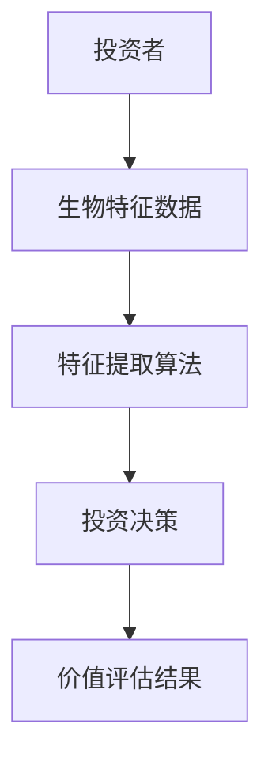
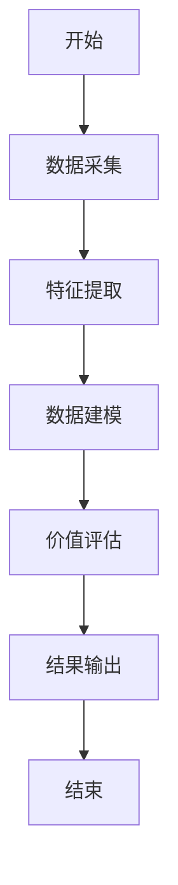
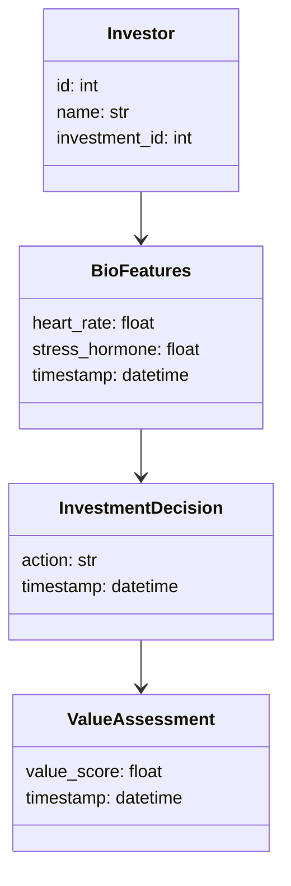
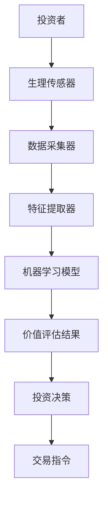
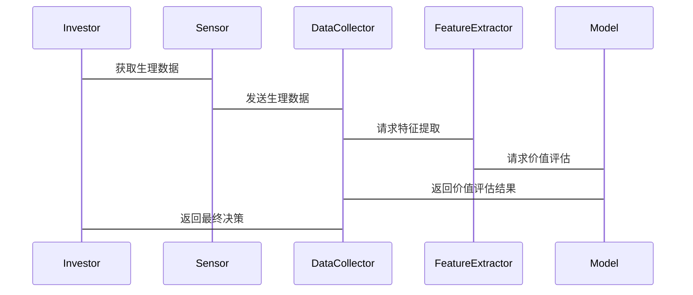

                 


# 价值投资中的新一代生物识别技术前景

> 关键词：生物识别技术，价值投资，人工智能，机器学习，金融数据分析

> 摘要：本文探讨了生物识别技术在价值投资中的潜在应用，分析了其在投资决策中的优势与挑战，结合算法原理和系统架构设计，展示了如何利用生物识别技术提升投资分析的准确性。

---

# 正文

## 第一部分: 背景介绍

### 第1章: 生物识别技术的现状与价值投资的结合

#### 1.1 生物识别技术的现状

生物识别技术近年来发展迅速，涵盖指纹识别、虹膜识别、面部识别等多种方式。这些技术在身份验证、安全监控等领域得到了广泛应用。随着技术的进步，生物识别的准确性、速度和成本效益不断提升，使其在金融领域的应用成为可能。

#### 1.2 价值投资的基本概念

价值投资是一种以基本面分析为基础的投资策略，强调通过分析公司的财务状况、行业地位和管理团队等因素，寻找市场价格低于其内在价值的股票进行投资。传统价值投资依赖于财务数据和市场分析，而生物识别技术的引入为投资决策提供了新的视角。

#### 1.3 生物识别技术在价值投资中的应用前景

生物识别技术能够通过分析投资者的生理和行为特征，揭示其情绪、决策模式等内在因素，从而为价值评估提供更全面的信息。例如，投资者在决策过程中的压力激素水平、心率变化等生理指标，可以通过生物传感器实时采集并分析，帮助评估其决策的稳定性和可靠性。

---

## 第二部分: 核心概念与联系

### 第2章: 生物识别技术的核心概念与原理

#### 2.1 生物识别技术的核心原理

生物识别技术的核心在于通过传感器采集生物特征数据，经过特征提取和模式识别，实现对个体身份的确认或行为分析。在价值投资中，这些技术可以用于分析投资者的行为模式，评估其决策的稳定性和一致性。

#### 2.2 生物识别技术的属性特征对比

| 技术类型   | 优缺点对比               | 安全性评估 |
|------------|--------------------------|------------|
| 指纹识别   | 成本低，易于部署；但容易被复制 | 中等        |
| 虹膜识别   | 高精度，安全性高；设备成本高 | 高          |
| 面部识别   | 便捷性高，适用性强；易受环境影响 | 中等        |

#### 2.3 ER实体关系图架构



---

## 第三部分: 算法原理讲解

### 第3章: 生物识别技术在价值投资中的算法原理

#### 3.1 算法流程图



#### 3.2 算法实现代码

```python
import numpy as np
from sklearn import svm

def preprocess(data):
    # 数据预处理
    return data

def extract_features(data):
    # 特征提取
    features = []
    for d in data:
        features.append([d['heart_rate'], d['stress_hormone']])
    return np.array(features)

def train_model(features, labels):
    # 训练模型
    model = svm.SVC()
    model.fit(features, labels)
    return model

def predict_value(model, features):
    # 预测价值评估
    return model.predict(features)

# 示例用法
data = [{'heart_rate': 75, 'stress_hormone': 10}, {'heart_rate': 80, 'stress_hormone': 15}]
features = extract_features(data)
labels = ['buy', 'sell']
model = train_model(features, labels)
result = predict_value(model, features)
print(result)
```

#### 3.3 数学模型与公式

在特征提取过程中，我们可以使用主成分分析（PCA）来降维：

$$
X_{\text{PCA}} = X^T \cdot \Sigma^{-1/2}
$$

在价值评估中，可以采用线性回归模型：

$$
y = \beta_0 + \beta_1x_1 + \beta_2x_2 + \epsilon
$$

其中，$y$ 是目标变量，$x_i$ 是特征变量，$\beta_i$ 是回归系数，$\epsilon$ 是误差项。

---

## 第四部分: 系统分析与架构设计方案

### 第4章: 价值投资中的生物识别技术系统架构

#### 4.1 问题场景介绍

在价值投资中，投资者的决策往往受到情绪和压力的影响。通过实时监测投资者的生理指标，如心率、皮肤电活动等，可以评估其情绪状态，进而优化投资决策。

#### 4.2 系统功能设计



#### 4.3 系统架构设计



#### 4.4 系统接口设计

- 数据采集接口：接收传感器数据并存储
- 特征提取接口：对数据进行特征提取并返回
- 模型预测接口：接收特征数据并返回价值评估结果

#### 4.5 系统交互序列图



---

## 项目实战

### 4.6 项目案例分析

假设我们开发了一个基于心率和压力激素水平的投资者行为分析系统。通过收集投资者在决策过程中的生理数据，分析其情绪状态，并预测其投资行为。

#### 4.6.1 环境安装

需要安装以下工具和库：

- Python 3.8+
- NumPy, scikit-learn, TensorFlow
- 心率传感器和相关数据采集接口

#### 4.6.2 核心实现代码

```python
import numpy as np
from sklearn.svm import SVC

# 数据预处理
def preprocess(data):
    return data

# 特征提取
def extract_features(data):
    features = []
    for d in data:
        features.append([d['heart_rate'], d['stress_hormone']])
    return np.array(features)

# 训练模型
def train_model(features, labels):
    model = SVC()
    model.fit(features, labels)
    return model

# 预测价值评估
def predict_value(model, features):
    return model.predict(features)

# 示例用法
data = [{'heart_rate': 75, 'stress_hormone': 10}, {'heart_rate': 80, 'stress_hormone': 15}]
features = extract_features(data)
labels = ['buy', 'sell']
model = train_model(features, labels)
result = predict_value(model, features)
print(result)
```

---

## 最佳实践 tips

- 在实际应用中，需确保生物识别数据的隐私和安全，避免数据泄露。
- 生物识别技术应与传统金融分析方法相结合，以提高投资决策的准确性。
- 定期更新模型和算法，以适应市场变化和投资者行为的多样性。

---

## 小结

本文详细探讨了生物识别技术在价值投资中的应用前景，从背景介绍、核心概念、算法原理到系统设计和项目实战，全面分析了其在投资决策中的潜力和挑战。通过结合机器学习和生物传感器技术，投资者可以更全面地评估自身的决策能力，从而优化投资策略。

---

## 注意事项

- 生物识别技术的应用需遵守相关法律法规，确保数据隐私和合规性。
- 投资者在使用此类技术时，应保持理性，避免过度依赖技术而忽视基本面分析。
- 系统的稳定性和准确性是关键，需定期进行测试和优化。

---

## 拓展阅读

1. "生物识别技术在金融领域的应用"（书籍推荐）
2. "机器学习在投资分析中的应用"（技术文章）
3. "生物传感器与数据分析"（在线课程）

---

作者：AI天才研究院 & 禅与计算机程序设计艺术

