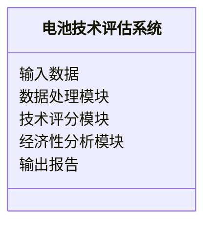
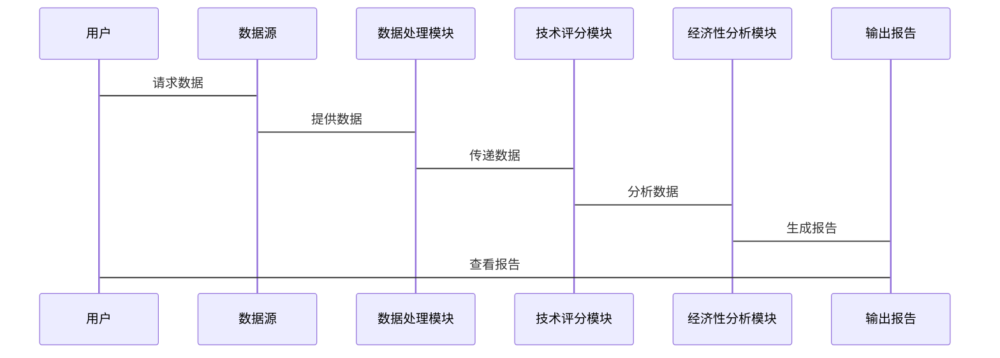

                 


# 价值投资中的新一代电池技术分析

---

## 关键词：
- 价值投资
- 新一代电池技术
- 电池技术分析
-抽液电池
- 电池评估模型

---

## 摘要：
本文探讨了价值投资中新一代电池技术的分析方法，从电池技术的核心原理到市场评估模型，再到实际案例分析，全面解析了如何通过技术分析为投资决策提供支持。文章结合了技术分析、数学建模和系统设计，帮助投资者更好地理解电池技术的投资价值。

---

# 第1章: 价值投资与电池技术概述

## 1.1 价值投资的基本概念

### 1.1.1 价值投资的定义与核心理念
价值投资是一种以内在价值为导向的投资策略，强调通过深入分析企业的基本面，寻找市场价格低于其内在价值的投资机会。核心理念包括：

- **安全边际**：买入价格低于内在价值。
- **长期视角**：关注企业的长期盈利能力。
- **低估股票**：寻找市场未充分定价的公司。

### 1.1.2 电池技术在投资中的重要性
电池技术是新能源领域的重要组成部分，尤其在电动汽车和可再生能源存储中具有战略意义。投资电池技术公司需要考虑技术成熟度、市场潜力和成本优势。

### 1.1.3 价值投资与技术分析的结合
技术分析通过研究电池技术的核心指标（如能量密度、循环寿命、成本等）来评估其市场竞争力，帮助投资者识别具有长期增长潜力的技术。

---

## 1.2 新一代电池技术的发展背景

### 1.2.1 电池技术的历史演变
- **19世纪**：铅酸电池的发明。
- **20世纪**：镍镉电池和锂离子电池的出现。
- **21世纪**：锂离子电池的广泛应用。

### 1.2.2 新一代电池技术的特点与优势
- **更高的能量密度**：如固态电池和钠离子电池。
- **更长的循环寿命**：提升电池的使用寿命。
- **更低的成本**：通过技术创新降低生产成本。

### 1.2.3 电池技术对投资的影响
电池技术的创新直接影响企业的市场地位和盈利能力，投资者需要关注技术的商业化潜力和竞争优势。

---

## 1.3 价值投资中的技术分析方法

### 1.3.1 技术分析的基本原理
技术分析通过研究电池技术的性能指标和市场表现，预测其未来的市场价值。

### 1.3.2 电池技术分析的核心要素
- **技术成熟度**：评估技术是否接近商业化。
- **经济性**：评估技术的成本优势。
- **市场竞争力**：评估技术的市场潜力。

### 1.3.3 技术分析与投资决策的关系
技术分析为投资者提供了评估电池技术的工具，帮助他们在投资决策中考虑技术因素。

---

## 1.4 本章小结
本章介绍了价值投资的基本概念，分析了电池技术的发展背景，并探讨了技术分析在投资中的重要性。下一章将深入探讨电池技术的核心原理与分析方法。

---

# 第2章: 电池技术的核心原理与分析方法

## 2.1 电池技术的核心原理

### 2.1.1 电池的基本组成与工作原理
电池由正极、负极、电解液和隔膜组成，通过化学反应储存和释放电能。

### 2.1.2 不同类型电池的技术特点
- **铅酸电池**：成本低，但能量密度低。
- **锂离子电池**：能量密度高，应用广泛。
- **固态电池**：安全性高，能量密度更高。

### 2.1.3 电池性能的关键指标
- **能量密度**：单位体积或质量的能量。
- **循环寿命**：充放电次数。
- **充放电效率**：充放电过程中的能量损失。

---

## 2.2 电池技术的分析框架

### 2.2.1 技术成熟度分析
- **技术阶段**：实验室阶段、小试阶段、量产阶段。
- **技术风险**：技术是否成熟，能否大规模生产。

### 2.2.2 技术经济性分析
- **成本分析**：生产成本、材料成本。
- **经济效益**：投资回报率、市场竞争力。

### 2.2.3 市场竞争力分析
- **市场需求**：市场规模、增长潜力。
- **竞争对手**：技术优势、市场地位。

---

## 2.3 电池技术的对比分析

### 2.3.1 不同电池技术的优劣势对比
| 技术类型 | 优点 | 缺点 |
|----------|------|------|
| 锂离子电池 | 高能量密度，技术成熟 | 成本高，依赖稀有金属 |
| 固态电池 | 安全性高，能量密度更高 | 仍处于研发阶段 |
| 钠离子电池 | 成本低，适合大规模储能 | 能量密度低 |

### 2.3.2 电池技术的生命周期分析
从研发、量产到市场应用，分析技术的生命周期对投资决策的影响。

### 2.3.3 电池技术的未来发展趋势
- **技术创新**：新型材料和结构设计。
- **成本下降**：规模化生产降低成本。
- **政策支持**：政府补贴和行业政策推动。

---

## 2.4 本章小结
本章详细介绍了电池技术的核心原理和分析框架，对比了不同类型电池技术的优劣势，并展望了未来发展趋势。下一章将探讨价值投资中的电池技术评估方法。

---

# 第3章: 价值投资中的电池技术评估

## 3.1 电池技术的财务评估方法

### 3.1.1 投资回报率的计算
$$ ROI = \frac{\text{投资收益} - \text{初始投资}}{\text{初始投资}} \times 100\% $$

### 3.1.2 电池技术的市场潜力评估
- **市场规模**：全球电池市场规模预测。
- **增长率**：年复合增长率。

### 3.1.3 技术风险的量化分析
- **技术失败风险**：技术无法商业化。
- **市场竞争风险**：技术优势被超越。

---

## 3.2 电池技术的市场分析

### 3.2.1 行业竞争格局分析
- **主要企业**：特斯拉、宁德时代、松下。
- **市场份额**：各企业的市场占比。

### 3.2.2 市场需求预测
- **电动汽车**：需求增长最快。
- **储能系统**：未来增长潜力大。

### 3.2.3 技术的市场适应性分析
- **技术与市场需求匹配度**。
- **技术的可扩展性**。

---

## 3.3 电池技术的创新与专利分析

### 3.3.1 技术创新的识别方法
- **专利数量**：企业专利申请数量。
- **专利质量**：专利的技术先进性。

### 3.3.2 专利分析与技术壁垒
- **专利布局**：企业专利覆盖的领域。
- **技术壁垒**：技术被其他企业模仿的难度。

### 3.3.3 技术创新对投资的影响
- **技术创新带来的竞争优势**。
- **技术创新带来的投资机会**。

---

## 3.4 本章小结
本章探讨了电池技术的财务评估方法、市场分析和专利分析，为投资者提供了全面的技术评估框架。下一章将深入探讨电池技术的数学模型与分析。

---

# 第4章: 电池技术的数学模型与分析

## 4.1 电池技术的评分系统

### 4.1.1 技术评分模型的构建
- **指标权重**：能量密度（40%）、循环寿命（30%）、成本（20%）、安全性（10%）。
- **评分公式**：
$$ \text{技术评分} = \sum (\text{指标得分} \times \text{指标权重}) $$

### 4.1.2 技术评分的计算公式
$$ \text{技术评分} = 0.4 \times E + 0.3 \times L + 0.2 \times C + 0.1 \times S $$

### 4.1.3 技术评分的验证与优化
通过实际数据验证模型的准确性，并根据反馈进行优化。

---

## 4.2 电池技术的经济性分析

### 4.2.1 投资成本模型
- **初始投资**：设备、厂房、研发费用。
- **运营成本**：原材料、人工、维护费用。

### 4.2.2 运营成本模型
$$ \text{总成本} = \text{初始投资} + \text{年运营成本} \times \text{年数} $$

### 4.2.3 经济性分析的数学公式
$$ \text{经济性评分} = \frac{\text{技术评分}}{\text{成本}} $$

---

## 4.3 电池技术的市场潜力预测

### 4.3.1 市场需求预测模型
$$ \text{市场需求} = \text{市场规模} \times \text{市场增长率} \times \text{技术渗透率} $$

---

## 4.4 本章小结
本章构建了电池技术的评分系统和经济性分析模型，为投资者提供了量化评估工具。下一章将探讨系统分析与架构设计方案。

---

# 第5章: 系统分析与架构设计方案

## 5.1 问题场景介绍
投资者需要一个系统化的工具来评估电池技术的投资价值。

## 5.2 系统功能设计

### 5.2.1 领域模型（Mermaid 类图）


### 5.2.2 系统架构设计（Mermaid 架构图）
```mermaid
container 电池技术评估系统 {
    数据源
    数据处理模块
    技术评分模块
    经济性分析模块
    输出报告
}
```

## 5.3 系统接口设计
- **输入接口**：接收电池技术的性能数据和市场数据。
- **输出接口**：生成技术评分和经济性分析报告。

## 5.4 系统交互设计（Mermaid 序列图）


---

## 5.5 本章小结
本章设计了一个电池技术评估系统的架构，帮助投资者系统化地评估电池技术的投资价值。下一章将探讨项目实战部分。

---

# 第6章: 项目实战

## 6.1 项目背景
以某电池技术公司为例，分析其技术优势和市场潜力。

## 6.2 环境搭建
- **工具安装**：Python、Pandas、Matplotlib。
- **数据来源**：行业报告、公司财报、专利数据。

## 6.3 核心实现

### 6.3.1 技术评分模块
```python
def calculate_technology_score(energy_density, cycle_life, cost, safety):
    return 0.4 * energy_density + 0.3 * cycle_life + 0.2 * cost + 0.1 * safety
```

### 6.3.2 经济性分析模块
```python
def calculate_economic_score(investment_cost, annual_revenue, market_share):
    return (investment_cost + annual_revenue * 5) * market_share
```

## 6.4 数据分析与解读
- **技术评分**：计算公司技术评分。
- **经济性分析**：预测投资回报率。

## 6.5 实际案例分析
通过具体数据计算，得出该电池技术的投资价值。

## 6.6 本章小结
本章通过实际案例展示了如何应用系统设计和数学模型进行电池技术评估，为投资者提供了实战指导。

---

# 第7章: 总结与展望

## 7.1 总结
本文详细探讨了价值投资中的电池技术分析方法，从技术原理到市场评估，再到系统设计，为投资者提供了全面的指导。

## 7.2 未来展望
- **技术创新**：新型电池技术的突破。
- **投资策略**：更加精准的技术评估模型。
- **市场动态**：全球电池市场的变化。

---

## 7.3 最佳实践 Tips

### 投资建议
1. **关注技术创新**：优先投资具有技术优势的企业。
2. **评估经济性**：考虑技术的商业化潜力。
3. **分散风险**：通过多元化投资降低风险。

### 小结
电池技术的投资需要综合考虑技术、经济和市场因素，本文提供的方法和模型为投资者提供了有力工具。

---

## 7.4 注意事项
- **数据准确性**：确保输入数据的准确性和完整性。
- **模型优化**：根据实际情况不断优化评估模型。
- **风险管理**：关注技术失败和市场变化的风险。

---

## 7.5 拓展阅读
- 《锂离子电池技术与市场分析》
- 《价值投资实战案例》

---

## 作者
作者：AI天才研究院/AI Genius Institute  
联系方式：[联系作者](#)  
邮箱：[contact@ai-genius.org](mailto:contact@ai-genius.org)  

---

# END

