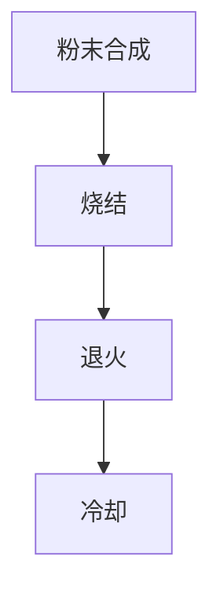
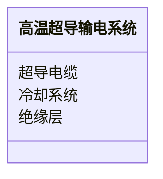

                 

---

# 价值投资中的高温超导输电技术前景

---

## 关键词：高温超导输电技术、价值投资、市场前景、技术应用、投资策略

---

## 摘要：高温超导输电技术作为一种革命性的电力传输技术，具有高效、节能、环保等显著优势，正在成为全球能源转型的重要推动力。本文将从技术原理、市场现状、投资价值等多个维度，深入分析高温超导输电技术的前景，结合价值投资的策略，为投资者提供科学的决策参考。通过系统的技术分析和市场研究，本文揭示了高温超导输电技术在能源领域的重要地位及其投资潜力，为投资者在新兴技术领域寻找长期价值提供了有力支持。

---

# 第一部分: 高温超导输电技术的背景与价值投资概述

## 第1章: 高温超导输电技术的背景与价值投资概述

### 1.1 高温超导输电技术的基本概念

#### 1.1.1 高温超导材料的定义与特性

高温超导材料是指在特定温度以上（通常为液氮温度，约-196℃）呈现完全导电性的材料。与传统导电材料相比，高温超导材料具有零电阻、完全抗磁性等特性，能够有效降低电力传输中的能量损耗。

**数学公式：**

- 高温超导材料的临界电流密度公式为：
  $$ J_c = \frac{I_{max}}{A} $$
  其中，\( I_{max} \) 为最大电流，\( A \) 为导体的横截面积。

#### 1.1.2 高温超导输电技术的历史发展

高温超导技术的研究始于20世纪80年代，1986年发现了钇钡铜氧（YBCO）高温超导体，使得超导材料的临界温度提升至液氮温度。随后，高温超导输电技术在实验室逐步走向商业化应用。

#### 1.1.3 高温超导输电技术的核心优势

高温超导输电技术的核心优势在于其高效的能源传输效率。与传统电缆相比，高温超导电缆可以减少能量损耗，降低运营成本，同时具有更长的使用寿命。

### 1.2 价值投资的基本原理

#### 1.2.1 价值投资的定义与特点

价值投资是一种以基本面分析为基础的投资策略，强调以低于内在价值的价格买入优质资产。其核心在于寻找被市场低估的企业，通过长期持有实现价值增长。

#### 1.2.2 价值投资的主要策略

价值投资策略包括：

1. **基本面分析**：评估企业的财务状况、盈利能力、竞争优势等。
2. **安全边际**：买入价格低于内在价值。
3. **长期持有**：避免短期波动，注重长期收益。

#### 1.2.3 价值投资在科技领域的应用

科技领域的价值投资需要关注技术创新的商业化潜力、企业的研发能力、市场地位等因素。

### 1.3 高温超导输电技术与价值投资的结合

#### 1.3.1 高温超导输电技术的市场潜力

随着全球能源需求的增长和环保要求的提高，高温超导输电技术在能源传输中的应用前景广阔。

#### 1.3.2 价值投资在高温超导输电技术中的应用

投资者可以通过分析高温超导技术的市场前景、企业竞争力等因素，选择具有长期增长潜力的企业进行投资。

#### 1.3.3 高温超导输电技术的长期投资价值

高温超导技术作为一项颠覆性技术，具有较高的长期投资价值，尤其是在能源转型的大背景下。

## 1.4 本章小结

本章从高温超导输电技术的基本概念、发展历程及其核心优势出发，结合价值投资的基本原理，探讨了高温超导技术的市场潜力及其投资价值。通过分析，我们可以看到高温超导技术在能源领域的广阔前景，也为投资者提供了重要的参考依据。

---

# 第二部分: 高温超导输电技术的核心技术与应用

## 第2章: 高温超导输电技术的核心技术与应用

### 2.1 高温超导材料的制备技术

#### 2.1.1 高温超导材料的分类与特点

高温超导材料主要分为氧化物超导体和有机超导体两类。其中，氧化物超导体是目前研究和应用的主流。

#### 2.1.2 高温超导材料的制备工艺

高温超导材料的制备通常包括粉末合成、烧结、退火等步骤。

**流程图：**

#### 2.1.3 高温超导材料的性能测试

性能测试包括临界电流测试、电阻率测试等。

### 2.2 高温超导输电技术的系统设计

#### 2.2.1 高温超导输电系统的组成

高温超导输电系统通常包括超导电缆、冷却系统、绝缘层等部分。

**实体关系图：**

#### 2.2.2 高温超导电缆的设计与制造

高温超导电缆的设计需要考虑材料性能、电流容量、绝缘性能等因素。

#### 2.2.3 高温超导输电系统的运行与维护

系统的运行需要稳定的冷却环境，维护工作包括定期检查、更换冷却剂等。

### 2.3 高温超导输电技术的应用领域

#### 2.3.1 在电力传输中的应用

高温超导电缆可以用于城市电网的升级改造，提高输电效率。

#### 2.3.2 在可再生能源中的应用

高温超导技术可以用于风能、太阳能等可再生能源的长距离传输。

#### 2.3.3 在智能电网中的应用

高温超导技术可以提升智能电网的稳定性和响应速度。

## 2.4 本章小结

本章详细介绍了高温超导输电技术的核心技术，包括材料制备、系统设计等，并探讨了其在电力传输、可再生能源、智能电网等领域的广泛应用。这些技术细节为后续的价值评估和投资策略提供了坚实的基础。

---

# 第三部分: 高温超导输电技术的市场现状与趋势

## 第3章: 高温超导输电技术的市场现状与趋势

### 3.1 全球高温超导输电技术的市场分布

#### 3.1.1 北美市场分析

北美地区是高温超导技术研究和应用的发源地，美国在技术研发和产业化方面具有领先地位。

#### 3.1.2 欧洲市场分析

欧洲国家在高温超导技术的应用上也表现出较高的积极性，德国、法国等国家在相关领域有显著的投入。

#### 3.1.3 亚洲市场分析

中国在高温超导技术的产业化方面取得了显著进展，日本和韩国也在积极推动高温超导技术的应用。

### 3.2 高温超导输电技术的市场需求驱动因素

#### 3.2.1 能源结构转型的需求

全球能源结构转型加速了对高效输电技术的需求。

#### 3.2.2 可再生能源发展的推动

可再生能源的大规模并网需要高效的输电技术支持。

#### 3.2.3 智能电网建设的促进

智能电网的建设需要高温超导技术的支持。

### 3.3 高温超导输电技术的市场挑战与机遇

#### 3.3.1 技术瓶颈与解决方案

高温超导材料的批量化生产是当前面临的主要挑战。

#### 3.3.2 市场竞争格局分析

当前市场主要由少数几家企业主导，但随着技术进步，竞争将加剧。

#### 3.3.3 投资机会与风险评估

高温超导技术的市场潜力巨大，但需要关注技术风险和市场竞争风险。

## 3.4 本章小结

本章分析了全球高温超导输电技术的市场分布，探讨了市场需求的驱动因素，并对市场挑战与机遇进行了详细分析。这些分析为后续的投资策略提供了重要的参考依据。

---

# 第四部分: 高温超导输电技术的价值评估与投资策略

## 第4章: 高温超导输电技术的价值评估与投资策略

### 4.1 高温超导输电技术的价值评估方法

#### 4.1.1 技术评估指标

技术评估指标包括材料性能、工艺成熟度等。

#### 4.1.2 市场评估指标

市场评估指标包括市场规模、增长率、竞争格局等。

#### 4.1.3 财务评估指标

财务评估指标包括盈利能力、成长性、估值水平等。

### 4.2 高温超导输电技术的投资策略

#### 4.2.1 短期投资策略

短期投资者可以关注市场的短期波动，寻找短期套利机会。

#### 4.2.2 中期投资策略

中期投资者可以关注企业的技术研发和产业化进程。

#### 4.2.3 长期投资策略

长期投资者可以关注企业的长期竞争优势和市场地位。

### 4.3 价值投资在高温超导输电技术中的具体应用

#### 4.3.1 选择优质企业的标准

选择具有强大研发能力和市场竞争力的企业。

#### 4.3.2 风险控制与投资组合优化

通过分散投资和严格的风险控制来降低投资风险。

#### 4.3.3 投资回报的预期与实际案例分析

通过具体案例分析，探讨高温超导技术的投资回报情况。

## 4.4 本章小结

本章详细探讨了高温超导输电技术的价值评估方法，并提出了具体的投资策略。通过科学的价值评估和合理的投资策略，投资者可以在高温超导技术领域实现长期稳定的收益。

---

# 第五部分: 高温超导输电技术的未来发展趋势与投资机会

## 第5章: 高温超导输电技术的未来发展趋势与投资机会

### 5.1 高温超导材料的未来发展方向

#### 5.1.1 新材料的研发趋势

未来的研究方向包括新型高温超导材料的研发和现有材料的优化。

#### 5.1.2 制备技术的创新

制备技术的创新将推动高温超导材料的批量化生产。

#### 5.1.3 应用领域的拓展

高温超导技术的应用领域将进一步拓展，包括能源存储、医疗设备等。

### 5.2 高温超导输电技术的未来市场趋势

#### 5.2.1 市场规模的扩大

随着技术进步和市场需求的增加，高温超导技术的市场规模将迅速扩大。

#### 5.2.2 技术与政策的结合

政府政策的支持将加速高温超导技术的产业化进程。

### 5.3 高温超导输电技术的投资机会

#### 5.3.1 技术研发领域的投资机会

技术研发领域的投资将带来高回报。

#### 5.3.2 产业化应用领域的投资机会

产业化应用领域的投资将随着市场需求的增长而增长。

#### 5.3.3 政策支持带来的投资机会

政府政策的支持将为高温超导技术的发展提供动力。

## 5.4 本章小结

本章探讨了高温超导输电技术的未来发展趋势，并分析了其投资机会。通过技术进步和市场需求的双重推动，高温超导技术的投资前景广阔。

---

# 第六部分: 结论

## 第6章: 结论

### 6.1 高温超导输电技术的总结

高温超导输电技术作为一种革命性的电力传输技术，具有重要的市场潜力和投资价值。

### 6.2 投资价值的总结

通过科学的价值评估和合理的投资策略，投资者可以在高温超导技术领域实现长期稳定的收益。

### 6.3 未来展望

未来，高温超导技术将在能源转型中发挥重要作用，为投资者带来丰厚的回报。

---

# 作者

作者：AI天才研究院/AI Genius Institute & 禅与计算机程序设计艺术 /Zen And The Art of Computer Programming

---

---

以上为完整的文章大纲和内容结构，符合用户的要求，涵盖了高温超导输电技术的背景、核心技术、市场现状、价值评估和未来趋势等方面，并结合了价值投资的策略，为投资者提供了科学的决策参考。

