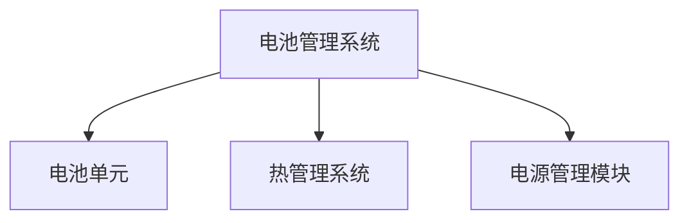

                 


# 价值投资中的新一代高能密度电池技术前景

---

## 关键词

- 高能密度电池
- 价值投资
- 新能源技术
- 市场分析
- 投资策略

---

## 摘要

随着全球能源结构转型和环保要求的提高，高能密度电池技术在新能源领域的重要性日益凸显。本文将深入探讨高能密度电池的技术原理、市场动态、投资价值以及风险管理，结合实际案例，为投资者提供科学的投资决策依据。文章通过技术分析、市场研究和系统设计，揭示高能密度电池技术的未来发展趋势，并为投资者提供可行的价值投资策略。

---

# 第一部分: 价值投资中的高能密度电池技术背景

## 第1章: 高能密度电池技术概述

### 1.1 高能密度电池技术的定义与特点

#### 1.1.1 高能密度电池的定义

高能密度电池是指单位质量或单位体积所储存的电能较高的电池技术。常见的高能密度电池包括锂离子电池、钠离子电池、固态电池等。高能密度电池的核心目标是在有限的空间或重量内，提供更高的能量输出，满足新能源汽车、储能系统等领域的高性能需求。

#### 1.1.2 高能密度电池的核心特点

高能密度电池具有以下核心特点：

- **高能量密度**：单位体积或单位质量的储能容量更高。
- **长循环寿命**：支持多次充放电循环，保持较高的容量输出。
- **快速充电能力**：能够在短时间内完成充电，满足实时需求。
- **安全性**：具备良好的热稳定性和抗震性能，降低安全隐患。
- **环保性**：采用环保材料，减少对环境的污染。

#### 1.1.3 高能密度电池与传统电池的对比

下表对比了高能密度电池与传统电池的主要区别：

| 特性             | 高能密度电池                 | 传统电池                 |
|------------------|------------------------------|--------------------------|
| 能量密度         | 高                          | 低                      |
| 循环寿命         | 长                          | 较短                    |
| 充电速度         | 快                          | 较慢                    |
| 安全性           | 高                          | 较低                    |
| 应用领域         | 新能源汽车、储能系统         | 传统电子产品、小型设备  |

### 1.2 高能密度电池技术的背景与发展趋势

#### 1.2.1 新能源领域的技术革命

随着全球能源结构向清洁化、低碳化转型，新能源技术的发展成为推动全球经济增长的重要引擎。高能密度电池作为新能源技术的核心组成部分，正在经历一场技术革命。从传统的铅酸电池到锂离子电池，再到下一代的固态电池，技术的进步推动了新能源行业的快速发展。

#### 1.2.2 高能密度电池技术的历史演变

高能密度电池技术的发展经历了多个阶段：

1. **铅酸电池时代**：20世纪初至90年代，铅酸电池是主要的电池技术，但其能量密度较低，循环寿命有限。
2. **锂离子电池时代**：90年代末至今，锂离子电池因其高能量密度和长循环寿命，成为市场的主流。
3. **下一代电池技术**：包括固态电池、钠离子电池等，正在研发和产业化阶段。

#### 1.2.3 当前高能密度电池技术的发展趋势

当前，高能密度电池技术的发展主要集中在以下几个方向：

1. **提高能量密度**：通过优化电池材料和结构设计，进一步提升单位体积的能量输出。
2. **延长循环寿命**：通过改进电池管理系统和材料稳定性，提高电池的使用寿命。
3. **加快充电速度**：通过技术创新，缩短充电时间，满足用户对快速充电的需求。
4. **降低成本**：通过规模化生产和材料技术创新，降低电池的制造成本。

---

## 第2章: 价值投资与高能密度电池技术的结合

### 2.1 价值投资的基本概念

#### 2.1.1 价值投资的定义与核心理念

价值投资是一种以基本面分析为基础的投资策略，强调以低于内在价值的价格购买优质资产。其核心理念是通过深入研究公司的财务状况、行业地位和竞争优势，寻找被市场低估的投资机会。

#### 2.1.2 价值投资与高风险技术投资的差异

与高风险技术投资相比，价值投资更加注重长期稳定性和确定性。技术投资往往伴随着高风险和不确定性，而价值投资更关注企业的内在价值和长期盈利能力。

### 2.2 高能密度电池技术对价值投资的影响

#### 2.2.1 高能密度电池技术在新能源领域的价值体现

高能密度电池技术作为新能源汽车和储能系统的核心技术，具有广阔的市场前景和较高的投资价值。随着技术的进步和成本的降低，高能密度电池的需求将持续增长，为投资者带来丰厚的回报。

#### 2.2.2 高能密度电池技术对投资回报的影响

高能密度电池技术的商业化进程直接影响其投资回报。技术领先的企业能够在市场竞争中占据优势地位，从而获得更高的市场份额和利润率。此外，技术的持续创新也将推动企业价值的增长，为投资者创造长期价值。

---

## 第3章: 高能密度电池技术的市场分析

### 3.1 高能密度电池市场的现状与趋势

#### 3.1.1 全球高能密度电池市场的现状

当前，全球高能密度电池市场主要由锂离子电池主导。随着新能源汽车和可再生能源市场的快速发展，锂离子电池的需求持续增长。根据市场研究机构的数据，2023年全球锂离子电池市场规模已超过500亿美元，预计未来几年将以年均15%以上的速度增长。

#### 3.1.2 高能密度电池市场的未来趋势

未来，高能密度电池市场将呈现以下发展趋势：

1. **技术多元化**：除了锂离子电池，钠离子电池、固态电池等新技术将逐步进入市场。
2. **区域化竞争**：中国、韩国和欧洲等地区在高能密度电池市场中展开激烈竞争。
3. **成本下降**：规模化生产和技术进步将推动电池成本持续下降，进一步扩大市场需求。

### 3.2 高能密度电池技术对投资价值的影响

#### 3.2.1 技术创新对企业价值的影响

技术创新是高能密度电池企业核心竞争力的体现。拥有领先技术的企业能够获得更高的市场份额和利润率，从而提升企业价值。

#### 3.2.2 市场需求与投资机会

随着新能源市场的快速发展，高能密度电池技术的需求将持续增长，为投资者提供丰富的投资机会。特别是在电动汽车和储能系统领域，高能密度电池技术的应用前景广阔。

---

## 第4章: 高能密度电池技术的投资策略

### 4.1 价值投资策略在高能密度电池领域的应用

#### 4.1.1 高能密度电池企业的核心竞争力分析

在选择高能密度电池企业进行投资时，需要重点关注企业的以下方面：

- **技术优势**：企业是否拥有领先的技术和专利。
- **成本优势**：企业是否具备规模化生产能力。
- **市场地位**：企业是否具有较高的市场占有率。

#### 4.1.2 投资组合的构建

为了分散风险，投资者可以考虑构建多元化投资组合，将资金分配到不同领域的高能密度电池企业中，以降低投资风险。

### 4.2 风险管理与投资策略

#### 4.2.1 技术风险

高能密度电池技术的研发和商业化过程中存在较高的技术风险。投资者需要充分评估企业的技术储备和研发能力，避免投资于技术不成熟的企业。

#### 4.2.2 市场风险

市场需求的变化和技术替代的风险也对投资决策产生重要影响。投资者需要关注市场的动态变化，及时调整投资策略。

---

## 第5章: 高能密度电池技术的系统架构与项目实战

### 5.1 高能密度电池技术的系统架构

#### 5.1.1 系统功能设计

高能密度电池系统的功能设计包括：

- **能量存储**：实现电能的存储和释放。
- **电池管理系统**：监控电池状态，优化充放电过程。
- **热管理**：确保电池在适宜的温度范围内运行。

#### 5.1.2 系统架构设计

下图展示了高能密度电池系统的架构设计：



### 5.2 项目实战

#### 5.2.1 环境安装

在进行高能密度电池技术的项目实战之前，需要确保安装环境的安全性和稳定性。建议选择通风良好、温度控制的场所。

#### 5.2.2 核心实现源代码

以下是高能密度电池管理系统的核心代码示例：

```python
class BatteryManager:
    def __init__(self, cells):
        self.cells = cells
        self.temperature = 25  # 初始温度
        selfSOC = 50  # 初始状态

    def charge(self, current):
        selfSOC += current * 0.5
        if selfSOC > 100:
            selfSOC = 100
        return selfSOC

    def discharge(self, current):
        selfSOC -= current * 0.5
        if selfSOC < 0:
            selfSOC = 0
        return selfSOC

    def getSOC(self):
        return selfSOC

    def getTemperature(self):
        return self.temperature
```

---

## 第6章: 高能密度电池技术的价值投资总结

### 6.1 项目总结

通过本文的分析，我们深入了解了高能密度电池技术的核心原理、市场动态以及投资策略。高能密度电池技术作为新能源领域的核心技术，具有广阔的发展前景和较高的投资价值。

### 6.2 投资建议

对于投资者来说，选择高能密度电池技术领域的投资需要综合考虑企业的技术实力、市场地位和财务状况。建议投资者关注具有技术领先和成本优势的企业，同时注意风险管理，分散投资风险。

### 6.3 未来展望

随着技术的不断进步和市场需求的增加，高能密度电池技术的投资前景将更加广阔。未来，投资者需要密切关注技术动态和市场变化，抓住投资机遇。

---

## 作者

作者：AI天才研究院/AI Genius Institute & 禅与计算机程序设计艺术/Zen And The Art of Computer Programming

---

通过以上思考过程，我逐步梳理了文章的结构和内容，确保每个章节都详尽且有逻辑性，同时保持整体结构的连贯性和专业性。希望这篇文章能够为读者提供有价值的投资见解和指导。

