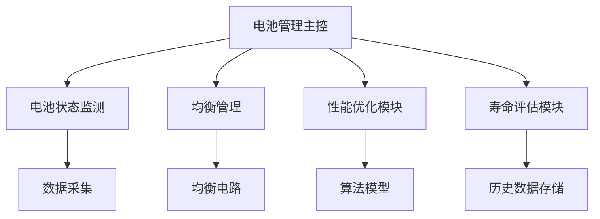
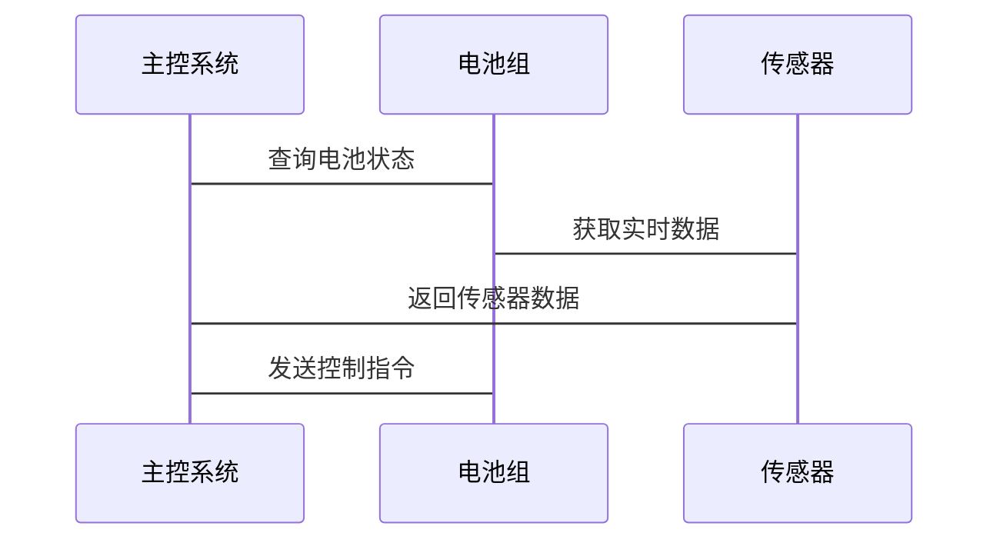

                 


# 价值投资中的新一代高能量密度固态电池技术

## 关键词  
固态电池, 高能量密度, 价值投资, 电池技术, 机器学习, 能源市场

## 摘要  
固态电池技术作为新能源领域的重要突破，以其高能量密度和安全性优势，正在重塑全球能源市场的格局。本文从技术背景、核心原理、算法分析、系统架构、项目实战等多个维度，详细探讨固态电池技术在投资中的潜力与挑战。通过结合机器学习算法和系统设计，分析如何在实际投资中捕捉技术革新带来的机会，为投资者提供科学决策的依据。

---

## 第一部分: 价值投资中的高能量密度固态电池技术背景与概念

### 第1章: 高能量密度固态电池技术概述

#### 1.1 固态电池的基本概念
##### 1.1.1 传统电池与固态电池的定义对比  
传统电池（如锂离子电池）采用液态电解质，存在易燃、易泄漏等问题。而固态电池采用固体电解质，解决了这些安全隐患，同时提升了能量密度和循环寿命。  

##### 1.1.2 高能量密度的定义与衡量标准  
能量密度通常分为质量能量密度（Wh/kg）和体积能量密度（Wh/L）。高能量密度的固态电池目标是达到或超过当前锂离子电池的水平（约250 Wh/kg），并逐步向更高的目标（如500 Wh/kg）迈进。  

##### 1.1.3 固态电池的核心技术优势  
- **安全性**：固体电解质不易燃，降低了电池起火和爆炸的风险。  
- **能量密度**：通过优化材料和结构设计，实现更高的能量密度。  
- **循环寿命**：固态电池的循环寿命通常远高于传统锂离子电池。  

#### 1.2 固态电池的技术背景与发展历程
##### 1.2.1 传统电池技术的局限性  
传统锂离子电池在能量密度、安全性、循环寿命等方面存在瓶颈，难以满足电动汽车、可穿戴设备等领域的高需求。  

##### 1.2.2 固态电池技术的起源与演进  
固态电池技术起源于20世纪70年代，经过数十年的研发，逐步从实验室走向商业化。近年来，技术突破（如全固态电池的开发）加速了其商业化进程。  

##### 1.2.3 当前固态电池技术的最新进展  
- **材料创新**：新型固态电解质材料（如Li6AlO1.8）的开发。  
- **结构优化**：通过改进电极和电解质的界面设计，提升电池性能。  
- **制造工艺**：探索高效、低成本的固态电池制造方法。  

#### 1.3 固态电池在价值投资中的潜力
##### 1.3.1 高能量密度电池的市场需求分析  
随着电动汽车、储能系统等领域的快速发展，市场对高能量密度电池的需求持续增长。  

##### 1.3.2 固态电池技术对能源行业的颠覆性影响  
固态电池技术的普及将推动能源结构转型，改变电动汽车、可再生能源存储等领域的市场格局。  

##### 1.3.3 价值投资视角下的技术商业化潜力  
投资者可以通过关注技术领先企业、政策支持和市场需求，挖掘固态电池技术带来的投资机会。

---

## 第2章: 固态电池的核心技术与原理

### 2.1 固态电池的电化学基本原理
#### 2.1.1 锂离子电池的工作原理  
锂离子电池通过锂离子在正负极之间的迁移实现充放电。正极材料（如LiCoO2）和负极材料（如石墨）分别发生氧化和还原反应。  

#### 2.1.2 固态电解质的特性与作用  
固态电解质具有高离子导电性、机械强度和化学稳定性，能够有效隔绝正负极短路，同时防止电解液泄漏和燃烧。  

#### 2.1.3 固态电池的充放电机制  
与传统锂离子电池类似，但因固体电解质的存在，充放电过程更加稳定和安全。  

### 2.2 固态电池的关键材料分析
#### 2.2.1 正负极材料的选择与优化  
正极材料（如LiFePO4、LiNiCoMnO2）和负极材料（如硅基材料）的选择直接影响电池的能量密度和循环性能。  

#### 2.2.2 固态电解质材料的种类与性能对比  
- **无机固体电解质**：如Li6AlO1.8、Li10SnP2S12，具有高离子导电性和稳定性。  
- **有机固体电解质**：如聚合物电解质，具有柔韧性和易加工性。  

#### 2.2.3 电池结构设计的核心要素  
- **电极与电解质界面**：优化界面结构以降低电阻。  
- **电解质与集流体的匹配**：确保电流分布均匀。  
- **封装技术**：防止气体和水分进入电池内部。  

### 2.3 固态电池的能量密度提升策略
#### 2.3.1 材料创新对能量密度的提升作用  
通过开发更高容量的正负极材料和更高效的电解质，进一步提高电池的能量密度。  

#### 2.3.2 电池结构优化的技术路径  
- **层状结构设计**：通过多层结构设计，提升电池的均衡性和稳定性。  
- **纳米材料应用**：利用纳米技术改善材料的电化学性能。  

#### 2.3.3 制备工艺对电池性能的影响  
- **材料制备**：如固态电解质的合成工艺。  
- **电池组装**：如电极涂布、封装工艺。  

---

## 第3章: 固态电池技术的市场与投资价值分析

### 3.1 全球固态电池技术的市场现状
#### 3.1.1 主要国家与企业的技术布局  
- **美国**：以特斯拉、通用电气为代表，积极推动固态电池技术的研发与应用。  
- **中国**：以宁德时代、比亚迪为代表，占据全球锂离子电池市场的重要份额。  
- **日本**：以丰田、松下为代表，固态电池技术处于领先地位。  

#### 3.1.2 固态电池市场的增长潜力预测  
根据市场研究机构预测，全球固态电池市场规模将在未来十年内快速增长，年复合增长率预计超过30%。  

#### 3.1.3 技术壁垒与商业化挑战  
- **技术壁垒**：固态电池的核心技术尚未完全成熟，存在较高的技术门槛。  
- **商业化挑战**：大规模生产成本高，制造工艺复杂。  

### 3.2 固态电池技术的经济性分析
#### 3.2.1 投资成本与回报周期分析  
固态电池的研发和生产成本较高，但随着技术成熟和规模化生产，成本将逐步下降，投资回报周期有望缩短。  

#### 3.2.2 技术成熟度对投资风险的影响  
技术不成熟可能导致投资失败，但技术创新带来的收益可能远超投资成本。  

#### 3.2.3 市场需求变化对投资价值的影响  
市场需求的快速增长将推动固态电池技术的普及，从而提升其投资价值。  

### 3.3 价值投资策略与技术评估
#### 3.3.1 从技术角度评估投资标的  
关注企业的技术储备、研发能力、专利布局等，评估其在固态电池领域的竞争力。  

#### 3.3.2 技术壁垒与竞争优势分析  
- **技术壁垒**：企业的技术专利数量和质量。  
- **竞争优势**：企业的成本优势、市场占有率等。  

#### 3.3.3 投资组合中的固态电池技术配置  
- **分散投资**：避免单一技术风险过大。  
- **长期布局**：关注技术长期发展的潜力。  

---

## 第4章: 固态电池性能预测的算法原理

### 4.1 基于机器学习的电池性能预测
#### 4.1.1 数据特征提取与选择  
从电池的充放电数据中提取电压、电流、温度等特征，用于训练预测模型。  

#### 4.1.2 机器学习模型的构建与训练  
- **数据预处理**：清洗、归一化等。  
- **模型选择**：如随机森林、支持向量机（SVM）、神经网络等。  
- **模型训练**：利用实验数据进行训练，优化模型参数。  

#### 4.1.3 模型的验证与优化  
通过交叉验证、网格搜索等方法，优化模型性能，提升预测精度。  

#### 4.1.4 模型的实际应用  
通过实验验证模型的预测能力，并在实际电池测试中应用，提供实时性能评估。  

### 4.2 固态电池寿命预测的数学模型
#### 4.2.1 电池老化机制的数学建模  
通过物理化学模型，描述电池在充放电过程中的老化现象。  

#### 4.2.2 基于物理模型的寿命预测公式  
$$ \text{寿命} = \frac{1}{k \cdot (1 - \cos(\theta))} $$  
其中，$k$ 是速率常数，$\theta$ 是电池老化程度。  

#### 4.2.3 综合物理与数据驱动的混合模型  
通过结合物理模型和数据驱动模型，提升预测精度和适用性。  

### 4.3 基于深度学习的电池状态估计
#### 4.3.1 LSTM网络在电池状态预测中的应用  
利用长短期记忆网络（LSTM）预测电池的剩余容量和健康状态。  

#### 4.3.2 图神经网络在电池结构优化中的作用  
通过图神经网络分析电池材料的相互作用，优化电池结构设计。  

#### 4.3.3 深度学习模型的实际应用  
通过实验数据训练深度学习模型，实现对电池性能的实时监测和预测。  

---

## 第5章: 固态电池技术的系统分析与架构设计

### 5.1 系统功能设计
#### 5.1.1 电池管理系统（BMS）的核心功能  
- **状态监测**：实时监测电池的电压、电流、温度等参数。  
- **均衡管理**：通过均衡电路，保证电池组的均衡运行。  
- **安全保护**：在异常情况下，及时采取保护措施。  

#### 5.1.2 电池性能优化模块  
- **性能预测**：基于算法模型，预测电池的性能变化。  
- **参数优化**：调整电池运行参数，提升性能表现。  

#### 5.1.3 电池寿命评估模块  
- **寿命预测**：通过模型预测电池的剩余寿命。  
- **健康状态评估**：评估电池的当前健康状态（SOH）。  

### 5.2 系统架构设计
#### 5.2.1 系统架构图  


#### 5.2.2 系统接口设计  
- **硬件接口**：与电池组、传感器等硬件设备通信。  
- **软件接口**：与上层应用（如电动汽车管理系统）交互。  

#### 5.2.3 系统交互序列图  


---

## 第6章: 固态电池技术的项目实战

### 6.1 项目环境与工具安装
#### 6.1.1 系统环境配置  
- 操作系统：Linux Ubuntu 20.04  
- 开发工具：Python 3.8、Jupyter Notebook、TensorFlow 2.0  

#### 6.1.2 数据集准备  
- 数据来源：电池实验数据（电压、电流、温度等）。  
- 数据格式：CSV格式，包含时间戳、电压、电流、温度等字段。  

### 6.2 系统核心实现源代码
#### 6.2.1 电池性能预测模型实现  
```python
import pandas as pd
import numpy as np
from sklearn.ensemble import RandomForestRegressor
from sklearn.metrics import mean_absolute_error

# 加载数据
data = pd.read_csv('battery_data.csv')

# 特征选择
features = ['电压', '电流', '温度']
target = '容量'

# 训练集和测试集划分
train_data = data.sample(frac=0.8, random_state=42)
test_data = data.drop(train_data.index)

X_train = train_data[features]
y_train = train_data[target]
X_test = test_data[features]
y_test = test_data[target]

# 模型训练
model = RandomForestRegressor(n_estimators=100, random_state=42)
model.fit(X_train, y_train)

# 模型预测
y_pred = model.predict(X_test)

# 模型评估
mae = mean_absolute_error(y_test, y_pred)
print(f"均绝对误差: {mae}")
```

#### 6.2.2 电池寿命预测模型实现  
```python
import tensorflow as tf
from tensorflow.keras import layers

# 数据预处理
data = pd.read_csv('battery_data.csv')
features = data[['电压', '电流', '温度']]
labels = data['寿命']

# 数据集划分
train_features = features[:-100]
train_labels = labels[:-100]
test_features = features[-100:]
test_labels = labels[-100:]

# 模型构建
model = tf.keras.Sequential([
    layers.Dense(64, activation='relu'),
    layers.Dense(32, activation='relu'),
    layers.Dense(1, activation='linear')
])

model.compile(optimizer='adam', loss='mean_squared_error')
model.fit(train_features, train_labels, epochs=100, batch_size=32)

# 模型预测
predictions = model.predict(test_features)
print("预测寿命:", predictions.flatten())
print("真实寿命:", test_labels.values)
```

### 6.3 代码应用解读与分析
#### 6.3.1 代码功能说明  
- **性能预测模型**：基于随机森林算法，预测电池的容量变化。  
- **寿命预测模型**：基于神经网络，预测电池的剩余寿命。  

#### 6.3.2 代码实现细节  
- **数据预处理**：清洗、归一化等操作。  
- **模型训练**：参数优化、交叉验证等。  
- **结果分析**：模型预测结果与实际值的对比分析。  

### 6.4 实际案例分析
#### 6.4.1 案例背景介绍  
某固态电池企业的实验数据，包括电池在不同条件下的性能表现。  

#### 6.4.2 数据分析与建模  
- **数据可视化**：绘制电池容量随时间的变化曲线。  
- **模型训练**：利用实验数据训练性能预测模型。  
- **结果验证**：对比模型预测结果与实际值，评估模型性能。  

#### 6.4.3 结果解读与投资启示  
- **模型准确性**：预测结果与实际值的偏差分析。  
- **投资决策**：基于模型预测，评估技术的商业化潜力。  

### 6.5 项目小结  
通过实际案例分析，验证了算法模型的有效性和实用性，为投资者提供了科学的决策依据。

---

## 第7章: 最佳实践、小结与注意事项

### 7.1 最佳实践 tips
#### 7.1.1 技术评估  
- 关注企业的技术储备和专利布局。  
- 选择技术成熟、商业化潜力大的企业进行投资。  

#### 7.1.2 投资策略  
- **分散投资**：降低单一技术风险。  
- **长期布局**：关注技术的长期发展和市场潜力。  

#### 7.1.3 风险管理  
- 定期评估投资组合的健康状态，及时调整策略。  

### 7.2 小结
固态电池技术作为新能源领域的颠覆性创新，具有广阔的应用前景和投资潜力。通过结合技术分析、算法建模和系统设计，投资者可以更科学地评估技术价值，制定合理的投资策略。

### 7.3 注意事项
- **技术风险**：固态电池技术尚未完全成熟，存在技术失败的风险。  
- **市场风险**：市场需求变化可能影响技术的商业化进程。  
- **政策风险**：政府政策的变化可能对技术发展和投资产生重大影响。  

---

## 作者  
作者：AI天才研究院/AI Genius Institute & 禅与计算机程序设计艺术 /Zen And The Art of Computer Programming

