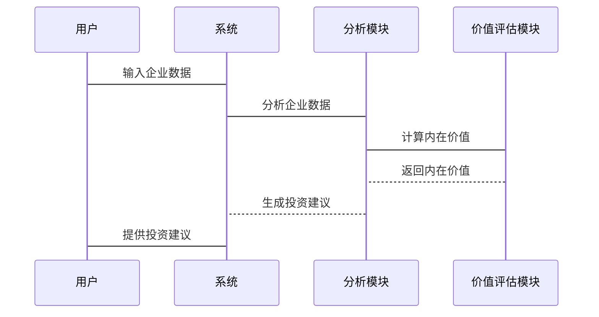

                 


```markdown
# 价值投资中的新兴市场机会

> 关键词：价值投资、新兴市场、内在价值、财务分析、风险管理、投资策略、价值评估模型

> 摘要：  
价值投资是一种以企业内在价值为基础的投资策略，通过分析企业的财务状况、行业地位和未来前景，寻找被市场低估的投资机会。新兴市场由于其高成长性和多样化的机会，为价值投资者提供了丰富的投资标的。本文将深入探讨价值投资在新兴市场中的应用，分析新兴市场的特点、行业选择、企业评估方法以及投资组合的构建策略。通过系统的分析和实际案例，本文将为投资者提供在新兴市场中寻找价值投资机会的方法和工具。

---

## 第一章：价值投资的核心概念

### 1.1 价值投资的起源与发展

#### 1.1.1 价值投资的起源
价值投资的理论基础可以追溯到本杰明·格雷厄姆和戴维·多德的工作。他们提出了“安全边际”和“内在价值”的概念，强调以低于内在价值的价格买入优质股票。

#### 1.1.2 价值投资的核心理念
- 买入低于内在价值的资产。
- 长期持有优质企业，而非频繁交易。
- 重视企业的基本面，包括财务状况、盈利能力、行业地位等。

#### 1.1.3 价值投资在现代金融中的地位
价值投资是投资领域的重要流派之一，尤其适合长期投资者和机构投资者。尽管市场波动较大，但价值投资通过长期持有优质资产，能够实现稳定的超额收益。

### 1.2 新兴市场的定义与特点

#### 1.2.1 新兴市场的定义
新兴市场通常指那些经济增长迅速、但尚未完全工业化的国家或地区。这些市场具有较高的波动性和不确定性，但也伴随着高增长的潜力。

#### 1.2.2 新兴市场的特点
- 高增长性：新兴市场通常具有较高的经济增长率，行业和企业有较大的发展空间。
- 多样性：新兴市场涵盖多个行业，如科技、互联网、新能源等，提供了丰富的投资选择。
- 波动性：新兴市场的价格波动较大，容易受到外部环境和政策变化的影响。
- 不完善性：市场结构和监管机制可能不够完善，增加了投资风险。

#### 1.2.3 新兴市场与成熟市场的区别
- 成长潜力：新兴市场具有更高的成长潜力，但风险也更大。
- 市场效率：成熟市场信息透明度高，价格反映充分；新兴市场可能存在信息不对称和价格扭曲。
- 投资机会：新兴市场提供更多的未被充分挖掘的机会，但也需要更多的研究和分析。

### 1.3 价值投资与新兴市场的结合

#### 1.3.1 价值投资在新兴市场的可行性
新兴市场的高增长性和多样性为价值投资者提供了丰富的投资机会，但同时也要求投资者具备更高的市场敏感性和风险控制能力。

#### 1.3.2 新兴市场中的投资机会
- 高成长行业的投资机会，如科技、互联网、新能源等。
- 被低估的优质企业的投资机会，尤其是在新兴市场中，许多企业尚未被市场充分挖掘。

#### 1.3.3 新兴市场投资的风险与挑战
- 市场波动性大，容易受到外部环境的影响。
- 信息不对称，企业财务透明度可能较低。
- 政策变化对企业的影响较大。

---

## 第二章：新兴市场中的价值投资策略

### 2.1 新兴市场的行业分析

#### 2.1.1 高成长行业的识别
- 行业增长潜力：选择那些具有较高增长潜力的行业，如科技、互联网、新能源等。
- 行业生命周期：分析行业所处的生命周期阶段，选择处于成长期或成熟期的行业。
- 行业竞争结构：分析行业内的竞争格局，选择具有竞争优势的行业。

#### 2.1.2 行业生命周期的分析
- 初创期：行业刚刚起步，增长潜力大，但风险较高。
- 成长期：行业快速发展，企业数量增加。
- 成熟期：行业增长放缓，企业竞争加剧。
- 衰退期：行业增长停滞，企业数量减少。

#### 2.1.3 行业竞争结构的评估
- 行业集中度：分析行业内主要企业的市场份额。
- 竞争优势：评估企业在行业内是否具有独特的竞争优势，如技术、品牌、成本等。

### 2.2 新兴市场的公司分析

#### 2.2.1 公司基本面分析
- 财务状况：分析企业的财务报表，包括资产负债表、利润表、现金流量表。
- 盈利能力：分析企业的盈利能力，包括净利润率、ROE等指标。
- 偿债能力：分析企业的偿债能力，包括资产负债率、流动比率等指标。
- 运营能力：分析企业的运营效率，包括存货周转率、应收账款周转率等指标。

#### 2.2.2 公司治理结构的重要性
- 股东结构：分析企业的股东结构，尤其是控股股东的背景和稳定性。
- 管理层素质：评估管理层的背景、经验和决策能力。
- 公司治理透明度：分析公司的治理结构是否透明，是否有良好的内部控制和审计机制。

#### 2.2.3 公司财务健康状况的评估
- 财务健康状况：分析企业的财务健康状况，包括是否存在高负债、低现金流等问题。
- 财务风险：评估企业的财务风险，包括利率风险、汇率风险等。

### 2.3 新兴市场的投资组合构建

#### 2.3.1 投资组合的分散化原则
- 分散化：通过投资不同行业、不同地区的资产，降低投资组合的整体风险。
- 行业配置：根据行业的增长潜力和风险特征，合理配置投资组合中的行业比例。
- 地区配置：根据地区的经济状况和政策环境，合理配置投资组合中的地区比例。

#### 2.3.2 行业与地域的配置策略
- 行业配置：根据行业分析的结果，选择具有较高增长潜力的行业。
- 地区配置：根据地区的经济状况和政策环境，选择具有较高增长潜力的地区。
- 风险控制：通过分散化和风险对冲，降低投资组合的整体风险。

#### 2.3.3 风险管理的重要性
- 风险管理：通过风险分析、风险评估和风险对冲，降低投资组合的整体风险。
- 风险对冲：通过投资于不同资产类别、行业和地区的资产，对冲风险。
- 风险监控：定期监控投资组合的风险状况，及时调整投资策略。

---

## 第三章：新兴市场中的价值评估模型

### 3.1 现金流折现法

#### 3.1.1 现金流折现法的定义
现金流折现法是一种通过将未来现金流折现到现值，评估企业内在价值的方法。

#### 3.1.2 现金流折现法的步骤
1. 预测未来现金流：根据企业的财务状况和行业前景，预测未来几年的现金流。
2. 确定折现率：根据企业的风险水平，确定适当的折现率。
3. 计算现值：将未来现金流折现到现值，求和得到企业的内在价值。

#### 3.1.3 现金流折现法的优缺点
- 优点：能够较为准确地反映企业的内在价值，考虑了时间价值和风险因素。
- 缺点：预测未来现金流具有较大的不确定性，折现率的选择也会影响评估结果。

### 3.2 市盈率与市净率分析

#### 3.2.1 市盈率的定义与应用
市盈率是股票价格与每股净利润的比率，用于衡量股票的估值水平。

#### 3.2.2 市净率的定义与应用
市净率是股票价格与每股净资产的比率，用于衡量股票的估值水平。

#### 3.2.3 市盈率与市净率
- 市盈率适用于盈利稳定的公司，市净率适用于净资产较多的公司。
- 市盈率和市净率都可以用来评估股票的估值水平，但各有优缺点。

### 3.3 股权价值评估模型

#### 3.3.1 股权价值的定义
股权价值是企业所有者权益的市场价值，反映了企业未来现金流的现值。

#### 3.3.2 股权价值评估的步骤
1. 确定企业的未来现金流。
2. 确定适当的折现率。
3. 将未来现金流折现到现值，求和得到股权价值。

#### 3.3.3 股权价值评估的注意事项
- 企业的未来现金流预测需要考虑行业和经济环境的变化。
- 折现率的选择需要考虑企业的风险水平和市场利率的变化。

---

## 第四章：系统分析与架构设计

### 4.1 问题场景介绍

#### 4.1.1 问题背景
在新兴市场中，价值投资需要考虑多个因素，包括企业的财务状况、行业前景、市场环境等。

#### 4.1.2 问题描述
为了在新兴市场中寻找价值投资机会，我们需要构建一个系统，能够对企业的内在价值进行评估，并提供投资建议。

### 4.2 系统功能设计

#### 4.2.1 领域模型


#### 4.2.2 系统架构


### 4.3 系统接口设计

#### 4.3.1 系统接口
- 输入接口：企业的财务数据、行业数据、市场数据。
- 输出接口：企业的内在价值、投资建议。

#### 4.3.2 接口交互流程
1. 用户输入企业的财务数据、行业数据、市场数据。
2. 系统调用分析模块，对数据进行处理。
3. 分析模块调用价值评估模块，计算企业的内在价值。
4. 系统根据内在价值和市场价格，生成投资建议。
5. 用户收到投资建议，进行投资决策。

### 4.4 系统交互流程

#### 4.4.1 交互流程


---

## 第五章：项目实战

### 5.1 环境安装

#### 5.1.1 安装Python
```bash
python --version
pip install --upgrade pip
```

#### 5.1.2 安装必要的库
```bash
pip install pandas numpy matplotlib
```

### 5.2 核心实现源代码

#### 5.2.1 现金流折现法
```python
def discounted_cash_flows(cash_flows, discount_rate):
    return sum(cash_flow / (1 + discount_rate) ** t for t, cash_flow in enumerate(cash_flows))
```

#### 5.2.2 市盈率分析
```python
def calculate_pe_ratio(net_income, price_per_share):
    return price_per_share / net_income
```

#### 5.2.3 市净率分析
```python
def calculate_p_b_ratio(book_value_per_share, price_per_share):
    return price_per_share / book_value_per_share
```

### 5.3 代码应用解读与分析

#### 5.3.1 现金流折现法的应用
- 使用现金流折现法计算企业的内在价值。
- 通过调整折现率，分析不同风险水平下的内在价值变化。

#### 5.3.2 市盈率分析的应用
- 使用市盈率分析评估股票的估值水平。
- 通过比较市盈率与行业平均水平，判断股票的高估或低估。

#### 5.3.3 市净率分析的应用
- 使用市净率分析评估股票的估值水平。
- 通过比较市净率与行业平均水平，判断股票的高估或低估。

### 5.4 实际案例分析

#### 5.4.1 案例背景
假设我们选择一个新兴市场的科技公司，分析其投资价值。

#### 5.4.2 数据收集
- 收集企业的财务数据，包括收入、利润、现金流等。
- 收集行业的数据，包括行业增长率、竞争格局等。

#### 5.4.3 数据分析
- 使用现金流折现法计算企业的内在价值。
- 使用市盈率和市净率分析股票的估值水平。

#### 5.4.4 投资建议
- 根据分析结果，提供买入、卖出或持有的投资建议。

### 5.5 项目小结

#### 5.5.1 项目总结
通过构建一个系统，我们能够对新兴市场中的企业进行内在价值评估，并提供投资建议。

#### 5.5.2 经验总结
- 数据的准确性是价值评估的关键。
- 模型的选择需要根据具体情况调整。
- 投资建议需要结合市场环境和企业实际情况。

---

## 第六章：最佳实践与小结

### 6.1 最佳实践

#### 6.1.1 风险管理
- 分散化：通过投资不同行业和地区的资产，降低投资组合的整体风险。
- 风险对冲：通过套期保值和对冲工具，降低特定风险。

#### 6.1.2 长期视角
- 价值投资需要长期持有优质资产，避免短期波动的干扰。

#### 6.1.3 持续学习
- 随着市场环境和企业情况的变化，需要不断学习和调整投资策略。

### 6.2 小结

#### 6.2.1 价值投资的核心
- 价值投资的核心是寻找被市场低估的优质资产。
- 新兴市场的高增长性和多样性为价值投资者提供了丰富的投资机会。

#### 6.2.2 新兴市场的挑战
- 新兴市场的波动性和不确定性增加了投资难度。
- 信息不对称和政策变化对企业估值产生较大影响。

#### 6.2.3 投资策略
- 通过系统化的分析和评估，选择具有高成长潜力的行业和企业。
- 结合财务分析和市场环境，制定合理的投资策略。

### 6.3 注意事项

#### 6.3.1 市场风险
- 新兴市场的波动性较大，投资需要谨慎。

#### 6.3.2 信息风险
- 信息不对称可能导致估值偏差，需要加强研究和分析。

#### 6.3.3 政策风险
- 政策变化可能对企业估值产生较大影响，需要关注政策动态。

### 6.4 拓展阅读

#### 6.4.1 经典书籍
- 《The Intelligent Investor》 by Benjamin Graham
- 《Value Investing: Principles and Performance》 by Bruce C. Feiler

#### 6.4.2 相关研究
- 价值投资与新兴市场的结合研究
- 新兴市场中的高成长行业分析
- 投资组合管理与风险管理策略

---

## 附录

### 附录A：参考文献

1. Graham, B. (1974). *The Intelligent Investor*. New York: McGraw-Hill.
2. Buffett, W. (1984). *The Superinvestors of Graham-and-Doddsville*. Columbia Business School.
3. Dimson, E., Marsh, P., & Staunton, M. (2002). *Triumph of the Optimists*. Princeton University Press.

### 附录B：工具推荐

- 数据分析工具：Python、R
- 图表绘制工具：Matplotlib、ggplot
- 投资组合管理工具：Excel、Excel Solver、Python的pandas库

---

## 作者信息

作者：AI天才研究院/AI Genius Institute & 禅与计算机程序设计艺术/Zen And The Art of Computer Programming
```

