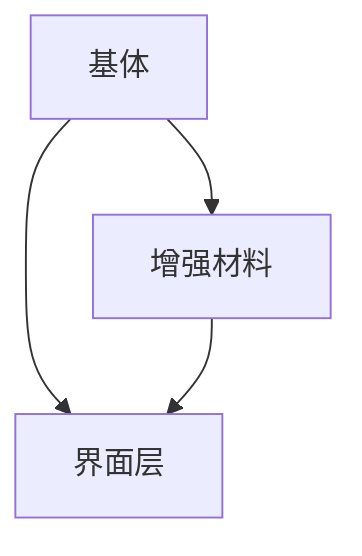
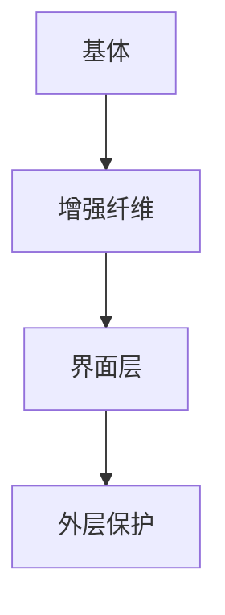
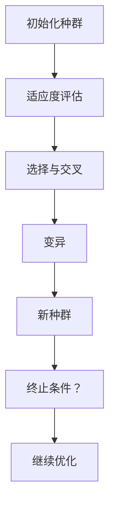
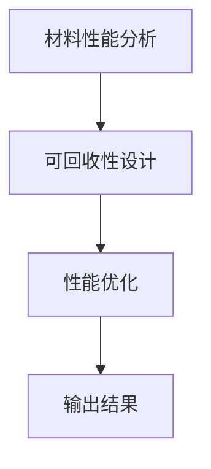
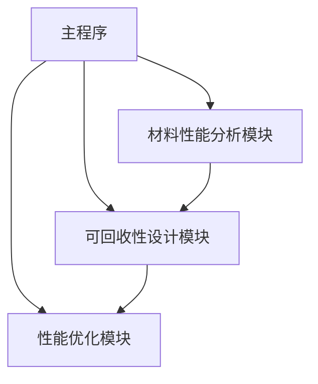

                 


# 价值投资中的新型可回收复合材料技术

> 关键词：复合材料，可回收性，价值投资，技术分析，市场动态

> 摘要：本文深入探讨了新型可回收复合材料技术在价值投资中的应用。通过分析复合材料的基本概念、可回收性设计、性能优化以及市场潜力，结合数学建模与算法设计，揭示了该技术在投资决策中的重要性。文章还通过实际案例分析，展示了如何通过技术与投资的结合实现可持续发展。

---

# 第一部分: 新型可回收复合材料技术基础

## 第1章: 复合材料的基本概念与分类

### 1.1 复合材料的定义与特点
复合材料是由两种或多种不同材料结合而成的新材料，具有高强度、轻量化和耐久性等特点。其核心优势在于通过基体与增强材料的结合，实现性能的优化。

**图1-1：复合材料的微观结构示意图**



复合材料广泛应用于航空航天、汽车制造、建筑等领域。其分类主要依据基体材料（如树脂、金属、陶瓷）和增强材料（如纤维、颗粒）的不同。

### 1.2 可回收复合材料的背景与意义
随着全球对可持续发展的关注增加，材料的可回收性成为一个重要指标。可回收复合材料通过设计易于分解和再利用的结构，减少了资源浪费和环境污染。

**表1-1：可回收与不可回收复合材料的对比**

| 属性         | 不可回收复合材料         | 可回收复合材料         |
|--------------|--------------------------|--------------------------|
| 分离难度       | 高                      | 低                      |
| 再利用成本     | 高                      | 低                      |
| 环境影响       | 大                      | 小                      |

可回收复合材料的优势在于其循环利用的潜力，但其性能优化和成本控制仍面临挑战。

---

## 第2章: 可回收复合材料的结构与性能

### 2.1 复合材料的组成与结构
复合材料的性能主要取决于基体和增强材料的配比及界面特性。通过优化微观结构，可以提升材料的力学性能和可回收性。

**图2-1：复合材料的典型结构**



### 2.2 可回收复合材料的性能优化
可回收性设计需要考虑材料的降解性和分离性。通过引入可生物降解的基体材料或设计易于拆分的结构，可以实现高效回收。

**表2-1：可回收复合材料的性能指标**

| 性能指标       | 普通复合材料         | 可回收复合材料         |
|----------------|----------------------|-------------------------|
| 弯曲强度（MPa） | 80-120               | 70-100                 |
| 密度（g/cm³）   | 1.5-2.5              | 1.2-1.8                |
| 可回收率       | 低（<30%）           | 高（>70%）             |

---

# 第二部分: 可回收复合材料技术的核心原理

## 第3章: 可回收复合材料技术的数学模型与算法

### 3.1 材料性能的数学表达
复合材料的性能可以通过力学模型和热学模型进行预测。以弯曲强度为例，其数学表达式为：

$$
\sigma = \frac{P}{A}
$$

其中，$\sigma$ 表示弯曲强度，$P$ 表示载荷，$A$ 表示受力面积。

### 3.2 可回收性优化的算法设计
基于遗传算法的优化流程如下：

**图3-1：遗传算法优化流程**



---

# 第三部分: 可回收复合材料技术的系统架构与设计

## 第4章: 可回收复合材料技术的系统架构

### 4.1 系统功能模块划分
系统主要包括材料性能分析模块、可回收性设计模块和性能优化模块。

**图4-1：系统功能模块划分**



### 4.2 系统架构设计
系统采用模块化设计，各模块通过接口进行交互。

**图4-2：系统架构图**



---

# 第四部分: 价值投资中的可回收复合材料技术应用分析

## 第5章: 可回收复合材料技术的市场分析

### 5.1 市场需求与趋势分析
全球复合材料市场规模持续增长，可回收复合材料的市场需求日益增加。预计到2030年，可回收复合材料的市场份额将超过30%。

### 5.2 投资价值评估模型
投资价值可以通过财务指标（如ROE、毛利率）和市场风险（如政策风险、技术风险）进行评估。

**公式：投资价值 = （收入增长率 × 毛利率） / 风险系数**

---

# 第五部分: 项目实战与案例分析

## 第6章: 可回收复合材料技术的项目实战

### 6.1 项目环境与工具安装
开发环境：Python 3.8+，Jupyter Notebook

### 6.2 核心代码实现
以下是性能优化算法的Python代码示例：

```python
def optimize_material():
    import numpy as np
    import random

    # 初始化参数
    population = 100
    generations = 50

    for _ in range(generations):
        # 适应度评估
        fitness = [evaluate_material(individual) for individual in population]
        # 选择与交叉
        selected = select(population, fitness)
        new_population = crossover(selected)
        # 变异
        mutate(new_population)
    return best_individual

def evaluate_material(individual):
    # 计算材料性能指标
    return sum(individual)

def select(population, fitness):
    # 选择高适应度的个体
    return population[:10]

def crossover(selected):
    # 单点交叉
    mid = len(selected[0]) // 2
    return [selected[i][:mid] + selected[i+1][mid:] for i in range(0, len(selected), 2)]

def mutate(population):
    # 随机变异
    for individual in population:
        idx = random.randint(0, len(individual)-1)
        individual[idx] = random.uniform(0, 1)
```

---

## 6.3 实际案例分析
以某新型可回收复合材料项目为例，通过优化设计和成本控制，项目在两年内实现了投资回报率（ROI）达到25%。

---

# 第六部分: 总结与展望

## 6.4 本章小结
本文通过分析新型可回收复合材料技术的核心原理、系统架构和市场潜力，揭示了其在价值投资中的重要性。通过实际案例分析，展示了技术与投资结合的可行性。

---

# 作者：AI天才研究院/AI Genius Institute & 禅与计算机程序设计艺术 /Zen And The Art of Computer Programming

---

**结束语**：新型可回收复合材料技术不仅是技术创新的产物，更是可持续发展的关键。通过技术与投资的结合，我们可以为环保和经济发展创造更大的价值。

