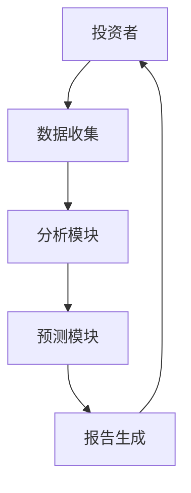

                 

# 价值投资中的新型核能技术分析

> 关键词：价值投资、核能技术、投资分析、技术原理、经济模型

> 摘要：本文深入分析了新型核能技术在价值投资中的应用，探讨了核能技术的基本原理、经济性与可行性，构建了数学模型进行价值评估，并通过系统分析和案例分析提供科学的投资决策支持。

---

## 第一部分：核能技术的背景与价值分析

### 第1章：核能技术的基本概念与价值投资背景

#### 1.1 核能技术的基本概念

核能技术是一种利用核反应释放能量的技术，主要通过核裂变和核聚变产生热量，用于发电。核能技术的发展始于20世纪，是解决能源危机的重要途径。

#### 1.2 价值投资的基本概念

价值投资是一种投资策略，强调以低于内在价值的价格买入优质资产。其核心在于寻找市场低估的公司，长期持有以实现收益。

#### 1.3 核能技术在投资中的重要性

核能技术作为清洁能源，具有高效、稳定的优点。随着全球能源需求增长，核能技术的投资潜力巨大，是价值投资的理想领域。

---

## 第二部分：核能技术的核心原理与投资分析

### 第2章：核能技术的核心原理

#### 2.1 核反应的基本原理

核反应包括核裂变和核聚变。核裂变是重原子核吸收中子后分裂成两个较轻的原子核，释放大量能量。核聚变是轻原子核（如氘和氚）在高温高压下结合，释放能量。

#### 2.2 核能技术的主要类型

- **核裂变技术**：利用铀-235或钚-239的裂变反应发电。
- **核聚变技术**：通过氘和氚的聚变反应发电，能量密度极高。
- **其他技术**：如钍基燃料技术，具有资源丰富、废料少的优势。

#### 2.3 核能技术的经济性与可行性分析

- **成本分析**：核电站的建设和运营成本较高，但单位发电成本低于传统能源。
- **收益预测**：随着能源需求增长，核能发电需求将增加，收益稳定。

---

### 第3章：核能技术的价值评估模型

#### 3.1 净现值（NPV）模型

净现值是将项目未来现金流按折现率折算到现值，减去初始投资。公式为：

$$ NPV = \sum_{t=1}^{n} \frac{CF_t}{(1+r)^t} - I $$

其中，$CF_t$是第t年的现金流，$r$是折现率，$I$是初始投资。

#### 3.2 内部收益率（IRR）模型

内部收益率是使NPV为零的折现率。公式为：

$$ NPV = \sum_{t=1}^{n} \frac{CF_t}{(1+IRR)^t} - I = 0 $$

---

## 第三部分：系统分析与架构设计

### 第4章：系统分析与架构设计

#### 4.1 系统功能设计

- 数据收集模块：收集市场数据、技术参数。
- 分析模块：计算NPV、IRR，评估风险。
- 预测模块：预测未来收益和风险。

#### 4.2 系统架构设计

采用分层架构，包括数据层、业务逻辑层和表现层。

---

## 第四部分：项目实战

### 第5章：项目实战

#### 5.1 案例分析

选择某核能公司，分析其财务状况、技术可行性、市场前景。假设该公司过去五年收入增长稳定，净利润率较高，技术领先。

#### 5.2 投资决策

通过NPV和IRR模型评估，假设NPV为正，IRR高于行业基准，建议投资。

---

## 第五部分：最佳实践与总结

### 第6章：最佳实践与总结

#### 6.1 投资核能技术的关键点

- 长期视角：核能项目周期长，需长期投资。
- 风险管理：评估技术和政策风险，分散投资。
- 政策环境：关注政策支持和行业趋势。

#### 6.2 总结

核能技术具有重要投资价值，价值投资者应关注行业动态，合理评估项目，分散风险。

---

## 作者

作者：AI天才研究院/AI Genius Institute & 禅与计算机程序设计艺术 /Zen And The Art of Computer Programming

---

**本文版权归作者所有，未经授权，不得转载。**

