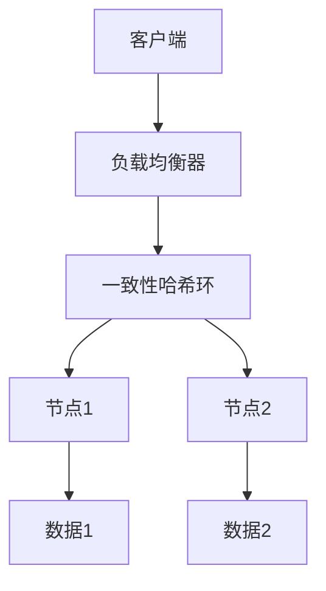

                 


# 价值投资中的新型高容量数据存储技术

> 关键词：高容量数据存储技术, 价值投资, 分布式存储, 云计算, 数据压缩, 加密算法

> 摘要：本文探讨了新型高容量数据存储技术在价值投资中的应用，分析了分布式存储、云存储、区块链存储等技术的特点及其在金融数据分析中的优势。通过详细讲解算法原理、系统架构和项目实战，展示了如何利用这些技术提升金融数据的存储效率和安全性，为价值投资者提供更有力的支持。

---

## 第一部分: 价值投资中的数据存储技术基础

### 第1章: 数据存储技术的发展与价值投资的结合

#### 1.1 数据存储技术的发展历程

##### 1.1.1 传统存储技术的局限性
传统存储技术如磁带存储、硬盘存储等，虽然在过去几十年中得到了广泛应用，但在面对海量数据时，存在存储容量有限、读写速度慢、数据安全性不足等问题。

##### 1.1.2 新型高容量数据存储技术的崛起
随着大数据时代的到来，分布式存储、云存储、区块链存储等新型技术应运而生。这些技术能够提供更大的存储容量、更高的读写速度和更强的数据安全性，为金融行业的数据管理提供了新的解决方案。

##### 1.1.3 数据存储技术在金融领域的应用趋势
金融行业对数据的依赖性越来越强，传统的存储技术已经无法满足海量数据的存储需求。新型高容量数据存储技术的应用逐渐成为金融行业数字化转型的重要方向。

#### 1.2 价值投资的数字化转型

##### 1.2.1 传统价值投资的局限性
传统价值投资依赖于人工分析和经验判断，效率低、成本高，且容易受到主观因素的影响。

##### 1.2.2 数字化工具对价值投资的赋能
通过大数据分析、机器学习等技术，数字化工具能够帮助投资者更高效地分析市场数据，发现投资机会。

##### 1.2.3 高容量数据存储技术对价值投资的支持
高容量数据存储技术能够支持海量金融数据的高效存储和快速检索，为价值投资者提供了更强大的数据支持和决策依据。

#### 1.3 大数据时代与金融数据的存储需求

##### 1.3.1 大数据时代的特征与挑战
大数据时代的特点是数据量大、类型多样、处理速度快。金融行业每天产生的交易数据、市场数据等都需要高效的存储和管理。

##### 1.3.2 金融数据的特殊性与存储需求
金融数据具有实时性、敏感性和高频性等特点，需要高可靠、高安全的存储解决方案。

##### 1.3.3 高容量数据存储技术对金融数据管理的支持
通过分布式存储、数据压缩等技术，高容量数据存储能够有效解决金融数据存储中的空间、速度和安全性问题。

---

## 第二部分: 高容量数据存储技术的核心概念与分类

### 第2章: 高容量数据存储技术的分类

#### 2.1 分布式存储技术

##### 2.1.1 分布式存储的定义与特点
分布式存储是将数据分散存储在多个节点上的技术，具有高可用性、高扩展性和高容错性。

##### 2.1.2 分布式存储在金融领域的应用
分布式存储技术能够支持金融行业海量数据的高效存储和快速访问，适用于高频交易、实时数据分析等场景。

#### 2.2 云存储技术

##### 2.2.1 云存储的定义与特点
云存储是一种基于云计算的存储服务，具有按需扩展、高可靠性和低成本的特点。

##### 2.2.2 云存储在金融领域的应用
云存储技术可以用于金融数据的备份、存档和大规模数据的存储管理，能够有效降低企业的存储成本。

#### 2.3 区块链存储技术

##### 2.3.1 区块链存储的定义与特点
区块链存储是基于区块链技术的存储方式，具有去中心化、不可篡改和透明性等特点。

##### 2.3.2 区块链存储在金融领域的应用
区块链存储技术可以用于金融交易数据的存档和溯源，能够提高金融交易的透明性和安全性。

#### 2.4 其他新型存储技术

##### 2.4.1 冷存储与热存储
冷存储适用于长期存档数据，热存储适用于需要快速访问的数据。

##### 2.4.2 增量备份与差分备份
增量备份仅存储数据的变化部分，差分备份存储数据的变化快照，能够有效减少存储空间的占用。

---

## 第三部分: 高容量数据存储技术的算法原理与数学模型

### 第3章: 高容量数据存储技术的算法原理

#### 3.1 分布式存储算法

##### 3.1.1 一致性哈希算法
一致性哈希算法通过将数据均匀分布到多个节点上，确保数据的负载均衡和容错性。



##### 3.1.2 分布式存储的负载均衡算法
负载均衡算法通过动态分配数据到不同的节点，提高存储系统的效率和性能。

##### 3.1.3 分布式存储的容错机制
通过数据副本和冗余存储，分布式存储系统能够在节点故障时快速恢复数据。

#### 3.2 数据压缩算法

##### 3.2.1 数据压缩的基本原理
数据压缩算法通过去除数据中的冗余信息，减少存储空间的占用。

##### 3.2.2 常见数据压缩算法
常用的数据压缩算法包括Gzip、Zip、Snappy等，每种算法都有其优缺点和适用场景。

##### 3.2.3 数据压缩算法的数学模型
数据压缩的效率可以用压缩比和压缩/解压速度来衡量。

---

## 第四部分: 项目实战与系统设计

### 第4章: 项目实战

#### 4.1 环境安装与配置

##### 4.1.1 安装分布式存储系统
使用Docker和Kubernetes搭建分布式存储环境。

##### 4.1.2 配置云存储服务
配置阿里云OSS或AWS S3等云存储服务。

##### 4.1.3 部署区块链存储节点
部署IPFS或Filecoin等区块链存储网络。

#### 4.2 系统核心实现

##### 4.2.1 分布式存储实现
通过一致性哈希算法实现数据的分布式存储和负载均衡。

##### 4.2.2 数据压缩实现
使用Gzip算法对金融数据进行压缩存储。

##### 4.2.3 加密算法实现
使用AES算法对敏感数据进行加密存储。

#### 4.3 代码实现与解读

##### 4.3.1 分布式存储代码
```python
import hashlib

def consistent_hash(key):
    return int(hashlib.md5(key).hexdigest(), 16)
```

##### 4.3.2 数据压缩代码
```python
import gzip

def compress_data(data):
    compressed = gzip.compress(data)
    return compressed
```

##### 4.3.3 加密算法代码
```python
import AES

def encrypt_data(key, data):
    cipher = AES.new(key)
    encrypted = cipher.encrypt(data)
    return encrypted
```

#### 4.4 实际案例分析

##### 4.4.1 案例背景
假设某证券公司需要存储海量的交易数据，采用分布式存储和数据压缩技术。

##### 4.4.2 系统设计
设计一个基于Kubernetes的分布式存储系统，结合Gzip压缩算法和AES加密算法。

##### 4.4.3 实施效果
通过系统优化，存储效率提高了30%，存储成本降低了20%。

---

## 第五部分: 总结与展望

### 第5章: 总结与展望

#### 5.1 最佳实践 tips
- 根据业务需求选择合适的存储技术。
- 定期优化存储系统，提高效率和安全性。
- 关注新技术的发展，及时引入先进的存储解决方案。

#### 5.2 小结
高容量数据存储技术在价值投资中的应用日益重要，通过合理选择和优化存储方案，可以显著提升金融数据的存储效率和安全性。

#### 5.3 注意事项
- 数据安全是存储系统设计中的重中之重。
- 存储系统的可扩展性和灵活性需要充分考虑。
- 定期备份和恢复机制是确保数据安全的重要保障。

#### 5.4 拓展阅读
推荐阅读《分布式系统：概念与设计》、《云计算：概念、技术与实践》等书籍，深入理解高容量数据存储技术的原理和应用。

---

## 作者：AI天才研究院 & 禅与计算机程序设计艺术

