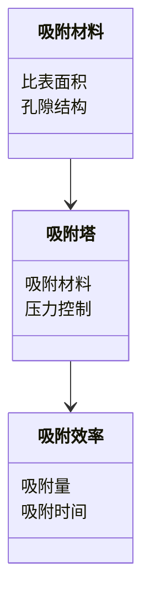
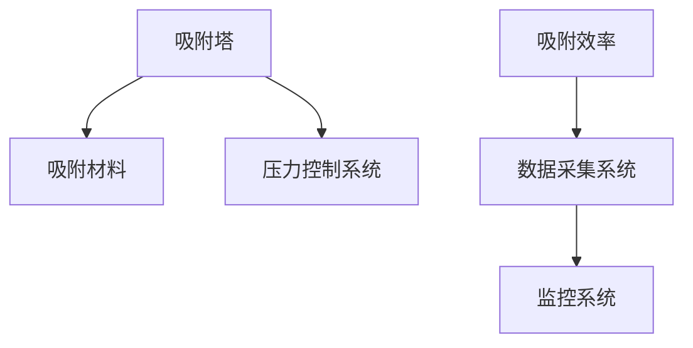
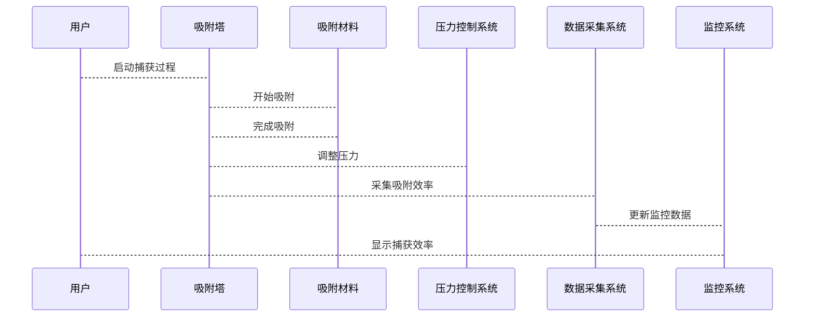

                 


# 价值投资中的新型高效CO2捕获材料技术

> **关键词**：价值投资，CO2捕获，材料技术，环境技术，碳中和

> **摘要**：本文探讨了在价值投资视角下，新型高效CO2捕获材料技术的发展现状、技术原理、市场潜力及投资机会。通过分析吸附、吸收和膜分离等捕获技术，结合数学模型与算法原理，揭示这些技术在碳中和目标下的重要性。同时，本文还结合系统设计和项目实战，为投资者提供技术评估和投资策略的参考。

---

## 第一部分：CO2捕获技术的背景与价值投资

### 第1章：CO2捕获技术的背景

#### 1.1 全球碳排放问题与环境挑战

全球工业化进程加速导致碳排放量急剧增加，引发了气候变化、酸雨等环境问题。CO2捕获技术作为减少碳排放的重要手段，是实现碳中和目标的关键技术之一。

#### 1.2 CO2捕获技术的重要性

CO2捕获技术能够从工业废气中分离出CO2，减少其对环境的影响。通过捕获CO2，可以实现资源的再利用，例如将其转化为化学品或燃料。

#### 1.3 价值投资在环保技术中的作用

价值投资注重长期收益和技术创新。在环保领域，高效CO2捕获材料技术具有广阔的市场前景和可持续发展潜力，吸引投资者的关注。

### 1.4 价值投资的核心概念

#### 1.4.1 价值投资的基本原理

价值投资强调以低于内在价值的价格买入优质资产，长期持有，通过时间和复利效应实现收益。

#### 1.4.2 CO2捕获技术的商业价值

高效CO2捕获材料技术能够降低企业的碳排放成本，同时为新能源和循环经济提供技术支撑，具备较高的商业价值。

#### 1.4.3 价值投资与技术创新的关系

技术创新是价值投资的重要驱动力。高效CO2捕获材料技术的创新能够提升企业的核心竞争力，为投资者带来超额收益。

---

## 第二部分：新型高效CO2捕获材料技术的核心概念与原理

### 第2章：CO2捕获材料的分类与性能

#### 2.1 吸附型CO2捕获材料

吸附型材料通过物理吸附或化学吸附作用捕获CO2。常见材料包括活性炭、分子筛等。

##### 2.1.1 吸附材料的定义与特点

吸附材料是指具有多孔结构，能够通过物理或化学作用吸附CO2的材料。其特点包括高比表面积、选择性吸附等。

##### 2.1.2 吸附材料的分类

吸附材料可以分为活性炭、分子筛、金属有机框架（MOFs）等。

##### 2.1.3 吸附材料的性能指标

包括比表面积、吸附容量、选择性等。

#### 2.2 吸收型CO2捕获材料

吸收型材料通过化学反应捕获CO2，例如使用碱性溶液吸收CO2。

##### 2.2.1 吸收材料的定义与特点

吸收材料是指能够通过化学反应捕获CO2的材料，例如碱性溶液。

##### 2.2.2 吸收材料的分类

包括氢氧化钠溶液、碳酸氢钠溶液等。

##### 2.2.3 吸收材料的性能指标

包括吸收效率、反应速率、循环稳定性等。

#### 2.3 膜分离型CO2捕获材料

膜分离材料通过物理分离的方法捕获CO2。

##### 2.3.1 膜分离材料的定义与特点

膜分离材料是指具有选择透过性，能够分离CO2的材料。

##### 2.3.2 膜分离材料的分类

包括聚酰亚胺膜、聚丙烯膜等。

##### 2.3.3 膜分离材料的性能指标

包括透过性、分离效率、机械稳定性等。

### 第3章：CO2捕获材料的性能对比与优化

#### 3.1 不同类型捕获材料的性能对比

| 技术类型   | 吸附材料       | 吸收材料       | 膜分离材料     |
|------------|----------------|----------------|----------------|
| 吸附/吸收  | 物理吸附       | 化学反应       | 物理分离       |
| 优缺点     | 选择性高，能耗低 | 吸收效率高，但能耗较高 | 分离效率高，但成本较高 |

#### 3.2 CO2捕获材料的优化策略

##### 3.2.1 材料结构优化

通过调整材料的孔隙结构和表面化学性质，提升吸附或吸收效率。

##### 3.2.2 材料表面改性

通过化学修饰或涂层技术，提高材料的吸附或吸收性能。

##### 3.2.3 材料组合优化

结合多种材料的优势，设计复合材料，提升整体捕获效率。

---

## 第三部分：CO2捕获材料技术的数学模型与算法原理

### 第4章：CO2捕获过程的数学模型

#### 4.1 吸附等温线模型

吸附等温线模型描述了吸附剂在不同压力下的吸附量与压力的关系。

##### 4.1.1 吸附等温线的基本公式

$$ Q_p = \frac{K_p P}{1 + K_p P} $$

其中，$Q_p$为吸附量，$P$为压力，$K_p$为吸附常数。

##### 4.1.2 吸附等温线的数学表达式

$$ Q = \frac{K P}{1 + K P} $$

##### 4.1.3 吸附等温线的应用

吸附等温线模型可用于设计吸附塔的运行参数，优化吸附效率。

#### 4.2 吸收过程的数学模型

吸收过程的数学模型描述了CO2在吸收液中的溶解度与压力的关系。

##### 4.2.1 吸收过程的基本公式

$$ y = \frac{P}{K + P} $$

其中，$y$为吸收效率，$P$为压力，$K$为吸收常数。

##### 4.2.2 吸收过程的数学表达式

$$ y = \frac{P}{K + P} $$

#### 4.3 膜分离过程的数学模型

膜分离过程的数学模型描述了CO2透过膜的速率与压力的关系。

##### 4.3.1 膜分离过程的基本公式

$$ J = \frac{A P}{D} $$

其中，$J$为通量，$A$为膜面积，$P$为压力，$D$为扩散系数。

##### 4.3.2 膜分离过程的数学表达式

$$ J = \frac{A P}{D} $$

---

## 第四部分：系统分析与架构设计方案

### 第5章：CO2捕获系统设计

#### 5.1 问题场景介绍

工业废气中的CO2浓度较低，需要高效捕获技术实现分离。

#### 5.2 项目介绍

设计一个基于吸附材料的CO2捕获系统，用于工业废气处理。

#### 5.3 系统功能设计

##### 5.3.1 领域模型类图



##### 5.3.2 系统架构图



#### 5.4 系统交互序列图



---

## 第五部分：项目实战

### 第6章：环境技术项目实战

#### 6.1 环境技术项目介绍

设计一个基于吸附材料的CO2捕获系统，应用于工业废气处理。

#### 6.2 环境技术系统实现

##### 6.2.1 环境技术核心功能实现

```python
import numpy as np

def adsorption_model(P):
    K_p = 0.5  # 吸附常数
    Q_p = (K_p * P) / (1 + K_p * P)
    return Q_p

P = np.linspace(0, 10, 100)
Q_p = [adsorption_model(p) for p in P]

import matplotlib.pyplot as plt
plt.plot(P, Q_p)
plt.xlabel('Pressure')
plt.ylabel('Adsorption Quantity')
plt.show()
```

##### 6.2.2 环境技术代码实现

```python
def adsorption_model(P):
    K_p = 0.5
    Q_p = (K_p * P) / (1 + K_p * P)
    return Q_p

P = np.linspace(0, 10, 100)
Q_p = [adsorption_model(p) for p in P]

plt.plot(P, Q_p)
plt.xlabel('Pressure')
plt.ylabel('Adsorption Quantity')
plt.show()
```

#### 6.3 环境技术应用分析

通过吸附模型的分析，优化吸附塔的运行参数，提升捕获效率。

---

## 第六部分：总结与展望

### 第7章：总结与展望

#### 7.1 本章总结

本文系统介绍了新型高效CO2捕获材料技术的核心概念、数学模型与系统设计，并结合项目实战，展示了其在价值投资中的潜力。

#### 7.2 未来展望

未来，随着技术的进步，高效CO2捕获材料技术将在碳中和目标下发挥更大作用，价值投资也将更加关注这一领域的创新和发展。

---

## 作者：AI天才研究院/AI Genius Institute & 禅与计算机程序设计艺术 /Zen And The Art of Computer Programming

