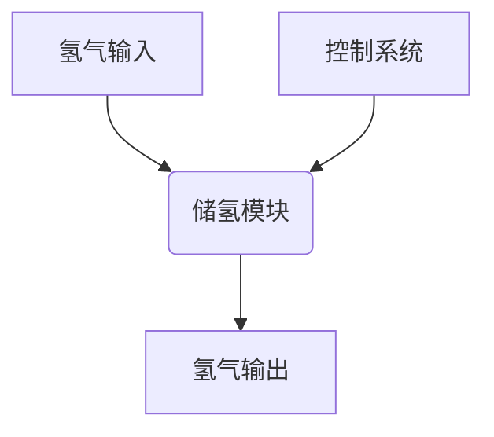

                 

# 价值投资中的新型高效储氢材料技术前景

> 关键词：储氢材料，价值投资，能源转型，可再生能源，氢能源

> 摘要：本文探讨了新型高效储氢材料技术的前景及其对价值投资的影响。通过分析储氢材料的技术原理、市场需求和投资价值，本文为投资者提供了科学的技术评估和投资建议，帮助他们在能源转型中抓住机遇。

---

## 第一部分：储氢技术的背景与现状

### 第1章：储氢技术的背景与重要性

#### 1.1 储氢技术的定义与分类

储氢技术是一种用于储存氢气的能量存储方式，其核心目标是将氢气以多种形式储存，以便在需要时释放能量。根据储存方式的不同，储氢技术可以分为以下几类：

- **吸附储氢**：通过物理吸附或化学吸附将氢气储存在多孔材料中。
- **化学储氢**：通过化学反应将氢气转化为其他化合物，如氨气或甲醇。
- **金属氢化物储氢**：利用金属或合金与氢气反应生成金属氢化物。
- **其他储氢方式**：包括液体氢储存和高压气体储存。

#### 1.2 价值投资与储氢技术的结合

价值投资是一种长期投资策略，注重分析企业的内在价值和成长潜力。在储氢技术领域，投资者需要关注技术创新、市场需求和政策支持等因素，以评估储氢材料的技术可行性和投资回报。

---

### 第2章：新型高效储氢材料的技术现状

#### 2.1 储氢材料的分类与性能指标

储氢材料的性能指标包括储氢容量、储氢效率、循环寿命和安全性。吸附储氢材料具有高比容量和快速充放电的特点，但储氢密度相对较低；化学储氢材料具有高储氢密度和稳定性，但反应速率较慢；金属氢化物储氢材料具有高储氢密度和良好的循环性能，但成本较高。

---

## 第二部分：储氢材料技术的核心原理与价值分析

### 第4章：储氢材料的核心原理与数学模型

#### 4.1 吸附储氢材料的吸附原理

吸附储氢是通过材料的表面作用将氢气分子吸附在材料表面或孔隙中。吸附作用可以通过范德华力或化学键作用实现。吸附储氢的数学模型可以通过Langmuir吸附等温线和BET模型进行描述。

- **Langmuir吸附等温线**：描述了气体分子在固体表面的吸附过程，公式为：
  $$ \theta = \frac{Kp}{1 + Kp} $$
  其中，$\theta$ 是吸附量，$K$ 是吸附常数，$p$ 是气体压力。

- **BET模型**：用于描述多孔材料的比表面积和孔隙结构，公式为：
  $$ \frac{1}{n(\theta - 1)} = \frac{1}{n(\theta - 1)} $$

#### 4.2 化学储氢材料的反应机制

化学储氢是通过化学反应将氢气转化为其他化合物。例如，氢气与氮气反应生成氨气的化学反应如下：
$$ N_2 + 3H_2 \rightarrow 2NH_3 $$

该反应释放大量能量，可以通过热力学分析确定反应的可行性。化学储氢的数学模型可以通过热力学公式和动力学公式进行描述。

---

### 第5章：储氢材料的性能优化与价值提升

#### 5.1 储氢材料的性能优化策略

为了提高储氢材料的性能，可以通过以下策略进行优化：
- **材料结构优化**：通过纳米技术或孔结构设计提高储氢容量。
- **表面改性技术**：通过化学修饰或涂层技术提高材料的吸附性能。
- **成本优化策略**：通过规模化生产和材料替代降低储氢成本。

---

## 第三部分：储氢技术的市场分析与投资价值评估

### 第6章：储氢技术的系统架构与应用场景

#### 6.1 储氢系统的整体架构

储氢系统的整体架构包括以下几个功能模块：
- **氢气输入模块**：负责氢气的输入和压缩。
- **储氢模块**：负责氢气的储存和释放。
- **控制系统**：负责系统的监控和优化。

储氢系统的架构可以用以下Mermaid图表示：

#### 6.2 储氢技术的应用场景分析

储氢技术广泛应用于可再生能源储能、工业用氢和氢燃料电池等领域。例如，在可再生能源储能中，储氢技术可以将风能和太阳能转化为氢气储存，用于电网调峰和备用电源。

---

## 第四部分：最佳实践与未来展望

### 7章：储氢技术的未来发展趋势

#### 7.1 技术创新与成本降低

未来，储氢技术将朝着高效、低成本和长寿命的方向发展。例如，通过新材料的研发和工艺优化降低储氢成本。

#### 7.2 市场拓展与政策支持

随着全球能源转型的推进，储氢技术将在能源存储和氢能源领域发挥重要作用。政策支持和市场需求将推动储氢技术的广泛应用。

---

## 作者：AI天才研究院/AI Genius Institute & 禅与计算机程序设计艺术 /Zen And The Art of Computer Programming

---

本文通过系统分析储氢材料的技术原理、市场需求和投资价值，为投资者提供了科学的技术评估和投资建议。在能源转型的背景下，储氢技术具有广阔的应用前景和投资潜力。

